# ZedExams Target Architecture

**File:** `docs/architecture.md`
**Repository baseline:** `Mwelwa-cyber/Zedexams`
**Verified commit:** `79ff3d29d83186f7d794c3cd0aed81d0106be697` (`main`)
**Verification date:** 1 August 2026

**Status:** Target state, verified against the actual repository at the commit above. Where this document says "today", it describes verified current reality — and those statements are authoritative **only for the verified commit**. The document contains precise measurements (line counts, function counts, index counts, route inventories); before migration begins, if `main` has advanced past the verified commit, regenerate the inventories rather than trusting the numbers here. The AI coding agent must follow the Migration Phases (section 13) and the binding Rules (section 14).

**Relationship to existing docs:** the repo already carries a `docs/architecture/` corpus (26 numbered docs including `03-route-register.md`, `11-firestore-data-model.md`, `13-cloud-functions-register.md`, `14-payment-and-subscriptions.md`, `24-recommended-target-architecture.md`, `25-remediation-plan.md`) plus `CLAUDE.md` and `AI_DEVELOPMENT_GUIDE.md`. This document is the consolidated target map. When sources disagree, authority is resolved as follows:

| Question | Authority |
|---|---|
| Current deployed behaviour | Verified code at the pinned commit, and CI |
| Firestore/Storage access | `firestore.rules` / `storage.rules` and their emulator tests |
| Frozen API names, routes, regions | The function and route registers (`03`, `13`) |
| Target folder / domain structure | This document |
| Migration sequencing | This document, reconciled with `25-remediation-plan.md` |
| Deployment and test discipline | `CLAUDE.md`, `AI_DEVELOPMENT_GUIDE.md`, `DEPLOY.md` |

On **frozen surfaces** (section 14, rule 3), the agent must stop and report a conflict rather than selecting one interpretation.

**How to use this document:**

1. Read sections 13 (Migration Phases) and 14 (Rules) before touching any code.
2. Anything in the Feature Inventory (section 2) is live unless marked **(planned)**. A file is only "legacy" if its replacement is verified per Phase 6.
3. Firestore collection and field names, Cloud Function export names, and Hosting rewrite paths are **frozen**. This is a code restructure, not a data or API migration.
4. This document changes only through deliberate architectural amendments. Individual migration PRs **implement** it — they do not reinterpret it.

---

## 1. Complete System Architecture

```mermaid
flowchart TB
    USERS["Users"]

    USERS --> LEARNER["Learner App"]
    USERS --> TEACHER["Teacher Workspace"]
    USERS --> ADMIN["Admin Workspace"]
    USERS --> PARENT["Parent / Family Portal"]
    USERS --> PUBLIC["Public Website"]

    ANDROID["Android App - Capacitor shell, com.zedexams.android"]
    ANDROID --> FRONTEND

    subgraph FRONTEND["React 19 + Vite Frontend (PWA)"]
        LEARNER
        TEACHER
        ADMIN
        PARENT
        PUBLIC

        ROUTER["Application Router"]
        PROVIDERS["Provider Stack"]
        FEATURES["Feature Modules"]
        ENGINES["Domain Engines"]
        SHARED["Shared UI and Utilities"]
        SERVICES["Frontend Services"]
        OFFLINE["Service Worker + src/offline IndexedDB stack"]

        ROUTER --> LEARNER
        ROUTER --> TEACHER
        ROUTER --> ADMIN
        ROUTER --> PARENT
        ROUTER --> PUBLIC

        PROVIDERS --> ROUTER
        FEATURES --> ENGINES
        FEATURES --> SHARED
        ENGINES --> SERVICES
        FEATURES --> SERVICES
        SERVICES --> OFFLINE
    end

    subgraph PROVIDER_LAYER["Provider Stack Contents"]
        AUTH_CONTEXT["AuthContext"]
        THEME_CONTEXT["ThemeContext"]
        DATA_SAVER["DataSaverContext"]
        OFFLINE_CTX["OfflineContext"]
        NOTIF_CTX["NotificationContext"]
        PLATFORM_CTX["PlatformSettingsContext"]
        ERROR_BOUNDARY["ErrorBoundary"]
    end

    PROVIDERS --> PROVIDER_LAYER

    subgraph FIREBASE["Firebase Platform - project examsprepzambia"]
        AUTH["Firebase Authentication + Passkeys"]
        FIRESTORE["Cloud Firestore - default DB in africa-south1"]
        STORAGE["Firebase Storage"]
        FUNCTIONS["Cloud Functions v2 - us-central1"]
        APP_CHECK["App Check - reCAPTCHA Enterprise web / Play Integrity Android"]
        RULES["Security Rules + 158 Composite Indexes"]
        FCM["Cloud Messaging"]
    end

    SERVICES --> AUTH
    SERVICES --> FIRESTORE
    SERVICES --> STORAGE
    SERVICES --> FUNCTIONS
    SERVICES --> FCM

    APP_CHECK --> FUNCTIONS
    APP_CHECK --> FIRESTORE
    APP_CHECK --> STORAGE
    RULES --> FIRESTORE
    RULES --> STORAGE

    subgraph EXTERNAL["External Services"]
        ANTHROPIC["Anthropic - Claude Sonnet + Haiku"]
        OPENAI["OpenAI - chat, marking, images, embeddings, moderation"]
        GEMINI["Google Gemini - text + image"]
        LENCO["Lenco - MTN, Airtel, Zamtel mobile money + cards, ZMW"]
        PLAY_BILLING["Google Play Billing - @capgo/native-purchases"]
        PLAY_API["Google Play Developer API"]
        GCTTS["Google Cloud Text-to-Speech"]
        WHATSAPP["Meta WhatsApp Business"]
        SMTP["SMTP Email"]
        POSTHOG["PostHog Analytics"]
        SENTRY["Sentry Error Monitoring"]
    end

    FUNCTIONS --> ANTHROPIC
    FUNCTIONS --> OPENAI
    FUNCTIONS --> GEMINI
    FUNCTIONS --> LENCO
    FUNCTIONS --> PLAY_API
    FUNCTIONS --> GCTTS
    FUNCTIONS --> WHATSAPP
    FUNCTIONS --> SMTP

    ANDROID --> PLAY_BILLING
    SERVICES --> POSTHOG
    SERVICES --> SENTRY

    subgraph DEPLOYMENT["Deployment - GitHub Actions on merge to main"]
        HOSTING["Firebase Hosting - dist, SPA fallback /app.html"]
        REWRITES["firebase.json rewrites - 13 /api/* routes to functions"]
        CI["PR gate: lint, node tests, vitest, rules emulator suites, payment lifecycle, visual regression"]
        ANDROID_CI["Android workflows - debug APK, App Distribution, Play AAB"]
    end

    CI --> HOSTING
    CI --> FUNCTIONS
    HOSTING --> FRONTEND
    REWRITES --> FUNCTIONS
    ANDROID_CI --> ANDROID
```

Ground truths the agent must not "fix":

- **All payments in Zambia run through Lenco.** MTN MoMo, Airtel Money, and Zamtel Kwacha are operators *under* the single Lenco integration (`functions/lencoService.js`); there are no direct MTN or Airtel APIs anywhere. Card checkout exists in the Lenco client but is currently disabled server-side.
- **The Android app is a Capacitor shell**, not a TWA: native plugins for App Check (Play Integrity), Firebase Auth, FCM, and Play Billing via `@capgo/native-purchases`. The service worker is deliberately not registered inside Capacitor.
- **Regions are split on purpose**: Firestore `(default)` is in `africa-south1` (Firestore triggers must be pinned there); HTTP/callable functions run in `us-central1`; passkey functions are mid-migration to `africa-south1` behind a feature flag.
- **Deploys happen only via GitHub Actions on merge to `main`** (`deploy-hosting.yml`, `deploy-firebase.yml`); manual `firebase deploy --only hosting|functions` is forbidden (see `DEPLOY.md`). There are no Hosting preview channels today — CI gates PRs instead.
- PostHog and Sentry are the only analytics/monitoring providers and appear in the Play Data safety declarations; do not add others without flagging compliance impact.

---

## 2. Frontend Architecture and Feature Inventory

**Current reality (verified):** `src/` is ~1,950 files of plain JavaScript (no TypeScript). Only 8 modules use the `src/features/` pattern (learnerHome, notes, lessons, drafts, visualStudio, learnerSettings, teacherSettings, ...); the bulk lives in `src/components/` (935 files) and a flat `src/utils/` (527 files). `App.jsx` declares learner/admin/public routes inline; teacher routes are data-driven in `teacherRoutes.jsx`. There is no state-management library — React Context plus custom hooks throughout. `src/index.css` is a 286 KB monolith. The target below migrates toward the feature-module pattern without inventing new products.

```mermaid
flowchart TB
    MAIN["main.jsx"]

    MAIN --> ERROR["ErrorBoundary"]
    ERROR --> PROVIDERS["App Providers"]
    PROVIDERS --> APP["App.jsx"]
    APP --> ROUTES["Route registry"]

    subgraph APP_CORE["src/app (target)"]
        APP
        ROUTES
        PROVIDERS
        GUARDS["Guards: ProtectedRoute, LearnerOnlyRoute, AdminRoute + MFA gate, ParentRoute, StudioGate, PremiumGate"]
        LAYOUTS["Layouts: TeacherLayout, AdminLayout, ParentLayout, LegalLayout"]
    end

    ROUTES --> GUARDS
    GUARDS --> LEARNER_FEATURES
    GUARDS --> TEACHER_FEATURES
    GUARDS --> ADMIN_FEATURES
    GUARDS --> PARENT_FEATURES
    ROUTES --> PUBLIC_FEATURES

    subgraph LEARNER_FEATURES["Learner Features - flat routes like /dashboard, /quiz/:id"]
        LD["Learner Home + classic Grade Hub"]
        LEARN["Learn / Practice / Subject pages"]
        NOTES["Notes - Learn and Revise modes"]
        LESSONS["Lessons - slide player"]
        QUIZZES["Quizzes"]
        DAILY_QUIZ["Daily Quiz + Leaderboard - replaces Daily Exams"]
        PAST_PAPERS["Past Papers - hub, viewer, practice, paper quizzes"]
        GAMES["Games - 8 games, grade scoped"]
        LIVE_QUIZ["Live Quiz Challenge (planned - no chat)"]
        RESULTS["Results / My Stats / Streaks"]
        BADGES["Badges"]
        STUDY["Study Plan / Calendar / Timetable"]
        CLASSES_L["My Classes / Join"]
        SEARCH["Search"]
        ASK_ZED["Ask Zed"]
        OFFLINE_LIB["Offline Library"]
        SETTINGS_L["Learner Settings"]
    end

    subgraph TEACHER_FEATURES["Teacher Features - /teacher/*"]
        TD["Teacher Dashboard (V2 live)"]
        ASSESSMENT_STUDIO["Assessment Studio - unified test/exam papers"]
        LESSON_PLAN["Lesson Plan Studio"]
        LESSONS_T["Lesson Builder"]
        GENERATORS["Generators: worksheet, homework, flashcards, rubric, notes, scheme of work, weekly forecast, mark schedule, record of work, class timetable"]
        SBA["SBA: hub, task studio, mark tracker, year planner"]
        REGISTER["Class Register: attendance, marks, SBA, progress, reports, roster import"]
        CLASSES_T["Classes + invites + approvals"]
        CLASS_LIST["Class List capture/import"]
        SYLLABI["Syllabi Library + Curriculum browsers (CBC + 2013)"]
        CALENDAR_T["School Calendar"]
        LIBRARY_T["Teacher Library - virtual folders"]
        TEMPLATES["Template Bank"]
        QBANK["Central Question Bank"]
        DRAFTS["Drafts Recovery Centre"]
        SCAN["Scan / Import pipeline"]
        VISUAL["Visual Studio"]
        SETTINGS_T["Teacher Settings + Subscription"]
    end

    subgraph ADMIN_FEATURES["Admin Features - /admin/*"]
        AD["Admin Dashboard + Analytics + Visitors"]
        USERS_ADMIN["Users / Learners / Roles / MFA"]
        CONTENT["Content: quizzes, notes studio, lessons, approvals, question review, picture bank"]
        CURRICULUM_ADMIN["Curriculum: CBC KB, uploads, syllabus replace, RAG ingestion"]
        PAPERS_ADMIN["Past Paper Studio + admin papers"]
        AI_ADMIN["AI: generations, costs, budget enforcement"]
        PAYMENTS_ADMIN["Payments panel, revenue, trials"]
        AGENTS_ADMIN["Agents console + Company HQ"]
        SETTINGS_ADMIN["Settings registry, App Check, announcements, activity log"]
    end

    subgraph PARENT_FEATURES["Parent Features"]
        FAMILY["Family Home /family"]
        CHILD["Child Progress"]
        SHARES["Progress share links /parent/:token"]
    end

    subgraph PUBLIC_FEATURES["Public Features"]
        LANDING["Landing, Pricing, Teachers, Company, Grade 7/12 pages"]
        BLOG["Blog (SEO prerendered)"]
        PAPERS_PUBLIC["Public papers browse"]
        LEGAL["Privacy, Terms, Child Safety, Delete Account, Status"]
        AUTHP["Login / Register / Verify / Auth actions"]
    end

    LEARNER_FEATURES --> ASSESSMENT_ENGINE
    TEACHER_FEATURES --> ASSESSMENT_ENGINE
    ADMIN_FEATURES --> CURRICULUM_ENGINE

    subgraph CORE_ENGINES["Domain Engines - src/engines and src/curriculum (target)"]
        ASSESSMENT_ENGINE["Assessment Engine - ONE runner"]
        CURRICULUM_ENGINE["Curriculum Engine"]
        EXPORT_ENGINE["Document Export Engine"]
        PAYMENT_ENGINE["Payment / Entitlement Engine"]
        NOTIFICATION_ENGINE["Notification Engine"]
    end

    TEACHER_FEATURES --> CURRICULUM_ENGINE
    LEARNER_FEATURES --> CURRICULUM_ENGINE
    TEACHER_FEATURES --> EXPORT_ENGINE
    LEARNER_FEATURES --> PAYMENT_ENGINE
    TEACHER_FEATURES --> PAYMENT_ENGINE

    subgraph SERVICE_LAYER["Service Layer"]
        FIREBASE_SERVICE["Firebase config + App Check"]
        FIRESTORE_SERVICE["Firestore repositories + query hooks"]
        OFFLINE_LAYER["src/offline - contentCache, syncEngine, offlineSecurity"]
        STORAGE_SERVICE["Storage Service"]
        AI_CLIENT["AI API Client"]
        PAYMENT_CLIENT["Lenco + Play Billing clients"]
        ANALYTICS["PostHog + Sentry wrappers (consent-gated)"]
    end

    CORE_ENGINES --> SERVICE_LAYER
    LEARNER_FEATURES --> SERVICE_LAYER
    TEACHER_FEATURES --> SERVICE_LAYER
    ADMIN_FEATURES --> SERVICE_LAYER
```

Placement decisions the agent must follow:

- **Engines live in `src/engines/<name>/`**; the Curriculum Engine lives at `src/curriculum/`. No engine lives inside `src/features/`.
- `src/contexts/` migrates into `src/app/providers/` as part of Phase 4 — but `OfflineContext` stays exported from `src/offline/`.
- **The flat `src/utils/` (527 files) is subdivided during migration**, not in one sweep: each file moves to its owning feature, engine, or `src/shared/utils/` when the feature that owns it migrates. Same policy for splitting `src/index.css`.
- Learner routes are **flat** (`/dashboard`, `/quiz/:id`, `/notes/:id`); do not introduce a `/learner` prefix — `/learner/*` exists only as legacy redirects.
- The unified Assessment Studio at `/teacher/assessment-papers` is canonical; `/teacher/test-papers`, `/teacher/exam-papers`, `/teacher/assessments` remain redirects.
- "Daily Exam" is being replaced by the **Daily Quiz** (one short quiz per day, hosted by the Zed mascot, feeding the leaderboard). The existing `DailyExamRunner` route family migrates onto the shared Assessment Engine as part of that rework.
- **Live Quiz Challenge is planned, not built.** When built: learners see who's online and challenge them; strictly no chat/voice/typed messages; it consumes the Assessment Engine and the consent capability system (`CAPABILITY_SOCIAL`).

---

## 3. Feature Module Internal Structure

Every migrated feature follows the same internal pattern.

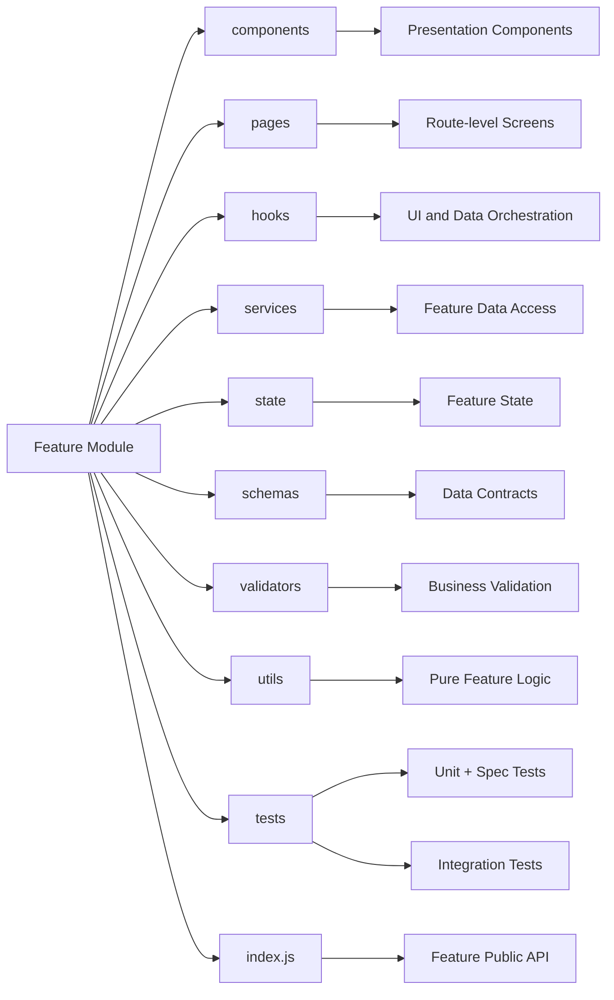

This matches the pattern already established by `src/features/notes/` and `src/features/learnerHome/`. Keep the repo's existing test conventions: colocated `*.spec.jsx` (Vitest/jsdom) and plain-node `*.test.js` discovered by `npm run test:all` — do not merge the two suites. Keep the `xCore.js` pure-logic split where it exists.

Other features import only from a feature's `index.js`; enforce with an ESLint import-boundary rule added in Phase 1.

---

## 4. Assessment Engine

**Current reality: four parallel runners exist** — `src/components/quiz/QuizRunnerV2.jsx` (learner quizzes), `src/components/exams/DailyExamRunner.jsx` (daily exams), `src/features/papers/pages/PublicQuizRunner.jsx` (past-paper quizzes), and `src/components/games/PlayGame.jsx` + per-game cores (games), each with its own results rendering. The target is one shared engine that all of them consume.

Three corrections to what an earlier revision of this section claimed, verified against the tree at `6edaf22f` and recorded because each one changes what the engine has to do:

- **`src/features/papers/pages/PastPaperPractice.jsx` is not a runner** and is not in scope for the engine. It is a PDF reader with a stopwatch: it renders no questions, holds no answer key, awards no marks, and writes an attempt carrying `elapsedSeconds` plus a free-text reflection and no answers (`src/utils/pastPapers.js:518,539`). Putting it behind a question engine would mean inventing a product rather than migrating one.
- **`PublicQuizRunner` persists nothing.** It has no Firestore write of any kind; its progress is a localStorage tally against a 30-question free limit, keyed by uid *or an anonymous id* because the route is public (`src/utils/pastPaperQuiz.js:73-95`). For that consumer the engine's requirement is therefore the inverse of byte-compatibility: it must not begin writing. An anonymous, SEO-visible route that starts saving learner results needs a rules change, a consent path and an account-deletion purge entry that do not exist today.
- **Only one of the eight game engines is a question loop.** `PlayGame` dispatches by `game.type` (`src/components/games/PlayGame.jsx:229-236`); seven are mechanics (memory match, word builder, province shapes, sorting, scramble, number target, market challenge). Only `timed_quiz` asks a question and takes an option, and its questions live inline on the `games` document as `{question, options, answer}` — a third vocabulary, neither the editor's nor the assessment paper's.

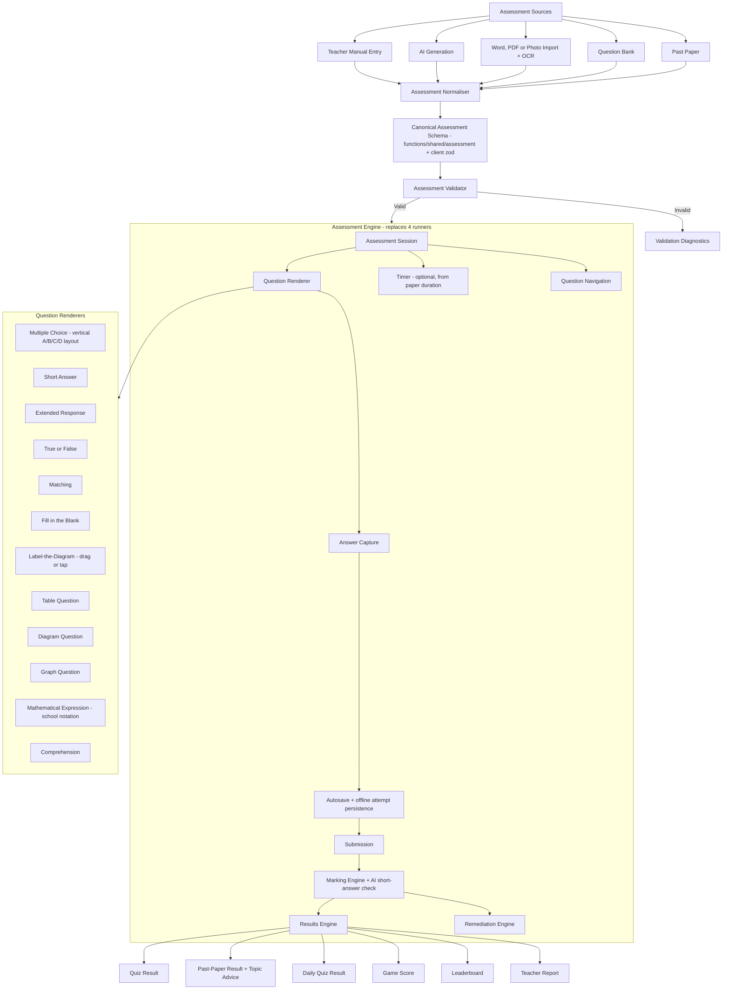

Engine-level requirements:

- **MCQ layout:** single vertical column with A/B/C/D letter badges, ECZ past-paper style, so long options get a full-width row.
- **Timing:** past-paper quizzes offer timed or untimed mode; the timer defaults to the paper's own duration.
- **Results:** past-paper results report what was wrong and which topics to improve; notes check-quizzes reuse the remediation path (wrong answer → deeper explanation with more examples before retry).
- **Games** reuse the engine's question/answer core; game chrome (mascots, streaks, animations, per-game mechanics in `*Core.js`) wraps the engine.
- Existing shared pieces to absorb rather than rewrite: `useQuizPersistence`, `useQuizDisplayPrefs`, `useQuizReadAloud`, `src/utils/quizSections.js`, `paperToQuizConverter.js`, `src/schemas/{quiz,attempt,result}.js`.
- **`src/offline/useOfflineQuiz.js` is not in that list, because it is not in use.** It is exported from `src/offline/index.js:43` and imported by nothing; `registerQuizResultHandler` is never called, so an offline submit enqueued through it would sit in the sync queue with no handler registered for its `quiz-result` kind. Giving the engine offline attempt support is therefore **building a capability, not absorbing one** — it needs its own scope, its own tests and a §13 rule-13 review of what `assertCacheable` admits, and it must not be estimated as a migration.

### 4.1 Canonical relationships

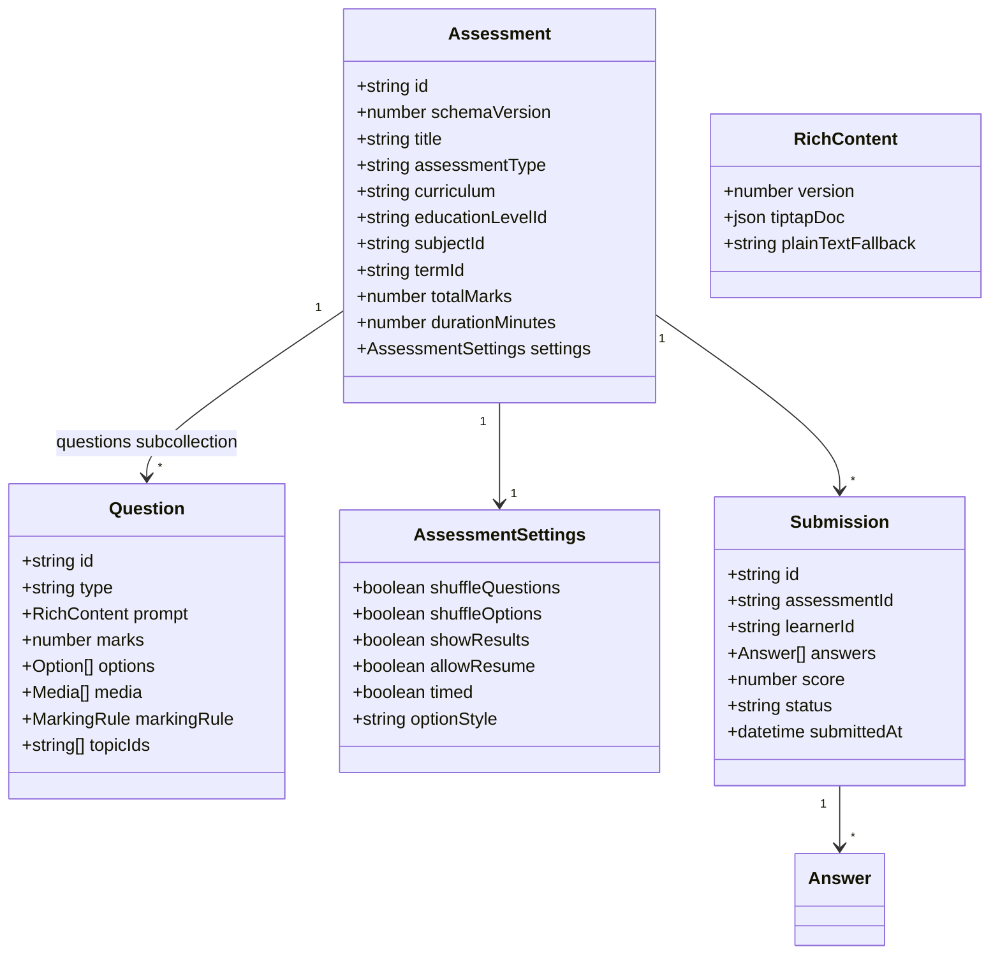

Contract notes — load-bearing:

1. **Questions are a Firestore subcollection**, not an array field (the stale-tab race-condition fix). Question writes go through guarded repository methods; storage-orphan cleanup triggers (`onQuizQuestionDeleted/Updated`, `onAssessmentQuestionDeleted/Updated`) already depend on this shape.
2. **`RichContent`, not `string`**: Tiptap JSON rendered with KaTeX; school notation (stacked fractions with a horizontal bar — never slash forms) via the existing custom extensions (`MathFraction`, `MathInline`, `NumberBase`, `VerticalArithmetic`); editor → preview → PDF/DOCX export parity, protected by the visual-regression CI gate.
3. **Legacy plain-string content stays byte-compatible**: the normaliser wraps legacy strings at read time; stored documents are never mutated in place.
4. **`schemaVersion` is required**; the normaliser upgrades old shapes at read time.

   **Phasing (decided 2026-08-05).** No document on the quiz-runner path carries `schemaVersion` today — it exists on lessons, drafts and teacher-tool outputs, and on none of `quizzes`, `questions`, `results`, `exam_attempts` or `scores`. Taken literally alongside Phase 3's byte-compatibility rule, this clause is a contradiction: stamping the field onto new writes makes every new `results` document differ from every old one by a field, which is the thing that phase forbids.

   It resolves by phase, not by exception. **For all of Phase 3, `schemaVersion` is read-time only** — the normaliser derives it, it is a property of the in-memory model, and nothing new is written. **Stamping it onto writes is a separate change after the cutovers**, once no old runner still writes those collections; until then two writers would disagree about whether the field exists, and the version stamp would record which code path happened to serve the request rather than the shape of the document. That later change carries its own read-side migration for unstamped documents, which is why it is not free and is not bundled here.
5. The canonical schema builds on what exists: **`functions/shared/assessment/` (13 ESM core modules shared with the client) is the seed of the canonical contract.** Client-side zod schemas (`src/schemas/`) formalise the same shapes. Do not create a third parallel definition; extend `functions/shared/` and keep the CJS/ESM constant-mirror tests green.

---

## 5. Curriculum Engine and Education-Level Resolver

**Current reality:** the taxonomy root is **`src/config/canonicalEducation.js`** (813 lines, "the one declaration of which curriculum years exist"); `src/config/educationLevels.js` (392 lines) is explicitly derived from it. Around them sit ~13 more config files (`curriculum.js`, `curriculumCatalog.js`, `teacherTaxonomy.js`, `assessmentBands.js`, `sba.js`, `grading.js`, ...) and ~15 resolution utils scattered in `src/utils/` (`curriculumFramework.js`, `curriculumOptions.js`, `syllabusTopicTree.js`, `frameworkSubjectMatch.js`, ...) plus duplicated framework data (`frameworkData.js` CBC vs `frameworkData2013.js`). The target consolidates the *resolution logic* into `src/curriculum/` while `canonicalEducation.js` remains the taxonomy root.

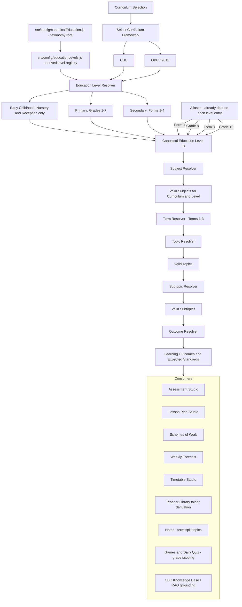

Hard constraints:

- **`canonicalEducation.js` is the single taxonomy root; `educationLevels.js` is its derived registry.** `src/curriculum/catalog/` re-exports these — it must never define a second registry. Server-side curriculum data (`functions/data/`, `cbcKnowledgeBase`, `rag_chunks`) must key off the same canonical IDs.
- Early Childhood is **Nursery + Reception only** — no Baby Class, no Middle Class.
- Secondary is named by **Form** (Form 1–4) in teacher-facing UI; Grade aliases resolve to the same canonical IDs (alias data already lives on each level entry).
- Subject naming is curriculum-aware: no "Numeracy" anywhere. CBC: "Pre-Mathematics and Science" (Nursery/Reception), "Mathematics and Science" (Grades 1–3); Grade 4+ and OBC: "Mathematics".
- Topics are **term-split** (Terms 1–3); strand-organised syllabi (e.g. Grade 7 English 2013) are mapped to terms in the catalog.
- The CBC vs 2013 duplicated framework data files converge behind one adapter interface in `src/curriculum/adapters/` — one resolver API, two framework datasets.

### 5.1 Curriculum selection rule

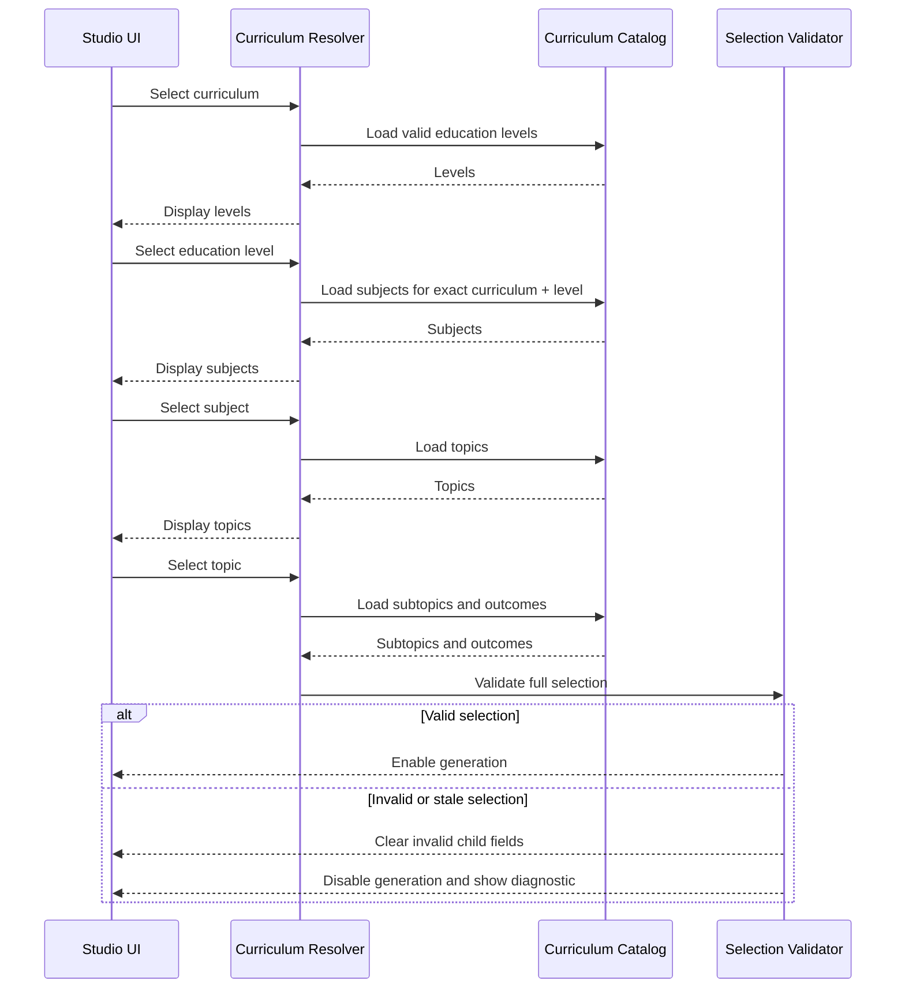

---

## 6. Offline and PWA Architecture

**Current reality (substantial and working — extend, don't rebuild):** `vite-plugin-pwa` (`generateSW`, `registerType: autoUpdate`, heavy chunks like pdfjs runtime-cached instead of precached, tested `navigateFallback` denylist); SW registration lives in `usePwaUpdate` with two safe cutover points (update toast + auto-apply on next in-app navigation); **the SW is not registered inside the Capacitor shell**. `src/offline/` is a 20-file stack: IndexedDB `zedexams-offline` (stores: `content`, `meta`, `outbox`), `contentCache`, `syncEngine` + `syncQueueCore`, `offlineSecurity` (AES-GCM with an `assertCacheable` sensitivity gate), `OfflineContext`, `OfflineLibraryPage`, `StorageSettingsPanel`, `useOfflineContent`, `useOfflineQuiz`. Firestore multi-tab persistence is enabled. A separate FCM service worker ships alongside.

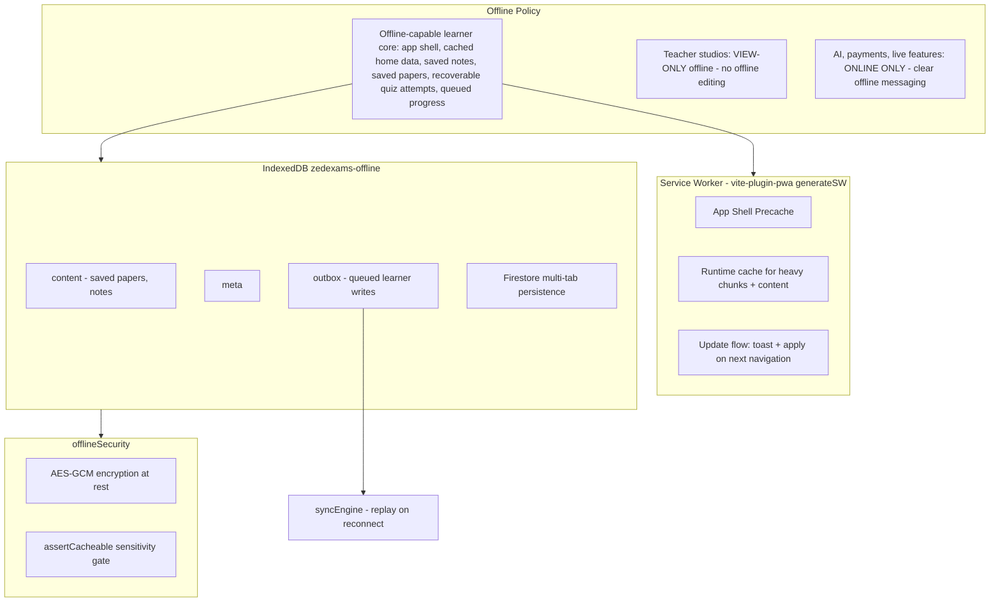

Rules:

1. **The offline-capable learner core is a precise, testable scope** — not "everything learner-facing". The two lists below are the contract; do not attempt to make every learner route work offline.

   Offline guaranteed:

   - Application shell (open the app with no connection)
   - Explicitly saved notes
   - Explicitly saved past papers
   - In-progress supported quiz attempts (recoverable via the outbox)
   - Previously cached learner home data

   Connectivity required:

   - Ask Zed and all AI generation
   - Payments and subscription changes
   - Live Quiz Challenge (when built)
   - Real-time leaderboard updates
   - Joining classes and invitation acceptance
   - Any content not previously cached or explicitly saved

   The outbox/syncEngine queues and replays learner-side writes (quiz attempts, progress) on reconnect.
2. **"Save offline" replaces "Download"** for past papers in the app (papers stored in IndexedDB, viewed in-app); the raw download button appears only on the desktop website.
3. **Teacher studios are view-only offline**: no offline editing of studio documents and no queued studio writes. The outbox is a learner-side mechanism; do not extend it to teacher document mutation.
4. **AI features are online-only** and say so when offline.
5. The `assertCacheable` gate and AES-GCM encryption are mandatory for anything written to the offline store — never bypass them for convenience.
6. The Capacitor shell currently runs without the SW; offline inside the Android app rides Firestore persistence + the IndexedDB stores. Any change to SW registration on Capacitor is its own explicitly-approved task, not a side effect of migration.

---

## 7. Cloud Functions Backend

**Current reality:** ~200 exported functions, Node 22, Functions v2 (two v1 auth triggers remain by necessity), all defined or re-exported from a single **4,894-line `functions/index.js`** with ~45 handlers written inline. Shared middleware already exists as modules (`authGuard`, `consentGuard`, `appCheckEnforcement` with staged per-label rollout, `rateLimit` fixed-window fail-open, `logger`, `cors` allow-list, `idempotency`, `paginationCore`). Validation is hand-rolled pure validators plus the `aiValidation/` contract registry — **there is no zod in functions**; the shared ESM package `functions/shared/` (guardian consent + 13 assessment modules) is imported by both client and server.

Target: the same functions, reorganised into the module layout below, with `index.js` reduced to exports only. **Every export name and Hosting rewrite path is frozen** — renaming a deployed function changes its URL and breaks webhooks, rewrites, and the app.

```mermaid
flowchart TB
    INDEX["functions/index.js - exports only, names frozen"]

    INDEX --> AI_FUNCTIONS
    INDEX --> ASSESSMENT_FUNCTIONS
    INDEX --> TEACHER_FUNCTIONS
    INDEX --> PAYMENT_FUNCTIONS
    INDEX --> CONSENT_FUNCTIONS
    INDEX --> ACCOUNT_FUNCTIONS
    INDEX --> FAMILY_FUNCTIONS
    INDEX --> NOTIFICATION_FUNCTIONS
    INDEX --> ADMIN_FUNCTIONS
    INDEX --> AGENT_FUNCTIONS
    INDEX --> OPS_FUNCTIONS

    subgraph AI_FUNCTIONS["AI - aiChat, apiAiChat, explainAnswer, checkShortAnswer, generateStudyPlan, apiTextToSpeech"]
        PROVIDER_ROUTER["Provider router + model fallback ladder"]
        MODERATION["OpenAI moderation - input and output"]
        SAFETY["learnerSafety distress + secrecy screening (deterministic, pre-model)"]
        INJECTION["Prompt-injection fencing for OCR/imported text"]
        PROMPT_CACHE["Anthropic prompt caching - ordered system blocks"]
        BUDGET["Cost tracking + revenue-linked budget enforcement + idempotent aiOperations"]
    end

    subgraph ASSESSMENT_FUNCTIONS["Assessment - generateAssessment, planAssessment, generateQuiz, regenerateAssessmentQuestion, importPastPaperQuestions, structureImportedQuiz, structureScannedQuiz, analyzeExamPaper"]
        X1[" "]
    end

    subgraph TEACHER_FUNCTIONS["Teacher tools - generateLessonPlan, generateWorksheet, generateHomework, generateNotes, generateFlashcards, generateRubric, generateSbaTask, generateSchemeOfWork, generateDiagram + streams"]
        X2[" "]
    end

    subgraph PAYMENT_FUNCTIONS["Payments - see section 9"]
        LENCO_FNS["initiateLencoPayment, submitLencoOtp, getLencoPaymentStatus, lencoWebhook, recoverMyPendingPayments"]
        PLAY_FNS["verifyGooglePlayPurchase (+ RTDN handler - planned)"]
        ADMIN_PAY["adminConfirmPayment, adminRejectPayment, adminGrantPremium, adminRevokePremium"]
        LIFECYCLE["getUpgradeQuote, setSubscriptionCancellation, subscriptionExpiryReminders, hourlyRevenueReconcile"]
    end

    subgraph CONSENT_FUNCTIONS["Consent - sendGuardianConsent, apiGuardianConsent (server-rendered no-JS pages), recordAgeGateAttempt"]
        X3[" "]
    end

    subgraph ACCOUNT_FUNCTIONS["Account - deleteMyAccount (step-up reauth), apiRequestAccountDeletion, purge with drift-tested collection lists, analyticsPurge"]
        X4[" "]
    end

    subgraph FAMILY_FUNCTIONS["Family - createProgressShare, family invite codes, getChildProgress, weeklyParentDigest, WhatsApp digest + webhook"]
        X5[" "]
    end

    subgraph NOTIFICATION_FUNCTIONS["Notifications - FCM push + dead-token pruning, reminder crons, announcement fan-out, quiet hours (Lusaka time)"]
        X6[" "]
    end

    subgraph ADMIN_FUNCTIONS["Admin - user/role/status, teacher approvals, curriculum + syllabus versioning, KB/RAG ingestion, audit logs"]
        X7[" "]
    end

    subgraph AGENT_FUNCTIONS["Agents - dispatcher, 15 named runners (Till, Monitor, Quill, Echo, Cala, Dawn, ...), circuit breaker, agentJobs"]
        X8[" "]
    end

    subgraph OPS_FUNCTIONS["Ops - daily Firestore + Storage backups, heartbeats, platform health, rate-limit health, export pipeline, reapers"]
        X9[" "]
    end

    AI_FUNCTIONS --> CALLABLE_CONTROLS
    ASSESSMENT_FUNCTIONS --> CALLABLE_CONTROLS
    TEACHER_FUNCTIONS --> CALLABLE_CONTROLS
    CONSENT_FUNCTIONS --> CALLABLE_CONTROLS
    ACCOUNT_FUNCTIONS --> CALLABLE_CONTROLS
    FAMILY_FUNCTIONS --> CALLABLE_CONTROLS
    ADMIN_FUNCTIONS --> CALLABLE_CONTROLS

    PAYMENT_FUNCTIONS --> CALLABLE_CONTROLS
    PAYMENT_FUNCTIONS --> WEBHOOK_CONTROLS

    NOTIFICATION_FUNCTIONS --> SCHEDULED_CONTROLS
    AGENT_FUNCTIONS --> SCHEDULED_CONTROLS
    OPS_FUNCTIONS --> SCHEDULED_CONTROLS

    subgraph CALLABLE_CONTROLS["Callable / user-facing HTTP controls"]
        AUTHG["authGuard - verified auth + active account"]
        APPCHECKM["appCheckEnforcement - staged per-label"]
        CONSENTG["consentGuard - assertLearnerCapability, fail closed (learner surfaces)"]
        MFA["requireAdminMfa - 30-min step-up for destructive ops"]
        RATE["rateLimit - per-user + per-IP buckets"]
        VALID["aiValidation contracts + shared pure validators"]
    end

    subgraph WEBHOOK_CONTROLS["Provider webhook controls - NOT Firebase user auth"]
        SIG["Signature verification over unmodified raw body (Lenco HMAC-SHA512, WhatsApp)"]
        REPLAY["Replay protection + strict payload validation"]
        IDEMW["Idempotent event processing - processedEvents"]
    end

    subgraph SCHEDULED_CONTROLS["Scheduled / queue / trigger controls"]
        IDENT["Service identity - no user auth"]
        IDEMS["Idempotent, retry-safe, bounded batches"]
        CIRCUIT["Circuit breaking (agents)"]
        REGION["Firestore triggers pinned to source region (africa-south1), no recursive writes"]
    end

    subgraph FOUNDATION["Shared foundations - all classes"]
        LOG["structured logger + request IDs"]
        IDEM["idempotency helpers"]
    end

    CALLABLE_CONTROLS --> FOUNDATION
    WEBHOOK_CONTROLS --> FOUNDATION
    SCHEDULED_CONTROLS --> FOUNDATION

    FOUNDATION --> DATA["Firestore (africa-south1) + Storage + adminAuditLogs / securityAuditLogs"]
```

Backend rules:

- **`functions/shared/` stays the single client+server contract package** (ESM). The CJS-vs-ESM constant mirrors currently pinned by tests should shrink as modules migrate, never grow.
- **Every provider-backed export must have a rate limiter or an explicit exemption** — the `aiEndpointDiscovery` CI guard enforces this; new functions must satisfy it.
- Known hardening gaps (from `SECURITY_ENDPOINT_AUDIT.md`) to burn down during Phase 5: the unauthenticated HTTP surface and uncapped AI callables. Two current defaults deserve explicit review flags in code: moderation **fails open** on provider error, and rate limiting **fails open** on Firestore error.
- The mirror-discipline hazards must become shared modules during migration: `functions/plans.js` ↔ `src/utils/subscriptionConfig.js`, and `PLAY_PRODUCT_TO_PLAN` ↔ the client Play catalog (currently held together by tests).
- `functions/.env.examsprepzambia` is committed **on purpose**: it is the documented Firebase mechanism for non-secret runtime config (budget caps, App Check labels, backup buckets, alert recipients), and it must exist at deploy time. The Phase 0A secret exposure gate (section 13) audited it and every version in its history and found no credential, so it is retained rather than removed. Real secrets go to Secret Manager via `defineSecret()`; `npm run test:secret-hygiene` now scans this file's contents on every CI run so that stays true.

---

## 8. Learner AI Request Flow

This sequence applies to **learner-facing AI surfaces** (Ask Zed via `aiChat`/`apiAiChat`, short-answer checking, study-plan generation and similar). Teacher, admin, agent, and scheduled AI operations use their own authorization and validation paths — they do **not** execute the guardian-consent or distress flow unless they are processing content on behalf of a learner-facing experience. Do not insert `assertLearnerCapability` into teacher generators.

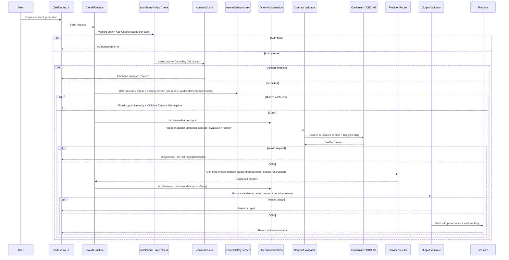

Provider stack (current): Anthropic Claude Sonnet (default, with fallback ladder) for generation and Haiku for verification/vision safety; OpenAI for Zed chat, short-answer marking, images (gpt-image-1), embeddings (curriculum RAG), and moderation; Gemini for text + image alternatives. All via hand-rolled REST clients — **no vendor SDKs in functions**; keep it that way for cold-start size. Imported/OCR text is fenced through the prompt-injection guard before reaching any prompt.

---

## 9. Payment and Subscription Flow

**All Zambian payments run through Lenco** — MTN MoMo, Airtel Money, and Zamtel Kwacha are operator choices inside the single Lenco integration (operator detected from the phone prefix). Cards exist in the Lenco client but are server-disabled pending enablement. Android digital goods go through Google Play Billing. Every path converges on one idempotent activation chokepoint.

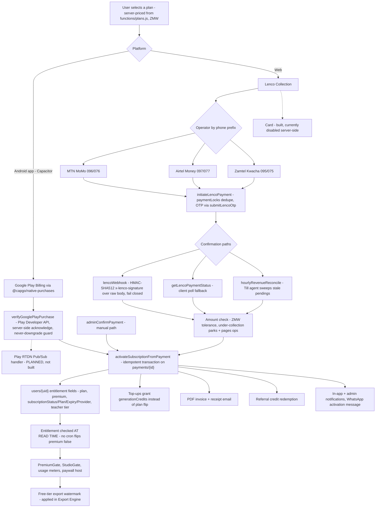

Payment rules:

1. **Platform routing is a Play compliance requirement**: digital subscriptions inside the Android app go through Play Billing only; Lenco is web-only. Never surface Lenco checkout inside the Capacitor shell.
2. **Entitlements are written only server-side.** Firestore rules already enforce this (users self-update blocks all subscription fields; `payments`/`invoices`/`subscriptionEvents` are server-only writes). Keep it that way.
3. **Server-authoritative pricing**: amounts come from `functions/plans.js`, never the client. `plans.js` and `src/utils/subscriptionConfig.js` must be unified into a shared module (they are currently test-pinned mirrors).
4. **Expiry is enforced at read time** (`hasValidEntitlement` in rules + client checks) — do not add a cron that flips `premium: false`.
5. Every path — including admin manual confirmation — flows through `activateSubscriptionFromPayment`. No code path may grant entitlement fields directly.
6. **Planned addition:** a Play RTDN (real-time developer notifications) Pub/Sub handler, so renewals/cancellations/refunds update entitlements without waiting for the client-driven `verifyGooglePlayPurchase` refresh. Until then, the restore-on-open sync (`NativePlayBillingSync`) is the refresh mechanism.

---

## 10. Firestore Domain Structure

Real collection names (frozen). Questions live as subcollections under their parent assessment/quiz.


Data-model notes:

- Supporting server-only collections (all `write: if false` to clients): `aiUsage`, `aiDailyLimits`, `aiOperations`, `rateLimits`, `processedEvents`, `downloadTickets`, `paymentLocks`, `referralRedemptions`, `webauthnChallenges`, `deletionRequests`, `accountPurgeJobs`, `opsBackups`, `visitorStats`.
- **`referralCodes` is not one of them** — corrected 2026-08-05. The rule is a *constrained client self-create*: `allow create: isAuthed() && incoming().keys().hasOnly(['uid','createdAt']) && incoming().uid == request.auth.uid`, with `update`/`delete` denied. That is deliberate, not an oversight — `mintAndPersistReferralCode` (`src/utils/referrals.js`) mints a code client-side and *relies on* rules rejecting a collision to drive its retry loop, and the `uid == request.auth.uid` clause is what stops a tampered client minting a code that points at someone else. Server-only for every other operation.
- Public-read surfaces are deliberate and enumerated (`if true` reads): `settings`, `examTimetables`, `announcements`, `leaderboards`, `daily_challenges`, `publicStats/global`, and token-shares readable by `get` only (never `list`) so they can't be enumerated.
- **`agentJobs` is admin-written, not server-only** — corrected 2026-08-05. Creation, review (`status`/`reviewedBy`/`reviewedAt`/`reviewNotes`/`overrideReason` only) and deletion are all `isAdmin()`; everything else on the document — `output`, `error`, `publishedRefs`, and every status transition beyond approve/reject — is server-owned. Create was `isTeacherOrAbove()` until the same date: that half of the grant was written for the teacher-facing agent-submission surface removed in 2026-06 and outlived it, so it was narrowed. The live client creators are the admin `BulkGenerateButton` and `GenerateFromTopicMenu`.
- **`games` was counted among those and is not** — corrected 2026-08-05. Its read is `resource.data.get('active', true) == true || isAdmin()`: public for an *active* game, closed for an inactive one, which is stricter than `if true` and better behaviour than the doc described. Writes are admin-only.
- `CONSENT_REQUESTS` stores **hashed** single-use tokens with TTL; consent pages are server-rendered no-JS HTML for low-end devices.
- Account deletion purges via three drift-tested collection lists (`accountDeletionDrift.test.js`) — **any new collection carrying user data must be added to those lists in the same PR**, plus the PostHog analytics purge.
- **Three collections were missing from this inventory until 2026-08-05**, each with a `firestore.rules` match block since it shipped: `paperAttempts` (`firestore.rules:2761` — past-paper practice attempts), `daily_exam_locks` (`:694` — the one-sit-per-day lock), and `learner_profiles` (`:1887` — games intelligence, written fire-and-forget from `src/utils/gamesIntelligence.js:109` after a score). They are added here because **this section is the universe `scripts/test-rules-collection-coverage.mjs` classifies against**: a collection absent from it is neither covered nor flagged as uncovered, so the ratchet could not fail on it in either direction and never did. Found while planning Phase 3, which writes all three. The ratchet is being changed to derive its universe from `firestore.rules`' match blocks rather than a hand-maintained list, so this class of omission fails a build instead of going quiet.
- Teacher Library metadata contract: `libraryState` (working/classified/archived), derived `classificationState`, virtual folders over `studioType → curriculum → grade → term`, author field `createdBy`, personal scope until a school membership model ships (rules helpers for school RBAC already exist).

---

## 11. Security Rules, Indexes, and Enforcement

**Current reality — already strong; the job is maintenance discipline, not creation:** `firestore.rules` is 3,279 lines with ~80 field-allowlist validators; `storage.rules` is 490 lines ending in default-deny; `firestore.indexes.json` holds 158 composite indexes; five emulator test suites plus static rules-text checks run in CI; `cors.json` grants read-only GET/HEAD.

Principles to preserve:

1. Hybrid role model: Firestore `users.role` + custom claims (`platformAdmin`, `superAdmin` as a zero-read break-glass path); everything meaningful behind `isVerified()` with a server-written grace window.
2. Self-update field allowlists on `users` block every entitlement and role field; registration forces `plan: 'free'`, `subscriptionStatus: 'inactive'`.
3. `hasValidEntitlement()` in rules mirrors the client entitlement check and fails closed on stale `premium: true`.
4. Token-share documents allow `get` but never `list`.
5. Indexes are derived from actual repository query contracts and emulator-verified — no blanket composites.
6. **Every migration that touches a collection updates the rules, its emulator test, and (if queries changed) the indexes in the same PR.** A phase is not complete while any rules suite fails.
7. Storage paths stay owner-scoped with the default-deny catch-all; new upload surfaces get their own scoped match block.
8. **Secret Manager is kept minimal: superseded versions are disabled after every rotation, and secrets no longer referenced by code are removed.** A rotation that leaves the old version enabled has not reduced the blast radius of the leak it was answering — both values still authenticate. An orphaned secret is worse than an unused one: nothing in the codebase reveals what it grants, so no review notices when it should have been revoked. Removing one is a **deploy-ordered** change — delete the `defineSecret()` reference and deploy *before* destroying the secret, because a `defineSecret()` bound to a secret with no value hard-fails every functions deploy (see §7's `OPS_ALERT_WEBHOOK_URL` note). The inverse also holds: a secret a function is *waiting on* is not an orphan — `META_WHATSAPP_APP_SECRET` is unset today and the inbound WhatsApp webhook answers 403 to everything as a result, which is the designed fail-closed posture, not a gap to clear by deleting the binding.

   **Inbound WhatsApp (Bonga) — recorded state, Phase 0B, 2026-08-04.** Secret Manager holds `META_WHATSAPP_VERIFY_TOKEN` **with zero versions**, and `META_WHATSAPP_APP_SECRET` **does not exist at all**. The consequence in code (`functions/metaWhatsApp.js`, `apiWhatsAppWebhook` in `functions/index.js`) is that inbound WhatsApp is **fail-closed and incomplete, by design**: the GET handshake compares `hub.verify_token` against an empty expected token and can never match (403), and every inbound POST is refused with `403 "signature verification not configured"` — unconditionally, on a separate branch from the bad-signature 403, so an unconfigured webhook is never mistaken for a verified one. Nothing is at risk; Bonga simply cannot receive.

   Two things about clearing it, both easy to get wrong:

   - **Neither secret is bound via `defineSecret()`.** Both are read from `process.env` through `readEnvSecret()`, and `WHATSAPP_WEBHOOK_SECRETS` deliberately omits them. So **storing a version changes nothing on its own** — an unbound secret never reaches the runtime environment, and the webhook would keep answering 403 while the console showed a populated secret. The value and the binding are two separate acts and only the pair has an effect.
   - **They must be created and bound together, and in that order.** A `defineSecret()` bound to a secret with no value makes `firebase deploy` hard-fail — *"no value for the secret: X"* — and that failure blocks **every** functions deploy, not just this one (§7's `OPS_ALERT_WEBHOOK_URL` note; the same trap documented for `RECRAFT_API_KEY`). `META_WHATSAPP_VERIFY_TOKEN`'s zero-version state is precisely this trap armed: binding it today wedges the deploy pipeline. Enabling Bonga inbound is therefore one change — set both values, add both to `WHATSAPP_WEBHOOK_SECRETS`, deploy — never a partial one.

### 11.1 Export and download pipeline

Exports are security-sensitive (entitlement-gated, watermarked, served via tickets). The pipeline is fixed:

```
Request export (requestAssessmentExport / library download)
  → validate ownership and entitlement
  → render artifact server-side (DOCX/PDF, content-addressed via sourceHash)
  → apply free-tier watermark where required (inside the Export Engine, so every path inherits it)
  → store in owner-scoped Storage path (assessment-exports, tmp-downloads)
  → issue short-lived single-use download ticket (downloadTickets, server-only collection)
  → download through the validated endpoint (apiAssessmentDownload / apiLibraryDownload via Hosting rewrite)
  → expire and reap artifact + ticket (reapDownloadTickets, tmpDownloadReaper, reapAssessmentExportsOnDelete)
```

No export may ever be served from a public Storage URL, and no download path may bypass the ticket check. Export rendering output is protected by the visual-regression CI gate.

### 11.2 Backup and disaster recovery

Current implementation: `dailyFirestoreBackup` (daily Firestore export) with `backupCompletionCheck`, plus `storageBackupCheck` / `storageBackupHeartbeat` and the `orphanStorageReaper`; run records in `opsBackups` / `opsBackupRuns` / `opsStorageBackups`; restore procedure documented in `docs/production-readiness/` (firestore-restore runbook). Hosting rollback is instant from the console; backend rollback is `git revert` through CI.

**Phase 0B answers (recorded 2026-08-04, commit `7e5df4b`).** Sources: `functions/firestoreBackupCore.js`, `functions/firestoreBackup.js`, `functions/storageBackup.js`, the runbook [`docs/production-readiness/runbooks/firestore-restore.md`](production-readiness/runbooks/firestore-restore.md), and the operator record [`docs/production-readiness/remediation/dr-001-infrastructure-readiness.md`](production-readiness/remediation/dr-001-infrastructure-readiness.md). Facts about live GCP state are quoted from that operator record — nothing here was read from a live console by the repo session.

**a. Backup destination bucket(s) and region(s) relative to africa-south1**

| | Bucket | Region | Set by |
|---|---|---|---|
| Firestore export | `gs://zedexams-backups` | **africa-south1** — *same region as the database* | `FIRESTORE_BACKUP_BUCKET`, `functions/.env.examsprepzambia` |
| Storage mirror | `gs://zedexams-storage-backup` | not provisioned | `STORAGE_BACKUP_BUCKET`, same file |

Layout: `{bucket}/firestore-exports/{YYYY-MM-DD}/`, `collectionIds: []` (every collection — `buildExportRequest` comments that a partial backup silently omitting a collection would be worse than none). The date key is **UTC**, and the cron fires 01:30 Africa/Lusaka = 23:30 UTC the *previous* calendar day, so a run "on the morning of the 20th" lands in the `…-19` folder.

> ⚠️ **Open finding — the backup bucket is co-located with the database.** `firestoreBackup.js`'s setup notes say "Create the destination bucket in a DIFFERENT region from the database", and the runbook's §1.2 command creates it in `europe-west1`; the bucket that actually exists is `AFRICA-SOUTH1`, and the runbook's own region table records it as such. A single-region incident can therefore take the database and its backups together. The runbook is internally contradictory on this point. Resolving it is an operator task (create a cross-region bucket, repoint `FIRESTORE_BACKUP_BUCKET`, re-verify) — **it is not a Phase 0B blocker**, because it degrades a scenario the daily export was never the only control for, but it must not be lost. Object versioning is on; there is no public-access binding.

**b. Retention policy**

`selectExportsToDelete` in `firestoreBackupCore.js`: `retentionDays = 30`, `keepMinimum = 7`. Its guarantees are the interesting part — it never deletes the newest completed export, never deletes an export not explicitly marked `completed`, always keeps at least the 7 most-recent completed exports, and keeps anything ambiguous. Its runner `runBackupRetention` is **dry-run by default and deliberately not scheduled**.

The code comments and the runbook both name the **GCS bucket lifecycle rule as the authoritative** retention mechanism, with the selector as a secondary safeguard. Per DR-001 §2, that lifecycle rule is **not configured** ("deliberately deferred — no deletion rule in this phase").

> **Therefore the effective retention today is *unbounded*: nothing expires an export.** That is fail-safe rather than fail-dangerous — the risk is storage cost, not data loss — but "30 days" is the *designed* policy, not the operating one, and this section should not be read as though it were. Closing it means setting the lifecycle rule (runbook §1.2), at which point the 30/7 selector becomes a genuine second line.

**c. Restore-test frequency and the last result**

**A restore test has succeeded.** Per DR-001 §13, an authorised operator restored the 2026-07-19 export into a **non-production scratch database** on **2026-07-22**: **27,192 documents**, measured **RTO 25m50s**, scratch database deleted afterwards, **no data imported into `(default)`** — result PASS. That is the recorded evidence Phase 0B's gate 8 requires, and it predates any migration code move.

Frequency, going forward: **before migration begins (satisfied by the 2026-07-22 drill) and again after Phase 5**, per this section's original instruction. Any change to the export destination, the database region, or the restore script re-arms the requirement regardless of schedule. The rehearsal procedure and the exact commands are in the runbook, Part 2 and the Phase 0B appendix.

Evidence completeness, stated plainly: §13's record is a summary block. It carries the document count, the RTO, the no-production-write confirmation and the verdict, but **not** the import operation name, the scratch database name, or per-collection document counts, which the record's own template asks for. The drill happened and passed; the paper trail is thinner than the template. The Phase 0B runbook appendix exists so the post-Phase-5 rehearsal records all of it.

**d. RPO / RTO**

| | Value | Basis |
|---|---|---|
| **RPO** | **≤ 24h** from the daily export; **≤ minutes** within the 7-day PITR window | PITR enabled 2026-07-19, retention 604800s |
| **RTO** | **≈ 26 minutes** (measured 25m50s for 27,192 documents) | The 2026-07-22 drill |

These are evidence-backed, not projected. **RTO scales with database size — re-measure after major growth**, and specifically as part of the post-Phase-5 rehearsal.

Both numbers describe **Firestore only**. Not covered by this export, and so outside both figures: **Firebase Auth** users and claims (needs its own `firebase auth:export` cadence), **Cloud Storage** objects (a verified backup *monitor* exists — DR-003 — but the cross-region mirror is unprovisioned and `STORAGE_BACKUP_BUCKET` is unset), and **provider reconciliation** — a restored `payments`/entitlement snapshot may lag live Lenco/Play state and must be reconciled through Till / `verifyGooglePlayPurchase` rather than trusted.

**e. Owning function for backup-failure alerts**

| Function | Region | Schedule | Raises |
|---|---|---|---|
| `dailyFirestoreBackup` | us-central1 | 01:30 Africa/Lusaka | `misconfigured` (production, no valid bucket) → **error alert**; `skipped-non-production` → silent, by design |
| `backupCompletionCheck` | us-central1 | 03:30 Africa/Lusaka | the export LRO finished with an error, or never completed |
| `storageBackupCheck` / `storageBackupHeartbeat` | us-central1 | — | Storage mirror staleness / `STORAGE_BACKUP_BUCKET` unset |
| `opsHeartbeatCheck` | us-central1 | — | the heartbeat path itself |

All four route through `sendOpsAlert` (`functions/opsAlert.js`) → email to **`OPS_ALERT_EMAILS`** (never `ADMIN_EMAILS`, which is an authorization allowlist — see §7) plus the opt-in `OPS_ALERT_WEBHOOK_URL` chat channel. No single agent owns backup health end-to-end; **Marshal** (`hourlyAgentSupervisor`) is the watchdog that notices a scheduled agent failing to produce its rollup, and is the natural owner if that gap is ever closed. Alert delivery is provable without waiting for a real failure: `/admin` → Developer tools → **Test the ops alarm**.

The scheduled backup functions run in **us-central1** while the database and bucket are in **africa-south1** — intentional, and consistent with the repo rule that only Firestore *triggers* pin to `africa-south1`. `gcloud` commands must use `--location=us-central1` for the function and its Scheduler job, and `--location=africa-south1` when creating a scratch database.

---

## 12. Final Target Folder Map

```
src/
├── app/                          ← target home for App.jsx, route registry, guards, layouts
│   ├── App.jsx
│   ├── routes/                   ← learner/admin/public routes join teacherRoutes.jsx pattern
│   ├── providers/                ← from src/contexts/ (OfflineContext stays in src/offline/)
│   │   ├── AppProviders.jsx      ← single composition entry, mounted in main.jsx
│   │   ├── AuthProvider.jsx
│   │   ├── ThemeProvider.jsx
│   │   ├── DataSaverProvider.jsx
│   │   ├── NotificationProvider.jsx
│   │   ├── PlatformSettingsProvider.jsx
│   │   └── index.js
│   ├── guards/
│   └── layouts/
│
├── features/                     ← migrate components/* area by area into this pattern
│   ├── (existing: learnerHome, notes, lessons, drafts, visualStudio,
│   │    learnerSettings, teacherSettings, ...)
│   ├── (learner: quizzes, daily-quiz, past-papers, games, live-quiz*, ask-zed,
│   │    badges, results, study-plan, classes, search, offline-library)
│   ├── (teacher: assessment-studio, lesson-plan-studio, generators…, sba,
│   │    class-register, class-list, syllabi, calendar, teacher-library,
│   │    templates, scan-import, my-classes; the question bank is a VIEW of
│   │    assessment-studio, not a surface of its own)
│   ├── (admin: dashboard, users, content, curriculum-admin, past-paper-studio,
│   │    ai-admin, payments-admin, agents-console, settings)
│   ├── (parent: family, child-progress, shares)
│   └── guardian-consent/         ← UI and client adapters importing functions/shared consent core (no copied contract)
│
├── engines/
│   ├── assessment-engine/        ← ONE runner replacing QuizRunnerV2, DailyExamRunner,
│   │   │                            PublicQuizRunner/PastPaperPractice, games quiz loops
│   │   └── schemas/              ← client zod, aligned with functions/shared/assessment
│   ├── export-engine/            ← docx/pdf/print, watermark, page preview, visual-regression-gated
│   ├── payment-engine/           ← entitlement checks, usage gates, paywall host
│   └── notification-engine/
│
├── curriculum/
│   ├── catalog/                  ← re-exports config/canonicalEducation.js + educationLevels.js
│   ├── resolvers/                ← consolidates ~15 curriculum utils from src/utils/
│   ├── adapters/                 ← CBC + 2013 framework data behind one interface
│   ├── aliases/
│   └── validators/
│
├── offline/                      ← keep as-is (contentCache, syncEngine, offlineSecurity, outbox)
├── editor/                       ← keep as-is (Tiptap + math extensions)
├── services/
│   ├── firebase/  firestore/  storage/  ai/  payments/  analytics/  notifications/
├── shared/
│   ├── components/  hooks/  icons/  constants/  schemas/  validation/  utils/
├── config/
│   ├── canonicalEducation.js     ← taxonomy root (frozen)
│   ├── educationLevels.js        ← derived registry (frozen)
│   └── (paper geometry, grading, sba, badges, ... stay here)
├── i18n/                         ← en + ny locales
├── assets/
└── main.jsx

functions/
├── index.js                      ← exports only; every export name frozen
├── ai/  assessments/  teacherTools/  payments/  consent/  account/  family/
├── notifications/  administration/  agents/  ops/  tts/
├── middleware/                   ← authGuard, appCheckEnforcement, consentGuard,
│                                    requireAdminMfa, rateLimit, logger, cors, idempotency
├── repositories/  schemas/  validation/  data/
└── shared/                       ← ESM package shared with client (consent + assessment cores)

firebase.json / .firebaserc / firestore.rules / firestore.indexes.json / storage.rules / cors.json
android/ + capacitor.config.json  ← Capacitor shell
.github/workflows/                ← CI gates + deploys + Android + visual regression + agent workflows
scripts/                          ← node test/audit/backfill utilities (keep; test:all discovers them)
tests/visual/baselines/           ← CI-recorded only, never hand-edited
```

Repo hygiene (Phase 6 cleanup targets): stale `README.md` claims (Netlify, "MTN MoMo" direct — reality is Lenco + Play Billing, Firebase Hosting, Vite 8 + React 19); the zero-byte `firebase` file at repo root; `tmp/` and `output/` scratch artifacts; committed QA report dumps (`.auth-qa-report.json` etc.) if no longer consumed.

---

## 13. Migration Phases

Every phase ends with: the app builds, all routes render, all nine required CI checks pass (including rules emulator suites and visual regression), and the merge deploys cleanly via GitHub Actions. **Never start phase N+1 with phase N red.** This plan must be reconciled with the repo's own `docs/architecture/25-remediation-plan.md` — where they conflict, resolve explicitly before starting.

**Phase 0A — Secret exposure gate (blocking, runs first). CLOSED 2026-08-04 — config-only, verified: no credentials were ever committed; the file is retained as documented non-secret runtime config.** Audit record: [`docs/security/AUDIT_LOG.md`](security/AUDIT_LOG.md).

1. Inspect `functions/.env.examsprepzambia` **without printing its values** into logs, comments, issues, or chat output. — Done; classified by format and entropy, no value reproduced.
2. Determine whether it contains live credentials, placeholders, or already-revoked values. — **None of the three.** All 9 keys are non-secret operational config (treasury budget numbers, App Check labels, backup bucket names, the ops alert recipient). There is nothing credential-shaped for a placeholder to stand in for.
3. If live or historically live, **rotate before deleting or reorganising anything** (moving a secret to Secret Manager does not invalidate a credential already committed to history). — **Not applicable.** All 16 historical versions were scanned in full, comments included; zero credential-format or high-entropy hits. Nothing to rotate.
4. Verify production and CI Secret Manager bindings. — Verified statically: the 13 `defineSecret()` names plus the string-bound `OPS_ALERT_WEBHOOK_URL` and the WhatsApp verify/app-secret pair are **disjoint** from this file's keys, and CI deploys authenticate through GitHub Actions secrets without ever writing into it. Live Secret Manager version state remains an owner-console check.
5. Check Git history exposure and decide whether history rewriting is necessary. — Tracked since 2026-04-25 (#62) and reachable from most branch tips of a public repo, so exposure would have been total *had* there been anything to expose. There was not: **no history rewrite is necessary.**
6. Remove the file from the tracked tree; add ignore rules and automated secret scanning. — **The removal was conditional on step 2 finding secrets, and it did not.** The file stays tracked: `functions/.env.<projectId>` is the documented Firebase mechanism for non-secret runtime config that must exist at deploy time, and deleting it would strip live budget caps, App Check labels, backup buckets and alert recipients from the next functions deploy. Automated scanning **was** added — `scripts/test-secret-hygiene.mjs` now scans the contents of every tracked dotenv file for credential formats and for opaque high-entropy values under secret-bearing key names, closing the gap where the one file allowed to be committed was the one file nothing read.
7. Record the incident and rotation in the security audit log. — Recorded as a **finding of no incident and no rotation**. This is a repo-level audit record; the Firestore `securityAuditLogs` collection remains for runtime security events and was not written to.

**Standing rule this leaves behind:** `functions/.env.<projectId>` is for values that are safe to read in a public repository. A real secret goes to `firebase functions:secrets:set` and is bound with `defineSecret()` — never into this file, which CI now enforces rather than trusts.

**Phase 0B — Safety net and recovery verification. CLOSED 2026-08-04 at commit `7e5df4b`.** No code moved; the route register was regenerated, the emulator-coverage question was converted from a reading into a test, and the §11.2 recovery information is now recorded above.

8. **Restore test — CLOSED on pre-existing evidence, not re-run.** A non-production restore drill **passed 2026-07-22**: 27,192 documents into a scratch database, measured **RTO 25m50s**, scratch database deleted afterwards, **no data imported into `(default)`**. Recorded in [`docs/production-readiness/remediation/dr-001-infrastructure-readiness.md`](production-readiness/remediation/dr-001-infrastructure-readiness.md) §13; the §11.2 answers above are derived from it. The drill predates any migration code move, which is what this gate asks for, so it is **not** re-run for its own sake — but the recorded evidence is a summary rather than the full template (no import operation name, scratch DB name, or per-collection counts). The commands and the checklist for the **post-Phase-5** rehearsal, written to capture all of it, are the Phase 0B appendix in [`runbooks/firestore-restore.md`](production-readiness/runbooks/firestore-restore.md); they are for an authorised operator's Cloud Shell session and target a scratch database, never `(default)`.

   Carried forward as open, and explicitly **not** Phase 0B blockers — they are DR-001 closure items, tracked in §11.2: the backup bucket is **co-located** with the database; the bucket **lifecycle rule is unset**, so the designed 30-day retention is not the operating one; and **Firebase Auth, Cloud Storage and provider reconciliation** are outside the Firestore export and outside the measured RPO/RTO.

9. **Route inventory — VERIFIED STALE and REGENERATED.** `main` had advanced 25 commits past the architecture doc's verified commit `79ff3d2`, and [`03-route-register.md`](architecture/03-route-register.md) was pinned to `0cd4c49` (2026-07-17) with **17 commits touching the route sources** since. It is regenerated at `7e5df4b`: **203 declared routes — 133 in `App.jsx`, 70 in `teacherRoutes.jsx`, no overlap**, parsed through `scripts/lib/declaredRoutes.mjs` (the one module that knows where routes are declared) and diffed against the document until only the `*` catch-all remained unmatched. **30 routes were undocumented.** The ones that matter to this plan:

   - `/dashboard` is `LearnerHomePage` (`features/learnerHome`), not `GradeHub` — `GradeHub` moved to `/dashboard/classic`. New flat learner routes `/learn`, `/practice`, `/subjects/:subjectId`, and six `/learner/*` **redirects** that confirm §2's rule: the prefix exists only as legacy redirects.
   - `/teacher/assessment-papers` is canonical and `test-papers` / `exam-papers` / `assessments` are now **pure redirects** (`LegacyAssessmentPaperRedirect`) — the old register still described them as functional aliases with a route-level `variant`. `/teacher/generate/lesson-plan` likewise became a redirect; the studio lives at `/teacher/lesson-plans/{new,:lessonPlanId/edit}`.
   - Two admin-role routes sit deliberately **outside** `AdminRoute`/`AdminLayout`: `/admin/security/mfa-setup` (the enrolment page cannot sit behind the gate it enrols for) and `/dev/ui` (`ProtectedRoute` + `AdminMfaGate`).
   - Four teacher routes are **unguarded on purpose** because they render mock data only: `/teacher/dashboard-preview` and `/teacher/register-preview{,/capture,/review}`. Giving any of them a Firestore read means adding a guard in the same PR.

   **Emulator coverage — confirmed, and now enforced rather than asserted.** A one-off reading of the six suites is true the day it is written and quietly false later, so the answer is [`scripts/test-rules-collection-coverage.mjs`](../scripts/test-rules-collection-coverage.mjs) (`npm run test:rules-collection-coverage`, auto-discovered by `test:all`). It is a ratchet: losing coverage on a collection fails, and a §10 collection classified as neither covered nor uncovered fails, so adding one forces a decision. Result today: **28 of 50 §10 collections are exercised by an emulator suite**; the other 22 are listed with what the rules do instead, since "uncovered" must never be read as "unruled". Writing it surfaced three cases where §10's entity name is not the collection name — **NOTES → `lessons`**, **CURRICULA → `curriculum`**, **PAPERS → `pastPapers`** (`papers` is the *Storage* path) — two of which had read as untested and are in fact covered.

   Uncovered collections a migration phase will touch, so the rule in §14.12 has teeth: **`classes`** (Phase 4), **`lessons`**, **`teacherLibraries`** (the `{uid}` meta doc — the library suite covers library *items*, not it), **`notifications`**, **`badges`**, **`dailyStreaks`**, **`learnerStats`**. Two server-only collections — **`paymentLocks`** and **`opsBackups`** — have no match block at all and rely on the explicit default-deny catch-all, with no test asserting that denial.

10. **Migration baseline tagged** — annotated tag **`migration-baseline-phase0`** at **`7e5df4b`**, the `main` tip every Phase 0B inventory above was verified against. It is deliberately *not* placed on the Phase 0B merge commit: `main` takes squash merges, so a tag on a branch commit would point outside `main`'s history the moment the PR lands. Phase 1 scaffolding begins from this tag, and `git diff migration-baseline-phase0..HEAD` is the migration's own diff for the rest of the plan.

No code moves in Phase 0. Phase 1 scaffolding begins only after **every** Phase 0 gate is closed.

**Phase 1 — Scaffold. CLOSED 2026-08-05.** Created `src/app/`, `src/engines/`, `src/shared/`, `src/curriculum/` with an `index.js` in every area, added the ESLint import-boundary rules, and wired `src/curriculum/catalog/` to re-export `canonicalEducation.js`/`educationLevels.js`. No file moved, no import changed, no route touched — the build output is unchanged.

Four things it established that later phases inherit:

- **The layering is `app → features → engines / curriculum → shared / services / config`**, and each arrow is one-way. The rules live in `eslint.config.js` as core `no-restricted-imports` (no new lint plugin); the three new lower layers additionally refuse the Firebase SDK, since reaching it through `src/services/` is what keeps them testable (§14.2).
- **Every directory index is a namespace marker, not a barrel.** Only `curriculum/catalog/` re-exports anything. A root barrel would pull all four engines into the chunk of anything that wanted one — the router is fully lazy and that is worth keeping.
- **The lint rules check static declarations by specifier, so three things are invisible to them**, and `npm run test:import-boundaries` resolves all 1,954 files in `src/` to cover all three: sibling features (`src/features/A/` reaching `src/features/B/` is written `../../B/lib/x`, which names no layer and is indistinguishable as a string from its own `../lib/x`); **dynamic `import()`, which `no-restricted-imports` does not inspect at all**; and growth, since a warning cannot fail `eslint .`. The same test lints synthetic violations through the real config, so a pattern that quietly stops matching fails a test instead of reading as a clean codebase.
- **It measured the existing debt rather than assuming there was none.** Three cross-feature imports exist (`features/lessons` reads `format`, `useLearnerProfile` and `notes.css` out of `features/notes`), and eleven more reach from the legacy tree (`src/components`, `src/hooks`) into feature internals. Both are shrink-only lists in that test: an unrecorded import fails, and a recorded one that no longer exists fails too, so clearing one means deleting its line. The legacy eleven are ESLint **warnings** as well, and the rule flips to `error` when the last goes. Nothing was rewired to make the lists shorter — the fix for the three is the Phase 4 migration that gives `notes` a public index, and a re-export added now would pull the notes pages into the lessons chunk to satisfy a lint rule.

One exception is recorded rather than tolerated: a **route mount** may name a page module inside a feature, but only through `lazy(() => import(…))` — sending it through the feature index would load the whole front door to render one route, which is what a lazy route exists to avoid. The exception is scoped to the two files `scripts/lib/declaredRoutes.mjs` names as route tables, and the mount pattern itself is matched rather than inferred from the filename: a static deep import fails, and so does a bare dynamic prefetch, which crosses the boundary without even being a route.

`src/services/` and `src/config/` are enforced as bottom layers alongside `shared` rather than left as unclassified legacy, since the arrow ends at them — and `config` additionally refuses `services`, because it is data, and data that reaches a Firebase-backed service inverts the direction the whole taxonomy depends on. The Firebase prohibition on the three lowest layers is checked in both directions the SDK can arrive: by package name (including the `import()` and `require()` forms ESLint does not inspect) and by a relative path resolving into `src/firebase/`.

`npm run test:curriculum-engine-catalog` pins the catalog to being a view rather than a copy: every name both roots export is reachable through it, it exports nothing of its own, and the two roots share no export name — an `export *` collision is silent in ESM, so it is asserted rather than trusted.

**Phase 2 — Reference migration. CLOSED 2026-08-05.** The Flashcard generator moved end-to-end into `src/features/flashcards/` — page, components, hook, repository, pure core, exporters and colocated tests — behind a public `index.js`. The route `/teacher/generate/flashcards` renders the same component from a new path; no behaviour, UI or Firestore shape changed. The steps are written up as [`MIGRATION_TEMPLATE.md`](MIGRATION_TEMPLATE.md), which Phase 4 replays.

What the reference migration established:

- **The page is not part of the public API.** `index.js` exports the five things other code composes with (two components, the progress hook, two exporters); the page is reached only by `lazy(() => import('…/pages/FlashcardGenerator'))` from the two route tables, under the route-mount exception. Exporting a page from a front door puts the whole studio in the chunk of anything that wanted one component — and one of this feature's consumers is the public marketing landing page.
- **A barrel's bundle cost is measured, not assumed.** Before/after: 565 chunks each, +95 bytes total, and the five chunks that changed moved by 4–38 bytes — the length of the import paths. What made it safe is `docx` already sitting in its own vendor chunk, which is a fact about this repo's `manualChunks` rather than a property of barrels.
- **Firebase access moved behind `services/`** and the decisions it was tangled with moved to `lib/flashcardProgressCore.js`, which is what made them testable under plain node (§14.2, and the `*Core.js` rule in `AI_DEVELOPMENT_GUIDE.md`). Its test reads the status vocabulary out of `firestore.rules` rather than restating it, so the client half and the server allowlist cannot drift.
- **`flashcardProgress` gained emulator coverage** it never had (10 cases, suite 273 → 283). The rules were unchanged; migrating the code that writes a collection is the moment §14.12 asks for the test. The cases that matter are the ones that would pass with the rule deleted — so each field-validation denial has a sibling that succeeds with only that field changed, and one case proves a client-derived document id is not authority.
- **The debt lists shrank, 11 → 9.** Moving `useFlashcardProgress` and its spec into the feature turned two legacy→feature imports into intra-feature ones. Nothing was added.

Two guards were extended by what this phase ran into. The boundary scan now **resolves every relative import to a file on disk** — a moved `lazy(() => import(…))` that no longer resolves is a runtime chunk-load error on one route, which the build does not catch and ESLint never sees. And two shared exporter suites (`printableHtmlChecks.js`, `docxExportChecks.js`) now hold their assertions once, because a feature colocating its case must not fork the properties the other exporters are checked against.

**Phase 3 — Assessment Engine.** Extract the engine (schema + normaliser + runner) seeded from `functions/shared/assessment/` and the best of `QuizRunnerV2`. Old runners keep working until their consumer is switched; results/leaderboard writes must stay byte-compatible. The plan is [`phase3-plan.md`](phase3-plan.md).

Scope and order were settled 2026-08-05, and differ from this entry's original text in three ways:

- **`DailyExamRunner` is out of Phase 3.** It stays on its own path, untouched. The Daily Quiz rework will be built directly on the engine as a **new consumer**, and the old runner retires with that product switch rather than being migrated first and reworked after. Migrating it first would have meant discarding much of the migration at the rework; combining the two into one cutover would have destroyed the recorded baseline that byte-compatibility is measured against, at the one runner where a lost attempt is unrecoverable — a learner cannot re-sit today's exam. Building the rework on the engine is not a deferral of the §14.5 rule; it is that rule applied to a surface that does not exist yet.
- **Build order and cutover order are separate decisions.** The contract is designed and built against **quizzes**, the hardest consumer — every question type, both modes, AI marking, resume, provisional grading — because generalising from a lesser consumer is how a wrong abstraction gets baked in. But the **first production flag flip is past-paper quizzes**, the only cutover that persists nothing, on the highest-traffic route, reversible instantly and with nothing to clean up if the engine is wrong. Then quizzes, then games. Gradual rollout covers the one risk the canary carries, which is a public, SEO-visible render.
- **Games means `timed_quiz` only.** `TimedQuizGame` migrates as it stands. It is one of two games already outside the shared `useGameFinish` hook, so the cutover leaves the games area with three end-of-round paths; that is accepted, counted debt on a shrink-only list, unified by the games tidy-up in Phase 4/6. Folding it onto the hook first would mean preparatory surgery on the path carrying four write targets and a documented "do NOT normalize" divergence, in the area deliberately sequenced last for being lowest-stakes — and the games area has its own product rework coming, so that investment risks the same waste avoided above.

Two engine-shape consequences follow from the first bullet. Every remaining Phase 3 consumer marks client-side, so the engine ships **`clientKey` and `none` marking only**, behind an isolated verdict seam — the session asks one function for a verdict, and a `serverCallable` strategy is an addition once a real consumer defines its shape, not an interface guessed from the retiring runner's. And the daily path's server-marking, privacy-split and lock behaviour leave Phase 3's byte-compatibility surface entirely.

**Phase 4 — Feature migrations. IN PROGRESS.** Migrate remaining areas one at a time, one PR each, replaying [`MIGRATION_TEMPLATE.md`](MIGRATION_TEMPLATE.md). Each migration moves its slice of `src/utils/` and `src/index.css` with it, and includes routes + repository + rules test.

The order was settled 2026-08-07 as **smallest and lowest-risk first**, ranked on measured surface rather than area: file count, LOC, *who consumes it* (the list that decides whether re-pointing is one import line or twenty), the size of its private `src/utils` slice, whether it has an `index.css` slice at all, and whether its collections already have emulator coverage.

- **Frozen for the duration, by owner instruction:** past papers, quizzes, games, and everything the Assessment Engine cutover touches, until the Phase 3 rollout flags reach 100%. That covers ~~`components/papers/`~~ (**released 2026-08-13 — see the rulings below**), `components/quiz/`, `components/games/`, ~~`AssessmentStudio.jsx` + `teacher/studio/`~~ (**released 2026-08-13 — see the rulings below**) + `views/PaperBlocks|AssessmentPaperView`, `admin/PastPaperStudio`, `admin/CreateQuizV2`, and `DailyExamRunner`. Four of those are named on `scripts/visual/printAffectingPaths.js` by exact path, so they also carry the ~30-minute render gate — a second reason they go last rather than first.

  **TWO owner rulings landed on 2026-08-13, from different sessions, and neither knew about the other.** Session F released the Assessment Paper Studio; session E released `components/papers/`. They were authored against the same clause within hours and merged as a conflict, which is how this combined paragraph exists — recorded rather than smoothed over, because the same pair of branches could as easily have merged cleanly and left the clause asserting that a surface already on `main` was frozen.

  **Session F — the Assessment Paper Studio.** The ruling was made against the measured inventory, not the path list — the third time this phase the boundary has been settled by what the code reaches rather than by what the clause names, and the second time in that direction.

  **Session E — `components/papers/`.** Released and migrated the same day (see the Wave 4 entry below). Unlike the studio, this one is named in the clause *literally and first*, so there was no measured-boundary argument to make: the flags were checked, found still at 0, and the session stopped and asked rather than interpreting. It is the only release so far granted against an unmet condition rather than against a misdescribed boundary.

  **What remains frozen, stated once so the strike-throughs above are not the only record:** `components/quiz/`, `components/games/`, `views/PaperBlocks|AssessmentPaperView`, `admin/PastPaperStudio`, `admin/CreateQuizV2` and `DailyExamRunner`. Both migrations deliberately left every one of them where it was. Anyone reading this row for a surface not struck through should treat the freeze as fully in force, and should not read two releases in one day as the freeze having lapsed — the Phase 3 rollout is the condition, and it is tracked in §4, not here.
- **Wave 1, the two smallest complete verticals:** `announcements`, then `templateBank`.
- **Wave 2, the generator studios**, which are Phase 2's exact shape (page + view + two exporters, consumed by the library detail / public share / locked-studio surfaces): `rubric`, `homework`, `worksheet`, `notesStudio`.
- **Wave 3, small admin surfaces:** `companyHQ`, `adminUsers`, `agentsConsole`.
- **Wave 4, the larger teacher areas:** `scan`, `classList`, `schemeOfWork` + `weeklyForecast` (paired, because `schemeFormat.js` is shared between them and moves to `src/shared/utils/` on the second), `sba`, `classTimetable`, `markSchedule`/`recordOfWork`, `teacherClasses`, `curriculumBrowsers`, `teacherLibrary` (blocked on the `engines/export-engine` decision — 40 of its imports are exporters), `register`, `dashboardV2`, then the remaining admin areas.

**Wave 4 ownership — two sessions are working this list, and one collision has already happened.** `classTimetable` was migrated twice: #2220 landed it, and #2221 arrived from a base that predated #2220 and was closed as redundant. The second author had not checked whether the next recorded item was already taken. A duplicate migration is not a merge accident; it is a whole surface of work discarded, and it is avoidable with one lookup.

| session A | session B | session C |
|---|---|---|
| ~~`markSchedule`~~ · ~~`recordOfWork`~~ | ~~`teacherClasses`~~ — see below | ~~`classTimetable`~~ |
| ~~`curriculumBrowsers`~~ | ~~`teacherLibrary`~~ → **reassigned to C** | ~~`teacherLibrary`~~ |
| ~~`register` — re-inventory first~~ · ~~inventory DONE 2026-08-10, migration split in two and unclaimed~~ · ~~CLAIMED 2026-08-11 by session D~~ · **MERGED #2291** — ONE pull request, not two; the split was withdrawn (see the correction below) | ~~`dashboardV2`~~ → **reassigned to C** | ~~`dashboardV2`~~ — **not a pure move, see below** |
| **the remaining admin areas** — claimed by A, 2026-08-10 | — | — |
| **the lesson-plan studio** — CLAIMED 2026-08-13 by session D, branch `claude/phase-4-lesson-plan-studio-rlqnw2`; unblocked by owner ruling, see the freeze note below | — | — |
| **`teacherShell`** — CLAIMED 2026-08-13 by session E, branch `claude/phase-4-teacher-shell-scx8tx`; **two pull requests**, see below | — | — |
| **`papers`** — CLAIMED 2026-08-13 by session E, branch `claude/papers-migration-v0u62a`; **released from the freeze by owner ruling the same day**, see the Wave 4 entry below | — | — |
| **`assessmentStudio`** — CLAIMED 2026-08-13 by session F, branch `claude/assessment-studio-migration-ufwz3h`; unfrozen by owner ruling the same day, see the freeze row above | — | — |

**`teacherShell` is a NEW Wave 4 item — it was not on the list, and it is claimed
here before a file moves.** The list named `dashboardV2`, and #2247 migrated the
dashboard out of `src/components/teacher/dashboardV2/` while deliberately leaving the
app shell behind. What is left in that directory is not a remainder: it is
`TeacherLayout` and the chrome every `/teacher/*` route mounts. Adding the row rather
than folding the work into a struck one is the `classTimetable` rule (#2220/#2221) —
an item nobody wrote down is an item two sessions can start.

**Checked before claiming, per the rule that collision wrote down:** `teacherShell`
appears nowhere in this document, `src/features/teacherShell/` does not exist, no open
pull request names it, and neither of session A's live branches carries a change under
`teacher/TeacherLayout|TeacherTopBar|dashboardV2|teacherNav|immersiveStudioRoutes`.
Session A's row is `src/components/admin/`, which does not reach the shell.

**Two pull requests, and the split is structural rather than stylistic.** Fourteen of
the 25 files in `src/components/teacher/dashboardV2/` serve BOTH the shell and
`features/dashboardV2` — `dashboardV2.css` (3 consumers), `glassSurface.css` (8),
`teacherStudios.js` (6), `teacherLauncherCore.js` (5), `dashboardV2Config.js` (4),
`dashboardV2Data.js` (2), `useRecentStudios.js` (2), `BottomSheet` and `GlassToolTile`,
plus five colocated tests. Those cannot go into the feature: a `features/dashboardV2`
file importing `features/teacherShell/components/BottomSheet` is a cross-feature
violation, and `KNOWN_CROSS_FEATURE_IMPORTS` only shrinks. **PR A** moves them to
`src/shared/` and re-points both sides, creating no feature; **PR B** is then the
mechanical move of the 16 remaining shell files (2,269 lines) into
`src/features/teacherShell/`. Combined, a boundary, mock-path, routing or bundle
regression could not be attributed to one or the other.

**The seam #2247 drew was right, and this reverses its direction rather than
contradicting it.** `src/features/dashboardV2/index.js` records why the shell kept its
own copies: reaching through the dashboard's front door would have put the app
launcher, the onboarding tour, Help & Support and the mock data on the import graph of
every teacher route, to draw a sidebar. That reason survives — the coupling it refused
(shell → dashboard) is still refused. The coupling this creates is the opposite one
(dashboard → shell), and it costs nothing new, because the dashboard already renders
*inside* `TeacherLayout` at every route it mounts on. **A deliberate seam is a decision
with a shelf life, not a permanent boundary:** #2247's was correct when it was made and
stopped being correct the moment the shell became a candidate to be a feature. This is
a different failure mode from the four times this section has recorded the freeze list
reaching further than the paths it names, and from the once it recorded it reaching too
broad.

**PR A — the seam, merged before any feature exists.** Fourteen files, 6,830
lines, left `src/components/teacher/dashboardV2/` for the bottom layer, and the
directory now holds **11 files, all shell**. Destinations: `dashboardV2.css` →
`src/shared/styles/` (a new area, named in `src/shared/index.js` in the same
commit — 4,047 lines of cross-cutting `.tdv2` selectors are not a component
primitive); `glassSurface.css`, `BottomSheet`, `GlassToolTile` (+ two specs) →
`src/shared/components/`; `dashboardV2Config` (+ spec), `teacherStudios` →
`src/shared/constants/`; `dashboardV2Data`, `teacherLauncherCore` (+ two tests)
→ `src/shared/utils/`. No feature was created and no boundary moved, which is
what makes PR B a move rather than an argument.

**`useRecentStudios` went to `src/hooks/`, not `src/shared/hooks/` — owner
ruling, 2026-08-13, and a correction to the plan.** It imports
`contexts/AuthContext`, which is legal from `shared/` today because `contexts/`
is legacy. But §2 mandates `src/contexts/` → `src/app/providers/` in Phase 4,
and `FORBIDDEN_TARGETS.shared` includes `app` with no front-door exemption — so
promoting it would have planted an edge that a later, already-decided migration
turns into a hard failure. `src/hooks/` is where `useGlassTile` (GlassToolTile's
own dependency) already lives, both the shell and the feature may import legacy,
and nothing breaks when `contexts/` moves. Raised by Codex on #2324.

**One import reaches UP, deliberately, and is documented in the module rather
than left to be found.** `src/shared/utils/dashboardV2Data.js` imports
`../../components/teacher/paperTaxonomy.js`. Legal — `legacy` is not forbidden
to `shared` — and ugly. Moving `paperTaxonomy.js` too was measured and refused:
it is the one file in this neighbourhood that `scripts/visual/printAffectingPaths.js`
matches, so taking it would convert a structural migration into a print-affecting
change and fire the ~30-minute Chromium + LibreOffice render. Every one of the
fourteen files PR A moved returns `not print-affecting`; `paperTaxonomy.js`
returns `PRINT-AFFECTING`. Holding `dashboardV2Data.js` back instead would have
left a non-shell file in a directory whose whole point is that it no longer has
any.

**Seven guards address these paths by string, and §6 of the plan named four of
them.** Re-pointed in the same commit as the move: two `package.json` test paths
(`test:dashboard-v2-data`, `test:launcher-core` — a `test:*` path that does not
move stops being discovered by `run-all-tests.mjs`, and the suite shrinks without
a red build), `test-studio-artwork.mjs`, `test-lesson-plan-routing.mjs`,
`forcedStates.test.js` (reads `dashboardV2.css` as text and asserts a
`.tdv2-nav-item:hover` rule), `test-glass-tokens.mjs` (reads both stylesheets),
and `audit-hardcoded-colors.mjs`, whose `SURFACE` regex labelled the area by
directory — one themed container now spanning two locations, so the label spans
both rather than silently dropping the stylesheet it was written for.
`test-dashboard-v2-links.mjs` needed no path change (both directories still
exist) but its comment named a nav config that had left.

**The stale destination in `src/app/layouts/index.js` is corrected here, not
left for the next reader.** That file said *"Empty until Phase 4. `TeacherLayout`
is the one shell for the whole teacher area… That test moves with the layout"* —
and §2's diagram and §12's map both file layouts under `app/`. Codex read that
and objected to `features/teacherShell` on #2324. The owner ruled for the
feature, and the reason is mechanical rather than stylistic:
`FORBIDDEN_TARGETS.features` includes `app`, that check runs BEFORE the
front-door exemption and consults no allowance list, so a layout in
`src/app/layouts/` cannot be imported from `src/features/` at all — and five
`features/dashboardV2` specs render `TeacherLayout` to assert it. Through a
feature's `index.js` those are legal (`isFrontDoor` → continue); from
`src/app/` they are a hard failure with no legal route. `AdminLayout` reached
`features/adminShell/` the same way without recording why. The comment now says
all of this, because that file is where the next reader looks for the
destination and it said the opposite for a week.

**PR B — `src/features/teacherShell/`.** Fifteen files: `pages/` (`TeacherLayout`
+ spec), `components/` (`TeacherTopBar`, `Sidebar`, `MobileChrome`,
`LogoutDialog`, `sidebarCollapse.spec`), `hooks/` (`useDashboardTheme`,
`useSidebarCollapsed`, `useRecordStudioVisit`), `lib/` (`teacherNavActive` +
test, `sidebarCollapseCore` + test, `immersiveStudioRoutes`).
`src/components/teacher/dashboardV2/` no longer exists.

**The front door exports `TeacherLayout` and nothing else, and unlike
`adminShell`'s it is not empty.** `AdminLayout` is reached only by a `lazy()`
mount; `TeacherLayout` has a second class of caller — five specs in
`features/dashboardV2` render the shell to assert it, as static imports the
route-mount exception does not reach. A front door is what makes those legal:
`test-import-boundaries.mjs` lets a cross-feature import through when it
resolves to the target's `index.js` and fails it otherwise. `App.jsx` and
`teacherRoutes.jsx` keep their deep `lazy()` mounts — routing them through the
barrel would put the whole shell on `App.jsx`'s eager graph for no gain.

**Nothing was deleted, by owner ruling of 2026-08-13, and Codex's P2 on #2324
was upheld rather than waived.** `TeacherGlassHeader.jsx` and
`TeacherBottomNav.jsx` are registered in
[`22-dead-code-register.md`](architecture/22-dead-code-register.md) §R1 with the
zero-importer evidence; Phase 6 removes them, per §13 and §14 rule 11. So
**`teacherNav.js` stays** in `src/components/teacher/`: `TeacherTopBar` imports
it outward from inside the feature, which `FORBIDDEN_TARGETS.features` (`['app']`
only) allows and which costs no debt line. Both reach Phase 6 without spending
one.

**The debt list went 5 → 4 → 5, and the two halves of that are not the same
decision.** A reviewer reading them together will think they contradict, so:

- `TeacherTopBar` retired its line by reaching `teacherSettings` through the
  front door — deleted, not re-pointed (the `lessonPlanStudio` precedent,
  #2320). **5 → 4.**
- `src/contexts/TeacherThemeSync.spec.jsx` → `teacherShell/hooks/useDashboardTheme`
  is a FORCED addition. **4 → 5.**

`teacherNav.js` had a free alternative: leaving it behind cost nothing and
reached Phase 6 anyway, so spending a line there would have bought nothing.
Here there is no free option. The spec must reach the REAL hook — its own
comment explains that the hook reads the module store directly and never
touches `ThemeProvider`, which is the whole reason it could bypass persistence,
so a fake would gut the regression — and the hook has to live somewhere. The
other two ways out were worse: exporting it from the front door puts a hook on
the import graph of everything that opens the door (what #2247 refused, and a
locked §9 decision), and relocating it because `teacherThemeStore` lives in
`src/contexts/` is a seam redesign riding inside a path migration, which is the
rule the 4,047-line stylesheet was held to. **A forced debt line honestly
recorded is the correct use of a list that only shrinks; refusing to record a
real edge would make the list lie.** Its retirement condition sits next to the
entry — it clears when the `useDashboardTheme` / `teacherThemeStore` seam is
revisited, which is the actual fix, deferred deliberately rather than forgotten.

**One correction to this migration's own brief, carried forward so the next
reader is not misled.** The brief's guard table lists
`src/contexts/TeacherThemeSync.spec.jsx` as a `vi.mock` path — the kind of
reference `test:mock-paths` exists to catch. It is not: line 27 is a real
`await import(…)`, a genuine legacy → feature edge rather than a mock string.
That is why the edge appeared in `test:import-boundaries` and not in
`test:mock-paths`, and why it could not be fixed by re-anchoring a mock.

**Guards re-pointed in the same commit as the move:** `test:teacher-nav-active`
and `test:sidebar-collapse` (both `package.json` paths — a `test:*` path that
does not move stops being discovered by `run-all-tests.mjs`, and the suite
shrinks without a red build) and `scripts/test-immersive-studio-routes.mjs`.
`test:teacher-dark-surface` did **not** move: it lives in
`src/components/teacher/` but reads `src/index.css`, `SyllabiLibrary.jsx` and
`CbcKbAdmin.jsx` — nothing in the shell. Moving it because of its address would
be the same mistake as moving a component because of its directory.

**Two more guards named the old directory as a STRING, and they failed in
opposite ways — which is the whole argument for the existence check.**
`test:dashboard-v2-links` names its scan roots in a `DIRS` list and threw,
loudly, because #2247 had already taught it to refuse a missing directory
rather than report "0 broken" for files it never opened; re-pointed, its
coverage went 23 → 25 targets. `audit-hardcoded-colors.mjs` has no such check:
its SURFACE regex `^src/components/teacher/dashboardV2/` simply matched nothing
and the audit stayed green over a surface it had stopped reading. Both are
re-pointed in this commit. The second is the one to learn from — a
path-as-string guard without an existence assertion does not fail when its
target moves, it silently audits less, which is exactly the class of defect
`test:dashboard-v2-links`'s own docblock was written about.

**And the re-point above was itself incomplete — a third failure mode, worse
than either.** Codex left an unresolved **P2 on PR A** (#2325) that was not read
until the §7a sweep after PR B had merged: PR A moved `dashboardV2Config.js` and
`teacherStudios.js` to `src/shared/constants/` and did **not** add that directory
to `DIRS`, so the two registries every navigation surface renders from were
scanned by nothing. PR B then re-pointed `DIRS` at the shell's new address, took
the count 23 → 25, printed *"0 broken"*, and added a docblock giving a reason for
leaving the registries out. Both halves of that reason were **false**: this
scanner reads files on disk and never follows the import graph, so a registry is
not reached "through the components that import it"; and `test:lesson-plan-routing`
does not pin the config's links — it makes two string assertions about the
lesson-plan entries and holds no route matcher at all. Fifty-one route-shaped
strings across the two files (29 + 24, two of them pinned) were unchecked while a
comment on `main` said they were covered.

**A guard that quietly checks less is the failure this section is about; one that
quietly checks less while asserting otherwise sends the next reader away, and
that is strictly worse.** The false docblock was deleted rather than softened —
it was wrong, not imprecise. `src/shared/constants` is now a `DIRS` entry, and the
count is stated as a measurement: **37** at #2250, **25** on `main`, **39** after.
The 39 is a superset of the 37 — all thirty-seven recovered, plus `/admin` and
`/login`, added since — established by running the scanner at `4dd09dae` and
diffing the two sets rather than comparing printed totals. Two totals matching
proves nothing about which targets are in them.

**A caveat that lives only in a pull-request body does not exist.** The teacher
shell's browser coverage has a real limit, and it was stated in the #2332 body,
which was closed as a duplicate — so it survived nowhere a future session would
look. Recorded here instead: **`/teacher/dashboard-preview` is the only shell
route walkable without credentials** (deliberately unguarded, mock data only,
§13). `scripts/test-dashboard-responsive.mjs` walks it across seven viewports and
`test-mobile-smoke.mjs` covers five public routes, so `TeacherLayout`, `Sidebar`
and `MobileChrome` ARE exercised — but `/teacher`, `/teacher/classic`,
`/teacher/help` and every studio route sit behind `ProtectedRoute` and are walked
by nothing. The shell is covered; the live-data pages behind it are not. This is a
standing property of the smoke layer, not a consequence of any one migration, and
no PR in Wave 4 changed it either way.

**Dead code found by the inventory, recorded as its own finding.**
`TeacherGlassHeader.jsx` (132 lines) and `TeacherBottomNav.jsx` (43) have **zero
importers** — every remaining mention across `src/`, `scripts/` and `docs/` is a prose
comment. They are the superseded V1 pair; the mobile chrome that actually renders is
`MobileChrome.jsx`'s `MobileBottomNav`. They survived a full Wave 4 sweep because every
check in this phase asks *where does this go?* and none asks *does anything still call
this?*

This paragraph originally continued: *"Deleting `TeacherBottomNav` is also what leaves
`teacherNav.js` with a single consumer, which is what lets it travel in PR B."* That is
**superseded** — the owner ruled on 2026-08-13 to register and defer rather than delete,
so neither file was removed and `teacherNav.js` keeps two consumers and stays in
`src/components/teacher/`. The sentence is corrected here rather than deleted because a
reader who saw the earlier claim needs to find out it was retired, not find it silently
absent.

**The admin-areas row is worked ONE SLICE AT A TIME, one pull request each — the row is not restruck until the last slice lands.** The 2026-08-12 inventory classified all 26 files in `src/components/admin/` plus `security/`: frozen by the owner freeze (`PastPaperStudio`, `CreateQuizV2`, `AdminPastPapers`, `ExamPaperLibraryPanel`, `pastPaperReport`, `quizPaperLink`, `BulkPublishQuizzesButton`, `GamesSeedAdmin`, and `AdminDashboard` via `seedData`'s quiz writes), superseded, or genuinely remaining. Slicing rather than one sweep is deliberate: a flat directory is not a feature, and the freeze reaches 21 of those files by dependency rather than the 5 named by path, so each slice has to argue its own case.

**Slice 1: `adminTrials` — CLAIMED 2026-08-12 by session A**, branch `claude/admin-trials`. `BulkGrantTrialsPanel.jsx`, one file, 325 lines, route-mounted at `/admin/demo-trials` and imported by nothing else. It is the smallest and lowest-risk of the remaining set: six imports, all shared infrastructure (`react`, `firebase/functions`, `ui/Button`, `ui/ConfirmDialog`, `seo/SeoHelmet`), no private utils slice, no `index.css` slice, no spec, and no Firestore access at all — its only backend contact is the `bulkGrantDemoTrials` callable.

**It is outside every freeze clause, and the reason is worth stating rather than assuming.** The freeze covers past papers, quizzes, games and the assessment-engine cutover. This panel creates Firebase Auth users and grants subscription trials; it reads and writes none of those collections, and nothing it imports does either. That is the same test that put `AdminDashboard` INSIDE the freeze despite not being named in it — `seedData.js` writes `collection(db, 'quizzes')` — so applying it here and getting the opposite answer is the check working, not a loophole.

**A move, not a rewrite.** The panel splits along §3's layout — the callable into `services/`, the pure parsing/validation/CSV rules into `lib/`, the DOM download into `export/` — with the component's behaviour, strings and validation order unchanged. The extracted core gets the node test it never had; pinning pure logic as it is lifted is what stops a move becoming a regression. The front door stays empty: the page is route-mounted under the Phase 1 exception, and `adminShell`'s own index note listing this file as "still in `components/admin/`" is corrected in the same commit. **MERGED #2311.**

**Slice 2: `adminAppCheck` — CLAIMED 2026-08-13 by session A**, branch `claude/admin-appcheck`. `AdminAppCheck.jsx` (341 lines, `/admin/app-check`) **plus `src/utils/appCheckHealth.js` (299), which travels with it** — the page is its only consumer, which is the rule. Same freeze test as slice 1 and the same answer: it reads `appCheckHealth/{date}` and calls `appCheckPing`, and touches no past paper, quiz, game or assessment surface at any depth.

**The util was doing two jobs, so it lands as two.** `lib/appCheckHealthCore.js` decides what the counters MEAN — `summarise`, `enforcementReadiness`, `classifyDeviceAttestation` — and is Firebase-free; `services/appCheckHealthService.js` is the only thing that reads Firestore (§14.2), and now also owns the `appCheckPing` callable the page was constructing inline. The day-window enumeration moves to the core as `healthWindowDates`, because deciding *which dates to read* is a rule and reading them is IO.

**Name collision worth recording:** `functions/appCheckHealthCore.js` already exists and is the **writer**, with its own tests (`test:appcheck-health`). The new client-side core is the **reader**. They are separate modules with separate suites; the shared name reflects a shared subject, not shared code.

**The admin row is CLOSED to further slices, and `CbcKbAdmin` is the reason.** Slices 1–3 landed (#2311, #2326, #2327) and emptied `components/admin/` of every unfrozen route-mounted surface. The remaining candidate — the `CbcKbAdmin` cluster, ~3,500 lines and the last thing in that directory that looked migratable — turns out to be **inside the freeze**, on exactly the dependency test that put `AdminCsvImport` and `AdminDashboard` there: `CbcKbAdmin.jsx` imports and renders `BulkPublishQuizzesButton`, whose own docblock says it *"writes directly to the public quizzes collection"* via `createQuiz` + `saveQuestions`. It also renders `ExamPaperLibraryPanel`. Per §14 rule 3 this is reported rather than interpreted — the assessment half of the freeze has visibly moved (#2328 migrated the Assessment Paper Studio), so whether `ExamPaperLibraryPanel` is still covered is an owner ruling, but the quizzes half has not moved at all: ~~the engine's `quiz` flag is not yet wired to a runner~~ (**corrected 2026-08-14: it is — `src/components/quiz/QuizRunnerV2.jsx:533` reads `useAssessmentEngineFlag('quiz')`. Wired is not rolled out, and the rollout percentage in `settings/global` is the condition, so the conclusion below stood on the ramp rather than on the wiring**). Nothing further in `components/admin/` proceeds without a ruling.

**OWNER RULING 2026-08-14 — the admin row is REOPENED for three named clusters, and closed again behind them.** The ruling was requested against the inventory above and granted for exactly three: the `AdminDashboard` cluster, `ManageContent` + `AdminCsvImport`, and the `CbcKbAdmin` cluster. All three landed as slices 4–6 (below). **The freeze itself did not lift and its condition is unchanged** — the Phase 3 rollout flags are not at 100%, and `components/quiz/`, `components/games/`, `views/PaperBlocks|AssessmentPaperView`, `admin/PastPaperStudio`, `admin/CreateQuizV2` and `DailyExamRunner` are all untouched. This is the second release granted against an unmet condition rather than a misdescribed boundary (session E's `components/papers/` was the first), and like that one it is a decision about specific surfaces, not a re-reading of the clause.

**Slice 4: `adminHome` — 2026-08-14.** `AdminDashboard.jsx` + the three panels that had it as their only consumer (`ParentDigestTester`, `OpsAlertTester` + spec, `AdminSetupBanner`) + `utils/seedData.js`, which becomes `services/seedDataService.js`. `utils/deleteQuizWithQuestions.js` stayed — `hooks/useFirestore` also calls it. The service now binds the app's Firestore handle so the page no longer imports `db` to hand it straight back (§14.2; the `db`-taking exports are unchanged and still injectable). `lib/adminHomeCore.js` lifts the review-queue and results rules out of the component with the node test they never had (`test:admin-home`).

**This releases the pin `features/parentPortal` recorded.** That index noted `utils/parentShares.js` as held in `src/utils/` by `ParentDigestTester` — "a util this feature would otherwise own is pinned by a component in an unrelated part of the tree… It clears when the dashboard's freeze lifts." It has. Moving it is `parentPortal`'s own PR, not a change smuggled into this one.

**Slice 5: `adminContent` (extended) — 2026-08-14.** `ManageContent.jsx` + its unassign spec, `AdminCsvImport.jsx`, and `quizPaperLink.js` + its node test into `lib/`. The feature's own index had recorded `/admin/content` as the page that could not come, on four separate grounds; that note is kept and marked superseded rather than deleted. **`ManageContent` still imports `components/quiz/ImportReviewBadge` across the legacy boundary**, which is the honest interim state — the release moved the page, not its dependency.

**Slice 6: `adminCbcKb` — 2026-08-14.** `CbcKbAdmin.jsx` (3,052 lines) + the four panels it alone renders. No util travelled: `adminCbcKbService` is shared with `features/adminCurriculum` and two Cloud Functions modules, `syllabusKbService` and `syllabusMapping` have a dozen-plus consumers each plus eight `scripts/` entry points, and `aiAssistant` has fifteen. **§14.2 is knowingly not satisfied** — `BulkGenerateButton` and `BulkPublishQuizzesButton` still write Firestore inline, and extracting them would rewrite the quiz bulk-publish path (still inside the live freeze) inside a commit that should read as a move. Recorded as debt in the feature index. Two path-classified lists — `teacherDarkSurface.test.js` and `scripts/audit-dark-surfaces.mjs` — `readFileSync` this page by path for its inline Night palette and were updated in the same commit.

**What is left in `src/components/admin/`, and why each stays.** Nine files, and none of them is a judgement call: `PastPaperStudio.jsx` (+ spec), `CreateQuizV2.jsx`, `AdminPastPapers.jsx` (+ spec), `GamesSeedAdmin.jsx` and `pastPaperReport.jsx` (+ spec, whose only consumer is `PastPaperStudio`) are named on the freeze list by path and were **not** part of this ruling. `GenerateFromTopicMenu.jsx` is **dead code** — no importer anywhere, already recorded in `docs/architecture/22-dead-code-register.md`. It was left in place rather than moved into `adminCbcKb`: filing dead code into a new feature gives it a home it has not earned, and deleting it is a removal, not a migration. Either is its own PR. **The row is closed again on those nine.**

**`zedChat` — CLAIMED 2026-08-13 by session A**, branch `claude/zed-chat`. Six files, ~1,150 lines: `components/ai/` in full. Outside every freeze clause — it streams from `apiAiChat` (OpenAI) and writes only its own report documents.

**One export, and the chunk boundary is the reason.** `App.jsx` imports `ZedChatLauncher` EAGERLY — it renders on every signed-in page, so it is main-bundle code by design — and the launcher `lazy()`-loads `ZedChat` itself. The front door therefore exports the launcher and NOTHING else: adding `ZedChat` or `ZedChatPage` would put the whole assistant in the main bundle for every learner who never opens it, because importing any name from a feature evaluates every module its index re-exports. Verified rather than assumed — after the move the main bundle contains no `renderChatMarkdown`, no `ReportAiResponse` and no `zed-chat`, while `ZedChat` remains its own 12.8 KB lazy chunk.

**`useSpeech.js` moved to `src/hooks/`, not into the feature.** It lived in `components/ai/` but has a second consumer — `hooks/useQuizReadAloud`, the quiz read-aloud path, which has nothing to do with Zed. Putting it in `features/zedChat/` would have made `src/hooks/` reach into a feature and added a legacy-boundary entry; leaving it in `components/ai/` would have kept a one-file directory named after the feature that had just left it. `src/hooks/` is where its other consumer already lives and where a browser-API hook belongs, so both callers now reach it as shared infrastructure without crossing a feature boundary. **`components/ai/` is removed.**

**`examTimetable` — CLAIMED 2026-08-13 by session A**, branch `claude/exam-timetable`. Four files, ~1,730 lines: `components/timetable/` in full, which the move removes. Empty front door — `ExamTimetablePage` is route-mounted lazily and nothing else imports it.

**Outside the freeze, and the reason states the rule precisely.** "Exam" here is the ECZ examination CALENDAR, not the Assessment Engine: it reads `examTimetables`, writes nothing, and no quiz, past-paper, game or assessment module appears in its imports. It DOES render a nav link labelled "Practice Quizzes" pointing at `/quizzes` — a route string, not a dependency. That is the distinction the whole freeze test turns on: a crude keyword search flags this link, and would equally have CLEARED `AdminCsvImport`, which is frozen because its publish step calls `createQuiz` two hops down.

**Two modules did not travel, and one is the template's hiding place.** `hooks/useExamTimetables` is also read by `learnerHome`'s `useLearnerDashboard`. `utils/examTimetableLogic` is read by `learnerHome`'s `OfficialExamCountdownCard` **and by `scripts/test-exam-timetable.mjs` + `scripts/seed-exam-timetables.mjs`** — moving it would have broken `test:exam-timetable`, a suite whose name never mentions this directory. `config/examTimetable2026` stays as config.

**`marketing` — CLAIMED 2026-08-13 by session A**, branch `claude/marketing`. Eighteen files, ~4,900 lines: `components/marketing/` in full, which the move removes. Eleven route-mounted pages stay unexported; the front door exports `ContactDialog` (read by `dashboardV2`' Help & Support page, its mobile twin, and `learnerSettings`' Help panel) and `TestPaperOfficial` (read by `components/teacher/LockedStudio`).

**Freeze checked in BOTH directions.** Marketing imports no quiz, past-paper, game or assessment module. Its one non-App.jsx consumer that could have been frozen — `LockedStudio` — is not: it imports ten already-migrated features through their front doors plus `utils/paywall` and `data/studioSamples`, and nothing on the freeze list. `Plans` and `GradePackLanding` dynamically import `components/subscription/UpgradeModal`, which has NOT migrated; that import still points at `components/`, which is why this feature does not wait on the `subscription` decision.

**The front door is stateful, and this is the signal MIGRATION_TEMPLATE.md says to raise rather than work around.** `ContactDialog` imports `firebase/config` directly, so any consumer importing ANY name from this index evaluates Firebase at import time. It surfaced as `LockedStudio.spec.jsx` failing at collection with *"Missing required Firebase web config"* — the same shape as the Phase 2 flashcards case. The prescribed fix (stub the one front door the component imports) is applied and the spec passes, and the BUNDLE cost was measured rather than assumed: `LockedStudio`'s chunk is 23,800 bytes and contains **zero** `ContactDialog` strings, because the shared vendor split already carries Firebase on every authenticated page. So the cost here is import-time evaluation in tests, not shipped bytes. Recorded because the underlying shape — a presentational marketing dialog reaching Firestore directly — is what would make a future export from this index expensive, and it is a fix for its own PR, not a migration.

**`blog` — CLAIMED 2026-08-13 by session A**, branch `claude/blog`. Three files: `components/blog/` (both pages) plus `src/utils/blogPosts.js`, whose only code consumers they were. Empty front door — both pages are route-mounted lazily. Outside every freeze clause; it reads markdown off disk and touches no collection at all.

**A `grep -l` reports a COMMENT identically to an import, and that nearly kept the util behind.** `features/zedChat/lib/chatMarkdown.js` matched a search for `blogPosts` — but the match is a prose line about the shared `marked.setOptions`, not an import. Reading the hit rather than counting it is what made `blogPosts` eligible to travel.

**Its Vite glob is the thing that needed checking.** `blogPosts.js` carries `import.meta.glob('…/content/blog/*.md', {eager: true})`, resolved at BUILD time against the importing file's own location — so moving the file silently changes what it matches, and the failure is not an error: an unmatched glob yields an empty record, the index renders with no posts, every `/blog/:slug` 404s, on a public SEO surface, with a green build and a passing test suite. Verified against the real build rather than by reading the path: the posts are inlined into a `blogPosts-*.js` chunk **before and after, identically**, and all six slugs are present. (The first check looked in the `BlogIndex`/`BlogPost` chunks, found nothing, and would have read as a regression — the posts have always lived in the util's own chunk.)

**`feedback` — CLAIMED 2026-08-13 by session A**, branch `claude/feedback`. Six files: `components/feedback/` in full, which the move removes. **No pages** — this feature is entirely surfaces other features mount inside themselves, so the front door IS the whole API: `FeedbackButton`, `FeedbackDialog`, `SuggestionNudge`, and `FEEDBACK_TYPES`/`FEEDBACK_STATUSES`. `normalizeFeedbackRole` stays internal; only the dialog calls it.

**Exporting the vocabulary rather than duplicating it is the point of the fourth export.** `features/adminFeedback`'s inbox triages against the same `FEEDBACK_TYPES`/`FEEDBACK_STATUSES` the submitter chose from, so the two ends of that pipeline are now held in step by one module rather than by review.

**Eight consumers, each freeze-checked individually rather than by area.** None is on the list: `TeacherDashboard` is the classic teacher dashboard, not `AssessmentStudio` or `teacher/studio/`, and the two learner dashboards are unnamed. **That check is exactly why `subscription/` is not migrated alongside this one** — its consumers include `components/quiz/` and `components/games/`, which are.

**`test:feedback` was bound to the old path** (`node src/components/feedback/feedbackOptions.test.js`) and is rebound in the same commit — the machine-readable-inventory hiding place from `MIGRATION_TEMPLATE.md`, where the breakage is a red CI job rather than a compile error.

**`uiAudit` — CLAIMED 2026-08-13 by session A**, branch `claude/dev-tools`. Twenty-two files: `components/dev/uiAudit/` in full, which empties and removes `components/dev/`. One consumer — the lazy `/dev/ui` mount — so the front door is empty. Outside every freeze clause; it renders shared components and reads no collection.

**Same depth, different ROOT — why every specifier was re-derived rather than regex-bumped.** `components/dev/uiAudit/sections/X.jsx` and `features/uiAudit/components/sections/X.jsx` are both four directories under `src/`, so every `../../../` specifier still RESOLVES — to a different place. `'../../../ui/Button'` meant `src/components/ui/Button` and would now mean `src/features/ui/Button`. Nothing about the string is wrong; the root moved. Each import was therefore resolved against its OLD location and re-expressed from the new one, then asserted to exist on disk. A depth-bump rule of the kind used on the earlier slices would have retargeted twenty imports silently.

**Three couplings no import resolver can see, all in one feature.** (1) `UiAuditPage` imports `uiAudit.css`, now under `styles/`. (2) `lib/forcedStates.test.js` reads that stylesheet by HARDCODED repo-relative string — it asserts the audit page repeats `index.css`'s focus ring exactly — so a move breaks it with a runtime file-read error, not a build error. (3) `test:ui-audit-tokens`, `test:ui-audit-forced-states` and `test:ui-audit-icons` name the old paths in `package.json`. All updated in the same commit; the three suites pass from the new home (23 + 11 + 4 assertions). A fourth, `iconInventory.test.js`'s failure MESSAGE, named the old path too — harmless to CI, and precisely the thing that sends the next person to a file that is not there.

**`learnerDashboard` — CLAIMED 2026-08-13 by session A**, branch `claude/learner-dashboard`. Eighteen files, ~6,200 lines: `components/dashboard/` in full plus `utils/studyPlanProgress.js`. Distinct from `learnerHome` (the 2026-07 rebuild); this is the surface being replaced, with `GradeHub` still reachable at `/dashboard/classic`. Front door exports `InvoicesCard` and `PaymentHistoryCard` — billing history belongs on `learnerSettings`' Account panel and `teacherSettings`' Subscription panel as much as on a dashboard. The nine pages stay route-mounted; `GradeHub` alone is 1,882 lines.

**DIRECTION is what makes this migratable and `subscription` not, and it is the sharpest statement of the freeze test yet.** Three pages here import `components/games/` (`gamesUi`, `GameStickerStyles`), and games are frozen — but those imports point OUTWARD, so the files edited are the ones already moving and not one frozen file is touched. `subscription/` is the mirror image: `components/quiz/QuizRunnerV2`, `QuizList` and `components/games/PlayGame` import IT. Same relationship, opposite direction, opposite answer.

**Three rewriter gaps, each caught by a different guard.** The resolution-based rewriter introduced for `uiAudit` handled `from` and `import()` but not `vi.mock` — `GradeHub.spec.jsx` alone carries thirty — and then not DOUBLE-quoted specifiers, which is how `LearnerCalendar.jsx` imports `moeCalendar`. The verifier caught the first, `test:import-boundaries` the second. Recorded because both gaps are silent by construction: a `vi.mock` pointing at nothing keeps its suite passing, and a double-quoted specifier is invisible to a single-quote regex.

**`test:curriculum-canon` fired, correctly, for the second time in this phase.** `MyResults.jsx` and `StudentDashboard.jsx` enter its scan scope by moving into `src/features/`, so they must be ledgered. Both were VERIFIED against their old paths with `git show <base>:src/components/dashboard/…` before being added — the rule that ledger's docblock now states — and both hold display mappings keyed by a subject a result already carries, not a picker's option list.

**`auth` — CLAIMED 2026-08-13 by session A**, branch `claude/auth`, on an owner ruling that authorised the split below. Thirty-one files: `components/auth/` in full, which the move removes. Twenty-five become `features/auth/`; **six are routing and session chrome and go to `components/layout/` instead**.

**What did not come with the feature, and why.** `LearnerOnlyRoute`, `MissingProfileRecovery`, `SessionRestorationLoader`, `SessionRestorationScreen` and its 403-line stylesheet decide whether a route renders at all — they are not the feature the route leads to. That is the call `adminMfa` made about `AdminMfaGate` in slice 3, applied consistently rather than re-litigated.

**The Loader and the Screen went together on a BUNDLE argument, not a tidiness one.** The Screen is purely presentational and looks like feature code. Splitting it into `features/auth/` would make `ProtectedRoute` — which `App.jsx` imports EAGERLY — import the auth front door, and importing any name from a feature evaluates every module its index re-exports. That would put `PasskeySection`, and through it `@simplewebauthn/browser`, in the main bundle for every visitor including signed-out ones. The pair has exactly one consumer, so keeping them together costs nothing and closes the path.

**Verified against the built output, not argued:** the main bundle contains zero `PasskeySection` and zero `simplewebauthn` references, the library stays in its own vendor chunk, and the main bundle moved **165,259 → 165,304 bytes** — 45 bytes, the length of the changed import-path strings.

**Four exports, every consumer behind a `lazy()` route:** `PasskeySection` (`zedexams-settings` + both Security panels), `OtpInput` and `GoogleSignInButton` (`adminMfa`'s enrolment page), `GuardianConsentBanner` (`learnerDashboard`'s StudentDashboard). `MfaChallenge` is NOT exported — `Login` is its only consumer. The four pages stay route-mounted; `Register` alone is 876 lines.

**`learnerSearch` — CLAIMED 2026-08-14 by session A**, branch `claude/learner-search`. Two files: `components/search/` in full, which the move removes. Empty front door — `/search` is route-mounted lazily and nothing else imports it.

**The hook did NOT travel, and the reason is a Phase 4 gap worth naming.** `hooks/useLearnerSearch`'s only consumer is this page, so by the usual rule it should have come along. It imports `features/notes/lib/firestore` — one of the remaining `KNOWN_LEGACY_FEATURE_IMPORTS` entries. Inside a feature that becomes a CROSS-feature import, and it cannot be routed through a front door because **`features/notes` has no `index.js` at all**: it is a migrated feature with no public surface. Moving the hook would therefore have converted one debt entry into another and pushed the cross-feature count from 3 to 4. Leaving it costs nothing — a feature may import `src/hooks/` — and keeps the entry where giving `notes` a front door can still retire it. `utils/learnerSearch` stays with the hook for the same reason.

**Follow-up, not folded in: `features/notes` needs an `index.js`.** It is the only migrated feature without one, which is why the `useLearnerSearch` debt entry is currently irretirable and why every consumer of notes reaches into its internals by construction.

**`accountSettings` — CLAIMED 2026-08-14 by session A**, branch `claude/zedexams-settings`. One file, 1,572 lines: `components/settings/` in full, which the move removes. Empty front door — route-mounted lazily, no other consumer.

**Not `adminSettings`, and the distinction is load-bearing.** `features/adminSettings` is the Platform Control Center at `/admin/settings` — runtime configuration and feature flags on `settings/global`. This is one person's account preferences at `/settings`: theme, avatar, notification permissions, accessibility, school profile, passkeys, parent sharing, account deletion. `App.jsx`'s settings router picks between three surfaces by role — `teacherSettings`, `learnerSettings`, and this one as the remaining case — so naming it `adminSettings` would have collided with a different feature serving a different route.

**Nothing travelled, and all seven candidates were checked rather than sampled**: `schoolProfileService` (13 other consumers), `fcm` (7), `accountService` (3), `accessibility` (3), `schoolProfile` (2), `accountReauth` (2), `notificationPrefs` (1). On an account page that composes platform-wide concerns, none of them is feature-private.

**The filename is unchanged.** `zedexams-settings.jsx` stays as it is: renaming in the same commit as the move makes a pure relocation read as a rewrite (`MIGRATION_TEMPLATE.md` step 1).

**It is also where several of this wave's front doors meet.** The page now consumes `features/auth`'s `PasskeySection` and `features/parentPortal`'s `ParentShareManager` through their public surfaces — imports that were deep relative paths into `components/` before those areas migrated.

**`features/notes` gets a front door — CLAIMED 2026-08-14 by session A**, branch `claude/notes-front-door`. Not a migration: `notes` moved long ago and was the ONLY migrated feature with no `index.js` at all, so every consumer reached into its internals by construction and one of them — `hooks/useLearnerSearch` → `notes/lib/firestore` — sat on `KNOWN_LEGACY_FEATURE_IMPORTS` with no way to be retired. Found while migrating `learnerSearch`, whose hook could not travel with the page it exclusively serves because of it.

**One export, because one thing is consumed.** `fetchLearnerNotes`. `lib/firestore.js` exports nine functions; the other eight are read only by this feature's own pages and stay internal. The seven route-mounted pages and `LearnerGate` are deliberately absent — re-exporting them would put the whole studio, editor and importer and generator, into the module graph of anything that wanted one search helper.

**The debt entry is RETIRED, not moved.** It was deleted from the guard's list, so the guard now has to prove the import is clean rather than tolerate it: legacy imports **3 → 2**. Verified the front door dragged nothing with it — the `LearnerSearch` chunk is 6,974 bytes and contains zero `AdminNoteEditor` strings.

**A stated cost:** `lib/firestore` imports `firebase/config`, so evaluating this index evaluates Firebase. That is not new — `useLearnerSearch` already imported the module directly — and nothing eager reaches this front door; its only consumer is a lazily-mounted page.

**`parentPortal` — CLAIMED 2026-08-13 by session A**, branch `claude/admin-cbc-kb` (named before the block above was found; the branch carries the parent portal, not the KB). Nine files, ~1,060 lines: `components/parent/` in full plus `src/utils/familyPortal.js`. Outside every freeze clause — it reads `parentLinks` and `familyInviteCodes` and calls the family-portal callables, and touches no quiz, paper, game or assessment surface at any depth.

**The first front door in this wave that is NOT empty.** The three admin slices each exported nothing, because their pages were route-mounted and nothing else imported them. Here `features/learnerSettings`' Parent panel genuinely renders `ParentShareManager` and `FamilyCodePanel` — the controls for who may see a learner's progress belong on the LEARNER's settings page — and two legacy-tree pages (`dashboard/ProfilePage`, `settings/zedexams-settings`) render `ParentShareManager` too. Those two, and only those two, are exported; the three pages stay unexported under the route-mount exception, so a consumer wanting two panels does not pull the whole portal into its chunk. Before the move, `learnerSettings` reaching into `components/parent/` was legal only because the target was not a feature; it is now a declared dependency the boundary guard can see.

**`parentShares` did not travel, and the freeze is why.** `familyPortal.js` came along — the portal was its only consumer. `src/utils/parentShares.js` stayed, because `admin/ParentDigestTester.jsx` also reads it, and that file is frozen as a sole-consumer child of `AdminDashboard`. A util this feature would otherwise own is pinned in `src/utils/` by a component in an unrelated part of the tree, for a reason that has nothing to do with parents. It clears when the dashboard's freeze lifts.

**Two consumers were found by the guard, not by grep.** `ProfilePage.jsx` and `zedexams-settings.jsx` import `'../parent/ParentShareManager'` — a relative path a search for `components/parent/` does not match. `test:import-boundaries` failed on both as unresolvable, which is the second time in this wave it has caught a consumer a path-shaped search missed.

**Slice 3: `adminMfa` — CLAIMED 2026-08-13 by session A**, branch `claude/admin-mfa`, **stacked on slice 2** rather than cut from `main`: both edit `adminShell/index.js`'s "still in `components/admin/`" note, and two branches editing one paragraph from the same base is a conflict manufactured for no reason. It rebases onto `main` cleanly once slice 2 lands.

`MfaSetupPage.jsx` (358 lines, `/admin/security/mfa-setup`) and **nothing else** — the slice is one file, and the reason nothing accompanies it is the finding. `src/services/adminMfa.js` is shared with `auth/Login.jsx` and `auth/MfaChallenge.jsx` (enrolment and challenge are two ends of one protocol), and `src/utils/mfaErrors.js` with those two plus `accountReauth`. A util travels when the feature is its only consumer; neither is. That also satisfies §14.2 without a `services/` folder here — the feature's Firebase access already goes through exactly one module, just not one it owns.

**`AdminMfaGate` stays in `components/layout/`.** It is route infrastructure deciding whether ANY admin route renders, it sits beside `ProtectedRoute` and `LearnerOnlyRoute`, and it is deliberately NOT applied to the enrolment route — an unenrolled admin has to be able to reach it. Pulling it into `adminMfa` would put a router guard inside the feature it guards the way past. Its private `utils/adminMfaAccess` stays with it.

**No test added, deliberately.** Slices 1 and 2 extracted pure logic and pinned it on the way out; nothing is extracted here. It is one component over shared services that already carry suites (`MfaChallenge.spec.jsx`, `Login.spec.jsx`, `AdminMfaGate.spec.jsx`, `test:admin-mfa`), so a test here would cover the move rather than the behaviour.

**Corrected in passing:** `03-route-register.md` recorded `AdminMfaGate` at `src/components/admin/security/AdminMfaGate`, which was wrong before this migration — it has always been `components/layout/`. The move empties and removes `components/admin/security/`, so leaving the stale path would have made a doc error look like a consequence of this PR.

**16 node cases on the reader, which had none.** This page answers one question — is `APPCHECK_ENFORCE=1` safe to flip — and enforcement hard-denies every call without a valid token, so a verdict wrong in the optimistic direction takes the API down for real users. The cases that matter are the ones where that happens quietly: a thin sample is never "ready"; one endpoint still unattested blocks the flip even at 99.8% valid overall; no traffic reports `null` rather than 0%; and the fail-open placeholder token is classified as unattested rather than as success.

**Not a migration, recorded here because the same claim rule applies: the trunk guard's REGRESSION TEST is still deploy-blocking — CLAIMED 2026-08-12 by session A**, branch `claude/trunk-guard-hermetic-fixture`, **MERGED #2306**. #2303 made the LIVE guard advisory (`raiseTrunkFinding` → `GITHUB_STEP_SUMMARY`), and its title says the guard can no longer hold a deploy hostage. Through `scripts/test-release-notes-core.mjs` it still can: the final regression assertion is a bare `assert.strictEqual(bounded, "")` against **live history**. `run-all-tests.mjs` discovers `test:*` and `test:all` gates `deploy-hosting.yml`, so the next genuine merge commit inside the bounded window on `main` fails that assertion and freezes deploys again — which is precisely Deploy Hosting 2000–2004. Codex flagged it on `46c43b0`; that thread is left unresolved for the owner.

**The fix is a hermetic fixture, NOT a route through the guard policy.** A throwaway repository under `os.tmpdir()` with a linear squash-style history plus one real merge commit, asserting that the unbounded form finds the merge and the bounded form does not. The bound is then proven on data the test OWNS, so no state of the real history can fail a deploy through this file again. Routing it through `trunkGuardPolicy` would have made the regression test advisory too — and an advisory regression test proves nothing, because the thing it guards is precisely that the bound still works.

**It also retires a latent false alarm, not merely dead weight.** The companion `assert.notStrictEqual(unbounded, "")` required `main`'s pre-squash-merge history to stay reachable **forever**. That is a standing dependency on 2026-04/05 commits nobody controls: a history rewrite, a graft, a filtered clone or any checkout that is full-but-truncated flips it, and the failure message would have blamed the guard rather than the clone. It was one `--depth` change away from being a second self-inflicted outage.

**Explicitly out of scope here, by owner instruction:** the live guard is not weakened or removed, `trunkGuardPolicy.mjs`'s severity defaults are unchanged, and the `RELEASE_NOTES_TRUNK_GUARD` enforce setting in `agent-release-notes.yml` is untouched.

**A second, SEPARATE item — not folded into this one.** The enforced preflight calls `buildGitLogArgs()` with **no arguments**, so it resolves to the `--since=14.days` fallback rather than the changelog boundary `release-notes.mjs` actually uses. #2301 derived the bound's SHAPE from that function and then called it with nothing, so the drift #2301 existed to prevent survives in the one place that now enforces. Its own PR, its own claim. Codex flagged this separately; that thread is also left unresolved.

**Not a migration, recorded here because the same claim rule applies: the enforced preflight walks a window Ledger does not — CLAIMED 2026-08-12 by session A**, branch `claude/trunk-guard-changelog-boundary`. This is the second item above, now claimed in its own right. It lands **after** #2306 and is not folded into it.

**The bound has a shape and a value, and only the shape was ever derived.** `buildGitLogArgs({sinceSha, sinceDate})` returns `<sha>..HEAD` given the commit that last touched `docs/CHANGELOG.md`, `--since=<date>` given a dated heading, and `--since=14.days` **only when neither is available**. `release-notes.mjs` resolves both inputs and passes them; the guard calls the same function with `{}`, so it always takes the third branch. Deriving the selector from `buildGitLogArgs()` therefore guaranteed the guard's window has the same *form* as Ledger's while saying nothing about its *extent* — which is the drift #2301 was written to close, surviving in the one context (`RELEASE_NOTES_TRUNK_GUARD: enforce`) where the guard can actually fail a job.

**It is wrong in both directions, and the enforced direction is the false positive.** Ledger runs daily, so the changelog boundary is usually a day or two old and the 14-day fallback is far **wider**: a merge commit older than the boundary is outside Ledger's walk, cannot corrupt its output, and still fails the preflight — the enforced check refusing to draft a changelog over history that changelog will never read. After a quiet fortnight the error inverts: the boundary is older than 14 days, so the fallback is **narrower** than the walk and a merge commit that *will* truncate the entry goes unreported. Both are demonstrated on fixtures rather than asserted.

**One declaration of the boundary, two callers.** `resolveChangelogBoundary` + `changelogBoundaryGitArgs` move into `releaseNotesCore.mjs` (pure — they return argv and a plain object, the IO stays with each caller), and `release-notes.mjs` is rewired through them. Restating the rule inside the guard instead would have re-created, one file over, exactly the copy that this item exists to remove.

**One line of `trunkGuardPolicy.mjs` changes, and it is not a severity default.** `formatTrunkFinding` ends *"within the last 14 days"* — true only for the fallback branch, and false for every window this change makes reachable. The wording now defers to the selector the message already carries. Severity resolution, the enforce opt-in, and `agent-release-notes.yml` remain untouched.

~~**Not a migration, recorded here because the same claim rule applies: `test:release-notes`' trunk assertion — CLAIMED 2026-08-12 by session A**, branch `claude/release-notes-trunk-assertion`. Claimed while production was frozen: `Deploy Hosting` runs `test:all` before deploying, `test:release-notes` failed, and nothing merged after 2026-08-12 06:18 UTC was live. **It must not block, and must not be rebased onto, #2300 (role routing).** Register remains session D's throughout.~~ *(superseded above — the assertion it fixed is now the one being made hermetic.)*

**#2302 landed first and unblocked production — this supersedes only its hardcoded window.** `764a5c7a` renamed the check to *"the recent trunk carries no merge commits"* and scoped it with a literal `--since=14.days`. That was the right call under an outage and is **not reopened here**: the name, the scoping decision and `--first-parent` all stand. What this replaces is the **literal 14 days**, because that number is only `buildGitLogArgs`' last-resort fallback — given a changelog commit the tool walks `<sha>..HEAD`, and given a dated heading it walks `--since=<that date>`. A hardcoded floor and the tool's real walk therefore coincide **only** in the fallback case; on any other run the guard inspects a different range than the one a merge commit could actually corrupt — too wide after a same-day release, too narrow after a quiet fortnight. Deriving the selector from `buildGitLogArgs()` means the guard follows the walk instead of approximating it.

**Three axes, three changes, deliberately not merged into one.** Worth recording because the overlap is easy to misread:

| axis | who | state |
|---|---|---|
| how far back the guard looks | #2302, then this | merged, then refined here |
| **which ref** the guard inspects (`HEAD` vs `origin/$GITHUB_BASE_REF` on a PR) | #2303 | open draft |
| whether CI can see enough history to run it at all | #2303 | open draft |

This PR touches **only** the first. It changes no workflow and does not resolve which ref is inspected, so it neither blocks nor depends on #2303; if #2303 lands first, the selector derived here is simply applied to the ref that PR resolves.

**What was wrong, measured rather than inferred.** The assertion ran `git log --merges --first-parent -n 1 HEAD` — **unbounded to `HEAD`, i.e. over all history**. That premise is false: `main`'s first-parent chain carries **35 merge commits**, dated 2026-04-22 to 2026-05-24, from before the repo adopted squash-merge. They are permanent history and cannot be made to go away.

**Why it passed review and then broke the deploy.** The two workflows check out differently, and neither is wrong:

| workflow | checkout | sees the 35? | result |
|---|---|---|---|
| `ci.yml` Tests | `actions/checkout@v7`, default depth 1 | no | passes |
| `deploy-hosting.yml` | full history — deliberate, the Firebase-dependency step diffs against `github.event.before` | yes | **fails** |

So the test never held the property it asserts; it passed only where the clone was too shallow to contain the counterexample. **Neither checkout changes** — the depth in `ci.yml` and the full history in `deploy-hosting.yml` are both intentional. The assertion is what moves.

**The regression test is about the SHAPE of the bug, not its symptom.** The symptom is 35 immovable commits; the bug was an unbounded assertion a shallow clone silently satisfied. So it requires the unbounded form to FAIL on full history — the bound cannot be widened back to `HEAD` without something going red — and separately requires the bounded form to be clean, because "unbounded fails" alone would still pass if the bounded form were failing too. On a shallow clone it SKIPS with instructions rather than passing, since the counterexample is not in the clone and nothing has been shown. **Note the tension with #2303**, which argues a silent skip is itself the original bug's shape and makes an unresolvable trunk a hard failure; that reasoning applies to the guard, whereas this skip is on the meta-test that proves the guard's bound. If #2303's hard-fail posture is adopted generally, this skip is the next thing to revisit — as its own change, not folded in here.

**A trap worth recording for anyone re-checking this from a container.** Cloud-session clones here are shallow (176 commits at the time of writing). `git merge-base --is-ancestor` and `git rev-list --merges --count HEAD` both answered "no merge commits" against that clone — the same false negative CI's shallow checkout gives. `git fetch --unshallow` was required before any of the numbers above could be trusted, and the first read of this bug was wrong because of it.

**`dashboardV2` was reassigned from B to C on 2026-08-10, on the same evidence and by the same rule as `teacherLibrary`**: no remote branch carried a change under `dashboardV2/`, no open pull request named it, and session B had started neither of its items in the nine hours since #2227 while session A stayed active on other work. B's column is now empty; if B returns, the unclaimed items are ~~`register` (session A has not begun it) and~~ the admin areas. **`register` is no longer among them:** session D claimed it on 2026-08-11 and it merged as #2291 (the migration) and #2292 (the record) — the struck clause is kept because it is what the reassignment decision was made against, not because it is still true.

**`register` was claimed on 2026-08-11 by a fresh session (session D), on branch `claude/phase-4-feature-migration-rlqnw2`**, under exactly the rule the collision above wrote down: the item was recorded unclaimed, no remote branch carried a change under `teacher/register/`, and no open pull request named it. The claim is recorded here **before any file moved**, because a table that is only updated at the end of the work is not a lookup anyone can use — it is a record of what already happened. The admin areas remain A's.

**It is the first Wave 4 item that is NOT a pure move, and the owner decided that deliberately.** The directory fuses two layers, and the numbers are why the standing policy was set aside for it:

- **~6,335 lines of app-shell navigation** — `Sidebar`, `LogoutDialog`, `TEACHER_NAV_GROUPS`, `teacherNavActive`, `useDashboardTheme`, `useSidebarCollapsed`, `sidebarCollapseCore`, `dashboardV2.css`, `glassSurface.css`. `TeacherLayout` imports nine of these, and it mounts on EVERY `/teacher/*` route.
- **~9,032 lines of dashboard page content** — the view, the app launcher, the onboarding tour, Help & Support, the mock data.

**`MobileDashboardView.jsx` is the proof the entanglement is structural rather than incidental.** One file exports `NavDrawer`, `MobileHeader` and `MobileBottomNav` — all three imported by `TeacherLayout`, all three shell chrome — *and* the dashboard page itself as its default export. No `git mv` separates that; the file has to be split, which is why this migration is not a move.

Migrating the directory whole would have made `TeacherLayout` import the feature's front door for nine names, so **every teacher route would evaluate the whole dashboard feature at import time** — launcher, tour and Help & Support included. That is legal under the layering rules and nothing would have caught it: `check:bundle-edges` guards four declared light pages and not one of them is a teacher route. The template's own instruction covers this case — *if a feature's front door would drag something heavy or stateful into innocent consumers, that is a signal about the feature's shape; say so and raise it rather than quietly splitting the front door in a migration PR.* It was raised, and the answer was to split.

**Correction to an earlier claim in this repo's own notes:** CLAUDE.md describes this area as drawing on `lucide-react + recharts`. The `recharts` half is **stale — nothing in `src/` imports recharts at all.** The only third-party dependency here is `lucide-react`. That mattered to the decision, because it is the difference between a heavy-vendor problem and a layering problem, and only the second one is real.

**Where the seam runs.** 25 files stay in `src/components/teacher/dashboardV2/` next to `TeacherLayout`; 41 moved to `src/features/dashboardV2/`. The rule that decided each one: **the shell stays in the legacy tree, so a feature may import DOWN into it, while the reverse would need a debt-list entry.** That is why `BottomSheet`, `GlassToolTile`, `teacherStudios`, `teacherLauncherCore` and `useRecentStudios` stayed despite the page using them too — moving them up would have made the shell reach into a feature. Eight specs stayed with the shell modules they test; the two integration specs that render `TeacherLayout` *and* `TeacherDashboardV2` went with the feature, for the same directional reason.

**`useIsMobile` went to `src/shared/hooks/`** — the layer's first resident, earned the way `src/shared/icons/` was: three unrelated consumers (the shell, the class register's `MarkAttendanceView`, `features/classList`), React-only, no Firebase. It also clears a trap: had the whole directory become a feature, `features/classList` reading that hook would have turned from a legal downward import into a cross-feature **error** needing a line on a shrink-only list.

**`useTeacherDashboardData` cleared the eighth legacy entry** by reaching `teacherSettings` through the front door #2220 created, the same way `ClassTimetableStudio` cleared the ninth. Legacy list 8 → 7; cross-feature unchanged at 3.

**What the measurement actually showed, stated exactly.** `TeacherLayout`, `AssessmentStudio` and `ClassTimetableStudio` reach **none** of `TeacherAppLauncher` / `OnboardingTour` / `DashboardView` / `mockData` / `HelpSupportPage` — and **they did not before the split either.** Rollup's per-module splitting already kept the shell's graph clean, so this migration did not remove a cost that was being paid. Recording that plainly matters more than the nicer story: the claim in this section's earlier draft — that migrating whole would put the launcher and the tour into every teacher route — is about a POPULATED FRONT DOOR, which is a real hazard and the reason `index.js` here exports nothing, not about the status quo it replaced.

So the value delivered is that the property became **structural rather than incidental**: an empty front door plus a layer boundary means no future import can pull the dashboard into a studio route, where before only Rollup's bookkeeping stood between them. Light pages measured byte-for-byte identical (`PublicShareView` and `LockedStudio` at 0 delta); every other surface moved by +49 or +128 bytes, which is import-path string length and one emitted chunk. 567 → 568 chunks.

**`check:bundle-edges` could not have answered this question**, which is worth knowing before trusting it on a teacher-side change: it guards four declared light pages and not one of them is a `/teacher/*` route. The numbers above came from measuring the emitted graph directly, before and after.

**`teacherLibrary` was reassigned from B to C on 2026-08-10, by the reassign-rather-than-duplicate rule below rather than around it.** The lookup that the rule asks for is what produced the decision, and it is recorded because "it looked idle" is not a reason anyone can check later:

- No remote branch — of the fifteen that exist — carries a single change under `teacher/library/`, and no open pull request names it. The surface is untouched, not merely unmerged.
- Session B's last action was #2227 at 20:53 on 2026-08-09; neither of its two items had been started in the eight hours since. Session A is demonstrably active over the same window (#2238), so its column was left alone.
- `dashboardV2` stays with B. It is the larger of B's two items and the one further down the recorded order, so taking the smaller one leaves B's column workable rather than emptied.

If B had begun it, the claim would have stood and this session would have taken the next unclaimed thing instead — an explicit claim wins, and idleness is evidence about a claim rather than a cancellation of it.

`scan` is unowned and stays blocked by the Assessment Studio freeze.

**#2227 removed one item from the list and shrank another.** The learner/teacher class bridge was deleted in full (70 files, ~7,500 deletions), and two of its consequences land here:

- **`teacherClasses` — eliminated, not migrated.** All six files of `teacher/classes/` were removed with the bridge; no migration remained. It is struck from session B's list rather than reassigned.
- **`register` — re-inventory before migrating.** #2227 edited two files inside it (`ClassRegisterList.jsx`, `RosterImportModal.jsx`), removing the "import from existing learner accounts" tab. The surface is smaller than the 38 files this session mapped before the merge, so the map is stale and gets rebuilt rather than trusted.

  **RE-INVENTORIED 2026-08-10 against `3cc2f566`, and the expectation above was WRONG.** #2227 deleted **no file** inside `teacher/register/` — it edited two (−101 lines from `RosterImportModal.jsx`, −1 from `ClassRegisterList.jsx`) and took 45 lines out of `src/utils/classRoster.js`. The count is **still 38 files, 6,180 lines**. About 147 lines went, not a single file. Recorded because the sentence above would otherwise have been carried forward as fact by whoever picks this up — which is exactly why the owner asked for the count to be rebuilt rather than trusted.

  **The size is not the constraint; the SHARING is.** Of the ~29 `src/utils`, `src/hooks` and `src/schemas` modules the directory reaches for, only seven have no consumer outside it (`attendanceCalculator`, `attendanceInsights`, `classProgress`, `classRecordExport`, `classRecordMath`, `registerValidationCore`, `sbaCrossYear` — the last already recorded above as travelling with `register`). Both hooks are register-only and travel in (`useClassRegister`, `useRegisterExportModel`), and with them go the four attendance modules only those hooks read.

  The rest are shared with features that have **already migrated**, and that is what makes this different from every Wave 4 item so far:

  | module | outside consumers |
  |---|---|
  | `classListCore` | `features/classList` ×4 |
  | `classRoster` | `classList`, `markSchedule`, `teacher/generate/` |
  | `rosterImport` | `features/classList` ×3 |
  | `classRecords`, `attendanceConstants` | `features/classList` |
  | `classRegister` | `features/markSchedule`, `teacher/generate/` |
  | `classTerms` | `features/teacherSettings` |
  | `schemas/classRegister` | `classList`, `markSchedule`, `teacher/generate/` |

  Today those are legal downward imports into `src/utils/`, ~~and the moment `register` becomes a feature they become **cross-feature imports**, which `test:import-boundaries` fails~~ — **and they stay legal downward imports afterwards. The struck sentence is FALSE, and the two-PR plan built on it is withdrawn (2026-08-11). This is ONE pull request.**

  **Why it was wrong.** A module becomes a cross-feature import only if it **moves into** `features/register/`. Left in `src/utils/`, it is imported by `features/register` exactly as `features/classList` imports it today, and a feature reading `src/utils/` is legal and ubiquitous. The guard says so in one line: `FORBIDDEN_TARGETS.features` in `scripts/test-import-boundaries.mjs` is `['app']` — a feature may import **every** layer except `app`, and `src/utils/` is `legacy`, which is not on that list. `features/adminQuestionBank/lib/` does it twice, and ten admin migrations passed the guard doing it. The `useIsMobile` precedent was misread: that trap was about a module that would have gone **into** the feature, which is the one thing that does convert a downward import into a cross-feature error. The rule already on the books handles every module in the table above without any new layer — **a util travels only when the feature is its only consumer**; a shared one simply stays put.

  **The promotion was attempted and reverted, and it surfaced an independent fact worth more than the reasoning that prompted it.** `classRoster`, `classRecords` and `classRegister` **cannot live in `src/shared/utils/` at all**: they import `firebase/firestore` and `firebase/config`, and `src/shared/` may not touch Firebase — `FORBIDDEN_TARGETS.shared` lists `firebase` and `NO_FIREBASE_LAYERS` contains `shared` (§14.2). `src/shared/` reaches Firebase only through `src/services/`. The attempt produced **six boundary failures of exactly that shape**. So the enabling PR was not merely unnecessary, it was unbuildable as specified; promoting those three would have required a `services/` extraction, which §13 defers and which a pure move must not smuggle in. **Do not create a `src/shared/utils/` promotion for `register`, and do not move any shared utility with it.**

  What outside consumers must NOT do is reach **into** `features/register/` internals. `src/utils/` and `src/components/` are `legacy`, and legacy reaching a feature's internals is ratcheted by `KNOWN_LEGACY_FEATURE_IMPORTS` (six entries, shrink-only) — so anything outside the feature that still needs the register reaches it through the front door `src/features/register/index.js`, which is the allowed form.

  **One exception, and it is not a loophole: a lazy route mount.** `teacherRoutes.jsx` names all four register pages directly — `lazy(() => import('../../features/register/pages/ClassRegisterList'))` and its three siblings — and that is the CORRECT implementation, not a violation. `test:import-boundaries` says so in its own words: *"a route mount is the one place allowed to name a page module inside a feature, and only through `lazy(() => import(…))`… sending a mount through the feature's index would load the whole front door to render one route, which is the opposite of what a lazy route is for."* That is why pages are deliberately NOT exported from `index.js`, and the licence is narrow: it belongs to the two route tables only, the `lazy(() => import(…))` pattern is matched rather than assumed, and a static deep import or a bare dynamic prefetch in those same files still fails. `test:route-mounts` is what keeps the 171 paths honest.

  `reportCardsToDocx` and `attendanceToDocx` go to `src/engines/export-engine/` with the feature; `features/teacherLibrary` and `features/markSchedule` already reach `reportCardsToDocx` directly, so that inherits #2172's rule rather than reopening it. `moeCalendar` (11 outside consumers) and `schoolProfileService` (10) are broadly shared and are `src/shared/utils/` candidates on their own merits, not `register`'s — they should not be pulled in by it.

  No dead bridge code survives inside the directory: the only `linkedUid` references left are the two in `classRoster.js` that §14 documents as deliberate (SBA cross-year matching reads it; nothing writes a non-null value).

The impact review that preceded that decision is worth keeping in one line: `classRegisters` rules untouched, all eleven removed callables unreferenced, no dangling routes, removed indexes matching removed rules, and **no production data deleted by merging** — the cleanup script is `npm run`-only, dry-run by default, and absent from every workflow and lifecycle hook. Verified by running the suites on the branch, not by reading its description.

Both sessions may PREPARE their next assigned surface in parallel; **merges follow the recorded order above.** Before beginning an item: update from `origin/main`, list open pull requests, confirm `src/features/<name>` does not already exist, and write the claim into this table. An existing explicit claim wins — reassign rather than duplicate.

**§14.2 during a move: the migration PR is a pure move.** Where Firebase access is already a single cohesive module (`templateBankService`, `adminUsersService`, `visualAssetService`) it travels into `services/` as part of the move. Where it is inline in components (`agentsConsole` has Firestore in six), it travels **as it stands**, and `services/` extraction is a separate PR — a Firestore-call refactor is where behaviour changes hide, and §1 of the template exists to keep a migration diff readable as a move. Naming follows the eight existing feature folders (camelCase), not §12's kebab-case sketch.

**`src/engines/export-engine/` exists, and ten exporters live in it.** Four Phase 4 migrations parked their exporters in `src/utils/` rather than inside a feature, because a docx exporter behind a feature index makes Rollup hand every consumer a 382 kB `docx-vendor` edge (#2172, #2177). §12 always put document exporters in an engine; this is them arriving.

- **The index is a CONTRACT and re-exports nothing.** Consumers import one exporter by path. A barrel here would be the same mistake the parking avoided, at ten times the size — `assessment-engine` sets the same precedent, a namespace whose consumers deep-import.
- **The contract is the split that already existed, written down:** `build<Thing>Document` / `build<Thing>PrintableHtml` are pure and are what the golden tests assert on; `download<Thing>Docx` / `download<Thing>Pdf` wrap them. `opts.attribution` is applied by the BUILDERS, so a path that assembles its own artifact cannot forget the free-tier watermark.
- **The nine shared helpers stayed in `src/utils/`** — the 27 unmigrated exporters still use them, so moving them would strand the majority to tidy the minority. An engine may import downward.
- **`npm run test:exporter-home` is the ratchet.** Relocated exporters must be in the engine and NOT in utils (a copy-back means two exporters for one document, and which teacher gets which output depends on what a caller imported). The 27 still in `src/utils/` are a shrink-only list, each naming the feature that will bring it across — so a NEW exporter written next to the old ones fails, and the remaining work is countable.
- Rubric's studio is retired and Worksheet's is flag-withdrawn; their exporters moved anyway, because saved artifacts stay readable and exportable whether or not the tool that made them is still offered.

**Wave 3 (admin) — `companyHQ`.** Marshal's fleet-health dashboard at `/admin/company`, plus the two `src/utils/` modules that were private to it: `companyOrg.js` (one importer) and `treasury.js` (one importer plus its own spec). `aiCosts.js` stayed put — it is shared with `/admin/ai-costs` and the settings control centre, so moving it would pull two other admin surfaces into this feature's internals to tidy one page's imports.

Its `index.js` exports nothing, for the same reason `templateBank`'s does: the page is reached only through a route mount, and the two libs had no consumer outside it. The page reads Firestore directly, which §14.2 says should go through `services/`; that is left as-is under the standing Phase 4 policy that a migration is a pure move, and recorded on the front door rather than silently tolerated.

**Wave 3 — `adminUsers`.** The roster at `/admin/users` (also `/admin/teachers` and `/admin/admins`, same page with a different `defaultRole`), the per-account profile, and the status badge those two share. Empty front door: both pages are route-mounted and the badge has no consumer outside them.

**No util travelled**, and the contrast with `companyHQ` is the rule rather than an inconsistency. A util travels when the feature is its ONLY consumer and stays when it is not: `companyOrg` and `treasury` had one importer each, while `adminUsersService` is also `PaymentsPanel`'s and `requestControl` / `requestDeduplication` have 14 and 10 importers across teacher, learner and admin surfaces — those belong in `src/shared/` when that layer is populated. Pulling a shared module into a feature to tidy one page's import paths inverts the dependency for everyone else.

**Wave 3 — `agentsConsole`, completing the wave.** Fifteen files: the fleet dashboard, the `agentJobs` queue and approval flow, per-agent profiles, Cala's alignment verdicts, Vigil's health panel, Dawn's briefings. Empty front door — thirty-odd places in the repo mention `/admin/agents` and **every one is a route STRING, not an import**; the only module-level consumers are App.jsx's four lazy mounts.

**No `src/utils/` slice and no `index.css` slice** — the only Phase 4 feature with neither. It is Tailwind plus the global `theme-*` utilities throughout, so the migration is the files and the mounts, with nothing else to decide.

**Six components read Firestore directly** and two call callables. §14.2 wants that behind `services/`, and this is the migration the pure-move policy exists for: extracting six components' worth of Firestore calls is not a move but a redesign of how the console loads and refreshes — in the surface that approves agent output before it reaches learners. Its own PR, on a tree where the file move has already landed and cannot be confused with it. `agentJobs` and `agentControl` are already emulator-covered, so §14.12 asks nothing of the move.

`test:mock-paths` (from #2179) caught a dead `vi.mock` in this migration BEFORE merge — the first time that guard fired on the mistake it was written for rather than four pull requests after it.

~~**Wave 4 — `scan` is BLOCKED, not skipped.** It is first in the order below, and its only consumers are `AssessmentStudio.jsx` and that file's three specs — frozen by owner instruction (see the freeze list above). Migrating it means editing a frozen file, so it waits for the Phase 3 rollout flags; the wave order is otherwise unchanged. Owner decision, 2026-08-09.~~

*(Resolved 2026-08-13. `scan` was never a feature of its own — the block was correct, and so was the diagnosis that its only consumer was the frozen file. When that file was released, all seven `scan/` modules travelled **inside** `assessmentStudio` by the ordinary fixpoint rule, and `src/components/teacher/scan/` no longer exists. A one-consumer directory is a part of that consumer, not a migration of its own; listing it separately in the wave order was the error, and the freeze is what made that visible.)*

**`teacher/views/` is NOT a Wave 4 item and must not be attempted as one — inventoried 2026-08-13 (session D), nothing moved.** Ten files, 2,925 lines. It looks like the smallest remaining teacher directory and it is the wrong shape entirely: a flat folder of document renderers owned by *five different surfaces*, which is the same trap the admin row records one section down — a directory is not a feature.

**Six of the ten are frozen or blocked by the freeze**, and only two of those are visible from the freeze list by path:

| file | why it cannot move |
|---|---|
| `PaperBlocks.jsx` (933) | named in the freeze clause **by path**, and on `printAffectingPaths.js` — it also carries the ~30-minute render gate |
| `AssessmentPaperView.jsx` (40) | same: named by path, and on the render gate |
| `PaperBlocks.spec.jsx` (303) | the spec of a frozen module |
| `PaperPagesPreview.jsx` (374) + its spec (328) | its ONLY consumer is `AssessmentSlideOvers.jsx`, whose own docblock says it was *"extracted from AssessmentStudio.jsx"* — the frozen surface wearing a different filename |
| `TableOfSpecificationView.jsx` (50) | its ONLY consumer is `AssessmentStudio.jsx`; moving it means editing a frozen file, which is exactly why `scan` is blocked above |

That is the fourth time in this phase the freeze has reached further than the paths it names — `CbcKbAdmin`, `AdminCsvImport`, `ManageContent` and `AdminDashboard` were each caught by a different signal, and here the signal is **a consumer that is a frozen file's extracted half**. A path list cannot see that; reading what the consumer *is* can.

**The remaining four are not one owner either**, which is the second and more useful half of the finding — each belongs to a surface that is not `views`:

| file | real owner | status |
|---|---|---|
| `LessonPlanView.jsx` (538) | the lesson-plan studio | that studio has NOT migrated; `lessonPlanToDocx`/`ToPdf` are still on `test:exporter-home`'s in-utils list against it |
| `LessonActivitiesView.jsx` (139) | lesson activities | `activityToDocx`, same list |
| `FullLessonView.jsx` (123) | the retired Full Lesson studio | `fullLessonToDocx`/`ToPdf`, same list — saved lessons still export |
| `ReportCardView.jsx` (97) | report cards | **orphaned from `features/register`**: its only consumer is the `/teachers` marketing page, and the register does not import it. Moving it into the register would put a module in a feature that does not use it — the call `sbaCrossYear` already got, from the other side |

So `views/` does not migrate; **its residents migrate when their owners do**, and three of those owners are the lesson studios that have not been reached yet. **Four of the ten feed declared light pages**, and they are named individually here because this is the list a future per-file migration checks against — a count alone would let two of them skip the `check:bundle-edges` analysis they need. `PublicShareView` (declared light) renders `LessonPlanView`, `LessonActivitiesView` and `AssessmentPaperView`; `TeachersLanding` (`/teachers`, declared light) renders `LessonPlanView` and `ReportCardView` — four distinct files, with `LessonPlanView` feeding both. `PaperBlocks` is additionally read by `features/sba`. So whoever eventually moves one of these is buying a bundle-edges question, a cross-feature question, or both — none of which a "small directory" framing would have predicted.

**The lesson-plan studio — inventoried 2026-08-13 (session D), and UNBLOCKED by owner ruling the same day: the freeze covers assessment only and does not extend to this studio. CLAIMED on branch `claude/phase-4-lesson-plan-studio-rlqnw2`.** The inventory below is what the ruling was made against, and it turns the freeze question upside down. It is the natural next Wave 4 item: `test:exporter-home` already carries `lessonPlanToDocx`/`ToPdf` as *"lesson-plan studio — Wave 4"*, and three of the four non-frozen renderers in `views/` above belong to it. It is also the largest unmigrated teacher surface left, and it cannot start until an owner answers one question.

**The question was: the freeze clause names `teacher/studio/` by path, and measured, that directory is 85% Lesson Plan Studio. The owner's answer, 2026-08-13: the freeze covers assessment only.** The clause's `teacher/studio/` entry is therefore read as the 8 files / 2,491 lines reachable from `AssessmentStudio.jsx`, not the 57 files / 11,675 lines reachable only from `LessonPlanStudio.jsx`. The freeze list above now says so where it is stated, because a path list that needs a paragraph elsewhere to be read correctly is the same hazard this section keeps recording. Reachability from each entry point, resolved rather than guessed from filenames (67 code files, 44 specs):

| reachable from | files | lines |
|---|---|---|
| `LessonPlanStudio.jsx` ONLY | **57** | **11,675** |
| `AssessmentStudio.jsx` ONLY | 8 | 2,491 |
| BOTH | **1** | 103 |
| neither | 1 | 63 |

So the freeze list's `teacher/studio/` entry, read literally, freezes 11,675 lines of lesson-plan code that touches no past paper, no quiz, no game and nothing in the assessment-engine cutover — the four things the freeze is actually for. **This is the first time the freeze's path list has been found too BROAD.** The four earlier findings (`CbcKbAdmin`, `AdminCsvImport`, `ManageContent`, `AdminDashboard`, and `views/PaperPagesPreview` above) all ran the other way, where the named paths under-described the real boundary. The lesson here is the same one from the opposite side: **the boundary is what the code reaches, not what the list says**, and that cuts both ways.

**The entanglement between the two studios is exactly one file.** `sections/CurriculumPicker.jsx` (103 lines) is reached by both, and by three other callers besides — `AssessmentSlideOvers`, `CreatePaperModal`, `curriculum/StudioCurriculumSelector` and the lesson wizard's `LessonSetupStep`. A module that many unrelated surfaces share is a `src/shared/` candidate on its own merits, decided separately from either studio — the `useIsMobile` call again.

**What the surface is, if the freeze answer is "the lesson-plan studio is not frozen":** ~57 files in `teacher/studio/` (the studio at 1,880 lines, its 1,266-line spec, the editor, the live preview, the five-step wizard, and the `cards/ hooks/ modals/ sections/ utils/` beneath them), `views/LessonPlanView.jsx` (538), and eight `src/utils/` modules with four node test scripts. It is bigger than `register` was.

**MIGRATED 2026-08-13 (session D), and the inventory above under-counted what stays.** 85 files moved — 81 into `src/features/lessonPlanStudio/` (`pages/` for the route-mounted studio, `components/` with `cards/ modals/ sections/ wizard/` beneath it, `hooks/`, `lib/`) and 4 into `src/engines/export-engine/`. `src/components/teacher/studio/` keeps **38**: the 17 assessment files, and **21 more that the reachability count had assigned to the studio**.

**That gap is the finding, and it is the same mistake in a new costume.** The inventory measured which files are REACHABLE FROM `LessonPlanStudio.jsx` and read that as "the studio's files". Reachability is the dependency closure — it says nothing about who else imports a module. Twelve of them are read from outside: `useSubjectTopics` by `features/schemeOfWork`, `useSubjectsForGrade` and `subjectName` and `teacherPlanContext` by the generator shell and the curriculum selector, `useTeacherPlanContext` by `features/homework` and `features/worksheet`, `renderPlanHtml` by `features/templateBank`, `lessonMemory` by `utils/lessonMemoryService`, and `lessonStudio.css` — despite its name — by `CreatePaperModal` and `AssessmentSlideOvers`, which are the *assessment* studio. Moving any of them in would have created a legacy→feature or cross-feature edge per importer. They stayed, with their nine specs, and the travelling set was recomputed as a fixpoint: **a file moves only if every importer of it also moves.** The rule was always "a util travels only when the feature is its only consumer"; reachability is not that test, and it took a guard run to notice.

**The debt list SHRANK, 6 → 5.** `hooks/useActiveAssignmentContext.js` was on `KNOWN_LEGACY_FEATURE_IMPORTS` for reaching `features/teacherSettings/lib/useTeachingProfile`. Inside a feature that import is no longer legacy→feature, and `teacherSettings` already exports the hook from its front door, so the caller now goes through it and the line is deleted rather than re-pointed. That is the second Wave 4 migration to clear a Phase 1 debt entry, and it is exactly what those lists said would happen: *"each clears when its caller migrates into a feature."*

**Two exported names**, `LessonPlanView` (drawn by `features/teacherLibrary` twice and by `/teachers`) and `LessonPlanDocumentPreview` (drawn by `features/templateBank`). The exporters are deliberately NOT on the front door: `lessonPlanToDocx`/`ToPdf` went to the engine and `teacherLibrary` reaches them there directly on #2172's rule, which keeps jsPDF out of `PublicShareView` and `/teachers` — both declared light pages. `test:exporter-home` goes 26 → 28 relocated, 11 → 9 still in utils.

**The redirect shim was deleted, not re-pointed.** `generate/LessonPlanStudio.jsx` was two lines re-exporting the studio, and its only consumer was the route table. Pointing it at the feature would have made it a legacy→feature import; the route mount now names the page directly under the route-mount exception, which is the form `test:route-mounts` checks.

**Three things that are already known to complicate it, recorded now so they are not re-derived:**

- `lessonPlanFormat.js` (600 lines) has **24 importers**, including `utils/teacherSettingsCore.js` and the shared studio chrome. It is not the studio's private module and does not travel; the rule that kept `classRoster` in `src/utils/` covers it unchanged.
- `lessonPlanToDocx`/`ToPdf` go to `src/engines/export-engine/`, and `features/teacherLibrary` reaches both DIRECTLY — #2172's rule again, inherited rather than reopened. `lessonPlanInheritance.js` is also read by `LibraryItemDetail`, so it stays too.
- **Two already-migrated features reach into this area**: `features/templateBank` imports `studio/LessonPlanDocumentPreview.jsx`, and `features/teacherLibrary` imports three of the utils. Whoever migrates the studio inherits a cross-feature question for each, answerable only through a front door.

**`teacher/generate/` is NOT a Wave 4 feature either — inventoried 2026-08-13 (session D), nothing moved.** Fourteen files, 2,021 lines. The name is the trap: `/teacher/generate/*` is a ROUTE PREFIX, and every page it mounts already lives in a feature (`homework`, `worksheet`, `flashcards`, `schemeOfWork`, `markSchedule`, `weeklyForecast`, `recordOfWork`, `classTimetable`, `teacherNotes`, `sba`). **The directory itself mounts no route at all.** What is left in it is the chrome those studios are built from, and every substantial file is read by SEVERAL of them:

| file | lines | consumers |
|---|---|---|
| `studioFields.jsx` | 261 | **7 features across 9 import sites** — classTimetable ×3, flashcards, homework, rubric, schemeOfWork, teacherNotes, worksheet — plus the dev UI-audit page |
| `StudioAssignmentChangeNotice.jsx` | 96 | **7 features** — flashcards, homework, rubric, schemeOfWork, teacherNotes, weeklyForecast, worksheet |
| `GeneratorStudioShell.jsx` | 260 | homework, rubric, worksheet |
| `TopicSubtopicPicker.jsx` | 384 | notes, sba |
| `CreatedFromLessonPlanNotice.jsx` | 43 | homework, worksheet |
| `ImportFromClassListModal.jsx` | 125 | markSchedule |
| `TeachingAssignmentChangeNotice.jsx`, `teachingAssignmentChangeNoticeCore.js` | 160 | the notice above, `TeacherDashboard`, `src/hooks/` |

Migrating any of it INTO a feature would hand every one of those features a cross-feature import. This is the third directory in a row whose name suggested a feature and whose consumer graph said "shared" — after `views/` and the twelve modules the lesson-plan studio had to leave behind. The pattern is now worth stating plainly: **in `src/components/teacher/`, what remains after twelve migrations is disproportionately the shared middle, because the features already left.** A directory this late in the phase should be assumed shared until its consumers prove otherwise.

**Where it goes is a `src/shared/` question, and the layer's own §14.6 test splits it in two rather than admitting it whole.** `src/shared/components/` exists, is empty, and its docblock says "Empty until Phase 4" with exactly this rule: *a component that knows a curriculum rule, an AI prompt, a Firestore query or payment logic is not shared.* Measured against imports, not names:

- **Qualifies — one file, not three.** `studioFields.jsx` only: its whole import closure is three modules (`react`, `ui/Icon`, `ui/icons`) and reaches no Firebase and no curriculum. **`CreatedFromLessonPlanNotice.jsx` and `ImportFromClassListModal.jsx` do NOT qualify, and the first pass said they did because it tested each file's own text rather than its closure.** `ImportFromClassListModal` calls `listTeacherRegisters()` and `listRoster()`, which are `firebase/firestore` queries — it is precisely "a component that knows a Firestore query". `CreatedFromLessonPlanNotice` imports one label helper from `lessonPlanInheritance`, and that reaches `utils/teacherTools.js` → `firebase/functions` and `firebase/config`; it does not itself query, but promoting it would put `firebase/config` in the shared layer's module graph. Neither is a shared component. **The one-hop-down test is the same one the freeze needed** — a file's own imports are not its reach.
- **Fails §14.6** — `TopicSubtopicPicker.jsx` reads `syllabusKbService`, `syllabusMapping`, `syllabus2013Topics` and `paperTaxonomy`; it *is* curriculum knowledge. `StudioAssignmentChangeNotice.jsx` and its core reach teaching-profile and subject-matching logic. These are not shared components under the rule as written.
- **Neither, yet** — `GeneratorStudioShell.jsx` is honest chrome, but it composes `StudioPageHeader`, `SetupForYouCard` and the draft components, none of which have migrated. Promoting it alone would put `src/shared/` on top of four legacy files. That is a permitted downward import, but it is also the sign that this file moves *after* the chrome it is made of, not before.

So `teacher/generate/` is not claimable as a feature and is not a single promotion either: **one** file is a clean `src/shared/components/` candidate, four are disqualified by the layer's own test (two on curriculum knowledge, two on Firestore reach), and one is waiting on chrome that has not moved.

  **`studioFields.jsx` was promoted on 2026-08-13 (session D) and is `src/shared/components/`'s first resident.** Eleven import sites re-pointed across eight features and the dev UI-audit page; the component and its spec moved unchanged. It is a small file with a wide blast radius, which is why it landed on its own rather than inside a batch. The other thirteen files of `generate/` stay exactly where they are — this promotion deliberately did not become a directory sweep.

**The shared studio chrome — CLAIMED 2026-08-13 by session G**, branch `claude/migrate-teachers-studios-40velc`. This is what "finish the teacher studios" means once twelve studios have left: not another feature, but the eleven loose chrome components still sitting at the top level of `src/components/teacher/`, which **sixteen migrated features reach into**. It is `studioFields.jsx`'s promotion again at the scale the directory actually has, and it is claimed here before a file moves. **Checked first, per the `classTimetable` rule:** the only open pull request is #2330 (`components/papers/`, which imports none of these), no branch names studio chrome, and no row in this section claims it.

**One census, three answers — and the rule that assigns each is demand, not the name on the file.** §14.6 says what MAY be shared (no curriculum rule, no AI prompt, no Firestore query, no payment logic — measured on the import CLOSURE, which is the correction `studioFields` already had to make); the number of distinct consumers says WHERE it goes. Applied uniformly:

| component | consumers | verdict |
|---|---|---|
| `StudioPageHeader.jsx` | **14 features** + `LockedStudio` + `GeneratorStudioShell` | → `src/shared/components/` |
| `StudioOutputBoundary.jsx` | **8 features** | → `src/shared/components/` |
| `StudioStepper.jsx` | `lessonPlanStudio`, `classTimetable` | → `src/shared/components/` |
| `SetupForYouCard.jsx` | `lessonPlanStudio` + `GeneratorStudioShell` | → `src/shared/components/` |
| `StudioHeader.jsx` + `studioHeader.css` + spec | `lessonPlanStudio` only | → into that feature, then **overruled** — see below |
| `StudioUnavailableNotice.jsx` + spec | `dashboardV2` only | → into that feature |
| `StudioGate`, `LockedStudio`, `UsageMeter`, `PlanUsageCard`, `FreeAllowanceNotice`, `FreePreviewUpsell`, `StudioNextSteps` | 0–2 features each | **stay** — every one fails §14.6 |

**`StudioHeader` was moved AGAIN, to `src/shared/components/` — owner ruling, 2026-08-13, immediately after #2335 merged.** #2335 filed it inside `features/lessonPlanStudio/` on the sole-consumer rule, and flagged the placement as the one judgement call in that PR rather than burying it. The owner overruled it the same day, and the reason is the half a consumer count cannot see: the band is *intended* as the shared studio identity band — its docblock has said so since #2094's consistency pass — so the next studio to adopt it would otherwise have to import a feature's internals or move the file a third time. **Demand decides placement; declared intent is an owner's call that outranks it.** The trio (component, `studioHeader.css`, spec) moved together, and `features/lessonPlanStudio/components/` keeps everything else.

**The rule is unchanged, and this is recorded as its exception rather than as its replacement.** `StudioUnavailableNotice` was the other single-consumer component in the same table and it stayed in `features/dashboardV2/` — nobody has claimed a second consumer for it, declared or otherwise. A reader who takes `StudioHeader` as a general licence to promote single-consumer components would empty every feature into `shared/`, which is the opposite of what §3 is for. The stylesheet travelling is likewise not a precedent for splitting `src/index.css`: `studioHeader.css` was already a separate file the component imported directly, which is why it could follow.

**The seven that stay fail on the closure, not on their own text, and two of them are the interesting cases.** `UsageMeter` reaches `utils/lenco`, `utils/paywall` and `utils/topup`; `StudioGate` reaches `AuthContext` and `teacherPlans` — those are payment logic by any reading. But `StudioNextSteps` and `FreePreviewUpsell` each have TWO feature consumers and would have passed a by-eye test: both import `utils/analytics`, which reaches `firebase/config` and five Firebase SDK entry points. `shared` is in `NO_FIREBASE_LAYERS`, so promoting either is a hard boundary failure rather than a matter of taste. That is the §14.6 test biting on exactly the files a name-based reading would have waved through.

**Two counts in this section were wrong, and a grep is why.** A search for `from '…/StudioHeader'` does not match `from '…/StudioHeader.jsx'`, and neither form matches `lazy(() => import('./LockedStudio'))`. Read literally, that made `StudioHeader` and `StudioStepper` look single-consumer and made `LockedStudio` and `UsageMeter` look like dead code with zero importers — one of which would have been a deletion. Both are alive: `StudioGate` and `PlanUsageCard` mount them lazily. This is the same class of miss as the four `vi.mock` paths and the two relative-path consumers `test:import-boundaries` caught, and the same lesson: **a path-shaped search is evidence, not a census.** Every count in the table above was taken with the extension and dynamic-import forms included.

**MIGRATED 2026-08-13.** Nine files moved, thirty-one import sites re-pointed across seventeen features. `src/shared/components/` goes 1 → 5 residents. Guards run clean end to end: `test:import-boundaries` (2,092 files resolved, no layering violation, debt lists unchanged at 3 + 5), `test:mock-paths` (980 relative mock paths resolve), `eslint .` (0 errors, the same 4 pre-existing warnings), the full Vitest suite (368 files / 3,821 tests), `test:all` (713 node scripts), `npm run build`, and `check:bundle-edges` (568 chunks, 2 known violations, no new ones). **Nothing was added to either debt list** — every re-pointed edge is feature → shared or legacy → shared, both of which are downward.

**Seven `vi.mock` paths in CONSUMER specs pointed at the old locations**, in `teacherNotes` ×2, `sba`, `drafts` and `assessmentStudio` ×3. That is the failure mode `MIGRATION_TEMPLATE.md`'s table puts first and calls **silent**: Vitest does not warn when a mock matches no imported module, so all seven suites would have kept passing while exercising the real component. `test:mock-paths` is what turns that row from a thing to remember into a thing that is checked, and it is the reason this migration could be verified rather than hoped about.

**`GeneratorStudioShell.jsx` is NOT unblocked by this, and the reason recorded above is incomplete.** That entry says it is "waiting on chrome that has not moved" — `StudioPageHeader` and `SetupForYouCard`, both of which move here. Measured, it is not waiting on them at all: its own closure reaches `useTeacherPlanContext` → `curriculumDataService` → `syllabusKbService` → `firebase/firestore`, plus four `src/utils/syllabus*` modules. It fails §14.6 twice over on its own imports, and would have failed with the chrome already in place. It stays where it is.

**`teacherPaywall` — CLAIMED 2026-08-14 by session G**, branch `claude/migrate-teachers-studios-40velc`, **MIGRATED the same day**. Ten files: five of the six components the studio-chrome pass excluded from `src/shared/` on §14.6 — `UsageMeter`, `PlanUsageCard`, `FreeAllowanceNotice`, `FreePreviewUpsell`, `StudioNextSteps` — with their five specs. **Checked before claiming:** no open pull request, no branch and no row here names it. This is the last coherent teacher-studio cluster; what the chrome pass measured as "fails the shared test" turns out to be one feature, and the thing that disqualified them from `shared/` — payment logic and Firebase reach — is precisely what makes them a feature.

**`LockedStudio` was moved in and then taken back out, and the measurement is the finding.** It imports ELEVEN features through their front doors, one of which (`flashcards`) reaches `firebase/config`. Re-exported from this feature's `index.js`, every consumer that opened the door for a 48-line upsell pulled that whole graph — **`CreatePaperModal.spec.jsx` went from 26 tests to ZERO**, failing at import with *"Missing required Firebase web config"*, while Vitest reported the run **green**, because a file with no tests is not a failure. Nothing caught it: not `test:import-boundaries`, not `test:mock-paths`, not `check:bundle-edges`. It was found by diffing per-file test counts against `main` — 3,830 → 3,804 — which is now worth doing on any migration that adds a front door. This is the Phase 2 flashcards rule (*"exporting a page from a front door puts the whole studio in the chunk of anything that wanted one component"*) biting on a **component** rather than a page, and it is the first time in Wave 4 that a barrel's cost has actually bitten. `LockedStudio` therefore stays beside `StudioGate` in `components/teacher/`, where it belongs on its own merits: the gate decides whether a studio renders and the locked view is what it renders instead — one unit, one `lazy()`. `src/data/studioSamples.js` stayed with it, being its data.

**Freeze-clean, and the original seven-component measurement was not.** With `LockedStudio` out, the closure is 42 modules and reaches nothing on the freeze list. The two frozen modules the first measurement found (`components/quiz/importRichText.js`, `importFormatTokens.js`) came entirely through `LockedStudio` → a feature → `src/utils/toolNotationRender.js`, and left with it. Worth keeping either way: **for a MOVE the freeze question is "does this edit a frozen file", not "is a frozen module anywhere in the closure"** — the second reading would retroactively invalidate half of Wave 4, including features already merged. `seo` is blocked because moving it genuinely requires editing 20 frozen files; this required editing none.

**`StudioGate` does NOT travel, on the `AdminMfaGate` precedent.** It is route infrastructure that decides whether a studio route renders at all, it sits beside its own route table in `components/teacher/`, and `teacherRoutes.jsx` imports it EAGERLY on purpose — its own comment says it "must decide synchronously from the already-loaded plan". Pulling it into the feature would mean the route table opens the paywall front door on the eager graph. It keeps reaching `LockedStudio` by `lazy()` exactly as before, unchanged.

**Four exported names, and `UsageMeter` is deliberately not one of them.** `PlanUsageCard` and `FreeAllowanceNotice` (`TeacherDashboard`), `FreePreviewUpsell` (`assessmentStudio`'s `CreatePaperModal`, `schemeOfWork`) and `StudioNextSteps` (`schemeOfWork`, `weeklyForecast`). `UsageMeter` has exactly one importer — `PlanUsageCard`, lazily — so it stays internal; exporting it would put `utils/lenco` and `utils/topup` on the graph of anything opening the door.

**One spec of another feature was edited, and that cost is stated rather than hidden.** `CreatePaperModal.spec.jsx` gains a `firebase/config` stub — the same one 60 specs here already use — because the barrel evaluates `StudioNextSteps` alongside the upsell the modal actually wants. **There is no production cost**: all four consumers of this door already load `firebase/config` (measured, not assumed), so the added edge exists only under Vitest, where no `VITE_FIREBASE_*` is set. Final suite: 3,830 tests, identical to `main`.

**`CharacterAvatar` — CLAIMED 2026-08-13 by session G**, branch `claude/migrate-teachers-studios-40velc`. `src/components/profile/CharacterAvatar.jsx` (84 lines) to `src/shared/components/`, which empties and removes `src/components/profile/`. Six consumers — `learnerHome` ×2, `learnerSettings` ×2, `components/layout/Navbar` and `components/settings/zedexams-settings` — in two spellings, `../profile/…` and `../../../components/profile/…`. Closure: one package (`react`). It is the sprite-sheet avatar and its character table; no Firebase, no curriculum, no payment logic.

**MIGRATED 2026-08-13.** One file moved, six consumers re-pointed, `src/components/profile/` removed. `src/shared/components/` goes 8 → 9. Guards clean: `test:import-boundaries` (2,104 files), `test:mock-paths` (980 paths), `eslint .` (0 errors), Vitest (368 files / 3,827 tests), `test:all` (715 node scripts), build, `check:bundle-edges` (572 chunks, no new violations), `check:integrity`. Move-only verified.

**Two higher-value promotions were measured first and BOTH are blocked by the freeze — reported rather than interpreted, per §14 rule 3.** They are the largest shared-dependency wins left in the tree, and neither can proceed without an owner ruling:

| candidate | references | blocker |
|---|---|---|
| `components/seo/SeoHelmet.jsx` | **168 files** across 41 features + 9 legacy areas | 20 consumers are in `components/quiz/` (9), `components/games/` (5), `components/exams/` (6) |
| `components/diagrams/` | 38 | 10 consumers in `quiz/` + `exams/`, and it is on the print-affecting path |

**The conflict is precise, and it is not about migrating a frozen surface — it is about whether a frozen file may have one import specifier re-pointed when a module BELOW it moves.** `SeoHelmet` is a 61-line wrapper over `react-helmet-async` with a closure of one; by every test this section uses it is the cleanest `src/shared/components/` resident available, at four times the blast radius of any promotion so far. But moving it edits 20 files inside the freeze. **There is no precedent either way**: a scan of the last 25 commits shows the only changes to `components/quiz/` are the Phase 3 engine cutover's own (`QuizRunnerV2.jsx`, three commits), which is work ON the frozen surface by the team that owns it, not a Phase 4 re-point. `QuizRunnerV2.jsx` being actively edited also makes it a live conflict risk. A re-export shim at the old path would avoid the edit and is rejected on this repo's own terms — `test:shim-guard` exists because that is how a fork comes back, and the lesson-plan studio deleted its shim rather than re-point it. **Recommended ruling: allow a Phase 4 migration to re-point an import specifier inside a frozen file, since the alternative is that nothing beneath the frozen areas can ever move.** Not acted on until an owner says so.

**`components/theme/` and `components/layout/` are blocked the same way** (3 references including `QuizRunnerV2`, and 5 frozen consumers respectively), and are covered by the same ruling.

**`notifications` — CLAIMED 2026-08-13 by session G**, branch `claude/migrate-teachers-studios-40velc`. Five files: `src/components/notifications/` in full, which the move removes — the bell, the centre, their two specs and the icon lookup. **Checked before claiming:** the two open pull requests are #2353 (`claude/auth`, another session — which is why `components/auth/` was measured, found clean, and NOT taken) and #2352 (an App Check error message, not a migration). Freeze-clean by reach: closure 33 modules, nothing on the list.

**A feature, not a `src/shared/` promotion, and the closure is what decides it.** The two components look like chrome — a bell in a header — and the previous three passes promoted exactly that shape. But both reach `AuthContext` and `NotificationContext`, and through them `firebase/firestore`, `firebase/messaging` and five more SDK entry points. `shared` is in `NO_FIREBASE_LAYERS`, so this is a hard boundary failure, not a preference. It also owns a collection, which is what a feature is for.

**Four consumers, all through the front door, and none of them costs a debt line.** `components/layout/Navbar.jsx` draws the bell; `features/dashboardV2`, `features/learnerHome` and `features/teacherShell` each draw the centre in their own header. One of those is legacy→feature and three are cross-feature — every one legal through `index.js`, which is why the door exports both names rather than one. It adds no graph edge either: `NotificationBell` already imports `NotificationCenter`, so a consumer opening the door for the centre was already pulling the bell's closure.

**`NotificationContext` does NOT travel, and the reason is a decision already taken.** It has twenty consumers including `main.jsx`, and §2 moves `src/contexts/` to `src/app/providers/` in Phase 4 — `FORBIDDEN_TARGETS.features` includes `app` with no front-door exemption. Pulling the provider into this feature would plant an edge that an already-decided migration turns into a hard failure. That is the `useRecentStudios` ruling of 2026-08-13 applied unchanged. `src/utils/notificationPrefs.js` stays too: its consumers are the settings page and `teacherSettings`' panel, neither of which is this feature.

**MIGRATED 2026-08-13.** Five files moved, four consumers re-pointed through the new front door, `src/components/notifications/` removed. Guards clean: `test:import-boundaries` (2,104 files, no layering violation, debt 3 + 3 unchanged), `test:mock-paths` (980 paths), `eslint .` (0 errors, same 4 pre-existing warnings), Vitest (368 files / 3,827 tests), `test:all` (715 node scripts), build, `check:bundle-edges` (572 chunks, no new violations), `check:integrity`. Every moved file verified move-only.

**The draft chrome — CLAIMED 2026-08-13 by session G**, branch `claude/migrate-teachers-studios-40velc`. `src/components/draft/` in full — `DraftRecoveryPrompt.jsx`, `DraftStatusIndicator.jsx` and their two specs — to `src/shared/components/`. **Twelve features reach them across ~20 import sites, plus twelve `vi.mock` paths.** This is the third pass of the same promotion (`studioFields`, then the studio chrome, now this), and it is the last of the three named in the `teacher/generate/` entry above.

**They are the cleanest §14.6 candidates seen yet: the closure of each is ZERO internal modules and one package (`lucide-react`).** Cleaner than `studioFields`, whose closure was three. No Firebase, no curriculum, no payment logic, nothing to argue about.

**The name is a trap, and this is the fourth directory in a row where it was.** `src/features/drafts/` already exists, so "move `components/draft/` into `features/drafts/`" reads as the obvious answer — and it is the wrong one. That feature is the **Recovery Centre**, the page that LISTS recoverable drafts; these two are the inline chrome a studio renders while editing (a "restore your draft?" prompt and a saved/saving pill). Moving them in would hand twelve features a cross-feature import to draw a status pill. Demand says below all of them, exactly as it did for `StudioPageHeader`.

**MIGRATED 2026-08-13.** Four files moved, 34 references re-pointed across twelve features (20 imports + 12 `vi.mock` paths), and one more that a census missed — see below. `src/shared/components/` goes 6 → 8 residents. Guards clean: `test:import-boundaries` (2,103 files), `test:mock-paths` (980 paths), `eslint .` (0 errors), Vitest (368 files / 3,827 tests), `test:all` (715 node scripts), build, `check:bundle-edges` (571 chunks, no new violations), `check:integrity`.

**A path-shaped census missed a consumer for the second migration running, and the guard caught it for the second migration running.** The census enumerated every specifier matching `components/draft/` and found 34, all at the same depth — which made a single global rewrite look safe. It was not: `GeneratorStudioShell.jsx` imports `'../../draft/DraftStatusIndicator'`, a relative path from `components/teacher/generate/` that **does not contain the string `components/draft` at all**. `test:import-boundaries` failed on it immediately, because it resolves every relative import to a file on disk rather than matching text. The lesson is the one this section has now recorded three times from three angles — after the `.jsx`-suffix miss and the dynamic-`import()` miss — and it is worth stating in its most general form: **a grep for a path finds the spellings you thought of. Only a resolver finds the rest.** Enumerate with the resolver; use grep to rewrite, never to verify.

**`GeneratorStudioShell.jsx` is STILL not unblocked, and this closes the question.** The `teacher/generate/` entry above listed three things it composes that had not migrated: `StudioPageHeader`, `SetupForYouCard` and "the draft components". All three have now moved. Measured again after this promotion, it still fails §14.6 on its OWN imports — `useTeacherPlanContext` → `curriculumDataService` → `syllabusKbService` → `firebase/firestore`. So the recorded reason was not merely incomplete (as the studio-chrome entry noted); it was never the operative one. **The chrome it was said to be waiting on has entirely arrived, and it has not moved an inch.** It stays until something splits the curriculum read out of it.

**`lessons` (the slide-lesson player, editor and library) — CLAIMED 2026-08-13 by session G**, branch `claude/migrate-teachers-studios-40velc`. Seventeen files, ~4,800 lines: `src/components/lessons/` in full, which the move removes. **Checked before claiming:** no open pull request (there are none), no other branch names it, and no row here claims it.

**This one finishes a feature rather than creating one.** `src/features/lessons/` already exists — four files, the learner-facing lessons LIST — and it has no front door. The player, the slide editor, the teacher library and the PowerPoint importer never joined it. So the shape here is a merge into an existing directory, and the front door is created by this migration rather than inherited.

**Freeze-checked by reach, not by name, per the rule this section keeps re-learning.** The closure of all 15 entry files is 90 modules and touches **nothing** on the freeze list — no `components/quiz/`, no `components/games/`, no `PastPaperStudio`, no `CreateQuizV2`, no `DailyExamRunner`. Contrast `components/dashboard/`, which was measured at the same time and IS blocked: it reaches four `components/games/` modules for its mascots. `components/subscription/` is blocked from the other direction — the freeze reaches it through its CONSUMERS, which is the check #2342 recorded.

**`lessonResume` moves too, and the papers migration already wrote down that it should.** `KNOWN_LEGACY_FEATURE_IMPORTS` carries `LessonPlayer.jsx → features/learnerHome/lib/lessonResume`, and the comment above that list says in as many words: *"`lessonResume` on the line below is the same shape and clears the same way when the lessons player migrates."* Moving the caller ALONE would convert a legacy→feature import into a cross-feature one, and `KNOWN_CROSS_FEATURE_IMPORTS` only shrinks — so the hook moves into `features/lessons/lib/` (it is about lessons; it merely lived next to a reader). **This case is simpler than the papers one and needs no shared module:** `paperResumeSync` had a localStorage contract both features touched, which is why `src/shared/utils/paperResumeStorage.js` exists. `lessonResume` has exactly ONE importer and writes `noteProgress` directly; learner-home meets it at the COLLECTION, not at a module, so there is nothing to put below both. **Debt 5 → 4, with nothing added.**

**`lessonConstants.js` stays with the lessons and the front door exports one name from it.** Eleven of its twelve importers are lesson files; the twelfth is `features/notes`' `SlideNotesReader`, which draws `LESSON_THEME_MAP` because notes render as slides too. Promoting the whole 381-line module to `src/shared/` on the strength of one imported constant would be the over-promotion the `studioFields` pass was careful to avoid — a module is not shared because one export of it is.

**MIGRATED 2026-08-13.** Eighteen files moved (17 out of `src/components/lessons/`, which the move removes, plus `lessonResume`), four consumers re-pointed, one front door created. `src/features/lessons/` goes 4 → 22 files. **Debt 4 → 3**, nothing added. Guards clean: `test:import-boundaries` (2,101 files, no layering violation), `test:mock-paths` (981 paths), `eslint .` (0 errors; the `LessonPlayer` warning is GONE, leaving 4 unrelated pre-existing ones), Vitest (368 files / 3,827 tests), `test:all` (713 node scripts), `npm run build`, `check:bundle-edges`, `check:integrity`.

**Two guards caught what a rewrite script did not, and both are worth recording because they failed in the two different ways this section keeps cataloguing.** A depth-aware rewriter re-pointed every `from` and `import()` in the moved files — and handled neither `vi.mock()` nor the fact that four files in the destination had NOT moved. `test:mock-paths` failed **loudly** on 8 dead `vi.mock` paths in `LessonPlayer.spec.jsx`; those mocks would otherwise have been silent no-ops with the spec exercising the real Firebase config. The second was caught only by reading the diff: the script rewrote `LearnerLessonsList`, `LearnerLessonCard`, `lib/firestore.js` and `lessonResume` as though they had come from `components/lessons/`, corrupting four files that were already correct. **A path rewriter needs to know which files moved, not just which directory they now sit in** — the same distinction, one layer down, as reachability versus ownership.

**`test:contractions-lesson` names its two imports by path as strings**, and was re-pointed in the same commit. That is the `printAffectingPaths` row of `MIGRATION_TEMPLATE.md`'s table: a `test:*` script whose path stops resolving does not report less, it throws — but only if something runs it, and `run-all-tests.mjs` discovers it by npm-script name, which did not change.

**Recorded rather than fixed: this feature does not satisfy §14.2.** `LessonEditor.jsx` reaches `firebase/storage`, `firebase/config` and `firebase/attestedStorage` directly, and `lib/firestore.js` (already there) queries Firestore from `lib/` rather than `services/`. Extracting an upload path into a service is a rewrite, not a move, and it sits on the slide-image upload — so it is left exactly as it is and noted here. `lessonResume` lands in `lib/` for the same reason: that is where `papers` put its twin, and matching the sibling case beats applying a stricter reading to one of the pair.

**Wave 4 — `classList`.** Eleven files: the roster table and its mobile twin, the add/edit dialog, the camera capture flow that reads a printed class list, the import review that decides what lands in the roster, and the two internal preview routes (`/teacher/register-preview`, `/teacher/capture-preview`). One exported name, `ClassListPanel`, because `ClassRegisterDetail` is the entire outside demand; the two pages stay route-mounted and unexported.

**The icons went to `src/shared/icons/`, not into the feature — the first real resident of the `shared` layer.** `classListIcons.js` is the Lucide vocabulary the Class List and the Class Register are *both* specified against (its own docblock said so before any of this), and three files in `teacher/register/attendance/` still import it. Into the feature it would have meant either exporting forty icon names through this front door — the register depending on the Class List's public API to draw a checkmark, and evaluating `ClassListPanel` to get one — or leaving a one-file directory behind. A module two features share belongs below both, which is the same rule `adminUsers` recorded from the other side. `classListCore.js` stays in `src/utils/` for that reason (`MarkAttendanceView` reads it, and `test:class-list-core` covers it); `classListCapture.js` had one importer and travelled, into `services/` where its callable belongs.

**The one real break was a dynamic import, exactly where the template says to look.** `classListCapture.js` reaches the PDF loader with `await import('./pdfjsLoader.js')` — a sibling in `src/utils/`, a wrong path once the file moved, and invisible to ESLint, the build and both suites. It would have failed at runtime only for a teacher importing a roster from a PDF. Caught by resolving every relative import in `src/`, which is what `test:import-boundaries` does and why it does it.

**No `index.css` slice.** The surface is Tailwind throughout. No spec or node test lived in the moved directory, so nothing needed re-registering; the discovered count is unchanged at 694.

**Wave 4 — `schemeOfWork`, the first half of the recorded pair.** The studio at `/teacher/schemes-of-work`, its renderer, the editable table, the preview card and the term preview, plus five `src/utils/` modules with their node tests (`schemeCalendarDefaults`, `schemeEditing`, `schemeReadiness`, `schemeTermPlan`, `schemeTermDivision`) — each because this feature was their only consumer. Two exported names: `SchemeOfWorkView`, drawn by four surfaces with nothing else to do with the studio, and `SchemeEditableTable`, which the library detail page edits a saved scheme in.

**The exporters went to `src/engines/export-engine/` — the first Wave 4 feature to use the home #2200 built.** `schemeOfWorkToDocx`/`schemeOfWorkToPdf` moved there and `LibraryItemDetail` imports them from the engine DIRECTLY, not through the front door. That is `rubric`'s measured rule (#2172) now made structural: three of `SchemeOfWorkView`'s four consumers are declared light pages — `PublicShareView`, `LockedStudio` and `/teachers` — so listing an exporter on this index is a failing build rather than something to remember. `test:exporter-home` goes 10 → 12 relocated, 27 → 25 still in utils; both lists moved in the direction they only move in.

**`schemeFormat.js` stayed, which is the whole reason the pair is a pair.** Fifteen modules read it, including the weekly-forecast studio and two Cloud Functions. It moves to `src/shared/utils/` when `weeklyForecast` migrates — the second half — and moving it now would make the forecast reach through this feature's front door for a column list. `weeklyForecast.js` and `schemeEditHistory.js` stayed for the same reason.

**Wave 4 — `weeklyForecast`, closing the pair and filling `src/shared/utils/`.** The studio, its renderer and its editable table; two exported names mirroring `schemeOfWork`; `weeklyForecastToDocx` to the engine (13 relocated, 24 still in utils).

**Both halves of the pair's shared code moved to `src/shared/utils/`, and only one of them was optional.** `schemeFormat.js` is the recorded case — read by both studios, the template bank and `frameworkSubjectMatch`, so neither studio should reach through the other's front door for a column list. `weeklyForecast.js` could not have gone into a feature at all: `src/engines/export-engine/schemeOfWorkToDocx.js` and its PDF twin call `isOfficialScheme`, and an engine may not import from a feature (§12) — a module an engine depends on belongs below the engine. Both are dependency-free (no imports, no DOM, no React, no Firebase), which is what the layer requires and what keeps `schemeFormat.test.js` runnable under plain `node`.

**This is a DEPLOYING pull request, and for a smaller reason than it first looked.** `deploy-firebase.yml` fires on `functions/**`, and this changes two files there — **two comments**, each naming `src/utils/schemeFormat.js` as the module a server-side rule must stay in step with. There is **no import of `schemeFormat` anywhere in `functions/`** and no server-side copy; an earlier note in this section called them "two Cloud Functions" consumers, which counted comment mentions as imports and was wrong. Corrected here because it is the difference between a mechanical path fix and a shared-contract change. The Cloud Functions deploy is real regardless, so the merge waits for a stated window.

**Wave 4 — `sba`.** Four route-mounted studio pages (`/teacher/sba`, task studio, mark tracker, year planner), three renderers, the workflow note, and five exporters into the engine — 18 relocated, 19 still in `src/utils/`. Three exported names: `SbaTaskView`, `SbaTrackerView`, `SbaPlanView`, drawn by the library detail page, the public share page and `LockedStudio`.

`sbaTaskToPaper.js` went to `src/shared/utils/` under the same forced move as `weeklyForecast.js`: `SbaTaskView` renders through it and BOTH SBA exporters build through it, and an engine may not import from a feature. `config/sba.js` and `sbaPlanner.js` stayed (seven and three consumers outside). **`sbaCrossYear.js` stayed for a different reason worth recording:** its only reader is `teacher/register/SbaTab.jsx`, which is the class register's SBA tab rather than this feature's — it migrates with `register`, and moving it here would put a module in a feature that does not use it.

**This is the first Phase 4 migration to touch the print-affecting path list**, the step-0 row §13 predicted would bite: `scripts/visual/printAffectingPaths.js` names `sbaTaskToDocx.js` and `sbaTaskToPdf.js` by exact path, and `test:visual-paths` fails when a listed non-glob path stops existing. Updated in the same commit, so the ~30-minute Chromium + LibreOffice gate still runs on a PR that changes SBA output rather than silently reporting green because it never ran.

**Four guards fired, and one of them fired on the front door itself.** `test:mock-paths` found fifteen dead paths (ten in the moved spec, five in the two consumer specs). `test:all` found three more tolerant-loader paths in `docxExporters.test.js` and three node scripts reaching the moved modules by literal path. `test:ai-generator-inventory` found the machine-readable `clientModule` record for `generateSbaTask`. And **`check:bundle-edges` failed on the acknowledged edges**: the light pages now reach `buildExtensions` through the `sba` front-door chunk as well as through `SbaTaskView` directly, which is a new first hop even though the weight behind it is unchanged. The record names both — that is the `via` design doing exactly what #2213 built it for, refusing to let a page/vendor pair stay acknowledged through a route nobody looked at.

**Wave 4 — `classTimetable`.** The studio at `/teacher/generate/class-timetable` (also mounted for admins at `/admin/generate/class-timetable`), thirteen components — the setup wizard and its two steps, the subjects panel, the layout panel, the drag-and-drop workspace and its drawer, the conflict panel, the block-details modal, the printed-timetable upload panel and the `ClassTimetableView` renderer — the conflict engine and the coverage calculator into `lib/`, the sibling-timetable loader and the OCR/AI extraction into `services/`, and three exporters into the engine (18 relocated → 21, 19 still in `src/utils/` → 16). One exported name, `ClassTimetableView`, because the studio, the library detail page, the public share page and `LockedStudio` all draw it and nothing else is asked for.

**Five modules went to `src/shared/utils/`, and the count is the point.** `classTimetable`, `timetableBlocks`, `timetableSessions`, `timetablePrintTemplates` and `timetableGridModel` are all read by the three exporters — directly or transitively — as well as by the feature, so the `weeklyForecast.js` / `sbaTaskToPaper.js` forced move applies to each: an engine may not import from a feature. `classTimetable` carries a second reason on its own, which is the more instructive one: `src/data/studioSamples.js` builds the locked-studio specimen from `buildPeriods`, so putting it in the feature would have created a legacy→feature debt entry rather than clearing one. **`teacherTimetableCore.js` stayed** — its four consumers are all inside `features/teacherSettings/`, so it is not this feature's module and migrates when that surface claims it.

**It also required giving `teacherSettings` a front door, and that is a rule rather than a convenience.** The studio reads `useTeachingProfile`, which was one of nine entries on the shrink-only LEGACY list — a warning, because the caller sat in `src/components/`. The moment the caller becomes a feature the same import is a feature-reaching-into-a-feature ERROR, and the only way to keep it would have been to add a line to the CROSS-FEATURE list, which only shrinks. §13's own instruction covers this: *if a migration would add an entry, fix the design, not the list.* So `src/features/teacherSettings/index.js` now exports the hook and the migrated studio imports the front door. Legacy list 9 → 8; cross-feature list unchanged at 3. The four callers still in `src/components/teacher/` keep their warnings, which is what those entries are for.

**`check:bundle-edges` fired again, and the diagnosis is the opposite of the SBA one.** Both share pages reached `buildExtensions` through a path naming `classTimetable`, and on `PublicShareView` the recorded `sba` edge had *vanished* — Rollup had grouped the SBA front door into the chunk it names after this feature. Nothing got heavier: 576 chunks before and after, the same heavy vendors reachable from each of the four light pages, and +52 bytes on the two share pages, which is the length of the new import path strings. The `via` records were updated to name what the pages actually reach. Worth stating plainly because the guard cannot tell the two cases apart and should not try: it reports a changed dependency, and whether that is a regression is measured, not inferred.

**This is a DEPLOYING pull request, for one comment.** `functions/teacherTools/schemeTimetable.js` documents its `defaultPeriodsPerWeek()` parity against the studio's module and named it by path; the path moved. `deploy-firebase.yml` fires on `functions/**` regardless of what changed there, so the Cloud Functions deploy is real — the same trade `weeklyForecast` recorded, taken the same way, because a comment pointing at a file that does not exist is worse than a deploy.

**Wave 4 — `markSchedule`** (session A). The studio, its spec, the renderer, and two exporters into the engine — 23 relocated, 14 still in `src/utils/`. One exported name, `MarkScheduleView`, and an unusually wide consumer set: the library detail page, the public share page, `LockedStudio` **and** the `/teachers` marketing page, three of which are declared light pages. That is exactly why the exporters are reached in the engine directly rather than listed on the front door.

`markSchedule.js` went to `src/shared/utils/` on the rule #2220 recorded: six modules read it across three layers — this feature, both exporters in the engine, `reportCardsToDocx` and `classRecordExport` in the legacy residue, and the marketing page — and a module more than one layer above depends on belongs below all of them. It imports nothing, touches no DOM/React/Firebase, and `scripts/test-mark-schedule.mjs` loads it under plain `node`.

`teacher/register/MarkSchedulesTab.jsx` stayed: it is the class register's tab, not this feature's, and migrates with `register` — the same call `sbaCrossYear` got.

**Wave 4 — `recordOfWork`** (session A), closing the recorded pair. The studio, the renderer, `recordOfWorkToDocx` into the engine — 23 → 24 relocated, 14 → 13 still in `src/utils/`. One exported name, `RecordOfWorkView`, drawn by five surfaces including three declared light pages.

`recordOfWork.js` went to `src/shared/utils/`: the engine exporter builds through it, the feature reads it twice, and `lib/recordOfWorkPlanning.js` imports it. It lands **beside `weeklyForecast.js`**, which it imports for `schemeWeeks`/`weekNumberOf`/`normalizeSchemeWeek` — that module moved to this layer two migrations ago for the same reason, so what was a reach across the tree is now a same-directory import. Verified loadable under plain `node` (7 exports), with no DOM, React or Firebase.

`recordOfWorkPlanning.js` and `recordOfWorkVariance.js` travelled into `lib/` — this studio is their only consumer. **`recordOfWorkStatus.js` did not**: `TeacherDashboard` and `utils/teacherRecommendations.js` read it, both legacy, so it stays in `src/utils/` (below the feature) and travels when its remaining callers do.

**Wave 4 — `curriculumBrowsers`** (session A). The eight read-only framework pages under `/teacher/curriculum` and `/teacher/curriculum/2013`, plus the two `frameworkData` modules that only they read. Empty front door — all eight are route-mounted and nothing composes with them. No exporters, no Firebase, no `index.css` slice.

**Wave 4 — `adminSettings`, the first of the admin areas** (session A). The Platform Control Center at `/admin/settings`: the page, its spec, `ControlCenterField`, the registry and core that describe and normalise every setting, and the live-vitals hook. Six files, 1,752 lines, and **the whole directory travelled** — nothing outside it imported any of its internals. The only two readers of `settingsRegistry.js` and `settingsCore.js` are node TEST scripts (`test:settings-registry`, `test:engine-flag-single-reader`), re-pointed in the same commit.

**Empty front door**, on the `adminUsers` / `agentsConsole` / `teacherLibrary` precedent. Every reference from the rest of `src/` is the route STRING `/admin/settings` — the `AdminLayout` sidebar entry and one line of copy in `MaintenanceBanner` — and the only module-level consumer is the `lazy()` mount in `App.jsx`.

`useControlCenterData.js` is a hook and went to `lib/`, matching `teacherSettings/lib/useTeachingProfile`. `src/utils/aiCosts.js` stayed: the admin AI-cost surfaces read it too, and the rule is the one `adminUsers` recorded — a util travels when the feature is its only consumer. Firebase stays inline per §14.2's standing policy; this area writes `settings/global`, feature flags included, so a `services/` extraction wants its own review rather than riding inside a file move. No exporters, no `index.css` slice.

**`test:mock-paths` earned its keep again.** The spec's `vi.mock('./useControlCenterData')` was still relative to the old directory, and a dead `vi.mock` is a silent no-op — the spec would have kept passing while exercising the real hook and its Firestore reads. Four migrations found it by hand and missed it; the guard has now caught it on two of the last three.

**Wave 4 — `adminAiCosts`, the second admin area** (session A). The spend dashboard at `/admin/ai-costs`, the Treasury `BudgetEnforcementPanel` it renders, that panel's spec, and `src/utils/aiBudget.js` into `lib/` — the panel and its spec were its only two readers. Empty front door; the page is a route mount and the panel has one consumer, which is the page.

`src/utils/aiCosts.js` stayed. Three surfaces read it — this page, `adminSettings`'s `useControlCenterData`, and `companyHQ` — and two of those are already features, so pulling it in would turn two legal downward imports into cross-feature ones. A failing build, not a tidier path.

**`RevenueTrendCard` is not part of this area, despite sitting beside it and being about money.** `AdminAiCosts` never renders it; its only consumer is `PaymentsPanel`. It stays with payments. Worth recording because `components/admin/` is flat and forty files deep, so the grouping a migration reaches for has to come from the import graph rather than from what looks related in an `ls`.

Both `vi.mock` paths in the moved spec were still relative to the old directory. `test:mock-paths` again — three of the last four migrations.

**Wave 4 — `adminCurriculum`, and a freeze boundary found inside a page** (session A). The syllabus-replacement studio at `/admin/curriculum/replace`, the source-document uploader at `/admin/curriculum-upload`, and `syllabusReplaceService.js` into `lib/` (the studio was its only consumer). Empty front door.

**`/admin/cbc-kb` is the third curriculum surface and did NOT come**, and the reason is worth recording because a directory listing gives the opposite answer. `CbcKbAdmin.jsx` (3,052 lines) has four private children — it is the only consumer of each — and two of them are inside the Assessment Engine freeze: `ExamPaperLibraryPanel` analyses uploaded papers into the format profiles the assessment GENERATOR grounds on, and `BulkPublishQuizzesButton` writes directly to the public `quizzes` collection. So the page cannot migrate without either carrying frozen code across or splitting a cohesive screen between two homes. It waits for the rollout flags.

The freeze list names paths (`admin/PastPaperStudio`, `admin/CreateQuizV2`); this one was found by reading what the children *do*. A path list cannot see a component that reaches the frozen surface from an unfrozen directory, so the check before each admin cluster is the import graph plus what the modules write, not the list alone.

`adminCbcKbService.js` stayed for the same reason: four readers, two of them in that frozen group, so it moves when they do. `syllabusKbService` (15 consumers) and `syllabusMapping` (8) stay for the ordinary reason.

**Wave 4 — `adminPayments`, the fourth admin area** (session A). The payments console at `/admin/payments` — activations, manual grants, invoice resends, expiry reminders — plus `RevenueTrendCard`, and `adminPaymentsService.js` + `whatsapp.js` into `lib/`. Empty front door.

`whatsapp.js` reads like general infrastructure from its name and is not: its own docblock calls it "the admin-only activation confirmation sender", and both exports serve the admin grant flow. Name is not evidence; the consumer set is.

**`RevenueTrendCard` arrives here from the other direction**, and the pair of decisions is the point. `adminAiCosts` left it behind two migrations ago because `AdminAiCosts` never renders it, despite the two sitting side by side in the flat `components/admin/` directory and both being about money. This page is its only consumer, so this is where it landed. Both calls came from the import graph rather than the directory listing, and they agree.

`adminUsersService.js` stayed — shared with `features/adminUsers`, which had already recorded this exact pair from the other side. Both halves are now features and the module stays below both, which is the shape `src/shared/` will eventually take. `invoices.js` (5 consumers) and `subscriptionConfig.js` stay for the ordinary reason.

**Wave 4 — `adminLearners`, the fifth admin area** (session A). The roster at `/admin/learners`, one learner's record at `/admin/learners/:learnerId`, and the results table at `/admin/results`. No util travelled. Empty front door.

**All three are read-only, and that is what let them move together.** No `addDoc`, `setDoc`, `updateDoc`, `deleteDoc`, `writeBatch` or callable in any of them. `/admin/results` reads quiz and exam results, which sounds like the Assessment Engine freeze should catch it, and does not — the freeze is about the cutover of code that PRODUCES those documents. Checked rather than assumed, because #2275 caught the reverse mistake.

**`AdminCsvImport` was in the cluster and did not come.** `/admin/import/csv` sits beside these pages and reads as admin data entry; it **creates quizzes and their questions** and navigates to `/admin/quizzes/:id/edit`. Frozen, same instruction and same reason as `BulkPublishQuizzesButton`. Two consecutive admin clusters have now each contained one file that looked local and wrote into a frozen surface.

**A stale docblock nearly sent a shared util into a feature.** `csvExport.js` said it was used by "AdminLearners, AdminLearnerProfile, and TeacherLibrary" — wrong on two of three. Its live consumers are this feature's roster page and `utils/attendanceExportService.js`, which belongs to the class register, so it stays and stays for a reason that outlives this migration. Corrected in the same commit: a consumer list is what the travels-or-stays decision is made on, so a wrong one is not a documentation nit.

**Wave 4 — `adminAnalytics`, the sixth admin area** (session A). Platform analytics at `/admin/analytics`, the visitor log at `/admin/visitors`, the admin activity log at `/admin/activity`. Three route-mounted read-only pages, nothing private to them, so no util travelled and the front door is empty. The first admin cluster to hold no surprise — recorded as such, because the value of the graph-plus-writes check is only legible against the clusters where it changed the answer.

**Wave 4 — `adminContent`, the seventh admin area** (session A). The agent-output approval queue at `/admin/approvals` and the generation log at `/admin/generations`. No util travelled — `adminGenerationsService` is shared with `AdminDashboard` and `features/teacherLibrary`, `teacherLibraryService` has ~50 consumers. Empty front door.

**`/admin/content` is the centre of this cluster and could not move.** `ManageContent.jsx` (1,304 lines) is literally the content manager, and it is frozen — this time on an IMPORT rather than a write: it imports `components/quiz/ImportReviewBadge`, and `components/quiz/` is named on the freeze list by path. It also reads `utils/pastPapers`, converts papers to quiz drafts through `paperToQuizConverter`, and links quizzes to papers via `quizPaperLink.js`. Four reasons, any one sufficient. `quizPaperLink.js` and its node test are private to it and wait with it.

**Three of the seven admin clusters have now had their most central file turn out to be the immovable one** — `CbcKbAdmin`, `AdminCsvImport`, `ManageContent`. The freeze reaches into `components/admin/` far more than its path list suggests, and each of the three was caught by a different signal: what a child writes, what the page writes, and what the page imports. A single-signal check would have missed two of them.

**Wave 4 — `adminQuestionBank`, the eighth admin area** (session A). Qix's review queue at `/admin/question-review` and the bulk importer at `/admin/import-questions`, plus `adminQuestionBankService.js`, `questionBankImport.js` and `questionBankImportCore.js` with its node test — each because this feature is its whole consumer set. `test:question-bank-import` re-pointed in the same commit. Empty front door.

**It reads from frozen collections, and that is allowed.** `questionBankImport` queries published `quizzes`, their `questions` subcollections, and legacy `aiGenerations` where `tool == 'exam_paper'`. The standard set when `/admin/results` moved holds: the freeze is about the cutover of the code that PRODUCES those documents, not code that reads them. What this area WRITES is `questionBank` and `agentControl/qix`, neither frozen. Recorded because all three blocker signals come back clean here and the reads would otherwise look alarming to anyone re-checking.

`questionBankService.js` (13 consumers) and `questionBankCore.js` (6) stay — they are the shared vocabulary of the bank, reaching into `components/quiz/`, `AssessmentStudio`, the teacher browser, `features/homework` and two migration scripts.

**Wave 4 — the image-pipeline admin joins `visualStudio`, and a debt line retires** (session A). `/admin/picture-bank` and `/admin/visuals` were the last of the image pipeline still in `src/components/admin/`. They did NOT become a feature of their own: this file's own description of `features/visualStudio` already claimed them — it "drives admin image authoring AND the teacher Picture & Diagram Studio" — so a new `adminImages` folder would have split one pipeline across two homes to satisfy a directory name.

**Moving `VisualStudioAdmin` retired a shrink-only debt entry rather than re-pointing it.** `test:import-boundaries` recorded it reaching past the visualStudio front door into `services/visualAssetService`, legal only because it sat outside any feature; inside, that is an ordinary intra-feature import. `KNOWN_LEGACY_FEATURE_IMPORTS` went **7 → 6** and the lint warning count 12 → 11. That is the first Wave 4 migration to shrink a Phase 1 debt list rather than leave it flat — and it is what those lists are for: each entry says "clears when its caller migrates into a feature", and this one did.

`pictureBankStarterPack` and the `visualCostReport` pair travelled into `lib/` with their node tests (`test:picture-starter-pack`, `test:visual-cost` re-pointed in the same commit). `pictureBankService` stays — 10 consumers, including `AssessmentStudio` and two components of this same feature. **The guard found both misses**: the colocated `pictureBankStarterPack.test.js` left behind pointing at a module that had moved, and the stale debt line.

**Wave 4 — `adminFeedback`** (session A). The support and suggestion inbox at `/admin/feedback`. One page, no util — `components/feedback/feedbackOptions` is shared with the learner-facing FeedbackDialog and stays.

**Deliberately one page rather than the "support and ops" cluster it looks like.** `OpsAlertTester` and `ParentDigestTester` sit beside it and read as the same subject, but they are RENDERED BY `AdminDashboard`, which belongs to the shell and has not migrated. Taking them here would leave the dashboard importing two components through an unrelated feature's directory; taking the dashboard too would make this the shell PR by accident. They travel with the shell — the first admin cluster split on a rendering relationship rather than on the freeze.

**Wave 4 — `adminShell`, and the fourth central file the freeze holds** (session A). `AdminLayout` — the chrome every `/admin/*` route renders inside — and the ⌘K `CommandPalette` it hosts. Empty front door.

**`AdminDashboard.jsx` is the centre of the admin shell and is frozen.** It imports `utils/seedData`, which writes `collection(db, 'quizzes')` and calls `deleteQuizWithQuestions`: the "seed / clear sample data" buttons create and destroy real quiz documents. Three components wait with it because it is their only consumer — `ParentDigestTester`, `OpsAlertTester` (+ spec) and `AdminSetupBanner` — as does `seedData.js`. `GamesSeedAdmin` is blocked separately on the same shape: it writes `collection(db, 'games')`.

That makes **four of ten admin clusters** whose most central file could not move — `CbcKbAdmin`, `AdminCsvImport`, `ManageContent`, `AdminDashboard` — caught by four different signals: a child's writes, the page's writes, the page's imports, and a util's writes one hop down. The freeze list names five paths; the real boundary is **21 files**. Anyone resuming Wave 4 should read that as the expected shape of `components/admin/` rather than as a run of bad luck.

**`AdminAppCheck`, `BulkGrantTrialsPanel` and `security/MfaSetupPage` were left behind deliberately**, not overlooked. They are route-mounted, unrelated to the shell and to each other, and sweeping them into a folder called `adminShell` would repeat the `RevenueTrendCard` mistake in the opposite direction — proximity in a flat directory is not cohesion. *(`BulkGrantTrialsPanel` has since become `src/features/adminTrials/` — Wave 4 slice 1 — for exactly that reason: it got its own feature rather than a place in someone else's.)*

**Wave 4 — `assessmentStudio`, the largest migration in the phase** (session F, 2026-08-13). 141 files: the studio at `/teacher/assessment-papers/{new,:paperId/edit}` (`AssessmentStudio.jsx`, 3,949 lines) and the paper list, 19 panels and modals, the seven `studio/` builder components, all seven `scan/` modules, two `views/` renderers, six hooks, three services, 43 libs, `paperPages.css`, and 60 colocated specs and tests. Bigger than the lesson-plan studio (85 files) and the previous largest, `register`.

**The travelling set was a fixpoint, not a reachability closure** — the lesson-plan migration's finding, applied as the method from the start rather than discovered by a guard run. The dependency closure of the two entry points is **306 files**; 224 of them stay. A file travelled only when *every* importer of it also travelled, and the two that this rule caught are the whole reason it is the rule:

- **`studio/sections/CurriculumPicker.jsx` stayed.** It is drawn by `curriculum/StudioCurriculumSelector.jsx` **and by `features/lessonPlanStudio`**. Taking it would have created a cross-feature import, and `KNOWN_CROSS_FEATURE_IMPORTS` only shrinks. Reachability said "studio"; the importer list said otherwise.
- **`studio/assessmentStudio.css` stayed**, because `views/PaperBlocks.jsx` imports it and PaperBlocks is shared with the export path — and is itself still frozen. `paperPages.css` travelled: `PaperPagesPreview` is its only consumer. `lessonStudio.css` was untouched, still reached back for by `CreatePaperModal` and `AssessmentSlideOvers` exactly as before.

**Empty front door**, on the `templateBank` / `agentsConsole` / `teacherLibrary` precedent: after the move nothing outside the feature imports anything inside it. The two pages are reached only through `teacherRoutes.jsx`'s lazy mounts under the Phase 1 route-mount exception, and every other mention of this area in `src/` is the route string `/teacher/assessment-papers`. **The exporters did not travel** — `assessmentToDocx`, `assessmentToPdf`, `assessmentPaperLayout` and `assessmentAnswerSheet` are read by the library detail page, the public share page and the server export path, so this feature is not their consumer set; nor did the shared export RULES in `functions/shared/assessment/`, which is the one copy both the studio and the export callable import.

**Two cross-cutting tests moved IN rather than reaching back.** `paperAcceptance.test.js` and `reopenedPaperText.spec.js` each exercise studio modules alongside modules that stayed. Left in `src/utils/` they would have become two legacy→feature imports on a shrink-only list; moved in, their remaining subjects (`assessmentDocument`, `quizSections`, `quizRichText`, `mcqChoices`, `paperPaginationCore`) are ordinary downward imports a feature is allowed to make. **A test that has to reach past a front door to keep working is evidence about which side it belongs on** — the debt list is the signal, not the obstacle.

**`test:export-theme-isolation` was the one guard that broke, and it broke in the way directory scans always do.** It `readdirSync`'s `src/utils/`, filters exporters by filename and asserts `length >= 10` — so moving `printableModel.js` and `paperPaginationMeasure.js` out would have left it passing while silently checking two fewer files, and it also read `printableModel.js` through a *computed* path (`resolve(here, …)`) that no string grep can see. It now scans both roots with a **per-root floor**, because one total can be satisfied while a whole root contributes nothing. Its own comment had said "if they moved, update this guard rather than deleting it"; this is that.

**`assessmentDrafts` gained emulator coverage it never had** (§14.12, and the same trigger as `flashcardProgress` in Phase 2 — moving the writer is the moment to cover the collection). Nine cases: owner read, cross-teacher denial, **admin denial** (this collection is private even from admins, the opposite of nearly every other teacher collection, so that case asserts a deliberate asymmetry rather than a default), id-is-authority, unverified-teacher denial, the 1,000,000-char `data` cap with **a control case at 999,999** so the denial proves the validator rather than the owner check, a non-string `data`, and owner delete. 318 → 327 rules tests.

**Measurements: 567 chunks before and after, +24 bytes total**, five chunks differing by 4–5 bytes — the length of the changed path strings. Node tests 712 → 712, Vitest 367 files / 3,808 tests, lint 0 errors and the same 5 pre-existing warnings, and the debt lists **flat** (3 cross-feature, 5 legacy) rather than grown. `printAffectingPaths.js` was updated in the same commit for `paperPaginationMeasure.js`, so the ~30-minute render gate still fires on a change to this studio's printed output instead of reporting green because it never ran.

**Wave 4 — `teacherLibrary`** (session C, reassigned from B). Ten files, 3,805 lines: the library index at `/teacher/library`, `LibraryItemDetail` (1,514 lines — render, edit and export one saved document), the signed-out `/share/:token` page, and the two libs `planPayload` and `studioPresentation`, which had zero consumers outside the folder. **Empty front door**, on the `templateBank` / `agentsConsole` precedent and for the same reason: every reference to this area from elsewhere in `src/` is the route STRING `/teacher/library/:id` — nav configs, the dashboard's link builders, `prepareThisWeek`, `teacherReminders`, and a dozen studio "open the saved copy" links — and the only module-level consumers are three lazy route mounts.

**The recorded block had already cleared, and checking that was the whole first step.** The wave order carried `teacherLibrary` as *"blocked on the `engines/export-engine` decision — 40 of its imports are exporters."* Measured on `main` before starting: of the 28 exporters `LibraryItemDetail` imports, **22 are already in the engine** and reached one by path, and the remaining six (`activityToDocx`, `fullLessonToDocx`/`ToPdf`, `lessonPlanToDocx`/`ToPdf`, `reportCardsToDocx`) are on `test:exporter-home`'s shrink-only list against the lesson-plan studio, the retired Full Lesson tool and the class register. So this migration inherits that decision rather than reopening it, and moves none of those six — they belong to the features that will claim them, not to the page that happens to call them.

**`PublicShareView` travelled with `LibraryItemDetail` despite not being a library route.** The two share a renderer switch over `tool` and must agree on which view draws a saved artifact and whether answers are shown; that agreement should not cross a feature boundary. A migration is a move, so it went with the file it has to stay in step with.

**The bundle question was the load-bearing one here and it came back flat.** `PublicShareView` is a declared light page in `check:bundle-edges`, and this feature is the export engine's largest consumer — 567 chunks before and after, `PublicShareView` and `LockedStudio` byte-for-byte identical, and the entry and marketing chunks two bytes SMALLER (the new import path is shorter than the old one). The empty front door is what makes that true: there is no index for Rollup to group anything through.

**`test:mock-paths` fired on thirteen paths, and the reason is worth naming.** The moved files' `from '…'` specifiers were re-anchored by pattern; a `vi.mock('…')` is a string literal in a call, not an import, so every one of those rewrites stepped straight over it. Thirteen mocks in the three page specs silently became no-ops — the specs would have kept passing while exercising the real `Toast`, the real `AssessmentPaperView` and the real renderer stack. This is the guard catching precisely the failure it was written for, on a migration whose source edits were otherwise fully mechanical.

Three path-keyed data records also moved in the same commit: `scripts/test-curriculum-canon.mjs`'s ledger, `scripts/test-studio-downloads.test.js`'s path→regex map, and a docblock in `test-mock-paths.mjs` that cites these two specs by name. None is reachable by grepping for an import.

**Debt recorded on the front door rather than fixed here:** all three pages read Firestore directly instead of through `services/` (§14.2), which is where they already were. Extracting it is a redesign of how the library loads and refreshes — its own PR, same call `companyHQ` and `agentsConsole` made.

**The directory it came out of was two things, and only one moved.** `src/components/teacher/curriculum/` also holds `StudioCurriculumSelector.jsx`, `curriculumSelectorConstants.js` and `CurriculumToggle.jsx` — studio infrastructure imported by NINE features and standing on a cluster inside `teacher/studio/` (four hooks, `CurriculumPicker`, a stylesheet). Pulling it in would make nine features import a tenth's internals to draw a grade dropdown: nine cross-feature errors, not a migration. Its real home is `src/shared/components/`, and getting it there means first deciding what happens to the studio hooks — a design question with its own diff. It stays; this feature is the browsers only.

**A third path-classified ledger, and this one was losing coverage silently.** After `printAffectingPaths.js` (#2219) and `scripts/aiGenerators/inventory.js` (#2219), `test:curriculum-canon` scanned exactly `src/components/teacher` and allowlisted two of these pages by path. Migrating them out did not just break the paths — it removed them from the check's field of view entirely, and the same would have happened to every teacher surface Phase 4 moves. The scan now covers `src/components/teacher` AND `src/features`, verified to fail on a planted subject list in a migrated feature.

Widening it surfaced **five pre-existing holders the check had never seen** (`notes` ×3, `learnerSettings`, `classTimetable`). They are recorded in a separate `UNSCANNED_UNTIL_NOW` set rather than folded into the frozen `ALLOWLIST`: that ledger only shrinks, and disguising five unexamined files as five reviewed exceptions is exactly what it exists to prevent. Both sets are checked for staleness. None was introduced by this migration, and none has been examined.

**Three guards caught what review would not have.** `test:mock-paths` found five dead `vi.mock` paths in the two CONSUMER specs (`LibraryItemDetail`, `PublicShareView`) — the miss this repo made eight times across four merged PRs before the guard existed, and it fired on the first Wave 4 migration to have consumers. `test:all` caught `docxExporters.test.js` loading the exporter through a variable (`loadModule('./schemeOfWorkToDocx.js')`), which no grep for an import statement sees. And resolving every relative import caught nothing this time only because the mock guard had already found the movable parts. The machine-readable `scripts/aiGenerators/inventory.js` records this page by path and was updated in the same commit, as the template's step-0 table requires.

**Wave 4 — `register`, and the enabling PR that was withdrawn** (session D). The class register at `/teacher/register`, `/teacher/attendance` and their five routes: 38 files and 6,180 lines re-verified on the branch rather than trusted, of which **36 travelled and 2 did not**. Four route-mounted screens into `pages/` (including `ClassRegisterStudio`, which came up one level out of `attendance/`), the rest into `components/` and `components/attendance/`; both register-only hooks into `hooks/`; `attendanceService` into `services/` as the one module that touches Firebase (§14.2), everything else pure into `lib/`. `reportCardsToDocx` and `attendanceToDocx` into the engine — **24 → 26 relocated, 13 → 11 still in `src/utils/`**, both lists moving the only direction they move in. Seven exported names, all of them things `features/classList` imports today.

**It was recorded as two pull requests and it is one.** The split rested on the claim that the modules `register` shares with `classList` and `markSchedule` "become cross-feature imports the moment `register` becomes a feature". They do not — that only happens to a module that MOVES INTO the feature. `FORBIDDEN_TARGETS.features` is `['app']`: a feature may import every layer except `app`, and `src/utils/` is `legacy`. The enabling PR was also **unbuildable as specified** — `classRoster`, `classRecords` and `classRegister` import `firebase/*`, and `FORBIDDEN_TARGETS.shared` lists `firebase`, so the promotion produced six boundary failures before it was reverted. Recorded at length above, because the plan it produced had already been carried forward once as fact.

**Three modules on the travel list could not travel, and the reason is the engine, not the feature.** `attendanceCalculator` and `attendanceCalendarResolver` are imported by `attendanceToDocx`, which moves to `src/engines/export-engine/`, and `FORBIDDEN_TARGETS.engines` includes `features` — the same forced stay `sbaTaskToPaper` hit from the other side. `classRecordMath` is imported by `classRecords`, which stays, so moving it would have grown `KNOWN_LEGACY_FEATURE_IMPORTS` 6 → 7. All three stay in `src/utils/`, legal for every consumer, and **no `src/shared/utils/` promotion was needed to achieve that** — which is the whole answer to the withdrawn plan.

**The same check cleared a module the inventory had listed as shared.** `attendanceExportService` looked like it had two outside consumers (`features/adminLearners`, `utils/csvExport`); resolving actual import edges rather than filename greps showed both are **docblock mentions, not imports**. It travelled. A consumer list assembled by grep is a draft, not a finding — the same lesson `csvExport`'s stale docblock taught one migration earlier, arriving this time as a false positive instead of a false negative.

**`shellNavGuardCore.js` and its node test stayed in `src/components/teacher/register/` for the migration itself, and that was the one open question left on #2291 — it is now RESOLVED: both moved to `src/shared/utils/` by owner decision, and `src/components/teacher/register/` no longer exists.** Its six outside importers are all app-shell chrome — `TeacherLayout`, `Sidebar`, `MobileChrome`, `NotificationCenter` — and `TeacherLayout` mounts on EVERY `/teacher/*` route. Exporting it from the front door would make every teacher route evaluate the whole class register at import time, which is `dashboardV2`'s trap exactly; importing it deeply would add **four** legacy→feature debt entries. Its own docblock describes it as the slot the register registers INTO, which is a description of shell infrastructure. Leaving it put costs nothing and adds nothing to either list. The honest alternative was `src/shared/`, on the `useIsMobile` and `classListIcons` precedent — it is pure, React-free and node-testable — and that is where they went, as a separate, evidence-backed change rather than folded into the move, which is why the migration PR could be reviewed as a pure move and this one can be reviewed on its own merits. The relocation costs nothing structurally: the file is entirely dependency-free, so a layer that forbids Firebase, features and engines admits it trivially; the four shell files and the register's own `registerUnsavedGuard` all reach it downward, and `KNOWN_LEGACY_FEATURE_IMPORTS` stays at six. **It is the first arrival in `src/shared/utils/` that no engine reads** — every earlier one was forced there because an exporter in the engine depended on it. This one is forced by the app shell instead, which is the `useIsMobile` argument reaching the utils layer for the first time. The side effect is that the migration is now total: with these two files gone, `src/components/teacher/register/` is empty and removed.

**The move was verified as a move.** 67 files changed, 217 insertions and 163 deletions against 6,180 lines relocated; every rename shows symmetric `n+ / n-`, because nothing but import lines changed. 568 chunks before and after, **+143 bytes** — the length of the changed path strings, the same shape Phase 2 measured. `test:import-boundaries` held at **3 cross-feature / 6 legacy**, `test:mock-paths` at 961, `test:route-mounts` at 171, `check:bundle-edges` at 2 known violations, lint at 0 errors and 11 warnings, `test:all` at 703 node scripts and `test:unit` at 366 files / 3,788 tests. `package.json` needed no edit: the only node test in the directory is `shellNavGuardCore.test.js`, which stayed, so `test:shell-nav-guard` still names a path that exists. No rule, index or collection changed, so §14.12's emulator obligation does not attach.

**Review debt — the eight Wave 1/2 pull requests merged UNREVIEWED, and the order to sweep them in.** Codex reported "usage limits reached" on every one of #2169, #2170, #2172, #2173, #2176, #2177, #2178 and #2179, so each merged on CI plus the author's own checks and nothing else. That is recorded here rather than in a PR comment because a PR nobody is looking at is exactly where this fact would stop being visible.

When quota returns, sweep them in **blast-radius order, not merge order** — the question is how much OTHER work each change silently governs:

1. **#2176** — `check:bundle-edges` and `scripts/lib/bundleGraph.mjs`. A required-job gate every future PR passes through, written by an author who had just got the same question wrong by hand. A wrong gate is worse than no gate: it reports green.
2. **#2179** — `test:mock-paths`, plus eight repaired `vi.mock` paths in `LibraryItemDetail.spec.jsx` / `PublicShareView.spec.jsx` and an edit to this repo's own migration recipe.
3. **#2177** — the flashcards exporters moved and BOTH shared exporter harnesses (`studioPdfExporters.test.js`, `docxExporters.test.js`) edited, plus a deliberate bundle change on three public pages.
4. **#2170**, then **#2169** — new Firestore rules assertions (`lessonPlanTemplates`, `announcements`). Rules tests that assert the wrong thing are indistinguishable from coverage.
5. **#2172**, **#2173**, **#2178** — the plain feature moves, lowest risk: each is a `git mv` plus re-pointed imports, and the build and both suites cover them.

**This debt stays open until the sweep actually runs.** Landing later work on top does not discharge it, and neither does this paragraph.

**The sweep ran (2026-08-09), over eleven pull requests** — the eight above plus `#2198`, `#2200` and the three Wave 3 admin moves `#2205`/`#2207`/`#2208`. Codex never came back, so this was a read of the merged code rather than a check for comments; all eleven carry **zero** review threads. What it found, in the order above:

- **#2176 — the gate was green for the wrong reason, and the miss was the expensive one.** `HEAVY_VENDORS` named `docx-vendor` (382 kB) and `pdfjs`, and did not name the two heaviest chunks the declared light pages could actually reach. `pdf-vendor` (578 kB — jsPDF + html2canvas) was statically reachable from **all four**, the entry chunk included: `index → vendor → pdf-vendor`, a real top-level `import{r as l}from"./pdf-vendor-*.js"` in the emitted `vendor` chunk. So every visitor to zedexams.com — the marketing page included — downloaded the PDF export runtime that `vite.config.js` says in a comment is "only reached via dynamic `import()` the first time a teacher downloads a PDF". **Cause:** `@babel/runtime`'s ~2 kB of helpers had no `manualChunks` rule, landed inside `pdf-vendor`, and one import of one helper dragged the whole chunk into the eager graph. **Fixed** by giving the helpers their own 2 kB chunk; `pdf-vendor` is now named in `HEAVY_VENDORS`, and the guard was verified to FAIL on the pre-fix build and pass on the post-fix one. `buildExtensions` (705 kB, the TipTap/ProseMirror runtime) is also now named, with its two paths recorded in `ACKNOWLEDGED` — `safeRender.js` needs the editor schema to draw saved rich text, so that one is a project, not an import to move, and the record is what stops the entry chunk and `/teachers` joining it silently.
- **#2176, second defect: the same silent-skip the check refuses to allow on the other side of its own comparison.** A `LIGHT_PAGES` entry naming no chunk fails loudly; a `HEAVY_VENDORS` entry naming no chunk was `continue`. A renamed vendor bucket would have removed every page's protection with no output at all, and the run would still have printed `ok`. Now fails, with both remedies in the message.
- **#2179 — `vi.doMock` was unchecked.** Same call, same silent no-op, written inside a test body instead of hoisted; `QuickCreate.spec.jsx` uses it. Now matched (969 paths, up from 968).
- **#2200 — the move was attributed to `#2199`**, which is a passkey pull request. Corrected to `#2200`. Separately, both directory scans were flat `readdirSync`, so an exporter one level down was invisible to the check whose whole job is to stop new exporters appearing in `src/utils/` — and `src/utils/` already has `cache/` and `pagination/`. Now recursive, matched on the full relative path so a file pushed into a subfolder says something instead of matching by basename.
- **#2169, #2170, #2172, #2173, #2177, #2178, #2205, #2207, #2208 — the moves are moves.** Every added source line across the nine is a route mount, a front-door re-export, or a re-anchored `vi.mock`; no behaviour edits rode along. `npm run test:all` (693 scripts) is green.
- **New guard: `test:route-mounts`.** The sweep's one structural gap. A page is deliberately not exported from its feature's front door, so the route tables reach it with `lazy(() => import('…'))` — a STRING nothing resolves at build time, mounting a component no spec renders. A migration that re-points the path but not the export SHAPE (`default` becoming a name, or a `.then(m => ({ default: m.Thing }))` mount naming an export that was renamed on the way across) leaves a route that throws only when someone visits it. Phase 4 has re-pointed 177 of these; Wave 4 moves twelve more surfaces. All 177 currently resolve, and the guard was verified to fail on both a missing file and a renamed export.

**Codex reviewed the sweep itself, after the merge, and found two holes in the new guards** (#2210 → #2211). Both were real, and both were the same species of defect the sweep had just been written to catch — a guard that reports green for a question it is not actually asking:

- **`test:route-mounts` read an export list backwards.** `hasDefaultExport` matched `default` *anywhere* inside `export { … }`, so `export { default as VisualStudioPage } from '…'` — a module that exports a NAME and no default — read as having one. Dropping the `.then(m => ({ default: m.VisualStudioPage }))` adapter from that route would have left the new guard green while `React.lazy` threw on the page. The list is now parsed per specifier: the exported name is the one after `as`. The symmetric error was there too (`export { Foo as Bar }` was reported as exporting `Foo`).
- **An acknowledged bundle edge disabled the whole page/vendor pair.** `ACKNOWLEDGED` was keyed `page → vendor` and `findPath` returns one path, so once "the share page reaches the editor through the paper renderer" was recorded, a direct `import RichEditor` added to that page later would have been accepted silently. Each entry now records `via` — **the page's own dependencies through which the weight arrives** — every one of which must really lead there, and cutting all of them must leave the vendor unreachable. Writing it this way immediately found that `PublicShareView` reaches `buildExtensions` through **two** of its own components, `AssessmentPaperView` *and* `SbaTaskView`; the record had named one. The chain itself is deliberately NOT what is pinned: enumerating chains produced three restatements of the same fact through different chunks in the renderer cluster, because these are chunk edges and a chunk carries many modules.

Wave 4 was held for this sweep. It resumes in the recorded order below, one bounded surface per pull request; the three `services/` extractions (`companyHQ`, `adminUsers`, `agentsConsole`) stay deferred, with `agentsConsole` owed its own boundary/security review because that surface approves agent output before learners receive it.

**Migrated so far:**

- **`announcements`** (#2169) — the admin editor (`/admin/announcements`) and the shell banner, which were split across `components/admin/` and `components/banners/` while being the only two places that know the collection's audience and severity vocabularies. No `src/utils` slice, no `index.css` slice (it is Tailwind + the global `theme-*` utilities), one exported name because one is consumed. `announcements` gained the emulator coverage §14.12 asks for: 7 cases, suite 284 → 291, including the signed-out read the landing-page banner depends on and an admin control case, without which every denial would still pass with the rule replaced by a blanket deny.
- **`templateBank`** (#2170) — the two pages, the pure preview core with its plain-node test, and `templateBankService.js` out of `src/utils/`. That service is the cleanest form of the "utils slice travels with it" rule: it was imported by nothing but these two pages, and it already imported the feature's own `templatePlanPreview` — a legacy→feature debt entry in embryo, which the move deletes rather than records. **Its `index.js` exports nothing, deliberately.** Every other reference to the Template Bank in the repo is the route STRING `/teacher/templates` in a nav config or a workspace tile; the only module-level consumers are the two `lazy(() => import(…))` mounts in `teacherRoutes.jsx`. Exporting anything would be inventing an API for a caller that does not exist. `lessonPlanTemplates` gained 11 emulator cases (suite 291 → 302) built around the fact that a template is cross-tenant content: the tamper shapes asserted are `usageCount` and `qualityScore`, the two fields the recommendation ranking reads, because "cannot update" as a blanket claim would not say why the counters go through a callable.

- **`rubric`** (#2172) — the studio page and its renderer. **Its exporters deliberately did NOT come with it**, which departs from the flashcards precedent and is the first thing Phase 4 learned that Phase 2 did not. Moving `rubricToDocx`/`rubricToPdf` into `export/` and listing them on the front door **measurably regressed the bundle**: with all three names reaching consumers through one module, Rollup grouped `RubricView` into the exporters' chunk, and that chunk opens with a static `import … from "./docx-vendor"` — so `PublicShareView` and `LockedStudio`, which had **zero** docx edges and need only a 4 kB presentational view, each gained a static edge to a **382 kB** vendor chunk. One of them is the public, SEO-visible share page. Nothing in lint or either test suite says a word about it; it was found by the before/after build diff template §4 prescribes.

  So the exporters stay in `src/utils/` until `src/engines/export-engine/` exists, which is where §12's target map puts them anyway — a pause on the way to their real home rather than a special case. When the engine lands they move there and `features/rubric/index.js` does not change, which is the point of a front door. **The same applies to `homework`, `worksheet` and `notesStudio`**: each is a view plus a docx exporter plus a PDF exporter, consumed by the same two light pages for the view alone.

- **`homework`** — the studio page, its spec and its renderer, under the rule `rubric` established: exporters stay put, front door exports the view. Verified rather than assumed to be free — 573 chunks before and after, still **zero** docx edges on both light pages, +34 bytes, of which 35 are one more evaluation-order import (this time into the `AssessmentPaperView` chunk) and the rest is path-string length. Every chunk that imports `AssessmentPaperView` already imported `HomeworkView` directly, so no page pays for it. Seven `vi.mock` paths were re-anchored with the spec, including four that mock modules the page does not import itself — they reach it through `GeneratorStudioShell`, so they resolve from the SPEC's new location, not the page's.

- **`worksheet`** — the studio page, its spec and its renderer, under the same rule. Its front door is the one where that rule is least optional: `WorksheetView` is consumed by FOUR surfaces, and one of them is `/teachers`, the marketing page. Three of the four export nothing. By this point the rule is no longer something anyone has to remember — `check:bundle-edges` (#2176) runs in the required "Build + mobile smoke" job with `TeachersLanding` declared, so putting the exporters on this index would have failed CI rather than needing a hand-diff.

- **`teacherNotes`** — the teacher's teaching-notes generator. **Named `teacherNotes`, not `notes`**, because `src/features/notes/` already exists and is a different product: the learner Notes reader and the admin studio that authors what learners read, backed by the `lessons` collection. This one produces a DOCUMENT into the teacher library and exports it. The two share nothing — no import crosses between them in either direction, which was checked before choosing the name, since folding them together would be a product decision dressed up as a migration. It follows `teacherSettings`, the existing feature that had to make the same distinction.

  This migration also repaired a defect the four before it had been leaving behind. Each moved a view into a feature and re-anchored the `vi.mock` paths in the MOVED spec — which is what template §0 asks for — while leaving the mocks in the two CONSUMERS' specs (`LibraryItemDetail.spec.jsx`, `PublicShareView.spec.jsx`) pointing at the old location. **Eight dead mocks across four merged PRs, every suite green**, because a `vi.mock` matching no imported module is a silent no-op: the spec keeps passing while exercising the real module. Sweeping by hand found the moved file's own mocks and missed its consumers' every single time, so `npm run test:mock-paths` now fails on any relative `vi.mock` path that resolves to nothing — 905 paths checked, `{ virtual: true }` deliberately exempt.

  Two things this leaves worth knowing. The first is a **correction**: this entry originally recorded that the **flashcards** front door, which has the identical shape, did *not* pull docx onto those pages. It does — the path is `PublicShareView → flashcards → flashcardsToPdf → docx-vendor`, and the check that produced the wrong answer looked for a DIRECT edge. The measurement was in the pull request and a reviewer had it, and it was still wrong, because the question asked was one hop away from the question that matters. The rule is therefore a script now rather than a habit: **`npm run check:bundle-edges`** walks the emitted chunks' static import graph transitively, runs in the required "Build + mobile smoke" job, and started with the two flashcards paths as its only recorded, shrink-only violations — and they are now **cleared**: the flashcards exporters moved back to `src/utils/` under the same rule, which took the 382 kB `docx-vendor` edge off the public share page, the locked-studio sample **and `/teachers`, the marketing page**, a third light page the original hand-check never thought to look at. The recorded list is empty and the marketing page is now declared. Its reachability logic is `scripts/lib/bundleGraph.mjs`, unit-tested with no build by `test:bundle-graph` — a walk that stops one hop short would make the check report a clean bundle, which is indistinguishable from having nothing to find. And a barrel adds **module-evaluation-order edges**, not only bundle mass: Rollup inserted a bare `import "./RubricView…"` into the `SbaPlanView` chunk (+33 of this migration's +36 total bytes). It costs nothing here because every page that loads `SbaPlanView` already loads `RubricView` through the same barrel — but it is a second way a front door reaches into chunks nobody wrote a line about.

Two habits worth keeping from the first two, both from template §0: the moved Vitest spec's **five `vi.mock` paths** are the part a grep for the feature name does not find, and a mock that matches nothing fails *silently* — here they are load-bearing (the service mock stops a real `firebase/config` import, and the renderer mock is asserted on), so the suite passing does prove they bound. And a **`test:*` script's path must move in the same commit** as its node test, or `run-all-tests.mjs` stops discovering it and the suite shrinks without a red build.

**Wave 4 — `papers`, the first surface released from the owner freeze** (session E). The past-paper archive at `/papers`: the hub, the reader, the timed practice runner, the public paper-quiz runner and the learner's paper history — 22 files, 7,129 lines, five route mounts. Four screens into `pages/` plus their two specs, three components into `components/`, `paperNav` and `paperVisuals` into `lib/`. One exported name, `PaperTitle`/`PaperSourceBadge`.

**The freeze had NOT expired — this moved on an explicit owner ruling, 2026-08-13.** The clause above names `components/papers/` first in its list and lifts it when the Phase 3 rollout flags reach 100%. Measured before asking: every `featureFlags.assessmentEngine.*` switch still defaults off, `rolloutPercent` still defaults to 0, and `PublicQuizRunner` still carries both runners behind `useAssessmentEngineFlag('pastPaperQuiz')` — so the condition was not met and the session stopped rather than interpreting it, per §13's own instruction. The owner released this area the same way the lesson-plan studio was released the day before. **The freeze clause is edited in place to say so**, because a reader who finds the clause and not this paragraph would get the wrong answer, which is the hazard this section keeps recording.

**Past papers is the engine's designated canary, and nothing about the cutover moved.** §13 makes `/papers/:paperId/quiz` the FIRST production flag flip. The flag read, its fail-closed default, the latch and the zero-write property are byte-identical and merely relocated; `test:paper-quiz-zero-write` was re-pointed in the same commit and still proves the runner persists nothing.

**Three consumers were invisible to `git grep`, and the resolver found all three.** Searching `components/papers` returns the five route mounts and stops — it cannot match `import { PaperSourceBadge } from '../papers/PaperTitle'`, because a relative specifier from a sibling directory never contains the string being searched for. `test:import-boundaries` resolves specifiers to files instead of matching text, and reported `AdminPastPapers`, `PastPaperStudio` (×2) and `TimetableViewerPage`. **Two were dynamic imports the build would not have failed on** — they would have shipped as a runtime chunk-load error on one admin step. This is the fifth path-keyed blind spot Phase 4 has hit and the first caught by resolution rather than by a ledger.

**The PDF viewers went DOWN a layer, and one of them was never papers' to keep.** `PdfScrollViewer`'s only consumer is `TimetableViewerPage` — an exam *timetable*, not a past paper. `PdfJsViewer` is shared between two papers pages and the admin studio, and `GlassPageNavigation` + `PageThumbnailSheet` are private to it. All four went to `src/shared/components/` on the `studioFields` precedent, passing §14.6 on **reach**: each takes a URL and renders pages, and `pdfjsLoader` and `friendlyErrors` have no static imports at all. The alternative was re-exporting them here so admin and dashboard could reach them through this door — the barrel cost MIGRATION_TEMPLATE.md §4 warns about, where `AdminPastPapers` wants a 93-line badge and evaluates two PDF viewers to get it. **`PastPaperStudio`'s lazy boundary survived exactly**: still `lazy(() => import(…))`, still deferred to the step that needs it, now pointing one layer down instead of sideways.

**A boundary entry was cleared rather than re-filed, which is the only outcome the lists allow.** `PastPaperViewer` imported `usePaperResumeSync` from `features/learnerHome/lib/` — recorded legacy→feature debt while the viewer was legacy code, and a **cross-feature** import the moment it became a feature, on a list that only shrinks. MIGRATION_TEMPLATE.md §8 names this exactly: an entry a migration would ADD means something belongs on the other side of the boundary. It did. The hook is about papers — it takes a paper and reads the page number `PastPaperViewer` itself writes — and only lived beside its READER, so it came here, and the storage contract the two features share (`PAPER_RESUME_KEY`, `writeJson`, `readPaperPage`) was promoted to `src/shared/utils/paperResumeStorage.js`. `learnerLocal.js` re-exports those, so learner-home's own callers are untouched. **Legacy→feature 5 → 4, cross-feature 3 → 3.** `lessonResume` on the remaining line is the identical shape and clears the same way when the lessons player migrates.

**The `src/utils/` slice could not travel, and that is a constraint rather than a deferral.** `pastPapers.js` (17 outside consumers) and `pastPaperQuizStatus.js` (4) are shared with `PastPaperStudio`, `AdminPastPapers` and `ManageContent` — all **still frozen**. A util travels when the feature is its only consumer; these have consumers that cannot be edited yet, so moving either means editing a frozen file or forking a rule `test:shim-guard` exists to stop being forked. `pastPaperQuiz`, `pastPaperQuizLoad` and `paperTitleCore` are papers-only today and could travel, except that `paperIdentity.test.js` covers `paperTitleCore` alongside a module this feature does not own — a shared test splits in its own PR (§5). They follow together when the frozen half unfreezes. Reaching back into `src/utils/` is what the layering allows and what §2 calls the honest interim state.

**The fourth path-classified ledger, and it behaved exactly as the third one did.** `test:curriculum-canon` scans `src/features`, so moving the hub INTO a feature made a pre-existing subject list visible for the first time. It is fixture data — the curated sample set the hub falls back to when Firestore returns nothing, so the archive is never blank — not a picker's option list, which is why converting it to `useCurriculumSelection` is not the fix it is for the other entries. Recorded in `UNSCANNED_UNTIL_NOW`, not folded into the frozen `ALLOWLIST`, on the rule that ledger already states.

**The move was verified as a move.** Every one of the ten relocated modules was diffed against its blob at `HEAD`: only import lines differ, in all ten. 569 chunks against 567 and **+335 bytes** total; all six largest chunks delta 0; and `PdfJsViewer` kept a **byte-identical chunk hash** (19,566 B) alongside unchanged `pdfjs` (1.72 MB) and `pdf-vendor` — which is what settles the 400 kB question the studio's own comment raises. `test:import-boundaries` at **3 cross-feature / 4 legacy**, lint at 0 errors, `test:all` green with the node-script count **unchanged by this migration** (712 on its own base; 713 after the first merge of `main`, which brought one new script with `teacherShell` PR B, and 713 again after the second), `test:unit` at 368 files / 3,821 tests. No rule, index or collection changed, so §14.12's emulator obligation does not attach.

**It was merged with `main` mid-review, and that is recorded because a clean text merge is not the answer to the question.** `teacherShell` PR A and PR B landed while this was open, and both touch `src/shared/` — the layer this migration also writes into — and PR B edits **the same `KNOWN_LEGACY_FEATURE_IMPORTS` set**, removing `TeacherTopBar` and adding a forced entry while this one removes the papers line. Git merged all of it without a conflict, on different lines. That proves nothing about the *counted* assertions those lists carry, so the whole ladder was re-run on the merge commit rather than assumed: boundaries held at 3/4, the papers entry is gone, and 713 node scripts and 3,808 Vitest tests pass. The arithmetic survived by coincidence rather than by design — `main` went 4 → 5 while this went 5 → 4 — which is the reason to check rather than to reason it out.

**It was merged with `main` a second time, and that one DID conflict — in this document, on the clause this migration was released from.** `adminMfa` (#2327), `assessmentStudio` (#2328) and the **quiz cutover** (#2329) landed while this was still open. Both conflicting hunks were §13's own text: session F struck the studio out of the freeze list and added its ownership row on the same day this session struck past papers out and added its own. Two sessions amending one clause about two different surfaces is not a disagreement to pick a winner from, so **both edits were kept** — both halves are struck, the two same-day rulings are recorded as one note, and both table rows stand. The list of what remains frozen was corrected in the merge rather than left stating a surface that had already moved.

**Everything outside this document merged textually, and the one that matters was re-checked rather than trusted.** #2329 rewrote the header and the failure message of `test:paper-quiz-zero-write` — **this feature's canary guard** — while this PR re-pointed the `RUNNER` constant inside it to `src/features/papers/pages/PublicQuizRunner.jsx`. Different lines again, so git had no opinion. The re-pointed path survived and the guard passes, which is the assertion that matters: the canary's zero-write property is still proved against the file this migration moved. #2329 also settled the rule that file's header had called provisional — persist reaches the writing routes as an AREA and never through the front door — so the canary's guarantee got stronger, not weaker, and neither change needed the other. Nothing `main` brought touched a papers route mount, a papers path or the boundary ledgers; the re-run on the second merge commit: boundaries **3/4**, lint **0 errors**, `test:all` **713 node scripts**, `test:unit` **368 files / 3,821 tests**, build clean. The Vitest figures moved because `main` brought tests, not because this migration did.

**Phase 5 — Functions restructure.** Move the ~45 inline handlers out of `index.js` into domain modules; reduce `index.js` to exports. Export names, regions (africa-south1 triggers / us-central1 callables), secrets bindings, and Hosting rewrite paths are frozen. Deploy in small batches; the payment-lifecycle emulator suite and webhook signature tests must pass on every batch. Burn down the audit's open items (unauthenticated HTTP surface, uncapped AI callables) here.

**Phase 6 — Cleanup.** Only now remove genuinely dead legacy files — checked against the route register and `docs/architecture/22-dead-code-register.md`. **Warning: most `V2` names are the live canonical code** (`QuizRunnerV2`, `EditQuizV2`, `dashboardV2/` power current routes) — renaming them to drop the suffix is allowed here; deleting them is not. Also do the repo hygiene list from section 12, including the stale README.

---

## 14. Rules for the AI Coding Agent

1. `index.js` files expose public APIs and contain no business logic.
2. Feature modules must not directly access Firebase SDKs; access goes through repositories/services. Question writes go through guarded repositories (subcollection shape, zero-question guards, audit logging).
3. **Frozen surfaces: Firestore collection/field names, Cloud Function export names, Hosting rewrite paths, function regions, and secret bindings.** Renames of any of these are separate, explicitly-approved tasks — never a side effect of restructuring.
4. Curriculum resolution always passes through the canonical resolver backed by `src/config/canonicalEducation.js` (root) and `educationLevels.js` (derived). Never create a second grade/level registry, client or server.
5. Quiz, daily-quiz, past-paper-quiz, game, and (future) live-challenge experiences must consume the shared Assessment Engine once Phase 3 lands. No new parallel runners, ever. **One scoped exception, with an end date:** `DailyExamRunner` stays on its own path past Phase 3 (§13), because the Daily Quiz rework replaces the product rather than migrating it, and it retires at that switch. The exception covers **that one existing file continuing to serve `/exam/:examId`** and nothing else — the replacement Daily Quiz is a new consumer of the engine, and "the daily path is exempt" is not a licence to build anything new outside it.
6. Components must not contain AI prompts, Firestore queries, payment logic, or curriculum-resolution logic.
7. Cross-feature imports use each feature's public `index.js` (lint-enforced).
8. All payments converge on `activateSubscriptionFromPayment`; entitlements/payments/subscriptions/consent are server-side writes only; pricing is server-authoritative from `plans.js`. Lenco is web-only; Play Billing is Android-only.
9. Cloud Function controls are selected by **trigger type** — do not apply one blanket checklist:

    - *Callable and user-facing HTTP endpoints:* authentication, App Check per the staged label policy, input validation, authorization, rate limiting or a documented exemption, request IDs and structured logging.
    - *Provider webhooks (Lenco, WhatsApp, future Play RTDN):* provider signature verification over the unmodified raw body, timestamp/replay checks where supported, idempotent event processing, strict payload validation, structured logging. Do **not** require Firebase user authentication.
    - *Scheduled, queue, and agent functions:* explicit service identity, idempotency, bounded batches, retry-safe operations, circuit breaking, structured logging.
    - *Firestore and Storage triggers:* pinned to the source resource region (africa-south1), validated event shape, retry-safe, and guarded against recursive writes.

    Learner-facing endpoints additionally apply the fail-closed consent capability guard; learner AI surfaces additionally apply distress screening and moderation (section 8).
10. `functions/shared/` is the single client+server contract package; extend it rather than creating parallel definitions, and keep its mirror tests green. Unify the `plans.js`/`subscriptionConfig.js` and Play catalog mirrors into shared modules as they're touched.
11. **Never delete a file until its replacement is wired into routes and verified** against the route register. Live `V2` code is canonical, not legacy — rename in Phase 6 only.
12. Every migration touching a collection updates `firestore.rules`, its emulator test, and (if queries changed) `firestore.indexes.json` in the same PR. New user-data collections join the account-deletion purge lists and Data-safety review in the same PR.
13. Offline policy: the offline-capable learner core is the precise scope defined in section 6 (shell, saved notes, saved papers, recoverable attempts, cached home data — with outbox replay); teacher studios are view-only offline; AI, payments, and live features are online-only. Everything written to the offline store passes `assertCacheable` and AES-GCM encryption. SW behaviour in the Capacitor shell changes only as an explicit task.
14. Rich assessment content uses the canonical `RichContent` (Tiptap JSON + KaTeX school notation) contract with editor → preview → export parity, protected by the visual-regression gate; legacy plain-string content stays byte-compatible via the normaliser.
15. Keep both test suites (colocated node `*.test.js` + Vitest `*.spec.jsx`) and the coverage ratchet; a required CI job must never gain a `paths:` filter. Visual baselines are recorded by CI only.
16. Do not add analytics or monitoring providers beyond PostHog and Sentry, or new external services, without flagging Play Data safety and CSP (`firebase.json` headers) impact.


