# ZedExams Target Architecture

**File:** `docs/architecture.md`
**Repository baseline:** `Mwelwa-cyber/Zedexams`
**Verified commit:** `79ff3d29d83186f7d794c3cd0aed81d0106be697` (`main`)
**Verification date:** 1 August 2026

**Status:** Target state, verified against the actual repository at the commit above. Where this document says "today", it describes verified current reality — and those statements are authoritative **only for the verified commit**. The document contains precise measurements (line counts, function counts, index counts, route inventories); before migration begins, if `main` has advanced past the verified commit, regenerate the inventories rather than trusting the numbers here. The AI coding agent must follow the Migration Phases (section 13) and the binding Rules (section 14).

**Relationship to existing docs:** the repo already carries a `docs/architecture/` corpus (26 numbered docs including `03-route-register.md`, `11-firestore-data-model.md`, `13-cloud-functions-register.md`, `14-payment-and-subscriptions.md`, `24-recommended-target-architecture.md`, `25-remediation-plan.md`) plus `CLAUDE.md` and `AI_DEVELOPMENT_GUIDE.md`. This document is the consolidated target map. When sources disagree, authority is resolved as follows:

| Question | Authority |
|---|---|
| Current deployed behaviour | Verified code at the pinned commit, and CI |
| Firestore/Storage access | `firestore.rules` / `storage.rules` and their emulator tests |
| Frozen API names, routes, regions | The function and route registers (`03`, `13`) |
| Target folder / domain structure | This document |
| Migration sequencing | This document, reconciled with `25-remediation-plan.md` |
| Deployment and test discipline | `CLAUDE.md`, `AI_DEVELOPMENT_GUIDE.md`, `DEPLOY.md` |

On **frozen surfaces** (section 14, rule 3), the agent must stop and report a conflict rather than selecting one interpretation.

**How to use this document:**

1. Read sections 13 (Migration Phases) and 14 (Rules) before touching any code.
2. Anything in the Feature Inventory (section 2) is live unless marked **(planned)**. A file is only "legacy" if its replacement is verified per Phase 6.
3. Firestore collection and field names, Cloud Function export names, and Hosting rewrite paths are **frozen**. This is a code restructure, not a data or API migration.
4. This document changes only through deliberate architectural amendments. Individual migration PRs **implement** it — they do not reinterpret it.

---

## 1. Complete System Architecture

```mermaid
flowchart TB
    USERS["Users"]

    USERS --> LEARNER["Learner App"]
    USERS --> TEACHER["Teacher Workspace"]
    USERS --> ADMIN["Admin Workspace"]
    USERS --> PARENT["Parent / Family Portal"]
    USERS --> PUBLIC["Public Website"]

    ANDROID["Android App - Capacitor shell, com.zedexams.android"]
    ANDROID --> FRONTEND

    subgraph FRONTEND["React 19 + Vite Frontend (PWA)"]
        LEARNER
        TEACHER
        ADMIN
        PARENT
        PUBLIC

        ROUTER["Application Router"]
        PROVIDERS["Provider Stack"]
        FEATURES["Feature Modules"]
        ENGINES["Domain Engines"]
        SHARED["Shared UI and Utilities"]
        SERVICES["Frontend Services"]
        OFFLINE["Service Worker + src/offline IndexedDB stack"]

        ROUTER --> LEARNER
        ROUTER --> TEACHER
        ROUTER --> ADMIN
        ROUTER --> PARENT
        ROUTER --> PUBLIC

        PROVIDERS --> ROUTER
        FEATURES --> ENGINES
        FEATURES --> SHARED
        ENGINES --> SERVICES
        FEATURES --> SERVICES
        SERVICES --> OFFLINE
    end

    subgraph PROVIDER_LAYER["Provider Stack Contents"]
        AUTH_CONTEXT["AuthContext"]
        THEME_CONTEXT["ThemeContext"]
        DATA_SAVER["DataSaverContext"]
        OFFLINE_CTX["OfflineContext"]
        NOTIF_CTX["NotificationContext"]
        PLATFORM_CTX["PlatformSettingsContext"]
        ERROR_BOUNDARY["ErrorBoundary"]
    end

    PROVIDERS --> PROVIDER_LAYER

    subgraph FIREBASE["Firebase Platform - project examsprepzambia"]
        AUTH["Firebase Authentication + Passkeys"]
        FIRESTORE["Cloud Firestore - default DB in africa-south1"]
        STORAGE["Firebase Storage"]
        FUNCTIONS["Cloud Functions v2 - us-central1"]
        APP_CHECK["App Check - reCAPTCHA Enterprise web / Play Integrity Android"]
        RULES["Security Rules + 158 Composite Indexes"]
        FCM["Cloud Messaging"]
    end

    SERVICES --> AUTH
    SERVICES --> FIRESTORE
    SERVICES --> STORAGE
    SERVICES --> FUNCTIONS
    SERVICES --> FCM

    APP_CHECK --> FUNCTIONS
    APP_CHECK --> FIRESTORE
    APP_CHECK --> STORAGE
    RULES --> FIRESTORE
    RULES --> STORAGE

    subgraph EXTERNAL["External Services"]
        ANTHROPIC["Anthropic - Claude Sonnet + Haiku"]
        OPENAI["OpenAI - chat, marking, images, embeddings, moderation"]
        GEMINI["Google Gemini - text + image"]
        LENCO["Lenco - MTN, Airtel, Zamtel mobile money + cards, ZMW"]
        PLAY_BILLING["Google Play Billing - @capgo/native-purchases"]
        PLAY_API["Google Play Developer API"]
        GCTTS["Google Cloud Text-to-Speech"]
        WHATSAPP["Meta WhatsApp Business"]
        SMTP["SMTP Email"]
        POSTHOG["PostHog Analytics"]
        SENTRY["Sentry Error Monitoring"]
    end

    FUNCTIONS --> ANTHROPIC
    FUNCTIONS --> OPENAI
    FUNCTIONS --> GEMINI
    FUNCTIONS --> LENCO
    FUNCTIONS --> PLAY_API
    FUNCTIONS --> GCTTS
    FUNCTIONS --> WHATSAPP
    FUNCTIONS --> SMTP

    ANDROID --> PLAY_BILLING
    SERVICES --> POSTHOG
    SERVICES --> SENTRY

    subgraph DEPLOYMENT["Deployment - GitHub Actions on merge to main"]
        HOSTING["Firebase Hosting - dist, SPA fallback /app.html"]
        REWRITES["firebase.json rewrites - 13 /api/* routes to functions"]
        CI["PR gate: lint, node tests, vitest, rules emulator suites, payment lifecycle, visual regression"]
        ANDROID_CI["Android workflows - debug APK, App Distribution, Play AAB"]
    end

    CI --> HOSTING
    CI --> FUNCTIONS
    HOSTING --> FRONTEND
    REWRITES --> FUNCTIONS
    ANDROID_CI --> ANDROID
```

Ground truths the agent must not "fix":

- **All payments in Zambia run through Lenco.** MTN MoMo, Airtel Money, and Zamtel Kwacha are operators *under* the single Lenco integration (`functions/lencoService.js`); there are no direct MTN or Airtel APIs anywhere. Card checkout exists in the Lenco client but is currently disabled server-side.
- **The Android app is a Capacitor shell**, not a TWA: native plugins for App Check (Play Integrity), Firebase Auth, FCM, and Play Billing via `@capgo/native-purchases`. The service worker is deliberately not registered inside Capacitor.
- **Regions are split on purpose**: Firestore `(default)` is in `africa-south1` (Firestore triggers must be pinned there); HTTP/callable functions run in `us-central1`; passkey functions are mid-migration to `africa-south1` behind a feature flag.
- **Deploys happen only via GitHub Actions on merge to `main`** (`deploy-hosting.yml`, `deploy-firebase.yml`); manual `firebase deploy --only hosting|functions` is forbidden (see `DEPLOY.md`). There are no Hosting preview channels today — CI gates PRs instead.
- PostHog and Sentry are the only analytics/monitoring providers and appear in the Play Data safety declarations; do not add others without flagging compliance impact.

---

## 2. Frontend Architecture and Feature Inventory

**Current reality (verified):** `src/` is ~1,950 files of plain JavaScript (no TypeScript). Only 8 modules use the `src/features/` pattern (learnerHome, notes, lessons, drafts, visualStudio, learnerSettings, teacherSettings, ...); the bulk lives in `src/components/` (935 files) and a flat `src/utils/` (527 files). `App.jsx` declares learner/admin/public routes inline; teacher routes are data-driven in `teacherRoutes.jsx`. There is no state-management library — React Context plus custom hooks throughout. `src/index.css` is a 286 KB monolith. The target below migrates toward the feature-module pattern without inventing new products.

```mermaid
flowchart TB
    MAIN["main.jsx"]

    MAIN --> ERROR["ErrorBoundary"]
    ERROR --> PROVIDERS["App Providers"]
    PROVIDERS --> APP["App.jsx"]
    APP --> ROUTES["Route registry"]

    subgraph APP_CORE["src/app (target)"]
        APP
        ROUTES
        PROVIDERS
        GUARDS["Guards: ProtectedRoute, LearnerOnlyRoute, AdminRoute + MFA gate, ParentRoute, StudioGate, PremiumGate"]
        LAYOUTS["Layouts: TeacherLayout, AdminLayout, ParentLayout, LegalLayout"]
    end

    ROUTES --> GUARDS
    GUARDS --> LEARNER_FEATURES
    GUARDS --> TEACHER_FEATURES
    GUARDS --> ADMIN_FEATURES
    GUARDS --> PARENT_FEATURES
    ROUTES --> PUBLIC_FEATURES

    subgraph LEARNER_FEATURES["Learner Features - flat routes like /dashboard, /quiz/:id"]
        LD["Learner Home + classic Grade Hub"]
        LEARN["Learn / Practice / Subject pages"]
        NOTES["Notes - Learn and Revise modes"]
        LESSONS["Lessons - slide player"]
        QUIZZES["Quizzes"]
        DAILY_QUIZ["Daily Quiz + Leaderboard - replaces Daily Exams"]
        PAST_PAPERS["Past Papers - hub, viewer, practice, paper quizzes"]
        GAMES["Games - 8 games, grade scoped"]
        LIVE_QUIZ["Live Quiz Challenge (planned - no chat)"]
        RESULTS["Results / My Stats / Streaks"]
        BADGES["Badges"]
        STUDY["Study Plan / Calendar / Timetable"]
        CLASSES_L["My Classes / Join"]
        SEARCH["Search"]
        ASK_ZED["Ask Zed"]
        OFFLINE_LIB["Offline Library"]
        SETTINGS_L["Learner Settings"]
    end

    subgraph TEACHER_FEATURES["Teacher Features - /teacher/*"]
        TD["Teacher Dashboard (V2 live)"]
        ASSESSMENT_STUDIO["Assessment Studio - unified test/exam papers"]
        LESSON_PLAN["Lesson Plan Studio"]
        LESSONS_T["Lesson Builder"]
        GENERATORS["Generators: worksheet, homework, flashcards, rubric, notes, scheme of work, weekly forecast, mark schedule, record of work, class timetable"]
        SBA["SBA: hub, task studio, mark tracker, year planner"]
        REGISTER["Class Register: attendance, marks, SBA, progress, reports, roster import"]
        CLASSES_T["Classes + invites + approvals"]
        CLASS_LIST["Class List capture/import"]
        SYLLABI["Syllabi Library + Curriculum browsers (CBC + 2013)"]
        CALENDAR_T["School Calendar"]
        LIBRARY_T["Teacher Library - virtual folders"]
        TEMPLATES["Template Bank"]
        QBANK["Central Question Bank"]
        DRAFTS["Drafts Recovery Centre"]
        SCAN["Scan / Import pipeline"]
        VISUAL["Visual Studio"]
        SETTINGS_T["Teacher Settings + Subscription"]
    end

    subgraph ADMIN_FEATURES["Admin Features - /admin/*"]
        AD["Admin Dashboard + Analytics + Visitors"]
        USERS_ADMIN["Users / Learners / Roles / MFA"]
        CONTENT["Content: quizzes, notes studio, lessons, approvals, question review, picture bank"]
        CURRICULUM_ADMIN["Curriculum: CBC KB, uploads, syllabus replace, RAG ingestion"]
        PAPERS_ADMIN["Past Paper Studio + admin papers"]
        AI_ADMIN["AI: generations, costs, budget enforcement"]
        PAYMENTS_ADMIN["Payments panel, revenue, trials"]
        AGENTS_ADMIN["Agents console + Company HQ"]
        SETTINGS_ADMIN["Settings registry, App Check, announcements, activity log"]
    end

    subgraph PARENT_FEATURES["Parent Features"]
        FAMILY["Family Home /family"]
        CHILD["Child Progress"]
        SHARES["Progress share links /parent/:token"]
    end

    subgraph PUBLIC_FEATURES["Public Features"]
        LANDING["Landing, Pricing, Teachers, Company, Grade 7/12 pages"]
        BLOG["Blog (SEO prerendered)"]
        PAPERS_PUBLIC["Public papers browse"]
        LEGAL["Privacy, Terms, Child Safety, Delete Account, Status"]
        AUTHP["Login / Register / Verify / Auth actions"]
    end

    LEARNER_FEATURES --> ASSESSMENT_ENGINE
    TEACHER_FEATURES --> ASSESSMENT_ENGINE
    ADMIN_FEATURES --> CURRICULUM_ENGINE

    subgraph CORE_ENGINES["Domain Engines - src/engines and src/curriculum (target)"]
        ASSESSMENT_ENGINE["Assessment Engine - ONE runner"]
        CURRICULUM_ENGINE["Curriculum Engine"]
        EXPORT_ENGINE["Document Export Engine"]
        PAYMENT_ENGINE["Payment / Entitlement Engine"]
        NOTIFICATION_ENGINE["Notification Engine"]
    end

    TEACHER_FEATURES --> CURRICULUM_ENGINE
    LEARNER_FEATURES --> CURRICULUM_ENGINE
    TEACHER_FEATURES --> EXPORT_ENGINE
    LEARNER_FEATURES --> PAYMENT_ENGINE
    TEACHER_FEATURES --> PAYMENT_ENGINE

    subgraph SERVICE_LAYER["Service Layer"]
        FIREBASE_SERVICE["Firebase config + App Check"]
        FIRESTORE_SERVICE["Firestore repositories + query hooks"]
        OFFLINE_LAYER["src/offline - contentCache, syncEngine, offlineSecurity"]
        STORAGE_SERVICE["Storage Service"]
        AI_CLIENT["AI API Client"]
        PAYMENT_CLIENT["Lenco + Play Billing clients"]
        ANALYTICS["PostHog + Sentry wrappers (consent-gated)"]
    end

    CORE_ENGINES --> SERVICE_LAYER
    LEARNER_FEATURES --> SERVICE_LAYER
    TEACHER_FEATURES --> SERVICE_LAYER
    ADMIN_FEATURES --> SERVICE_LAYER
```

Placement decisions the agent must follow:

- **Engines live in `src/engines/<name>/`**; the Curriculum Engine lives at `src/curriculum/`. No engine lives inside `src/features/`.
- `src/contexts/` migrates into `src/app/providers/` as part of Phase 4 — but `OfflineContext` stays exported from `src/offline/`.
- **The flat `src/utils/` (527 files) is subdivided during migration**, not in one sweep: each file moves to its owning feature, engine, or `src/shared/utils/` when the feature that owns it migrates. Same policy for splitting `src/index.css`.
- Learner routes are **flat** (`/dashboard`, `/quiz/:id`, `/notes/:id`); do not introduce a `/learner` prefix — `/learner/*` exists only as legacy redirects.
- The unified Assessment Studio at `/teacher/assessment-papers` is canonical; `/teacher/test-papers`, `/teacher/exam-papers`, `/teacher/assessments` remain redirects.
- "Daily Exam" is being replaced by the **Daily Quiz** (one short quiz per day, hosted by the Zed mascot, feeding the leaderboard). The existing `DailyExamRunner` route family migrates onto the shared Assessment Engine as part of that rework.
- **Live Quiz Challenge is planned, not built.** When built: learners see who's online and challenge them; strictly no chat/voice/typed messages; it consumes the Assessment Engine and the consent capability system (`CAPABILITY_SOCIAL`).

---

## 3. Feature Module Internal Structure

Every migrated feature follows the same internal pattern.

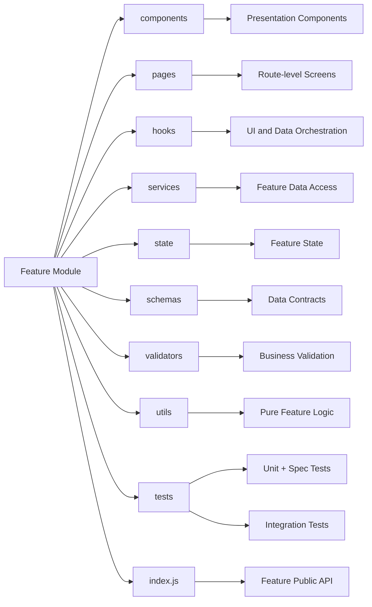

This matches the pattern already established by `src/features/notes/` and `src/features/learnerHome/`. Keep the repo's existing test conventions: colocated `*.spec.jsx` (Vitest/jsdom) and plain-node `*.test.js` discovered by `npm run test:all` — do not merge the two suites. Keep the `xCore.js` pure-logic split where it exists.

Other features import only from a feature's `index.js`; enforce with an ESLint import-boundary rule added in Phase 1.

---

## 4. Assessment Engine

**Current reality: four parallel runners exist** — `src/components/quiz/QuizRunnerV2.jsx` (learner quizzes), `src/components/exams/DailyExamRunner.jsx` (daily exams), `src/components/papers/PublicQuizRunner.jsx` + `PastPaperPractice.jsx` (past-paper quizzes), and `src/components/games/PlayGame.jsx` + per-game cores (games), each with its own results rendering. The target is one shared engine that all of them consume.

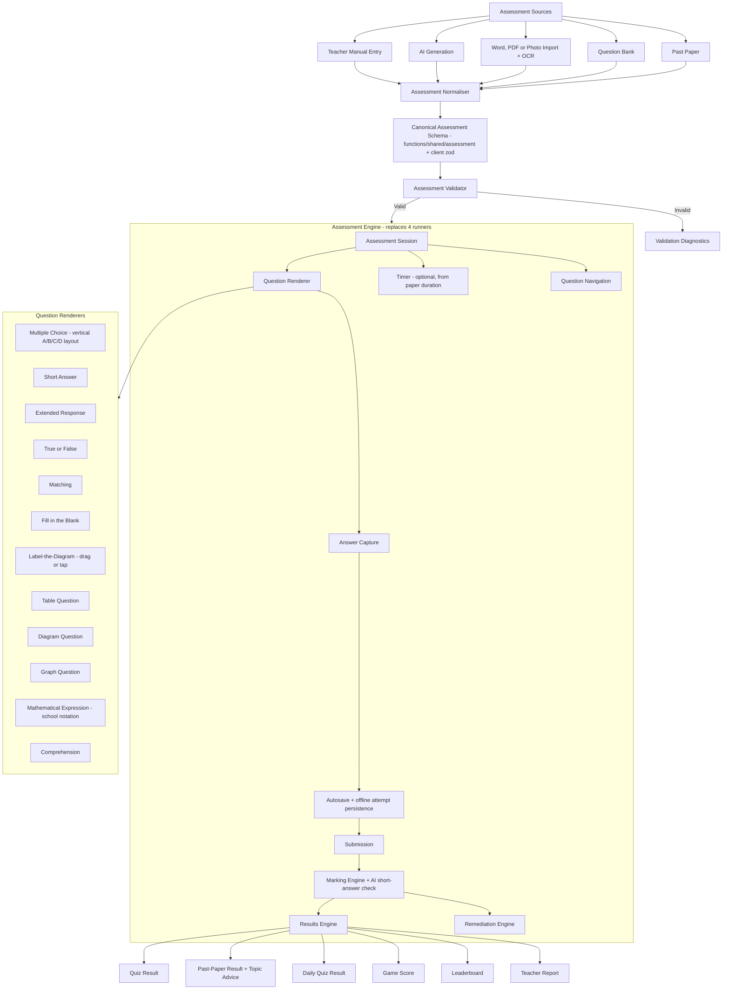

Engine-level requirements:

- **MCQ layout:** single vertical column with A/B/C/D letter badges, ECZ past-paper style, so long options get a full-width row.
- **Timing:** past-paper quizzes offer timed or untimed mode; the timer defaults to the paper's own duration.
- **Results:** past-paper results report what was wrong and which topics to improve; notes check-quizzes reuse the remediation path (wrong answer → deeper explanation with more examples before retry).
- **Games** reuse the engine's question/answer core; game chrome (mascots, streaks, animations, per-game mechanics in `*Core.js`) wraps the engine.
- Existing shared pieces to absorb rather than rewrite: `useQuizPersistence`, `useQuizDisplayPrefs`, `useQuizReadAloud`, `src/utils/quizSections.js`, `paperToQuizConverter.js`, `src/schemas/{quiz,attempt,result}.js`, and the offline attempt support in `src/offline/useOfflineQuiz.js`.

### 4.1 Canonical relationships

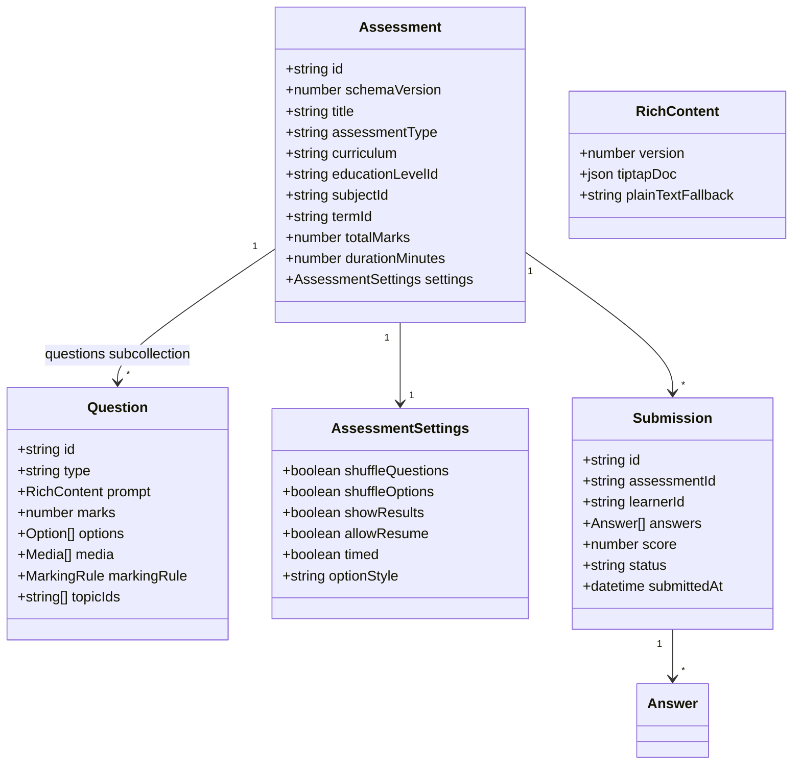

Contract notes — load-bearing:

1. **Questions are a Firestore subcollection**, not an array field (the stale-tab race-condition fix). Question writes go through guarded repository methods; storage-orphan cleanup triggers (`onQuizQuestionDeleted/Updated`, `onAssessmentQuestionDeleted/Updated`) already depend on this shape.
2. **`RichContent`, not `string`**: Tiptap JSON rendered with KaTeX; school notation (stacked fractions with a horizontal bar — never slash forms) via the existing custom extensions (`MathFraction`, `MathInline`, `NumberBase`, `VerticalArithmetic`); editor → preview → PDF/DOCX export parity, protected by the visual-regression CI gate.
3. **Legacy plain-string content stays byte-compatible**: the normaliser wraps legacy strings at read time; stored documents are never mutated in place.
4. **`schemaVersion` is required**; the normaliser upgrades old shapes at read time.
5. The canonical schema builds on what exists: **`functions/shared/assessment/` (13 ESM core modules shared with the client) is the seed of the canonical contract.** Client-side zod schemas (`src/schemas/`) formalise the same shapes. Do not create a third parallel definition; extend `functions/shared/` and keep the CJS/ESM constant-mirror tests green.

---

## 5. Curriculum Engine and Education-Level Resolver

**Current reality:** the taxonomy root is **`src/config/canonicalEducation.js`** (813 lines, "the one declaration of which curriculum years exist"); `src/config/educationLevels.js` (392 lines) is explicitly derived from it. Around them sit ~13 more config files (`curriculum.js`, `curriculumCatalog.js`, `teacherTaxonomy.js`, `assessmentBands.js`, `sba.js`, `grading.js`, ...) and ~15 resolution utils scattered in `src/utils/` (`curriculumFramework.js`, `curriculumOptions.js`, `syllabusTopicTree.js`, `frameworkSubjectMatch.js`, ...) plus duplicated framework data (`frameworkData.js` CBC vs `frameworkData2013.js`). The target consolidates the *resolution logic* into `src/curriculum/` while `canonicalEducation.js` remains the taxonomy root.

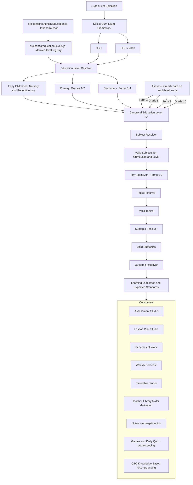

Hard constraints:

- **`canonicalEducation.js` is the single taxonomy root; `educationLevels.js` is its derived registry.** `src/curriculum/catalog/` re-exports these — it must never define a second registry. Server-side curriculum data (`functions/data/`, `cbcKnowledgeBase`, `rag_chunks`) must key off the same canonical IDs.
- Early Childhood is **Nursery + Reception only** — no Baby Class, no Middle Class.
- Secondary is named by **Form** (Form 1–4) in teacher-facing UI; Grade aliases resolve to the same canonical IDs (alias data already lives on each level entry).
- Subject naming is curriculum-aware: no "Numeracy" anywhere. CBC: "Pre-Mathematics and Science" (Nursery/Reception), "Mathematics and Science" (Grades 1–3); Grade 4+ and OBC: "Mathematics".
- Topics are **term-split** (Terms 1–3); strand-organised syllabi (e.g. Grade 7 English 2013) are mapped to terms in the catalog.
- The CBC vs 2013 duplicated framework data files converge behind one adapter interface in `src/curriculum/adapters/` — one resolver API, two framework datasets.

### 5.1 Curriculum selection rule

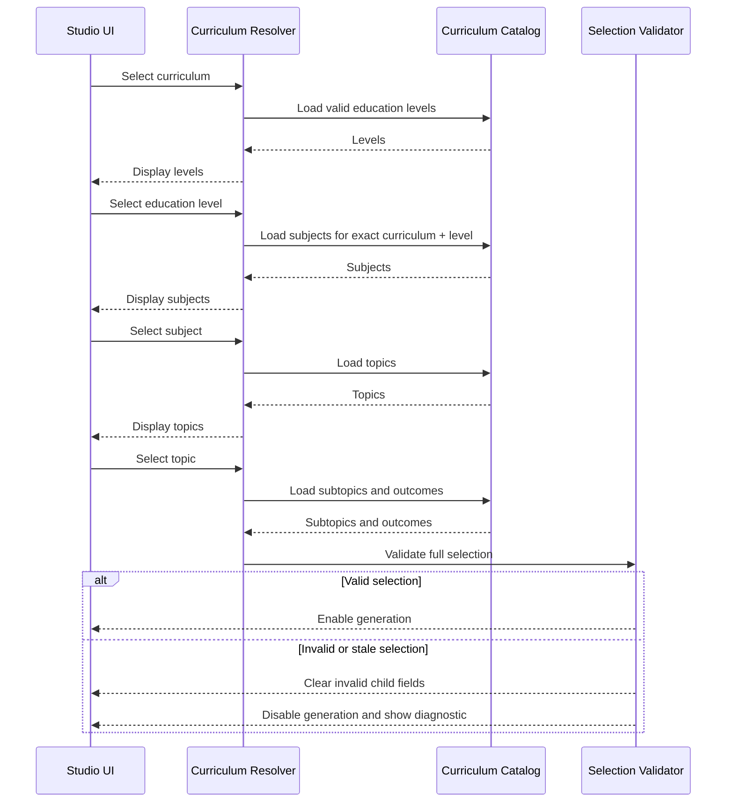

---

## 6. Offline and PWA Architecture

**Current reality (substantial and working — extend, don't rebuild):** `vite-plugin-pwa` (`generateSW`, `registerType: autoUpdate`, heavy chunks like pdfjs runtime-cached instead of precached, tested `navigateFallback` denylist); SW registration lives in `usePwaUpdate` with two safe cutover points (update toast + auto-apply on next in-app navigation); **the SW is not registered inside the Capacitor shell**. `src/offline/` is a 20-file stack: IndexedDB `zedexams-offline` (stores: `content`, `meta`, `outbox`), `contentCache`, `syncEngine` + `syncQueueCore`, `offlineSecurity` (AES-GCM with an `assertCacheable` sensitivity gate), `OfflineContext`, `OfflineLibraryPage`, `StorageSettingsPanel`, `useOfflineContent`, `useOfflineQuiz`. Firestore multi-tab persistence is enabled. A separate FCM service worker ships alongside.

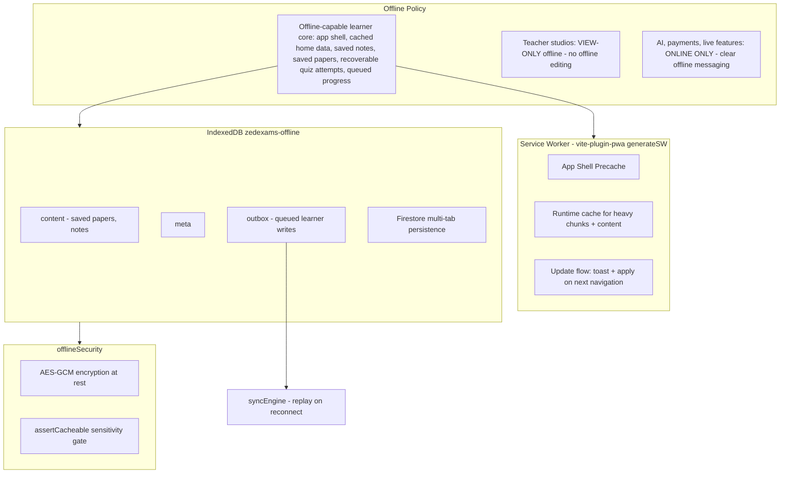

Rules:

1. **The offline-capable learner core is a precise, testable scope** — not "everything learner-facing". The two lists below are the contract; do not attempt to make every learner route work offline.

   Offline guaranteed:

   - Application shell (open the app with no connection)
   - Explicitly saved notes
   - Explicitly saved past papers
   - In-progress supported quiz attempts (recoverable via the outbox)
   - Previously cached learner home data

   Connectivity required:

   - Ask Zed and all AI generation
   - Payments and subscription changes
   - Live Quiz Challenge (when built)
   - Real-time leaderboard updates
   - Joining classes and invitation acceptance
   - Any content not previously cached or explicitly saved

   The outbox/syncEngine queues and replays learner-side writes (quiz attempts, progress) on reconnect.
2. **"Save offline" replaces "Download"** for past papers in the app (papers stored in IndexedDB, viewed in-app); the raw download button appears only on the desktop website.
3. **Teacher studios are view-only offline**: no offline editing of studio documents and no queued studio writes. The outbox is a learner-side mechanism; do not extend it to teacher document mutation.
4. **AI features are online-only** and say so when offline.
5. The `assertCacheable` gate and AES-GCM encryption are mandatory for anything written to the offline store — never bypass them for convenience.
6. The Capacitor shell currently runs without the SW; offline inside the Android app rides Firestore persistence + the IndexedDB stores. Any change to SW registration on Capacitor is its own explicitly-approved task, not a side effect of migration.

---

## 7. Cloud Functions Backend

**Current reality:** ~200 exported functions, Node 22, Functions v2 (two v1 auth triggers remain by necessity), all defined or re-exported from a single **4,894-line `functions/index.js`** with ~45 handlers written inline. Shared middleware already exists as modules (`authGuard`, `consentGuard`, `appCheckEnforcement` with staged per-label rollout, `rateLimit` fixed-window fail-open, `logger`, `cors` allow-list, `idempotency`, `paginationCore`). Validation is hand-rolled pure validators plus the `aiValidation/` contract registry — **there is no zod in functions**; the shared ESM package `functions/shared/` (guardian consent + 13 assessment modules) is imported by both client and server.

Target: the same functions, reorganised into the module layout below, with `index.js` reduced to exports only. **Every export name and Hosting rewrite path is frozen** — renaming a deployed function changes its URL and breaks webhooks, rewrites, and the app.

```mermaid
flowchart TB
    INDEX["functions/index.js - exports only, names frozen"]

    INDEX --> AI_FUNCTIONS
    INDEX --> ASSESSMENT_FUNCTIONS
    INDEX --> TEACHER_FUNCTIONS
    INDEX --> PAYMENT_FUNCTIONS
    INDEX --> CONSENT_FUNCTIONS
    INDEX --> ACCOUNT_FUNCTIONS
    INDEX --> FAMILY_FUNCTIONS
    INDEX --> NOTIFICATION_FUNCTIONS
    INDEX --> ADMIN_FUNCTIONS
    INDEX --> AGENT_FUNCTIONS
    INDEX --> OPS_FUNCTIONS

    subgraph AI_FUNCTIONS["AI - aiChat, apiAiChat, explainAnswer, checkShortAnswer, generateStudyPlan, apiTextToSpeech"]
        PROVIDER_ROUTER["Provider router + model fallback ladder"]
        MODERATION["OpenAI moderation - input and output"]
        SAFETY["learnerSafety distress + secrecy screening (deterministic, pre-model)"]
        INJECTION["Prompt-injection fencing for OCR/imported text"]
        PROMPT_CACHE["Anthropic prompt caching - ordered system blocks"]
        BUDGET["Cost tracking + revenue-linked budget enforcement + idempotent aiOperations"]
    end

    subgraph ASSESSMENT_FUNCTIONS["Assessment - generateAssessment, planAssessment, generateQuiz, regenerateAssessmentQuestion, importPastPaperQuestions, structureImportedQuiz, structureScannedQuiz, analyzeExamPaper"]
        X1[" "]
    end

    subgraph TEACHER_FUNCTIONS["Teacher tools - generateLessonPlan, generateWorksheet, generateHomework, generateNotes, generateFlashcards, generateRubric, generateSbaTask, generateSchemeOfWork, generateDiagram + streams"]
        X2[" "]
    end

    subgraph PAYMENT_FUNCTIONS["Payments - see section 9"]
        LENCO_FNS["initiateLencoPayment, submitLencoOtp, getLencoPaymentStatus, lencoWebhook, recoverMyPendingPayments"]
        PLAY_FNS["verifyGooglePlayPurchase (+ RTDN handler - planned)"]
        ADMIN_PAY["adminConfirmPayment, adminRejectPayment, adminGrantPremium, adminRevokePremium"]
        LIFECYCLE["getUpgradeQuote, setSubscriptionCancellation, subscriptionExpiryReminders, hourlyRevenueReconcile"]
    end

    subgraph CONSENT_FUNCTIONS["Consent - sendGuardianConsent, apiGuardianConsent (server-rendered no-JS pages), recordAgeGateAttempt"]
        X3[" "]
    end

    subgraph ACCOUNT_FUNCTIONS["Account - deleteMyAccount (step-up reauth), apiRequestAccountDeletion, purge with drift-tested collection lists, analyticsPurge"]
        X4[" "]
    end

    subgraph FAMILY_FUNCTIONS["Family - createProgressShare, family invite codes, getChildProgress, weeklyParentDigest, WhatsApp digest + webhook"]
        X5[" "]
    end

    subgraph NOTIFICATION_FUNCTIONS["Notifications - FCM push + dead-token pruning, reminder crons, announcement fan-out, quiet hours (Lusaka time)"]
        X6[" "]
    end

    subgraph ADMIN_FUNCTIONS["Admin - user/role/status, teacher approvals, curriculum + syllabus versioning, KB/RAG ingestion, audit logs"]
        X7[" "]
    end

    subgraph AGENT_FUNCTIONS["Agents - dispatcher, 15 named runners (Till, Monitor, Quill, Echo, Cala, Dawn, ...), circuit breaker, agentJobs"]
        X8[" "]
    end

    subgraph OPS_FUNCTIONS["Ops - daily Firestore + Storage backups, heartbeats, platform health, rate-limit health, export pipeline, reapers"]
        X9[" "]
    end

    AI_FUNCTIONS --> CALLABLE_CONTROLS
    ASSESSMENT_FUNCTIONS --> CALLABLE_CONTROLS
    TEACHER_FUNCTIONS --> CALLABLE_CONTROLS
    CONSENT_FUNCTIONS --> CALLABLE_CONTROLS
    ACCOUNT_FUNCTIONS --> CALLABLE_CONTROLS
    FAMILY_FUNCTIONS --> CALLABLE_CONTROLS
    ADMIN_FUNCTIONS --> CALLABLE_CONTROLS

    PAYMENT_FUNCTIONS --> CALLABLE_CONTROLS
    PAYMENT_FUNCTIONS --> WEBHOOK_CONTROLS

    NOTIFICATION_FUNCTIONS --> SCHEDULED_CONTROLS
    AGENT_FUNCTIONS --> SCHEDULED_CONTROLS
    OPS_FUNCTIONS --> SCHEDULED_CONTROLS

    subgraph CALLABLE_CONTROLS["Callable / user-facing HTTP controls"]
        AUTHG["authGuard - verified auth + active account"]
        APPCHECKM["appCheckEnforcement - staged per-label"]
        CONSENTG["consentGuard - assertLearnerCapability, fail closed (learner surfaces)"]
        MFA["requireAdminMfa - 30-min step-up for destructive ops"]
        RATE["rateLimit - per-user + per-IP buckets"]
        VALID["aiValidation contracts + shared pure validators"]
    end

    subgraph WEBHOOK_CONTROLS["Provider webhook controls - NOT Firebase user auth"]
        SIG["Signature verification over unmodified raw body (Lenco HMAC-SHA512, WhatsApp)"]
        REPLAY["Replay protection + strict payload validation"]
        IDEMW["Idempotent event processing - processedEvents"]
    end

    subgraph SCHEDULED_CONTROLS["Scheduled / queue / trigger controls"]
        IDENT["Service identity - no user auth"]
        IDEMS["Idempotent, retry-safe, bounded batches"]
        CIRCUIT["Circuit breaking (agents)"]
        REGION["Firestore triggers pinned to source region (africa-south1), no recursive writes"]
    end

    subgraph FOUNDATION["Shared foundations - all classes"]
        LOG["structured logger + request IDs"]
        IDEM["idempotency helpers"]
    end

    CALLABLE_CONTROLS --> FOUNDATION
    WEBHOOK_CONTROLS --> FOUNDATION
    SCHEDULED_CONTROLS --> FOUNDATION

    FOUNDATION --> DATA["Firestore (africa-south1) + Storage + adminAuditLogs / securityAuditLogs"]
```

Backend rules:

- **`functions/shared/` stays the single client+server contract package** (ESM). The CJS-vs-ESM constant mirrors currently pinned by tests should shrink as modules migrate, never grow.
- **Every provider-backed export must have a rate limiter or an explicit exemption** — the `aiEndpointDiscovery` CI guard enforces this; new functions must satisfy it.
- Known hardening gaps (from `SECURITY_ENDPOINT_AUDIT.md`) to burn down during Phase 5: the unauthenticated HTTP surface and uncapped AI callables. Two current defaults deserve explicit review flags in code: moderation **fails open** on provider error, and rate limiting **fails open** on Firestore error.
- The mirror-discipline hazards must become shared modules during migration: `functions/plans.js` ↔ `src/utils/subscriptionConfig.js`, and `PLAY_PRODUCT_TO_PLAN` ↔ the client Play catalog (currently held together by tests).
- `functions/.env.examsprepzambia` is committed **on purpose**: it is the documented Firebase mechanism for non-secret runtime config (budget caps, App Check labels, backup buckets, alert recipients), and it must exist at deploy time. The Phase 0A secret exposure gate (section 13) audited it and every version in its history and found no credential, so it is retained rather than removed. Real secrets go to Secret Manager via `defineSecret()`; `npm run test:secret-hygiene` now scans this file's contents on every CI run so that stays true.

---

## 8. Learner AI Request Flow

This sequence applies to **learner-facing AI surfaces** (Ask Zed via `aiChat`/`apiAiChat`, short-answer checking, study-plan generation and similar). Teacher, admin, agent, and scheduled AI operations use their own authorization and validation paths — they do **not** execute the guardian-consent or distress flow unless they are processing content on behalf of a learner-facing experience. Do not insert `assertLearnerCapability` into teacher generators.

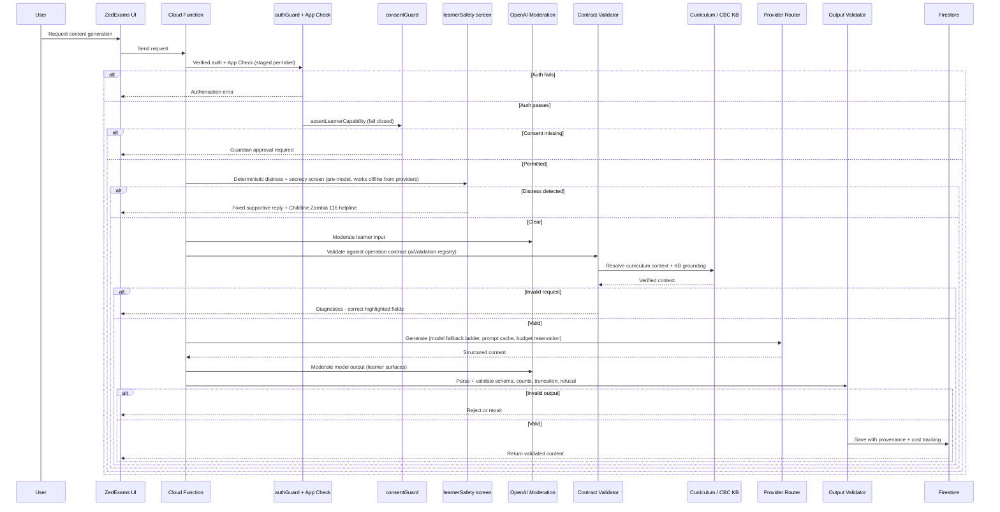

Provider stack (current): Anthropic Claude Sonnet (default, with fallback ladder) for generation and Haiku for verification/vision safety; OpenAI for Zed chat, short-answer marking, images (gpt-image-1), embeddings (curriculum RAG), and moderation; Gemini for text + image alternatives. All via hand-rolled REST clients — **no vendor SDKs in functions**; keep it that way for cold-start size. Imported/OCR text is fenced through the prompt-injection guard before reaching any prompt.

---

## 9. Payment and Subscription Flow

**All Zambian payments run through Lenco** — MTN MoMo, Airtel Money, and Zamtel Kwacha are operator choices inside the single Lenco integration (operator detected from the phone prefix). Cards exist in the Lenco client but are server-disabled pending enablement. Android digital goods go through Google Play Billing. Every path converges on one idempotent activation chokepoint.

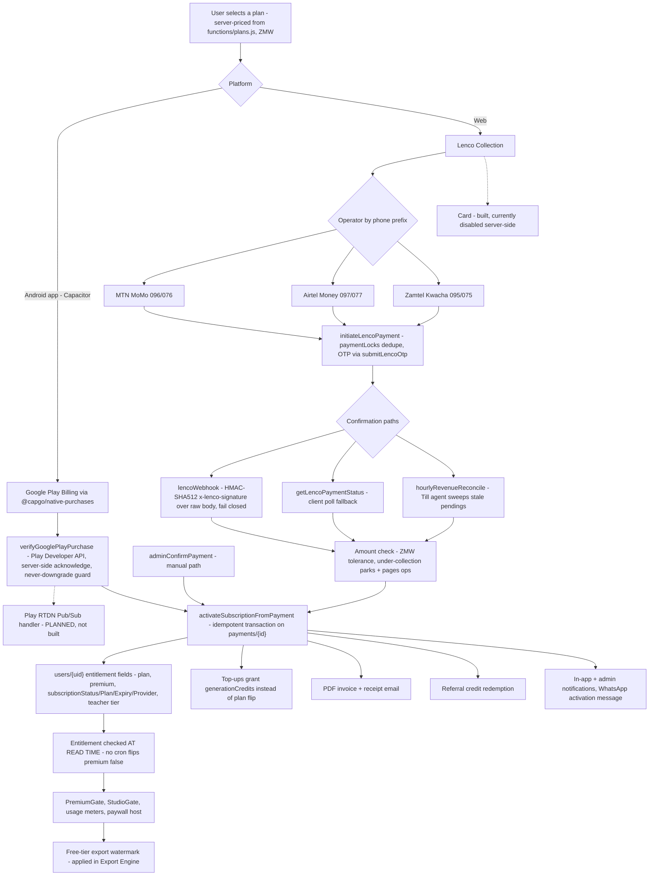

Payment rules:

1. **Platform routing is a Play compliance requirement**: digital subscriptions inside the Android app go through Play Billing only; Lenco is web-only. Never surface Lenco checkout inside the Capacitor shell.
2. **Entitlements are written only server-side.** Firestore rules already enforce this (users self-update blocks all subscription fields; `payments`/`invoices`/`subscriptionEvents` are server-only writes). Keep it that way.
3. **Server-authoritative pricing**: amounts come from `functions/plans.js`, never the client. `plans.js` and `src/utils/subscriptionConfig.js` must be unified into a shared module (they are currently test-pinned mirrors).
4. **Expiry is enforced at read time** (`hasValidEntitlement` in rules + client checks) — do not add a cron that flips `premium: false`.
5. Every path — including admin manual confirmation — flows through `activateSubscriptionFromPayment`. No code path may grant entitlement fields directly.
6. **Planned addition:** a Play RTDN (real-time developer notifications) Pub/Sub handler, so renewals/cancellations/refunds update entitlements without waiting for the client-driven `verifyGooglePlayPurchase` refresh. Until then, the restore-on-open sync (`NativePlayBillingSync`) is the refresh mechanism.

---

## 10. Firestore Domain Structure

Real collection names (frozen). Questions live as subcollections under their parent assessment/quiz.

```mermaid
erDiagram
    USERS ||--o{ PAYMENTS : makes
    USERS ||--o{ INVOICES : receives
    USERS ||--o{ SUBSCRIPTION_EVENTS : "ledger (server-only)"
    USERS ||--o{ AI_GENERATIONS : creates
    USERS ||--o{ USAGE_METERS : "metered by"
    USERS ||--o{ PASSKEY_CREDENTIALS : registers
    USERS ||--o{ NOTIFICATIONS : receives

    USERS ||--o{ CONSENT_REQUESTS : "learner subject of"
    USERS ||--o{ AGE_GATE_ATTEMPTS : "screened by"
    USERS ||--o{ PROGRESS_SHARES : "guardian views via"

    USERS ||--o{ TEACHER_LIBRARIES : owns
    USERS ||--o{ ASSESSMENTS : creates
    ASSESSMENTS ||--o{ QUESTIONS : "subcollection"
    USERS ||--o{ QUIZZES : creates
    QUIZZES ||--o{ QUIZ_QUESTIONS : "subcollection"

    USERS ||--o{ EXAM_ATTEMPTS : submits
    USERS ||--o{ RESULTS : earns
    USERS ||--o{ SCORES : achieves
    USERS ||--o{ BADGES : earns
    USERS ||--o{ DAILY_STREAKS : keeps
    USERS ||--o{ LEARNER_STATS : "tracked in"

    CLASSES ||--o{ CLASS_REGISTERS : has
    USERS ||--o{ CLASSES : "teacher manages"
    USERS ||--o{ CLASSES : "learner joins"

    PAPERS ||--o| QUIZZES : "has paper quiz (quizStatus: quiz_pending)"
    LESSONS ||--o{ LESSON_ITEMS : contains
    NOTES ||--o{ NOTE_SECTIONS : contains

    CURRICULA ||--o{ CBC_KNOWLEDGE_BASE : grounds
    CBC_KNOWLEDGE_BASE ||--o{ RAG_CHUNKS : "embedded as"

    USERS ||--o{ ADMIN_AUDIT_LOGS : "admin actions recorded"
    USERS ||--o{ SECURITY_AUDIT_LOGS : "security events recorded"
    AGENT_JOBS ||--o{ ADMIN_AUDIT_LOGS : "agent actions recorded"

    USERS {
        string uid
        string role
        string plan
        boolean premium
        string subscriptionStatus
        string subscriptionPlan
        timestamp subscriptionExpiry
        string subscriptionProvider
        number generationCredits
        timestamp verificationGraceUntil
    }

    PAYMENTS {
        string id
        string userId
        string provider
        string lencoCollectionId
        string status
        number amountZmw
        string planId
    }

    CONSENT_REQUESTS {
        string id
        string learnerId
        string guardianEmail
        string tokenHash
        string status
        timestamp expiresAt
    }

    TEACHER_LIBRARIES {
        string uid
        string itemsSubcollection
        string libraryState
        string classificationState
        number libraryMetaVersion
        string createdBy
        string scope
        string schoolId
    }

    PAPERS {
        string id
        string educationLevelId
        string subjectId
        number year
        string examType
        string quizStatus
        number durationMinutes
    }
```

Data-model notes:

- Supporting server-only collections (all `write: if false` to clients): `aiUsage`, `aiDailyLimits`, `aiOperations`, `rateLimits`, `processedEvents`, `downloadTickets`, `paymentLocks`, `referralCodes`, `referralRedemptions`, `webauthnChallenges`, `deletionRequests`, `opsBackups`, `agentJobs`, `visitorStats`.
- Public-read surfaces are deliberate and enumerated (13 `if true` reads): `settings`, `examTimetables`, `announcements`, `games`, `leaderboards`, `daily_challenges`, `publicStats/global`, and token-shares readable by `get` only (never `list`) so they can't be enumerated.
- `CONSENT_REQUESTS` stores **hashed** single-use tokens with TTL; consent pages are server-rendered no-JS HTML for low-end devices.
- Account deletion purges via three drift-tested collection lists (`accountDeletionDrift.test.js`) — **any new collection carrying user data must be added to those lists in the same PR**, plus the PostHog analytics purge.
- Teacher Library metadata contract: `libraryState` (working/classified/archived), derived `classificationState`, virtual folders over `studioType → curriculum → grade → term`, author field `createdBy`, personal scope until a school membership model ships (rules helpers for school RBAC already exist).

---

## 11. Security Rules, Indexes, and Enforcement

**Current reality — already strong; the job is maintenance discipline, not creation:** `firestore.rules` is 3,279 lines with ~80 field-allowlist validators; `storage.rules` is 490 lines ending in default-deny; `firestore.indexes.json` holds 158 composite indexes; five emulator test suites plus static rules-text checks run in CI; `cors.json` grants read-only GET/HEAD.

Principles to preserve:

1. Hybrid role model: Firestore `users.role` + custom claims (`platformAdmin`, `superAdmin` as a zero-read break-glass path); everything meaningful behind `isVerified()` with a server-written grace window.
2. Self-update field allowlists on `users` block every entitlement and role field; registration forces `plan: 'free'`, `subscriptionStatus: 'inactive'`.
3. `hasValidEntitlement()` in rules mirrors the client entitlement check and fails closed on stale `premium: true`.
4. Token-share documents allow `get` but never `list`.
5. Indexes are derived from actual repository query contracts and emulator-verified — no blanket composites.
6. **Every migration that touches a collection updates the rules, its emulator test, and (if queries changed) the indexes in the same PR.** A phase is not complete while any rules suite fails.
7. Storage paths stay owner-scoped with the default-deny catch-all; new upload surfaces get their own scoped match block.
8. **Secret Manager is kept minimal: superseded versions are disabled after every rotation, and secrets no longer referenced by code are removed.** A rotation that leaves the old version enabled has not reduced the blast radius of the leak it was answering — both values still authenticate. An orphaned secret is worse than an unused one: nothing in the codebase reveals what it grants, so no review notices when it should have been revoked. Removing one is a **deploy-ordered** change — delete the `defineSecret()` reference and deploy *before* destroying the secret, because a `defineSecret()` bound to a secret with no value hard-fails every functions deploy (see §7's `OPS_ALERT_WEBHOOK_URL` note). The inverse also holds: a secret a function is *waiting on* is not an orphan — `META_WHATSAPP_APP_SECRET` is unset today and the inbound WhatsApp webhook answers 403 to everything as a result, which is the designed fail-closed posture, not a gap to clear by deleting the binding.

### 11.1 Export and download pipeline

Exports are security-sensitive (entitlement-gated, watermarked, served via tickets). The pipeline is fixed:

```
Request export (requestAssessmentExport / library download)
  → validate ownership and entitlement
  → render artifact server-side (DOCX/PDF, content-addressed via sourceHash)
  → apply free-tier watermark where required (inside the Export Engine, so every path inherits it)
  → store in owner-scoped Storage path (assessment-exports, tmp-downloads)
  → issue short-lived single-use download ticket (downloadTickets, server-only collection)
  → download through the validated endpoint (apiAssessmentDownload / apiLibraryDownload via Hosting rewrite)
  → expire and reap artifact + ticket (reapDownloadTickets, tmpDownloadReaper, reapAssessmentExportsOnDelete)
```

No export may ever be served from a public Storage URL, and no download path may bypass the ticket check. Export rendering output is protected by the visual-regression CI gate.

### 11.2 Backup and disaster recovery

Current implementation: `dailyFirestoreBackup` (daily Firestore export) with `backupCompletionCheck`, plus `storageBackupCheck` / `storageBackupHeartbeat` and the `orphanStorageReaper`; run records in `opsBackups` / `opsBackupRuns` / `opsStorageBackups`; restore procedure documented in `docs/production-readiness/` (firestore-restore runbook). Hosting rollback is instant from the console; backend rollback is `git revert` through CI.

To be made explicit during Phase 0 (record the answers in this section):

- Backup destination bucket(s) and their region(s) relative to africa-south1
- Retention policy (as configured in `firestoreBackupCore.js`)
- Restore-test frequency — **a backup is not considered valid until a restore test has succeeded**; schedule one before migration begins and after Phase 5
- Recovery-time and recovery-point objectives (may initially be recorded as "to be established")
- Owning function/agent for backup failure alerts (ops heartbeat → ops alert path)

---

## 12. Final Target Folder Map

```
src/
├── app/                          ← target home for App.jsx, route registry, guards, layouts
│   ├── App.jsx
│   ├── routes/                   ← learner/admin/public routes join teacherRoutes.jsx pattern
│   ├── providers/                ← from src/contexts/ (OfflineContext stays in src/offline/)
│   │   ├── AppProviders.jsx      ← single composition entry, mounted in main.jsx
│   │   ├── AuthProvider.jsx
│   │   ├── ThemeProvider.jsx
│   │   ├── DataSaverProvider.jsx
│   │   ├── NotificationProvider.jsx
│   │   ├── PlatformSettingsProvider.jsx
│   │   └── index.js
│   ├── guards/
│   └── layouts/
│
├── features/                     ← migrate components/* area by area into this pattern
│   ├── (existing: learnerHome, notes, lessons, drafts, visualStudio,
│   │    learnerSettings, teacherSettings, ...)
│   ├── (learner: quizzes, daily-quiz, past-papers, games, live-quiz*, ask-zed,
│   │    badges, results, study-plan, classes, search, offline-library)
│   ├── (teacher: assessment-studio, lesson-plan-studio, generators…, sba,
│   │    class-register, class-list, syllabi, calendar, teacher-library,
│   │    templates, question-bank, scan-import, my-classes)
│   ├── (admin: dashboard, users, content, curriculum-admin, past-paper-studio,
│   │    ai-admin, payments-admin, agents-console, settings)
│   ├── (parent: family, child-progress, shares)
│   └── guardian-consent/         ← UI and client adapters importing functions/shared consent core (no copied contract)
│
├── engines/
│   ├── assessment-engine/        ← ONE runner replacing QuizRunnerV2, DailyExamRunner,
│   │   │                            PublicQuizRunner/PastPaperPractice, games quiz loops
│   │   └── schemas/              ← client zod, aligned with functions/shared/assessment
│   ├── export-engine/            ← docx/pdf/print, watermark, page preview, visual-regression-gated
│   ├── payment-engine/           ← entitlement checks, usage gates, paywall host
│   └── notification-engine/
│
├── curriculum/
│   ├── catalog/                  ← re-exports config/canonicalEducation.js + educationLevels.js
│   ├── resolvers/                ← consolidates ~15 curriculum utils from src/utils/
│   ├── adapters/                 ← CBC + 2013 framework data behind one interface
│   ├── aliases/
│   └── validators/
│
├── offline/                      ← keep as-is (contentCache, syncEngine, offlineSecurity, outbox)
├── editor/                       ← keep as-is (Tiptap + math extensions)
├── services/
│   ├── firebase/  firestore/  storage/  ai/  payments/  analytics/  notifications/
├── shared/
│   ├── components/  hooks/  icons/  constants/  schemas/  validation/  utils/
├── config/
│   ├── canonicalEducation.js     ← taxonomy root (frozen)
│   ├── educationLevels.js        ← derived registry (frozen)
│   └── (paper geometry, grading, sba, badges, ... stay here)
├── i18n/                         ← en + ny locales
├── assets/
└── main.jsx

functions/
├── index.js                      ← exports only; every export name frozen
├── ai/  assessments/  teacherTools/  payments/  consent/  account/  family/
├── notifications/  administration/  agents/  ops/  tts/
├── middleware/                   ← authGuard, appCheckEnforcement, consentGuard,
│                                    requireAdminMfa, rateLimit, logger, cors, idempotency
├── repositories/  schemas/  validation/  data/
└── shared/                       ← ESM package shared with client (consent + assessment cores)

firebase.json / .firebaserc / firestore.rules / firestore.indexes.json / storage.rules / cors.json
android/ + capacitor.config.json  ← Capacitor shell
.github/workflows/                ← CI gates + deploys + Android + visual regression + agent workflows
scripts/                          ← node test/audit/backfill utilities (keep; test:all discovers them)
tests/visual/baselines/           ← CI-recorded only, never hand-edited
```

Repo hygiene (Phase 6 cleanup targets): stale `README.md` claims (Netlify, "MTN MoMo" direct — reality is Lenco + Play Billing, Firebase Hosting, Vite 8 + React 19); the zero-byte `firebase` file at repo root; `tmp/` and `output/` scratch artifacts; committed QA report dumps (`.auth-qa-report.json` etc.) if no longer consumed.

---

## 13. Migration Phases

Every phase ends with: the app builds, all routes render, all nine required CI checks pass (including rules emulator suites and visual regression), and the merge deploys cleanly via GitHub Actions. **Never start phase N+1 with phase N red.** This plan must be reconciled with the repo's own `docs/architecture/25-remediation-plan.md` — where they conflict, resolve explicitly before starting.

**Phase 0A — Secret exposure gate (blocking, runs first). CLOSED 2026-08-04 — config-only, verified: no credentials were ever committed; the file is retained as documented non-secret runtime config.** Audit record: [`docs/security/AUDIT_LOG.md`](security/AUDIT_LOG.md).

1. Inspect `functions/.env.examsprepzambia` **without printing its values** into logs, comments, issues, or chat output. — Done; classified by format and entropy, no value reproduced.
2. Determine whether it contains live credentials, placeholders, or already-revoked values. — **None of the three.** All 9 keys are non-secret operational config (treasury budget numbers, App Check labels, backup bucket names, the ops alert recipient). There is nothing credential-shaped for a placeholder to stand in for.
3. If live or historically live, **rotate before deleting or reorganising anything** (moving a secret to Secret Manager does not invalidate a credential already committed to history). — **Not applicable.** All 16 historical versions were scanned in full, comments included; zero credential-format or high-entropy hits. Nothing to rotate.
4. Verify production and CI Secret Manager bindings. — Verified statically: the 13 `defineSecret()` names plus the string-bound `OPS_ALERT_WEBHOOK_URL` and the WhatsApp verify/app-secret pair are **disjoint** from this file's keys, and CI deploys authenticate through GitHub Actions secrets without ever writing into it. Live Secret Manager version state remains an owner-console check.
5. Check Git history exposure and decide whether history rewriting is necessary. — Tracked since 2026-04-25 (#62) and reachable from most branch tips of a public repo, so exposure would have been total *had* there been anything to expose. There was not: **no history rewrite is necessary.**
6. Remove the file from the tracked tree; add ignore rules and automated secret scanning. — **The removal was conditional on step 2 finding secrets, and it did not.** The file stays tracked: `functions/.env.<projectId>` is the documented Firebase mechanism for non-secret runtime config that must exist at deploy time, and deleting it would strip live budget caps, App Check labels, backup buckets and alert recipients from the next functions deploy. Automated scanning **was** added — `scripts/test-secret-hygiene.mjs` now scans the contents of every tracked dotenv file for credential formats and for opaque high-entropy values under secret-bearing key names, closing the gap where the one file allowed to be committed was the one file nothing read.
7. Record the incident and rotation in the security audit log. — Recorded as a **finding of no incident and no rotation**. This is a repo-level audit record; the Firestore `securityAuditLogs` collection remains for runtime security events and was not written to.

**Standing rule this leaves behind:** `functions/.env.<projectId>` is for values that are safe to read in a public repository. A real secret goes to `firebase functions:secrets:set` and is bound with `defineSecret()` — never into this file, which CI now enforces rather than trusts.

**Phase 0B — Safety net and recovery verification.**

8. Run a restore test of the latest Firestore backup and complete the section 11.2 recovery information (a backup is not valid until a restore test succeeds).
9. Verify the route inventory (`docs/architecture/03-route-register.md`) is current, and regenerate all inventories if `main` has advanced beyond commit `79ff3d29d83186f7d794c3cd0aed81d0106be697`. Confirm rules emulator suites cover collections about to be touched.
10. Tag the accepted migration baseline.

No code moves in Phase 0. Phase 1 scaffolding begins only after **every** Phase 0 gate is closed.

**Phase 1 — Scaffold.** Create `src/app/`, `src/engines/`, `src/shared/`, `src/curriculum/` skeletons with `index.js` files. Add ESLint import-boundary rules. Wire `src/curriculum/catalog/` to re-export `canonicalEducation.js`/`educationLevels.js`. Nothing user-facing changes.

**Phase 2 — Reference migration.** Migrate exactly one small feature end-to-end (Flashcard generator is a good candidate) including repository, schemas, colocated tests, and rules test. Review before proceeding; this is the template.

**Phase 3 — Assessment Engine.** Extract the engine (schema + normaliser + runner) seeded from `functions/shared/assessment/` and the best of `QuizRunnerV2`. Point **quizzes** at it first; then past-paper quizzes; then the Daily Quiz rework (which retires `DailyExamRunner`); then games. Old runners keep working until their consumer is switched; results/leaderboard writes must stay byte-compatible.

**Phase 4 — Feature migrations.** Migrate remaining areas one at a time: learner features, then teacher studios, then admin, then parent. Each migration moves its slice of `src/utils/` and `src/index.css` with it, and includes routes + repository + rules test.

**Phase 5 — Functions restructure.** Move the ~45 inline handlers out of `index.js` into domain modules; reduce `index.js` to exports. Export names, regions (africa-south1 triggers / us-central1 callables), secrets bindings, and Hosting rewrite paths are frozen. Deploy in small batches; the payment-lifecycle emulator suite and webhook signature tests must pass on every batch. Burn down the audit's open items (unauthenticated HTTP surface, uncapped AI callables) here.

**Phase 6 — Cleanup.** Only now remove genuinely dead legacy files — checked against the route register and `docs/architecture/22-dead-code-register.md`. **Warning: most `V2` names are the live canonical code** (`QuizRunnerV2`, `EditQuizV2`, `dashboardV2/` power current routes) — renaming them to drop the suffix is allowed here; deleting them is not. Also do the repo hygiene list from section 12, including the stale README.

---

## 14. Rules for the AI Coding Agent

1. `index.js` files expose public APIs and contain no business logic.
2. Feature modules must not directly access Firebase SDKs; access goes through repositories/services. Question writes go through guarded repositories (subcollection shape, zero-question guards, audit logging).
3. **Frozen surfaces: Firestore collection/field names, Cloud Function export names, Hosting rewrite paths, function regions, and secret bindings.** Renames of any of these are separate, explicitly-approved tasks — never a side effect of restructuring.
4. Curriculum resolution always passes through the canonical resolver backed by `src/config/canonicalEducation.js` (root) and `educationLevels.js` (derived). Never create a second grade/level registry, client or server.
5. Quiz, daily-quiz, past-paper-quiz, game, and (future) live-challenge experiences must consume the shared Assessment Engine once Phase 3 lands. No new parallel runners, ever.
6. Components must not contain AI prompts, Firestore queries, payment logic, or curriculum-resolution logic.
7. Cross-feature imports use each feature's public `index.js` (lint-enforced).
8. All payments converge on `activateSubscriptionFromPayment`; entitlements/payments/subscriptions/consent are server-side writes only; pricing is server-authoritative from `plans.js`. Lenco is web-only; Play Billing is Android-only.
9. Cloud Function controls are selected by **trigger type** — do not apply one blanket checklist:

    - *Callable and user-facing HTTP endpoints:* authentication, App Check per the staged label policy, input validation, authorization, rate limiting or a documented exemption, request IDs and structured logging.
    - *Provider webhooks (Lenco, WhatsApp, future Play RTDN):* provider signature verification over the unmodified raw body, timestamp/replay checks where supported, idempotent event processing, strict payload validation, structured logging. Do **not** require Firebase user authentication.
    - *Scheduled, queue, and agent functions:* explicit service identity, idempotency, bounded batches, retry-safe operations, circuit breaking, structured logging.
    - *Firestore and Storage triggers:* pinned to the source resource region (africa-south1), validated event shape, retry-safe, and guarded against recursive writes.

    Learner-facing endpoints additionally apply the fail-closed consent capability guard; learner AI surfaces additionally apply distress screening and moderation (section 8).
10. `functions/shared/` is the single client+server contract package; extend it rather than creating parallel definitions, and keep its mirror tests green. Unify the `plans.js`/`subscriptionConfig.js` and Play catalog mirrors into shared modules as they're touched.
11. **Never delete a file until its replacement is wired into routes and verified** against the route register. Live `V2` code is canonical, not legacy — rename in Phase 6 only.
12. Every migration touching a collection updates `firestore.rules`, its emulator test, and (if queries changed) `firestore.indexes.json` in the same PR. New user-data collections join the account-deletion purge lists and Data-safety review in the same PR.
13. Offline policy: the offline-capable learner core is the precise scope defined in section 6 (shell, saved notes, saved papers, recoverable attempts, cached home data — with outbox replay); teacher studios are view-only offline; AI, payments, and live features are online-only. Everything written to the offline store passes `assertCacheable` and AES-GCM encryption. SW behaviour in the Capacitor shell changes only as an explicit task.
14. Rich assessment content uses the canonical `RichContent` (Tiptap JSON + KaTeX school notation) contract with editor → preview → export parity, protected by the visual-regression gate; legacy plain-string content stays byte-compatible via the normaliser.
15. Keep both test suites (colocated node `*.test.js` + Vitest `*.spec.jsx`) and the coverage ratchet; a required CI job must never gain a `paths:` filter. Visual baselines are recorded by CI only.
16. Do not add analytics or monitoring providers beyond PostHog and Sentry, or new external services, without flagging Play Data safety and CSP (`firebase.json` headers) impact.


