# ZedExams Target Architecture

**File:** `docs/architecture.md`
**Repository baseline:** `Mwelwa-cyber/Zedexams`
**Verified commit:** `79ff3d29d83186f7d794c3cd0aed81d0106be697` (`main`)
**Verification date:** 1 August 2026

**Status:** Target state, verified against the actual repository at the commit above. Where this document says "today", it describes verified current reality — and those statements are authoritative **only for the verified commit**. The document contains precise measurements (line counts, function counts, index counts, route inventories); before migration begins, if `main` has advanced past the verified commit, regenerate the inventories rather than trusting the numbers here. The AI coding agent must follow the Migration Phases (section 13) and the binding Rules (section 14).

**Relationship to existing docs:** the repo already carries a `docs/architecture/` corpus (26 numbered docs including `03-route-register.md`, `11-firestore-data-model.md`, `13-cloud-functions-register.md`, `14-payment-and-subscriptions.md`, `24-recommended-target-architecture.md`, `25-remediation-plan.md`) plus `CLAUDE.md` and `AI_DEVELOPMENT_GUIDE.md`. This document is the consolidated target map. When sources disagree, authority is resolved as follows:

| Question | Authority |
|---|---|
| Current deployed behaviour | Verified code at the pinned commit, and CI |
| Firestore/Storage access | `firestore.rules` / `storage.rules` and their emulator tests |
| Frozen API names, routes, regions | The function and route registers (`03`, `13`) |
| Target folder / domain structure | This document |
| Migration sequencing | This document, reconciled with `25-remediation-plan.md` |
| Deployment and test discipline | `CLAUDE.md`, `AI_DEVELOPMENT_GUIDE.md`, `DEPLOY.md` |

On **frozen surfaces** (section 14, rule 3), the agent must stop and report a conflict rather than selecting one interpretation.

**How to use this document:**

1. Read sections 13 (Migration Phases) and 14 (Rules) before touching any code.
2. Anything in the Feature Inventory (section 2) is live unless marked **(planned)**. A file is only "legacy" if its replacement is verified per Phase 6.
3. Firestore collection and field names, Cloud Function export names, and Hosting rewrite paths are **frozen**. This is a code restructure, not a data or API migration.
4. This document changes only through deliberate architectural amendments. Individual migration PRs **implement** it — they do not reinterpret it.

---

## 1. Complete System Architecture

```mermaid
flowchart TB
    USERS["Users"]

    USERS --> LEARNER["Learner App"]
    USERS --> TEACHER["Teacher Workspace"]
    USERS --> ADMIN["Admin Workspace"]
    USERS --> PARENT["Parent / Family Portal"]
    USERS --> PUBLIC["Public Website"]

    ANDROID["Android App - Capacitor shell, com.zedexams.android"]
    ANDROID --> FRONTEND

    subgraph FRONTEND["React 19 + Vite Frontend (PWA)"]
        LEARNER
        TEACHER
        ADMIN
        PARENT
        PUBLIC

        ROUTER["Application Router"]
        PROVIDERS["Provider Stack"]
        FEATURES["Feature Modules"]
        ENGINES["Domain Engines"]
        SHARED["Shared UI and Utilities"]
        SERVICES["Frontend Services"]
        OFFLINE["Service Worker + src/offline IndexedDB stack"]

        ROUTER --> LEARNER
        ROUTER --> TEACHER
        ROUTER --> ADMIN
        ROUTER --> PARENT
        ROUTER --> PUBLIC

        PROVIDERS --> ROUTER
        FEATURES --> ENGINES
        FEATURES --> SHARED
        ENGINES --> SERVICES
        FEATURES --> SERVICES
        SERVICES --> OFFLINE
    end

    subgraph PROVIDER_LAYER["Provider Stack Contents"]
        AUTH_CONTEXT["AuthContext"]
        THEME_CONTEXT["ThemeContext"]
        DATA_SAVER["DataSaverContext"]
        OFFLINE_CTX["OfflineContext"]
        NOTIF_CTX["NotificationContext"]
        PLATFORM_CTX["PlatformSettingsContext"]
        ERROR_BOUNDARY["ErrorBoundary"]
    end

    PROVIDERS --> PROVIDER_LAYER

    subgraph FIREBASE["Firebase Platform - project examsprepzambia"]
        AUTH["Firebase Authentication + Passkeys"]
        FIRESTORE["Cloud Firestore - default DB in africa-south1"]
        STORAGE["Firebase Storage"]
        FUNCTIONS["Cloud Functions v2 - us-central1"]
        APP_CHECK["App Check - reCAPTCHA Enterprise web / Play Integrity Android"]
        RULES["Security Rules + 158 Composite Indexes"]
        FCM["Cloud Messaging"]
    end

    SERVICES --> AUTH
    SERVICES --> FIRESTORE
    SERVICES --> STORAGE
    SERVICES --> FUNCTIONS
    SERVICES --> FCM

    APP_CHECK --> FUNCTIONS
    APP_CHECK --> FIRESTORE
    APP_CHECK --> STORAGE
    RULES --> FIRESTORE
    RULES --> STORAGE

    subgraph EXTERNAL["External Services"]
        ANTHROPIC["Anthropic - Claude Sonnet + Haiku"]
        OPENAI["OpenAI - chat, marking, images, embeddings, moderation"]
        GEMINI["Google Gemini - text + image"]
        LENCO["Lenco - MTN, Airtel, Zamtel mobile money + cards, ZMW"]
        PLAY_BILLING["Google Play Billing - @capgo/native-purchases"]
        PLAY_API["Google Play Developer API"]
        GCTTS["Google Cloud Text-to-Speech"]
        WHATSAPP["Meta WhatsApp Business"]
        SMTP["SMTP Email"]
        POSTHOG["PostHog Analytics"]
        SENTRY["Sentry Error Monitoring"]
    end

    FUNCTIONS --> ANTHROPIC
    FUNCTIONS --> OPENAI
    FUNCTIONS --> GEMINI
    FUNCTIONS --> LENCO
    FUNCTIONS --> PLAY_API
    FUNCTIONS --> GCTTS
    FUNCTIONS --> WHATSAPP
    FUNCTIONS --> SMTP

    ANDROID --> PLAY_BILLING
    SERVICES --> POSTHOG
    SERVICES --> SENTRY

    subgraph DEPLOYMENT["Deployment - GitHub Actions on merge to main"]
        HOSTING["Firebase Hosting - dist, SPA fallback /app.html"]
        REWRITES["firebase.json rewrites - 13 /api/* routes to functions"]
        CI["PR gate: lint, node tests, vitest, rules emulator suites, payment lifecycle, visual regression"]
        ANDROID_CI["Android workflows - debug APK, App Distribution, Play AAB"]
    end

    CI --> HOSTING
    CI --> FUNCTIONS
    HOSTING --> FRONTEND
    REWRITES --> FUNCTIONS
    ANDROID_CI --> ANDROID
```

Ground truths the agent must not "fix":

- **All payments in Zambia run through Lenco.** MTN MoMo, Airtel Money, and Zamtel Kwacha are operators *under* the single Lenco integration (`functions/lencoService.js`); there are no direct MTN or Airtel APIs anywhere. Card checkout exists in the Lenco client but is currently disabled server-side.
- **The Android app is a Capacitor shell**, not a TWA: native plugins for App Check (Play Integrity), Firebase Auth, FCM, and Play Billing via `@capgo/native-purchases`. The service worker is deliberately not registered inside Capacitor.
- **Regions are split on purpose**: Firestore `(default)` is in `africa-south1` (Firestore triggers must be pinned there); HTTP/callable functions run in `us-central1`; passkey functions are mid-migration to `africa-south1` behind a feature flag.
- **Deploys happen only via GitHub Actions on merge to `main`** (`deploy-hosting.yml`, `deploy-firebase.yml`); manual `firebase deploy --only hosting|functions` is forbidden (see `DEPLOY.md`). There are no Hosting preview channels today — CI gates PRs instead.
- PostHog and Sentry are the only analytics/monitoring providers and appear in the Play Data safety declarations; do not add others without flagging compliance impact.

---

## 2. Frontend Architecture and Feature Inventory

**Current reality (verified):** `src/` is ~1,950 files of plain JavaScript (no TypeScript). Only 8 modules use the `src/features/` pattern (learnerHome, notes, lessons, drafts, visualStudio, learnerSettings, teacherSettings, ...); the bulk lives in `src/components/` (935 files) and a flat `src/utils/` (527 files). `App.jsx` declares learner/admin/public routes inline; teacher routes are data-driven in `teacherRoutes.jsx`. There is no state-management library — React Context plus custom hooks throughout. `src/index.css` is a 286 KB monolith. The target below migrates toward the feature-module pattern without inventing new products.

```mermaid
flowchart TB
    MAIN["main.jsx"]

    MAIN --> ERROR["ErrorBoundary"]
    ERROR --> PROVIDERS["App Providers"]
    PROVIDERS --> APP["App.jsx"]
    APP --> ROUTES["Route registry"]

    subgraph APP_CORE["src/app (target)"]
        APP
        ROUTES
        PROVIDERS
        GUARDS["Guards: ProtectedRoute, LearnerOnlyRoute, AdminRoute + MFA gate, ParentRoute, StudioGate, PremiumGate"]
        LAYOUTS["Layouts: TeacherLayout, AdminLayout, ParentLayout, LegalLayout"]
    end

    ROUTES --> GUARDS
    GUARDS --> LEARNER_FEATURES
    GUARDS --> TEACHER_FEATURES
    GUARDS --> ADMIN_FEATURES
    GUARDS --> PARENT_FEATURES
    ROUTES --> PUBLIC_FEATURES

    subgraph LEARNER_FEATURES["Learner Features - flat routes like /dashboard, /quiz/:id"]
        LD["Learner Home + classic Grade Hub"]
        LEARN["Learn / Practice / Subject pages"]
        NOTES["Notes - Learn and Revise modes"]
        LESSONS["Lessons - slide player"]
        QUIZZES["Quizzes"]
        DAILY_QUIZ["Daily Quiz + Leaderboard - replaces Daily Exams"]
        PAST_PAPERS["Past Papers - hub, viewer, practice, paper quizzes"]
        GAMES["Games - 8 games, grade scoped"]
        LIVE_QUIZ["Live Quiz Challenge (planned - no chat)"]
        RESULTS["Results / My Stats / Streaks"]
        BADGES["Badges"]
        STUDY["Study Plan / Calendar / Timetable"]
        CLASSES_L["My Classes / Join"]
        SEARCH["Search"]
        ASK_ZED["Ask Zed"]
        OFFLINE_LIB["Offline Library"]
        SETTINGS_L["Learner Settings"]
    end

    subgraph TEACHER_FEATURES["Teacher Features - /teacher/*"]
        TD["Teacher Dashboard (V2 live)"]
        ASSESSMENT_STUDIO["Assessment Studio - unified test/exam papers"]
        LESSON_PLAN["Lesson Plan Studio"]
        LESSONS_T["Lesson Builder"]
        GENERATORS["Generators: worksheet, homework, flashcards, rubric, notes, scheme of work, weekly forecast, mark schedule, record of work, class timetable"]
        SBA["SBA: hub, task studio, mark tracker, year planner"]
        REGISTER["Class Register: attendance, marks, SBA, progress, reports, roster import"]
        CLASSES_T["Classes + invites + approvals"]
        CLASS_LIST["Class List capture/import"]
        SYLLABI["Syllabi Library + Curriculum browsers (CBC + 2013)"]
        CALENDAR_T["School Calendar"]
        LIBRARY_T["Teacher Library - virtual folders"]
        TEMPLATES["Template Bank"]
        QBANK["Central Question Bank"]
        DRAFTS["Drafts Recovery Centre"]
        SCAN["Scan / Import pipeline"]
        VISUAL["Visual Studio"]
        SETTINGS_T["Teacher Settings + Subscription"]
    end

    subgraph ADMIN_FEATURES["Admin Features - /admin/*"]
        AD["Admin Dashboard + Analytics + Visitors"]
        USERS_ADMIN["Users / Learners / Roles / MFA"]
        CONTENT["Content: quizzes, notes studio, lessons, approvals, question review, picture bank"]
        CURRICULUM_ADMIN["Curriculum: CBC KB, uploads, syllabus replace, RAG ingestion"]
        PAPERS_ADMIN["Past Paper Studio + admin papers"]
        AI_ADMIN["AI: generations, costs, budget enforcement"]
        PAYMENTS_ADMIN["Payments panel, revenue, trials"]
        AGENTS_ADMIN["Agents console + Company HQ"]
        SETTINGS_ADMIN["Settings registry, App Check, announcements, activity log"]
    end

    subgraph PARENT_FEATURES["Parent Features"]
        FAMILY["Family Home /family"]
        CHILD["Child Progress"]
        SHARES["Progress share links /parent/:token"]
    end

    subgraph PUBLIC_FEATURES["Public Features"]
        LANDING["Landing, Pricing, Teachers, Company, Grade 7/12 pages"]
        BLOG["Blog (SEO prerendered)"]
        PAPERS_PUBLIC["Public papers browse"]
        LEGAL["Privacy, Terms, Child Safety, Delete Account, Status"]
        AUTHP["Login / Register / Verify / Auth actions"]
    end

    LEARNER_FEATURES --> ASSESSMENT_ENGINE
    TEACHER_FEATURES --> ASSESSMENT_ENGINE
    ADMIN_FEATURES --> CURRICULUM_ENGINE

    subgraph CORE_ENGINES["Domain Engines - src/engines and src/curriculum (target)"]
        ASSESSMENT_ENGINE["Assessment Engine - ONE runner"]
        CURRICULUM_ENGINE["Curriculum Engine"]
        EXPORT_ENGINE["Document Export Engine"]
        PAYMENT_ENGINE["Payment / Entitlement Engine"]
        NOTIFICATION_ENGINE["Notification Engine"]
    end

    TEACHER_FEATURES --> CURRICULUM_ENGINE
    LEARNER_FEATURES --> CURRICULUM_ENGINE
    TEACHER_FEATURES --> EXPORT_ENGINE
    LEARNER_FEATURES --> PAYMENT_ENGINE
    TEACHER_FEATURES --> PAYMENT_ENGINE

    subgraph SERVICE_LAYER["Service Layer"]
        FIREBASE_SERVICE["Firebase config + App Check"]
        FIRESTORE_SERVICE["Firestore repositories + query hooks"]
        OFFLINE_LAYER["src/offline - contentCache, syncEngine, offlineSecurity"]
        STORAGE_SERVICE["Storage Service"]
        AI_CLIENT["AI API Client"]
        PAYMENT_CLIENT["Lenco + Play Billing clients"]
        ANALYTICS["PostHog + Sentry wrappers (consent-gated)"]
    end

    CORE_ENGINES --> SERVICE_LAYER
    LEARNER_FEATURES --> SERVICE_LAYER
    TEACHER_FEATURES --> SERVICE_LAYER
    ADMIN_FEATURES --> SERVICE_LAYER
```

Placement decisions the agent must follow:

- **Engines live in `src/engines/<name>/`**; the Curriculum Engine lives at `src/curriculum/`. No engine lives inside `src/features/`.
- `src/contexts/` migrates into `src/app/providers/` as part of Phase 4 — but `OfflineContext` stays exported from `src/offline/`.
- **The flat `src/utils/` (527 files) is subdivided during migration**, not in one sweep: each file moves to its owning feature, engine, or `src/shared/utils/` when the feature that owns it migrates. Same policy for splitting `src/index.css`.
- Learner routes are **flat** (`/dashboard`, `/quiz/:id`, `/notes/:id`); do not introduce a `/learner` prefix — `/learner/*` exists only as legacy redirects.
- The unified Assessment Studio at `/teacher/assessment-papers` is canonical; `/teacher/test-papers`, `/teacher/exam-papers`, `/teacher/assessments` remain redirects.
- "Daily Exam" is being replaced by the **Daily Quiz** (one short quiz per day, hosted by the Zed mascot, feeding the leaderboard). The existing `DailyExamRunner` route family migrates onto the shared Assessment Engine as part of that rework.
- **Live Quiz Challenge is planned, not built.** When built: learners see who's online and challenge them; strictly no chat/voice/typed messages; it consumes the Assessment Engine and the consent capability system (`CAPABILITY_SOCIAL`).

---

## 3. Feature Module Internal Structure

Every migrated feature follows the same internal pattern.

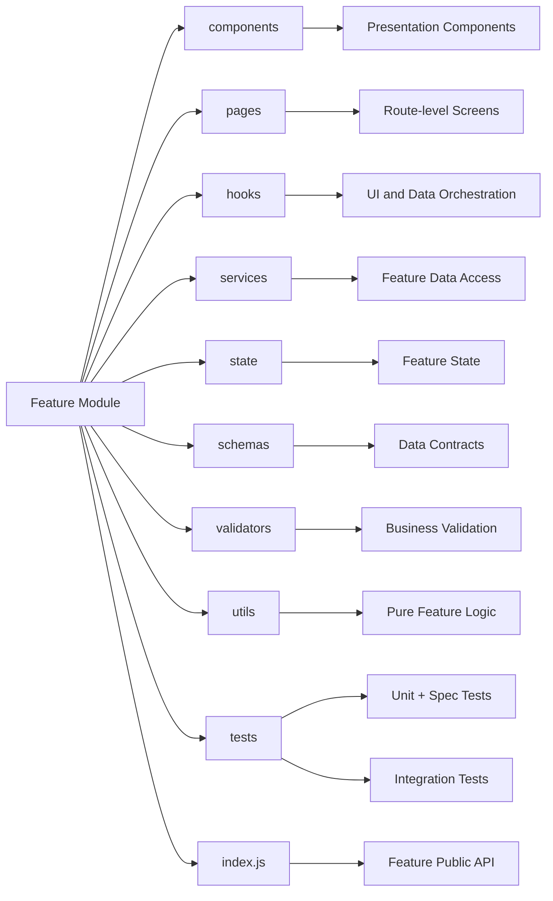

This matches the pattern already established by `src/features/notes/` and `src/features/learnerHome/`. Keep the repo's existing test conventions: colocated `*.spec.jsx` (Vitest/jsdom) and plain-node `*.test.js` discovered by `npm run test:all` — do not merge the two suites. Keep the `xCore.js` pure-logic split where it exists.

Other features import only from a feature's `index.js`; enforce with an ESLint import-boundary rule added in Phase 1.

---

## 4. Assessment Engine

**Current reality: four parallel runners exist** — `src/components/quiz/QuizRunnerV2.jsx` (learner quizzes), `src/components/exams/DailyExamRunner.jsx` (daily exams), `src/components/papers/PublicQuizRunner.jsx` (past-paper quizzes), and `src/components/games/PlayGame.jsx` + per-game cores (games), each with its own results rendering. The target is one shared engine that all of them consume.

Three corrections to what an earlier revision of this section claimed, verified against the tree at `6edaf22f` and recorded because each one changes what the engine has to do:

- **`src/components/papers/PastPaperPractice.jsx` is not a runner** and is not in scope for the engine. It is a PDF reader with a stopwatch: it renders no questions, holds no answer key, awards no marks, and writes an attempt carrying `elapsedSeconds` plus a free-text reflection and no answers (`src/utils/pastPapers.js:518,539`). Putting it behind a question engine would mean inventing a product rather than migrating one.
- **`PublicQuizRunner` persists nothing.** It has no Firestore write of any kind; its progress is a localStorage tally against a 30-question free limit, keyed by uid *or an anonymous id* because the route is public (`src/utils/pastPaperQuiz.js:73-95`). For that consumer the engine's requirement is therefore the inverse of byte-compatibility: it must not begin writing. An anonymous, SEO-visible route that starts saving learner results needs a rules change, a consent path and an account-deletion purge entry that do not exist today.
- **Only one of the eight game engines is a question loop.** `PlayGame` dispatches by `game.type` (`src/components/games/PlayGame.jsx:229-236`); seven are mechanics (memory match, word builder, province shapes, sorting, scramble, number target, market challenge). Only `timed_quiz` asks a question and takes an option, and its questions live inline on the `games` document as `{question, options, answer}` — a third vocabulary, neither the editor's nor the assessment paper's.

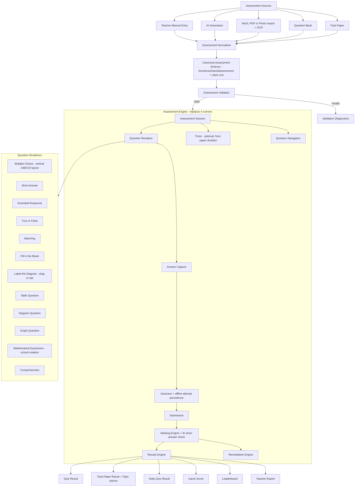

Engine-level requirements:

- **MCQ layout:** single vertical column with A/B/C/D letter badges, ECZ past-paper style, so long options get a full-width row.
- **Timing:** past-paper quizzes offer timed or untimed mode; the timer defaults to the paper's own duration.
- **Results:** past-paper results report what was wrong and which topics to improve; notes check-quizzes reuse the remediation path (wrong answer → deeper explanation with more examples before retry).
- **Games** reuse the engine's question/answer core; game chrome (mascots, streaks, animations, per-game mechanics in `*Core.js`) wraps the engine.
- Existing shared pieces to absorb rather than rewrite: `useQuizPersistence`, `useQuizDisplayPrefs`, `useQuizReadAloud`, `src/utils/quizSections.js`, `paperToQuizConverter.js`, `src/schemas/{quiz,attempt,result}.js`.
- **`src/offline/useOfflineQuiz.js` is not in that list, because it is not in use.** It is exported from `src/offline/index.js:43` and imported by nothing; `registerQuizResultHandler` is never called, so an offline submit enqueued through it would sit in the sync queue with no handler registered for its `quiz-result` kind. Giving the engine offline attempt support is therefore **building a capability, not absorbing one** — it needs its own scope, its own tests and a §13 rule-13 review of what `assertCacheable` admits, and it must not be estimated as a migration.

### 4.1 Canonical relationships

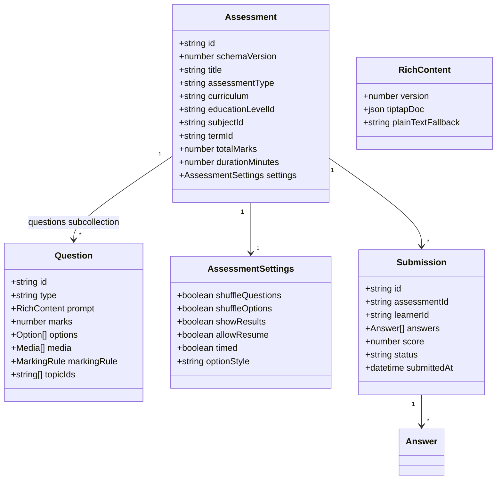

Contract notes — load-bearing:

1. **Questions are a Firestore subcollection**, not an array field (the stale-tab race-condition fix). Question writes go through guarded repository methods; storage-orphan cleanup triggers (`onQuizQuestionDeleted/Updated`, `onAssessmentQuestionDeleted/Updated`) already depend on this shape.
2. **`RichContent`, not `string`**: Tiptap JSON rendered with KaTeX; school notation (stacked fractions with a horizontal bar — never slash forms) via the existing custom extensions (`MathFraction`, `MathInline`, `NumberBase`, `VerticalArithmetic`); editor → preview → PDF/DOCX export parity, protected by the visual-regression CI gate.
3. **Legacy plain-string content stays byte-compatible**: the normaliser wraps legacy strings at read time; stored documents are never mutated in place.
4. **`schemaVersion` is required**; the normaliser upgrades old shapes at read time.

   **Phasing (decided 2026-08-05).** No document on the quiz-runner path carries `schemaVersion` today — it exists on lessons, drafts and teacher-tool outputs, and on none of `quizzes`, `questions`, `results`, `exam_attempts` or `scores`. Taken literally alongside Phase 3's byte-compatibility rule, this clause is a contradiction: stamping the field onto new writes makes every new `results` document differ from every old one by a field, which is the thing that phase forbids.

   It resolves by phase, not by exception. **For all of Phase 3, `schemaVersion` is read-time only** — the normaliser derives it, it is a property of the in-memory model, and nothing new is written. **Stamping it onto writes is a separate change after the cutovers**, once no old runner still writes those collections; until then two writers would disagree about whether the field exists, and the version stamp would record which code path happened to serve the request rather than the shape of the document. That later change carries its own read-side migration for unstamped documents, which is why it is not free and is not bundled here.
5. The canonical schema builds on what exists: **`functions/shared/assessment/` (13 ESM core modules shared with the client) is the seed of the canonical contract.** Client-side zod schemas (`src/schemas/`) formalise the same shapes. Do not create a third parallel definition; extend `functions/shared/` and keep the CJS/ESM constant-mirror tests green.

---

## 5. Curriculum Engine and Education-Level Resolver

**Current reality:** the taxonomy root is **`src/config/canonicalEducation.js`** (813 lines, "the one declaration of which curriculum years exist"); `src/config/educationLevels.js` (392 lines) is explicitly derived from it. Around them sit ~13 more config files (`curriculum.js`, `curriculumCatalog.js`, `teacherTaxonomy.js`, `assessmentBands.js`, `sba.js`, `grading.js`, ...) and ~15 resolution utils scattered in `src/utils/` (`curriculumFramework.js`, `curriculumOptions.js`, `syllabusTopicTree.js`, `frameworkSubjectMatch.js`, ...) plus duplicated framework data (`frameworkData.js` CBC vs `frameworkData2013.js`). The target consolidates the *resolution logic* into `src/curriculum/` while `canonicalEducation.js` remains the taxonomy root.

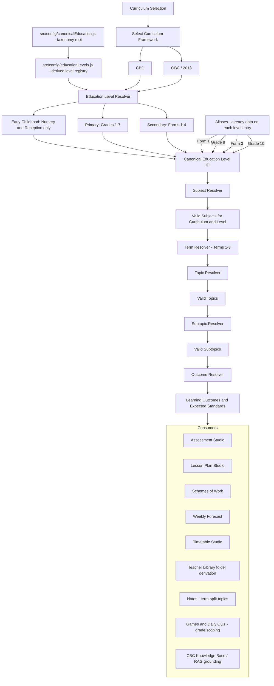

Hard constraints:

- **`canonicalEducation.js` is the single taxonomy root; `educationLevels.js` is its derived registry.** `src/curriculum/catalog/` re-exports these — it must never define a second registry. Server-side curriculum data (`functions/data/`, `cbcKnowledgeBase`, `rag_chunks`) must key off the same canonical IDs.
- Early Childhood is **Nursery + Reception only** — no Baby Class, no Middle Class.
- Secondary is named by **Form** (Form 1–4) in teacher-facing UI; Grade aliases resolve to the same canonical IDs (alias data already lives on each level entry).
- Subject naming is curriculum-aware: no "Numeracy" anywhere. CBC: "Pre-Mathematics and Science" (Nursery/Reception), "Mathematics and Science" (Grades 1–3); Grade 4+ and OBC: "Mathematics".
- Topics are **term-split** (Terms 1–3); strand-organised syllabi (e.g. Grade 7 English 2013) are mapped to terms in the catalog.
- The CBC vs 2013 duplicated framework data files converge behind one adapter interface in `src/curriculum/adapters/` — one resolver API, two framework datasets.

### 5.1 Curriculum selection rule

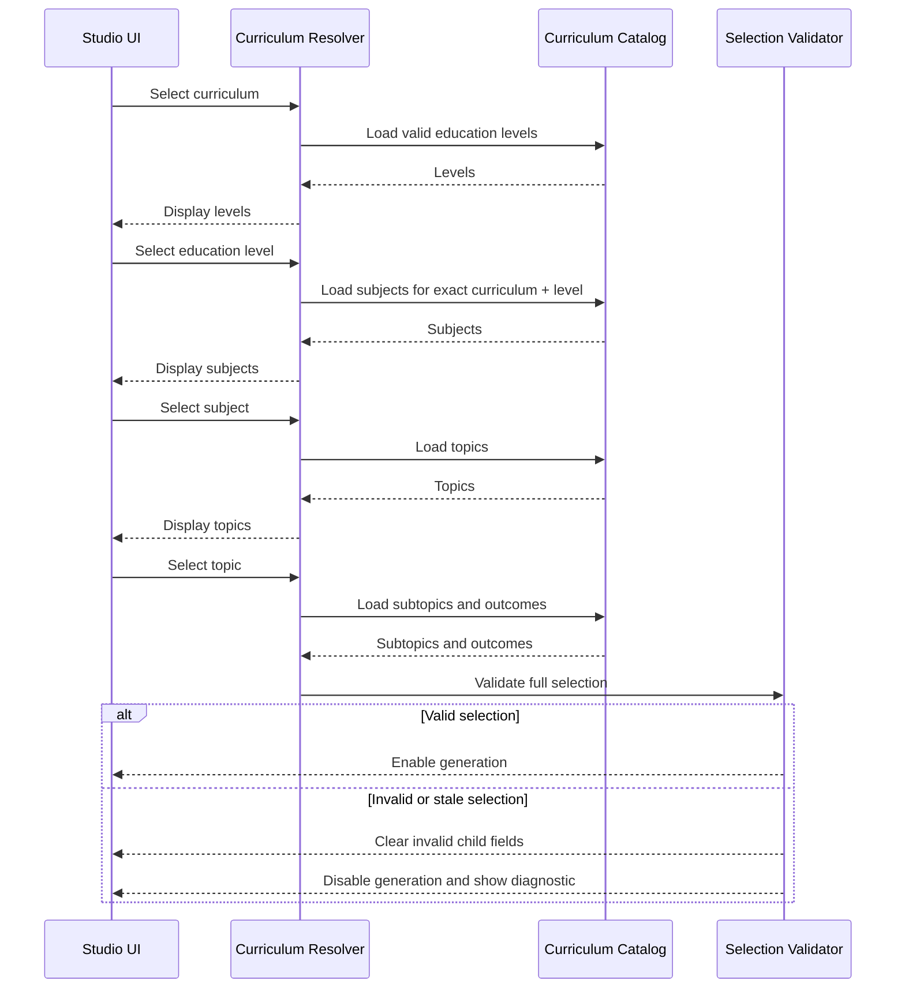

---

## 6. Offline and PWA Architecture

**Current reality (substantial and working — extend, don't rebuild):** `vite-plugin-pwa` (`generateSW`, `registerType: autoUpdate`, heavy chunks like pdfjs runtime-cached instead of precached, tested `navigateFallback` denylist); SW registration lives in `usePwaUpdate` with two safe cutover points (update toast + auto-apply on next in-app navigation); **the SW is not registered inside the Capacitor shell**. `src/offline/` is a 20-file stack: IndexedDB `zedexams-offline` (stores: `content`, `meta`, `outbox`), `contentCache`, `syncEngine` + `syncQueueCore`, `offlineSecurity` (AES-GCM with an `assertCacheable` sensitivity gate), `OfflineContext`, `OfflineLibraryPage`, `StorageSettingsPanel`, `useOfflineContent`, `useOfflineQuiz`. Firestore multi-tab persistence is enabled. A separate FCM service worker ships alongside.

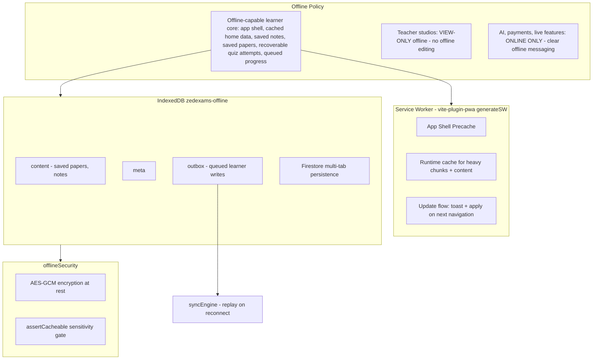

Rules:

1. **The offline-capable learner core is a precise, testable scope** — not "everything learner-facing". The two lists below are the contract; do not attempt to make every learner route work offline.

   Offline guaranteed:

   - Application shell (open the app with no connection)
   - Explicitly saved notes
   - Explicitly saved past papers
   - In-progress supported quiz attempts (recoverable via the outbox)
   - Previously cached learner home data

   Connectivity required:

   - Ask Zed and all AI generation
   - Payments and subscription changes
   - Live Quiz Challenge (when built)
   - Real-time leaderboard updates
   - Joining classes and invitation acceptance
   - Any content not previously cached or explicitly saved

   The outbox/syncEngine queues and replays learner-side writes (quiz attempts, progress) on reconnect.
2. **"Save offline" replaces "Download"** for past papers in the app (papers stored in IndexedDB, viewed in-app); the raw download button appears only on the desktop website.
3. **Teacher studios are view-only offline**: no offline editing of studio documents and no queued studio writes. The outbox is a learner-side mechanism; do not extend it to teacher document mutation.
4. **AI features are online-only** and say so when offline.
5. The `assertCacheable` gate and AES-GCM encryption are mandatory for anything written to the offline store — never bypass them for convenience.
6. The Capacitor shell currently runs without the SW; offline inside the Android app rides Firestore persistence + the IndexedDB stores. Any change to SW registration on Capacitor is its own explicitly-approved task, not a side effect of migration.

---

## 7. Cloud Functions Backend

**Current reality:** ~200 exported functions, Node 22, Functions v2 (two v1 auth triggers remain by necessity), all defined or re-exported from a single **4,894-line `functions/index.js`** with ~45 handlers written inline. Shared middleware already exists as modules (`authGuard`, `consentGuard`, `appCheckEnforcement` with staged per-label rollout, `rateLimit` fixed-window fail-open, `logger`, `cors` allow-list, `idempotency`, `paginationCore`). Validation is hand-rolled pure validators plus the `aiValidation/` contract registry — **there is no zod in functions**; the shared ESM package `functions/shared/` (guardian consent + 13 assessment modules) is imported by both client and server.

Target: the same functions, reorganised into the module layout below, with `index.js` reduced to exports only. **Every export name and Hosting rewrite path is frozen** — renaming a deployed function changes its URL and breaks webhooks, rewrites, and the app.

```mermaid
flowchart TB
    INDEX["functions/index.js - exports only, names frozen"]

    INDEX --> AI_FUNCTIONS
    INDEX --> ASSESSMENT_FUNCTIONS
    INDEX --> TEACHER_FUNCTIONS
    INDEX --> PAYMENT_FUNCTIONS
    INDEX --> CONSENT_FUNCTIONS
    INDEX --> ACCOUNT_FUNCTIONS
    INDEX --> FAMILY_FUNCTIONS
    INDEX --> NOTIFICATION_FUNCTIONS
    INDEX --> ADMIN_FUNCTIONS
    INDEX --> AGENT_FUNCTIONS
    INDEX --> OPS_FUNCTIONS

    subgraph AI_FUNCTIONS["AI - aiChat, apiAiChat, explainAnswer, checkShortAnswer, generateStudyPlan, apiTextToSpeech"]
        PROVIDER_ROUTER["Provider router + model fallback ladder"]
        MODERATION["OpenAI moderation - input and output"]
        SAFETY["learnerSafety distress + secrecy screening (deterministic, pre-model)"]
        INJECTION["Prompt-injection fencing for OCR/imported text"]
        PROMPT_CACHE["Anthropic prompt caching - ordered system blocks"]
        BUDGET["Cost tracking + revenue-linked budget enforcement + idempotent aiOperations"]
    end

    subgraph ASSESSMENT_FUNCTIONS["Assessment - generateAssessment, planAssessment, generateQuiz, regenerateAssessmentQuestion, importPastPaperQuestions, structureImportedQuiz, structureScannedQuiz, analyzeExamPaper"]
        X1[" "]
    end

    subgraph TEACHER_FUNCTIONS["Teacher tools - generateLessonPlan, generateWorksheet, generateHomework, generateNotes, generateFlashcards, generateRubric, generateSbaTask, generateSchemeOfWork, generateDiagram + streams"]
        X2[" "]
    end

    subgraph PAYMENT_FUNCTIONS["Payments - see section 9"]
        LENCO_FNS["initiateLencoPayment, submitLencoOtp, getLencoPaymentStatus, lencoWebhook, recoverMyPendingPayments"]
        PLAY_FNS["verifyGooglePlayPurchase (+ RTDN handler - planned)"]
        ADMIN_PAY["adminConfirmPayment, adminRejectPayment, adminGrantPremium, adminRevokePremium"]
        LIFECYCLE["getUpgradeQuote, setSubscriptionCancellation, subscriptionExpiryReminders, hourlyRevenueReconcile"]
    end

    subgraph CONSENT_FUNCTIONS["Consent - sendGuardianConsent, apiGuardianConsent (server-rendered no-JS pages), recordAgeGateAttempt"]
        X3[" "]
    end

    subgraph ACCOUNT_FUNCTIONS["Account - deleteMyAccount (step-up reauth), apiRequestAccountDeletion, purge with drift-tested collection lists, analyticsPurge"]
        X4[" "]
    end

    subgraph FAMILY_FUNCTIONS["Family - createProgressShare, family invite codes, getChildProgress, weeklyParentDigest, WhatsApp digest + webhook"]
        X5[" "]
    end

    subgraph NOTIFICATION_FUNCTIONS["Notifications - FCM push + dead-token pruning, reminder crons, announcement fan-out, quiet hours (Lusaka time)"]
        X6[" "]
    end

    subgraph ADMIN_FUNCTIONS["Admin - user/role/status, teacher approvals, curriculum + syllabus versioning, KB/RAG ingestion, audit logs"]
        X7[" "]
    end

    subgraph AGENT_FUNCTIONS["Agents - dispatcher, 15 named runners (Till, Monitor, Quill, Echo, Cala, Dawn, ...), circuit breaker, agentJobs"]
        X8[" "]
    end

    subgraph OPS_FUNCTIONS["Ops - daily Firestore + Storage backups, heartbeats, platform health, rate-limit health, export pipeline, reapers"]
        X9[" "]
    end

    AI_FUNCTIONS --> CALLABLE_CONTROLS
    ASSESSMENT_FUNCTIONS --> CALLABLE_CONTROLS
    TEACHER_FUNCTIONS --> CALLABLE_CONTROLS
    CONSENT_FUNCTIONS --> CALLABLE_CONTROLS
    ACCOUNT_FUNCTIONS --> CALLABLE_CONTROLS
    FAMILY_FUNCTIONS --> CALLABLE_CONTROLS
    ADMIN_FUNCTIONS --> CALLABLE_CONTROLS

    PAYMENT_FUNCTIONS --> CALLABLE_CONTROLS
    PAYMENT_FUNCTIONS --> WEBHOOK_CONTROLS

    NOTIFICATION_FUNCTIONS --> SCHEDULED_CONTROLS
    AGENT_FUNCTIONS --> SCHEDULED_CONTROLS
    OPS_FUNCTIONS --> SCHEDULED_CONTROLS

    subgraph CALLABLE_CONTROLS["Callable / user-facing HTTP controls"]
        AUTHG["authGuard - verified auth + active account"]
        APPCHECKM["appCheckEnforcement - staged per-label"]
        CONSENTG["consentGuard - assertLearnerCapability, fail closed (learner surfaces)"]
        MFA["requireAdminMfa - 30-min step-up for destructive ops"]
        RATE["rateLimit - per-user + per-IP buckets"]
        VALID["aiValidation contracts + shared pure validators"]
    end

    subgraph WEBHOOK_CONTROLS["Provider webhook controls - NOT Firebase user auth"]
        SIG["Signature verification over unmodified raw body (Lenco HMAC-SHA512, WhatsApp)"]
        REPLAY["Replay protection + strict payload validation"]
        IDEMW["Idempotent event processing - processedEvents"]
    end

    subgraph SCHEDULED_CONTROLS["Scheduled / queue / trigger controls"]
        IDENT["Service identity - no user auth"]
        IDEMS["Idempotent, retry-safe, bounded batches"]
        CIRCUIT["Circuit breaking (agents)"]
        REGION["Firestore triggers pinned to source region (africa-south1), no recursive writes"]
    end

    subgraph FOUNDATION["Shared foundations - all classes"]
        LOG["structured logger + request IDs"]
        IDEM["idempotency helpers"]
    end

    CALLABLE_CONTROLS --> FOUNDATION
    WEBHOOK_CONTROLS --> FOUNDATION
    SCHEDULED_CONTROLS --> FOUNDATION

    FOUNDATION --> DATA["Firestore (africa-south1) + Storage + adminAuditLogs / securityAuditLogs"]
```

Backend rules:

- **`functions/shared/` stays the single client+server contract package** (ESM). The CJS-vs-ESM constant mirrors currently pinned by tests should shrink as modules migrate, never grow.
- **Every provider-backed export must have a rate limiter or an explicit exemption** — the `aiEndpointDiscovery` CI guard enforces this; new functions must satisfy it.
- Known hardening gaps (from `SECURITY_ENDPOINT_AUDIT.md`) to burn down during Phase 5: the unauthenticated HTTP surface and uncapped AI callables. Two current defaults deserve explicit review flags in code: moderation **fails open** on provider error, and rate limiting **fails open** on Firestore error.
- The mirror-discipline hazards must become shared modules during migration: `functions/plans.js` ↔ `src/utils/subscriptionConfig.js`, and `PLAY_PRODUCT_TO_PLAN` ↔ the client Play catalog (currently held together by tests).
- `functions/.env.examsprepzambia` is committed **on purpose**: it is the documented Firebase mechanism for non-secret runtime config (budget caps, App Check labels, backup buckets, alert recipients), and it must exist at deploy time. The Phase 0A secret exposure gate (section 13) audited it and every version in its history and found no credential, so it is retained rather than removed. Real secrets go to Secret Manager via `defineSecret()`; `npm run test:secret-hygiene` now scans this file's contents on every CI run so that stays true.

---

## 8. Learner AI Request Flow

This sequence applies to **learner-facing AI surfaces** (Ask Zed via `aiChat`/`apiAiChat`, short-answer checking, study-plan generation and similar). Teacher, admin, agent, and scheduled AI operations use their own authorization and validation paths — they do **not** execute the guardian-consent or distress flow unless they are processing content on behalf of a learner-facing experience. Do not insert `assertLearnerCapability` into teacher generators.

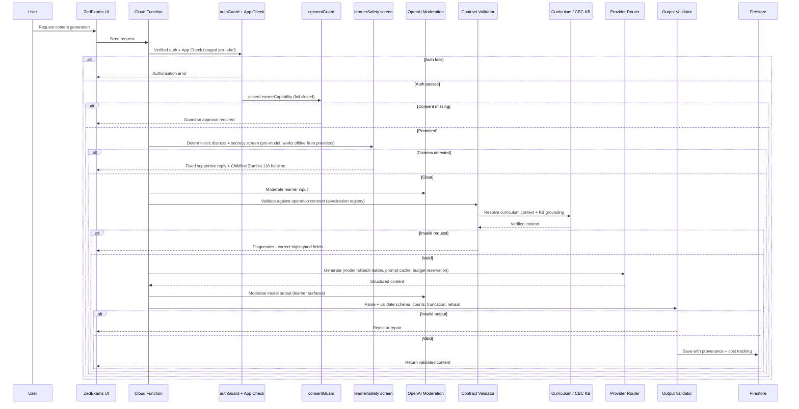

Provider stack (current): Anthropic Claude Sonnet (default, with fallback ladder) for generation and Haiku for verification/vision safety; OpenAI for Zed chat, short-answer marking, images (gpt-image-1), embeddings (curriculum RAG), and moderation; Gemini for text + image alternatives. All via hand-rolled REST clients — **no vendor SDKs in functions**; keep it that way for cold-start size. Imported/OCR text is fenced through the prompt-injection guard before reaching any prompt.

---

## 9. Payment and Subscription Flow

**All Zambian payments run through Lenco** — MTN MoMo, Airtel Money, and Zamtel Kwacha are operator choices inside the single Lenco integration (operator detected from the phone prefix). Cards exist in the Lenco client but are server-disabled pending enablement. Android digital goods go through Google Play Billing. Every path converges on one idempotent activation chokepoint.

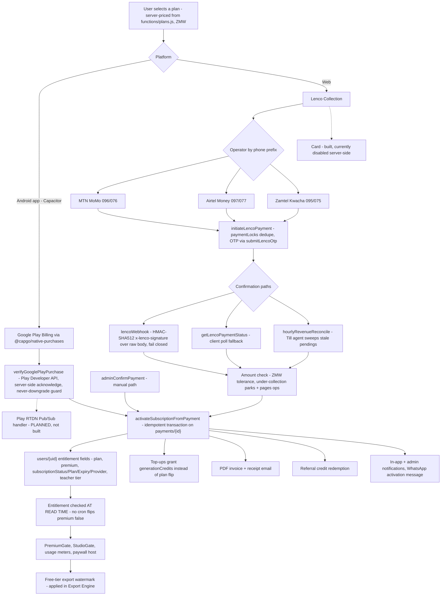

Payment rules:

1. **Platform routing is a Play compliance requirement**: digital subscriptions inside the Android app go through Play Billing only; Lenco is web-only. Never surface Lenco checkout inside the Capacitor shell.
2. **Entitlements are written only server-side.** Firestore rules already enforce this (users self-update blocks all subscription fields; `payments`/`invoices`/`subscriptionEvents` are server-only writes). Keep it that way.
3. **Server-authoritative pricing**: amounts come from `functions/plans.js`, never the client. `plans.js` and `src/utils/subscriptionConfig.js` must be unified into a shared module (they are currently test-pinned mirrors).
4. **Expiry is enforced at read time** (`hasValidEntitlement` in rules + client checks) — do not add a cron that flips `premium: false`.
5. Every path — including admin manual confirmation — flows through `activateSubscriptionFromPayment`. No code path may grant entitlement fields directly.
6. **Planned addition:** a Play RTDN (real-time developer notifications) Pub/Sub handler, so renewals/cancellations/refunds update entitlements without waiting for the client-driven `verifyGooglePlayPurchase` refresh. Until then, the restore-on-open sync (`NativePlayBillingSync`) is the refresh mechanism.

---

## 10. Firestore Domain Structure

Real collection names (frozen). Questions live as subcollections under their parent assessment/quiz.

```mermaid
erDiagram
    USERS ||--o{ PAYMENTS : makes
    USERS ||--o{ INVOICES : receives
    USERS ||--o{ SUBSCRIPTION_EVENTS : "ledger (server-only)"
    USERS ||--o{ AI_GENERATIONS : creates
    USERS ||--o{ USAGE_METERS : "metered by"
    USERS ||--o{ PASSKEY_CREDENTIALS : registers
    USERS ||--o{ NOTIFICATIONS : receives

    USERS ||--o{ CONSENT_REQUESTS : "learner subject of"
    USERS ||--o{ AGE_GATE_ATTEMPTS : "screened by"
    USERS ||--o{ PROGRESS_SHARES : "guardian views via"

    USERS ||--o{ TEACHER_LIBRARIES : owns
    USERS ||--o{ ASSESSMENTS : creates
    ASSESSMENTS ||--o{ QUESTIONS : "subcollection"
    USERS ||--o{ QUIZZES : creates
    QUIZZES ||--o{ QUIZ_QUESTIONS : "subcollection"

    USERS ||--o{ EXAM_ATTEMPTS : submits
    USERS ||--o{ RESULTS : earns
    USERS ||--o{ SCORES : achieves
    USERS ||--o{ BADGES : earns
    USERS ||--o{ DAILY_STREAKS : keeps
    USERS ||--o{ LEARNER_STATS : "tracked in"
    USERS ||--o{ LEARNER_PROFILES : "games intelligence"
    USERS ||--o{ DAILY_EXAM_LOCKS : "one sit per day"
    USERS ||--o{ PAPER_ATTEMPTS : "practises paper"
    PAPERS ||--o{ PAPER_ATTEMPTS : "practised in"

    CLASSES ||--o{ CLASS_REGISTERS : has
    USERS ||--o{ CLASSES : "teacher manages"
    USERS ||--o{ CLASSES : "learner joins"

    PAPERS ||--o| QUIZZES : "has paper quiz (quizStatus: quiz_pending)"
    LESSONS ||--o{ LESSON_ITEMS : contains
    NOTES ||--o{ NOTE_SECTIONS : contains

    CURRICULA ||--o{ CBC_KNOWLEDGE_BASE : grounds
    CBC_KNOWLEDGE_BASE ||--o{ RAG_CHUNKS : "embedded as"

    USERS ||--o{ ADMIN_AUDIT_LOGS : "admin actions recorded"
    USERS ||--o{ SECURITY_AUDIT_LOGS : "security events recorded"
    AGENT_JOBS ||--o{ ADMIN_AUDIT_LOGS : "agent actions recorded"

    USERS {
        string uid
        string role
        string plan
        boolean premium
        string subscriptionStatus
        string subscriptionPlan
        timestamp subscriptionExpiry
        string subscriptionProvider
        number generationCredits
        timestamp verificationGraceUntil
    }

    PAYMENTS {
        string id
        string userId
        string provider
        string lencoCollectionId
        string status
        number amountZmw
        string planId
    }

    CONSENT_REQUESTS {
        string id
        string learnerId
        string guardianEmail
        string tokenHash
        string status
        timestamp expiresAt
    }

    TEACHER_LIBRARIES {
        string uid
        string itemsSubcollection
        string libraryState
        string classificationState
        number libraryMetaVersion
        string createdBy
        string scope
        string schoolId
    }

    PAPERS {
        string id
        string educationLevelId
        string subjectId
        number year
        string examType
        string quizStatus
        number durationMinutes
    }
```

Data-model notes:

- Supporting server-only collections (all `write: if false` to clients): `aiUsage`, `aiDailyLimits`, `aiOperations`, `rateLimits`, `processedEvents`, `downloadTickets`, `paymentLocks`, `referralRedemptions`, `webauthnChallenges`, `deletionRequests`, `opsBackups`, `agentJobs`, `visitorStats`.
- **`referralCodes` is not one of them** — corrected 2026-08-05. The rule is a *constrained client self-create*: `allow create: isAuthed() && incoming().keys().hasOnly(['uid','createdAt']) && incoming().uid == request.auth.uid`, with `update`/`delete` denied. That is deliberate, not an oversight — `mintAndPersistReferralCode` (`src/utils/referrals.js`) mints a code client-side and *relies on* rules rejecting a collision to drive its retry loop, and the `uid == request.auth.uid` clause is what stops a tampered client minting a code that points at someone else. Server-only for every other operation.
- Public-read surfaces are deliberate and enumerated (`if true` reads): `settings`, `examTimetables`, `announcements`, `leaderboards`, `daily_challenges`, `publicStats/global`, and token-shares readable by `get` only (never `list`) so they can't be enumerated.
- **`games` was counted among those and is not** — corrected 2026-08-05. Its read is `resource.data.get('active', true) == true || isAdmin()`: public for an *active* game, closed for an inactive one, which is stricter than `if true` and better behaviour than the doc described. Writes are admin-only.
- `CONSENT_REQUESTS` stores **hashed** single-use tokens with TTL; consent pages are server-rendered no-JS HTML for low-end devices.
- Account deletion purges via three drift-tested collection lists (`accountDeletionDrift.test.js`) — **any new collection carrying user data must be added to those lists in the same PR**, plus the PostHog analytics purge.
- **Three collections were missing from this inventory until 2026-08-05**, each with a `firestore.rules` match block since it shipped: `paperAttempts` (`firestore.rules:2761` — past-paper practice attempts), `daily_exam_locks` (`:694` — the one-sit-per-day lock), and `learner_profiles` (`:1887` — games intelligence, written fire-and-forget from `src/utils/gamesIntelligence.js:109` after a score). They are added here because **this section is the universe `scripts/test-rules-collection-coverage.mjs` classifies against**: a collection absent from it is neither covered nor flagged as uncovered, so the ratchet could not fail on it in either direction and never did. Found while planning Phase 3, which writes all three. The ratchet is being changed to derive its universe from `firestore.rules`' match blocks rather than a hand-maintained list, so this class of omission fails a build instead of going quiet.
- Teacher Library metadata contract: `libraryState` (working/classified/archived), derived `classificationState`, virtual folders over `studioType → curriculum → grade → term`, author field `createdBy`, personal scope until a school membership model ships (rules helpers for school RBAC already exist).

---

## 11. Security Rules, Indexes, and Enforcement

**Current reality — already strong; the job is maintenance discipline, not creation:** `firestore.rules` is 3,279 lines with ~80 field-allowlist validators; `storage.rules` is 490 lines ending in default-deny; `firestore.indexes.json` holds 158 composite indexes; five emulator test suites plus static rules-text checks run in CI; `cors.json` grants read-only GET/HEAD.

Principles to preserve:

1. Hybrid role model: Firestore `users.role` + custom claims (`platformAdmin`, `superAdmin` as a zero-read break-glass path); everything meaningful behind `isVerified()` with a server-written grace window.
2. Self-update field allowlists on `users` block every entitlement and role field; registration forces `plan: 'free'`, `subscriptionStatus: 'inactive'`.
3. `hasValidEntitlement()` in rules mirrors the client entitlement check and fails closed on stale `premium: true`.
4. Token-share documents allow `get` but never `list`.
5. Indexes are derived from actual repository query contracts and emulator-verified — no blanket composites.
6. **Every migration that touches a collection updates the rules, its emulator test, and (if queries changed) the indexes in the same PR.** A phase is not complete while any rules suite fails.
7. Storage paths stay owner-scoped with the default-deny catch-all; new upload surfaces get their own scoped match block.
8. **Secret Manager is kept minimal: superseded versions are disabled after every rotation, and secrets no longer referenced by code are removed.** A rotation that leaves the old version enabled has not reduced the blast radius of the leak it was answering — both values still authenticate. An orphaned secret is worse than an unused one: nothing in the codebase reveals what it grants, so no review notices when it should have been revoked. Removing one is a **deploy-ordered** change — delete the `defineSecret()` reference and deploy *before* destroying the secret, because a `defineSecret()` bound to a secret with no value hard-fails every functions deploy (see §7's `OPS_ALERT_WEBHOOK_URL` note). The inverse also holds: a secret a function is *waiting on* is not an orphan — `META_WHATSAPP_APP_SECRET` is unset today and the inbound WhatsApp webhook answers 403 to everything as a result, which is the designed fail-closed posture, not a gap to clear by deleting the binding.

   **Inbound WhatsApp (Bonga) — recorded state, Phase 0B, 2026-08-04.** Secret Manager holds `META_WHATSAPP_VERIFY_TOKEN` **with zero versions**, and `META_WHATSAPP_APP_SECRET` **does not exist at all**. The consequence in code (`functions/metaWhatsApp.js`, `apiWhatsAppWebhook` in `functions/index.js`) is that inbound WhatsApp is **fail-closed and incomplete, by design**: the GET handshake compares `hub.verify_token` against an empty expected token and can never match (403), and every inbound POST is refused with `403 "signature verification not configured"` — unconditionally, on a separate branch from the bad-signature 403, so an unconfigured webhook is never mistaken for a verified one. Nothing is at risk; Bonga simply cannot receive.

   Two things about clearing it, both easy to get wrong:

   - **Neither secret is bound via `defineSecret()`.** Both are read from `process.env` through `readEnvSecret()`, and `WHATSAPP_WEBHOOK_SECRETS` deliberately omits them. So **storing a version changes nothing on its own** — an unbound secret never reaches the runtime environment, and the webhook would keep answering 403 while the console showed a populated secret. The value and the binding are two separate acts and only the pair has an effect.
   - **They must be created and bound together, and in that order.** A `defineSecret()` bound to a secret with no value makes `firebase deploy` hard-fail — *"no value for the secret: X"* — and that failure blocks **every** functions deploy, not just this one (§7's `OPS_ALERT_WEBHOOK_URL` note; the same trap documented for `RECRAFT_API_KEY`). `META_WHATSAPP_VERIFY_TOKEN`'s zero-version state is precisely this trap armed: binding it today wedges the deploy pipeline. Enabling Bonga inbound is therefore one change — set both values, add both to `WHATSAPP_WEBHOOK_SECRETS`, deploy — never a partial one.

### 11.1 Export and download pipeline

Exports are security-sensitive (entitlement-gated, watermarked, served via tickets). The pipeline is fixed:

```
Request export (requestAssessmentExport / library download)
  → validate ownership and entitlement
  → render artifact server-side (DOCX/PDF, content-addressed via sourceHash)
  → apply free-tier watermark where required (inside the Export Engine, so every path inherits it)
  → store in owner-scoped Storage path (assessment-exports, tmp-downloads)
  → issue short-lived single-use download ticket (downloadTickets, server-only collection)
  → download through the validated endpoint (apiAssessmentDownload / apiLibraryDownload via Hosting rewrite)
  → expire and reap artifact + ticket (reapDownloadTickets, tmpDownloadReaper, reapAssessmentExportsOnDelete)
```

No export may ever be served from a public Storage URL, and no download path may bypass the ticket check. Export rendering output is protected by the visual-regression CI gate.

### 11.2 Backup and disaster recovery

Current implementation: `dailyFirestoreBackup` (daily Firestore export) with `backupCompletionCheck`, plus `storageBackupCheck` / `storageBackupHeartbeat` and the `orphanStorageReaper`; run records in `opsBackups` / `opsBackupRuns` / `opsStorageBackups`; restore procedure documented in `docs/production-readiness/` (firestore-restore runbook). Hosting rollback is instant from the console; backend rollback is `git revert` through CI.

**Phase 0B answers (recorded 2026-08-04, commit `7e5df4b`).** Sources: `functions/firestoreBackupCore.js`, `functions/firestoreBackup.js`, `functions/storageBackup.js`, the runbook [`docs/production-readiness/runbooks/firestore-restore.md`](production-readiness/runbooks/firestore-restore.md), and the operator record [`docs/production-readiness/remediation/dr-001-infrastructure-readiness.md`](production-readiness/remediation/dr-001-infrastructure-readiness.md). Facts about live GCP state are quoted from that operator record — nothing here was read from a live console by the repo session.

**a. Backup destination bucket(s) and region(s) relative to africa-south1**

| | Bucket | Region | Set by |
|---|---|---|---|
| Firestore export | `gs://zedexams-backups` | **africa-south1** — *same region as the database* | `FIRESTORE_BACKUP_BUCKET`, `functions/.env.examsprepzambia` |
| Storage mirror | `gs://zedexams-storage-backup` | not provisioned | `STORAGE_BACKUP_BUCKET`, same file |

Layout: `{bucket}/firestore-exports/{YYYY-MM-DD}/`, `collectionIds: []` (every collection — `buildExportRequest` comments that a partial backup silently omitting a collection would be worse than none). The date key is **UTC**, and the cron fires 01:30 Africa/Lusaka = 23:30 UTC the *previous* calendar day, so a run "on the morning of the 20th" lands in the `…-19` folder.

> ⚠️ **Open finding — the backup bucket is co-located with the database.** `firestoreBackup.js`'s setup notes say "Create the destination bucket in a DIFFERENT region from the database", and the runbook's §1.2 command creates it in `europe-west1`; the bucket that actually exists is `AFRICA-SOUTH1`, and the runbook's own region table records it as such. A single-region incident can therefore take the database and its backups together. The runbook is internally contradictory on this point. Resolving it is an operator task (create a cross-region bucket, repoint `FIRESTORE_BACKUP_BUCKET`, re-verify) — **it is not a Phase 0B blocker**, because it degrades a scenario the daily export was never the only control for, but it must not be lost. Object versioning is on; there is no public-access binding.

**b. Retention policy**

`selectExportsToDelete` in `firestoreBackupCore.js`: `retentionDays = 30`, `keepMinimum = 7`. Its guarantees are the interesting part — it never deletes the newest completed export, never deletes an export not explicitly marked `completed`, always keeps at least the 7 most-recent completed exports, and keeps anything ambiguous. Its runner `runBackupRetention` is **dry-run by default and deliberately not scheduled**.

The code comments and the runbook both name the **GCS bucket lifecycle rule as the authoritative** retention mechanism, with the selector as a secondary safeguard. Per DR-001 §2, that lifecycle rule is **not configured** ("deliberately deferred — no deletion rule in this phase").

> **Therefore the effective retention today is *unbounded*: nothing expires an export.** That is fail-safe rather than fail-dangerous — the risk is storage cost, not data loss — but "30 days" is the *designed* policy, not the operating one, and this section should not be read as though it were. Closing it means setting the lifecycle rule (runbook §1.2), at which point the 30/7 selector becomes a genuine second line.

**c. Restore-test frequency and the last result**

**A restore test has succeeded.** Per DR-001 §13, an authorised operator restored the 2026-07-19 export into a **non-production scratch database** on **2026-07-22**: **27,192 documents**, measured **RTO 25m50s**, scratch database deleted afterwards, **no data imported into `(default)`** — result PASS. That is the recorded evidence Phase 0B's gate 8 requires, and it predates any migration code move.

Frequency, going forward: **before migration begins (satisfied by the 2026-07-22 drill) and again after Phase 5**, per this section's original instruction. Any change to the export destination, the database region, or the restore script re-arms the requirement regardless of schedule. The rehearsal procedure and the exact commands are in the runbook, Part 2 and the Phase 0B appendix.

Evidence completeness, stated plainly: §13's record is a summary block. It carries the document count, the RTO, the no-production-write confirmation and the verdict, but **not** the import operation name, the scratch database name, or per-collection document counts, which the record's own template asks for. The drill happened and passed; the paper trail is thinner than the template. The Phase 0B runbook appendix exists so the post-Phase-5 rehearsal records all of it.

**d. RPO / RTO**

| | Value | Basis |
|---|---|---|
| **RPO** | **≤ 24h** from the daily export; **≤ minutes** within the 7-day PITR window | PITR enabled 2026-07-19, retention 604800s |
| **RTO** | **≈ 26 minutes** (measured 25m50s for 27,192 documents) | The 2026-07-22 drill |

These are evidence-backed, not projected. **RTO scales with database size — re-measure after major growth**, and specifically as part of the post-Phase-5 rehearsal.

Both numbers describe **Firestore only**. Not covered by this export, and so outside both figures: **Firebase Auth** users and claims (needs its own `firebase auth:export` cadence), **Cloud Storage** objects (a verified backup *monitor* exists — DR-003 — but the cross-region mirror is unprovisioned and `STORAGE_BACKUP_BUCKET` is unset), and **provider reconciliation** — a restored `payments`/entitlement snapshot may lag live Lenco/Play state and must be reconciled through Till / `verifyGooglePlayPurchase` rather than trusted.

**e. Owning function for backup-failure alerts**

| Function | Region | Schedule | Raises |
|---|---|---|---|
| `dailyFirestoreBackup` | us-central1 | 01:30 Africa/Lusaka | `misconfigured` (production, no valid bucket) → **error alert**; `skipped-non-production` → silent, by design |
| `backupCompletionCheck` | us-central1 | 03:30 Africa/Lusaka | the export LRO finished with an error, or never completed |
| `storageBackupCheck` / `storageBackupHeartbeat` | us-central1 | — | Storage mirror staleness / `STORAGE_BACKUP_BUCKET` unset |
| `opsHeartbeatCheck` | us-central1 | — | the heartbeat path itself |

All four route through `sendOpsAlert` (`functions/opsAlert.js`) → email to **`OPS_ALERT_EMAILS`** (never `ADMIN_EMAILS`, which is an authorization allowlist — see §7) plus the opt-in `OPS_ALERT_WEBHOOK_URL` chat channel. No single agent owns backup health end-to-end; **Marshal** (`hourlyAgentSupervisor`) is the watchdog that notices a scheduled agent failing to produce its rollup, and is the natural owner if that gap is ever closed. Alert delivery is provable without waiting for a real failure: `/admin` → Developer tools → **Test the ops alarm**.

The scheduled backup functions run in **us-central1** while the database and bucket are in **africa-south1** — intentional, and consistent with the repo rule that only Firestore *triggers* pin to `africa-south1`. `gcloud` commands must use `--location=us-central1` for the function and its Scheduler job, and `--location=africa-south1` when creating a scratch database.

---

## 12. Final Target Folder Map

```
src/
├── app/                          ← target home for App.jsx, route registry, guards, layouts
│   ├── App.jsx
│   ├── routes/                   ← learner/admin/public routes join teacherRoutes.jsx pattern
│   ├── providers/                ← from src/contexts/ (OfflineContext stays in src/offline/)
│   │   ├── AppProviders.jsx      ← single composition entry, mounted in main.jsx
│   │   ├── AuthProvider.jsx
│   │   ├── ThemeProvider.jsx
│   │   ├── DataSaverProvider.jsx
│   │   ├── NotificationProvider.jsx
│   │   ├── PlatformSettingsProvider.jsx
│   │   └── index.js
│   ├── guards/
│   └── layouts/
│
├── features/                     ← migrate components/* area by area into this pattern
│   ├── (existing: learnerHome, notes, lessons, drafts, visualStudio,
│   │    learnerSettings, teacherSettings, ...)
│   ├── (learner: quizzes, daily-quiz, past-papers, games, live-quiz*, ask-zed,
│   │    badges, results, study-plan, classes, search, offline-library)
│   ├── (teacher: assessment-studio, lesson-plan-studio, generators…, sba,
│   │    class-register, class-list, syllabi, calendar, teacher-library,
│   │    templates, question-bank, scan-import, my-classes)
│   ├── (admin: dashboard, users, content, curriculum-admin, past-paper-studio,
│   │    ai-admin, payments-admin, agents-console, settings)
│   ├── (parent: family, child-progress, shares)
│   └── guardian-consent/         ← UI and client adapters importing functions/shared consent core (no copied contract)
│
├── engines/
│   ├── assessment-engine/        ← ONE runner replacing QuizRunnerV2, DailyExamRunner,
│   │   │                            PublicQuizRunner/PastPaperPractice, games quiz loops
│   │   └── schemas/              ← client zod, aligned with functions/shared/assessment
│   ├── export-engine/            ← docx/pdf/print, watermark, page preview, visual-regression-gated
│   ├── payment-engine/           ← entitlement checks, usage gates, paywall host
│   └── notification-engine/
│
├── curriculum/
│   ├── catalog/                  ← re-exports config/canonicalEducation.js + educationLevels.js
│   ├── resolvers/                ← consolidates ~15 curriculum utils from src/utils/
│   ├── adapters/                 ← CBC + 2013 framework data behind one interface
│   ├── aliases/
│   └── validators/
│
├── offline/                      ← keep as-is (contentCache, syncEngine, offlineSecurity, outbox)
├── editor/                       ← keep as-is (Tiptap + math extensions)
├── services/
│   ├── firebase/  firestore/  storage/  ai/  payments/  analytics/  notifications/
├── shared/
│   ├── components/  hooks/  icons/  constants/  schemas/  validation/  utils/
├── config/
│   ├── canonicalEducation.js     ← taxonomy root (frozen)
│   ├── educationLevels.js        ← derived registry (frozen)
│   └── (paper geometry, grading, sba, badges, ... stay here)
├── i18n/                         ← en + ny locales
├── assets/
└── main.jsx

functions/
├── index.js                      ← exports only; every export name frozen
├── ai/  assessments/  teacherTools/  payments/  consent/  account/  family/
├── notifications/  administration/  agents/  ops/  tts/
├── middleware/                   ← authGuard, appCheckEnforcement, consentGuard,
│                                    requireAdminMfa, rateLimit, logger, cors, idempotency
├── repositories/  schemas/  validation/  data/
└── shared/                       ← ESM package shared with client (consent + assessment cores)

firebase.json / .firebaserc / firestore.rules / firestore.indexes.json / storage.rules / cors.json
android/ + capacitor.config.json  ← Capacitor shell
.github/workflows/                ← CI gates + deploys + Android + visual regression + agent workflows
scripts/                          ← node test/audit/backfill utilities (keep; test:all discovers them)
tests/visual/baselines/           ← CI-recorded only, never hand-edited
```

Repo hygiene (Phase 6 cleanup targets): stale `README.md` claims (Netlify, "MTN MoMo" direct — reality is Lenco + Play Billing, Firebase Hosting, Vite 8 + React 19); the zero-byte `firebase` file at repo root; `tmp/` and `output/` scratch artifacts; committed QA report dumps (`.auth-qa-report.json` etc.) if no longer consumed.

---

## 13. Migration Phases

Every phase ends with: the app builds, all routes render, all nine required CI checks pass (including rules emulator suites and visual regression), and the merge deploys cleanly via GitHub Actions. **Never start phase N+1 with phase N red.** This plan must be reconciled with the repo's own `docs/architecture/25-remediation-plan.md` — where they conflict, resolve explicitly before starting.

**Phase 0A — Secret exposure gate (blocking, runs first). CLOSED 2026-08-04 — config-only, verified: no credentials were ever committed; the file is retained as documented non-secret runtime config.** Audit record: [`docs/security/AUDIT_LOG.md`](security/AUDIT_LOG.md).

1. Inspect `functions/.env.examsprepzambia` **without printing its values** into logs, comments, issues, or chat output. — Done; classified by format and entropy, no value reproduced.
2. Determine whether it contains live credentials, placeholders, or already-revoked values. — **None of the three.** All 9 keys are non-secret operational config (treasury budget numbers, App Check labels, backup bucket names, the ops alert recipient). There is nothing credential-shaped for a placeholder to stand in for.
3. If live or historically live, **rotate before deleting or reorganising anything** (moving a secret to Secret Manager does not invalidate a credential already committed to history). — **Not applicable.** All 16 historical versions were scanned in full, comments included; zero credential-format or high-entropy hits. Nothing to rotate.
4. Verify production and CI Secret Manager bindings. — Verified statically: the 13 `defineSecret()` names plus the string-bound `OPS_ALERT_WEBHOOK_URL` and the WhatsApp verify/app-secret pair are **disjoint** from this file's keys, and CI deploys authenticate through GitHub Actions secrets without ever writing into it. Live Secret Manager version state remains an owner-console check.
5. Check Git history exposure and decide whether history rewriting is necessary. — Tracked since 2026-04-25 (#62) and reachable from most branch tips of a public repo, so exposure would have been total *had* there been anything to expose. There was not: **no history rewrite is necessary.**
6. Remove the file from the tracked tree; add ignore rules and automated secret scanning. — **The removal was conditional on step 2 finding secrets, and it did not.** The file stays tracked: `functions/.env.<projectId>` is the documented Firebase mechanism for non-secret runtime config that must exist at deploy time, and deleting it would strip live budget caps, App Check labels, backup buckets and alert recipients from the next functions deploy. Automated scanning **was** added — `scripts/test-secret-hygiene.mjs` now scans the contents of every tracked dotenv file for credential formats and for opaque high-entropy values under secret-bearing key names, closing the gap where the one file allowed to be committed was the one file nothing read.
7. Record the incident and rotation in the security audit log. — Recorded as a **finding of no incident and no rotation**. This is a repo-level audit record; the Firestore `securityAuditLogs` collection remains for runtime security events and was not written to.

**Standing rule this leaves behind:** `functions/.env.<projectId>` is for values that are safe to read in a public repository. A real secret goes to `firebase functions:secrets:set` and is bound with `defineSecret()` — never into this file, which CI now enforces rather than trusts.

**Phase 0B — Safety net and recovery verification. CLOSED 2026-08-04 at commit `7e5df4b`.** No code moved; the route register was regenerated, the emulator-coverage question was converted from a reading into a test, and the §11.2 recovery information is now recorded above.

8. **Restore test — CLOSED on pre-existing evidence, not re-run.** A non-production restore drill **passed 2026-07-22**: 27,192 documents into a scratch database, measured **RTO 25m50s**, scratch database deleted afterwards, **no data imported into `(default)`**. Recorded in [`docs/production-readiness/remediation/dr-001-infrastructure-readiness.md`](production-readiness/remediation/dr-001-infrastructure-readiness.md) §13; the §11.2 answers above are derived from it. The drill predates any migration code move, which is what this gate asks for, so it is **not** re-run for its own sake — but the recorded evidence is a summary rather than the full template (no import operation name, scratch DB name, or per-collection counts). The commands and the checklist for the **post-Phase-5** rehearsal, written to capture all of it, are the Phase 0B appendix in [`runbooks/firestore-restore.md`](production-readiness/runbooks/firestore-restore.md); they are for an authorised operator's Cloud Shell session and target a scratch database, never `(default)`.

   Carried forward as open, and explicitly **not** Phase 0B blockers — they are DR-001 closure items, tracked in §11.2: the backup bucket is **co-located** with the database; the bucket **lifecycle rule is unset**, so the designed 30-day retention is not the operating one; and **Firebase Auth, Cloud Storage and provider reconciliation** are outside the Firestore export and outside the measured RPO/RTO.

9. **Route inventory — VERIFIED STALE and REGENERATED.** `main` had advanced 25 commits past the architecture doc's verified commit `79ff3d2`, and [`03-route-register.md`](architecture/03-route-register.md) was pinned to `0cd4c49` (2026-07-17) with **17 commits touching the route sources** since. It is regenerated at `7e5df4b`: **203 declared routes — 133 in `App.jsx`, 70 in `teacherRoutes.jsx`, no overlap**, parsed through `scripts/lib/declaredRoutes.mjs` (the one module that knows where routes are declared) and diffed against the document until only the `*` catch-all remained unmatched. **30 routes were undocumented.** The ones that matter to this plan:

   - `/dashboard` is `LearnerHomePage` (`features/learnerHome`), not `GradeHub` — `GradeHub` moved to `/dashboard/classic`. New flat learner routes `/learn`, `/practice`, `/subjects/:subjectId`, and six `/learner/*` **redirects** that confirm §2's rule: the prefix exists only as legacy redirects.
   - `/teacher/assessment-papers` is canonical and `test-papers` / `exam-papers` / `assessments` are now **pure redirects** (`LegacyAssessmentPaperRedirect`) — the old register still described them as functional aliases with a route-level `variant`. `/teacher/generate/lesson-plan` likewise became a redirect; the studio lives at `/teacher/lesson-plans/{new,:lessonPlanId/edit}`.
   - Two admin-role routes sit deliberately **outside** `AdminRoute`/`AdminLayout`: `/admin/security/mfa-setup` (the enrolment page cannot sit behind the gate it enrols for) and `/dev/ui` (`ProtectedRoute` + `AdminMfaGate`).
   - Four teacher routes are **unguarded on purpose** because they render mock data only: `/teacher/dashboard-preview` and `/teacher/register-preview{,/capture,/review}`. Giving any of them a Firestore read means adding a guard in the same PR.

   **Emulator coverage — confirmed, and now enforced rather than asserted.** A one-off reading of the six suites is true the day it is written and quietly false later, so the answer is [`scripts/test-rules-collection-coverage.mjs`](../scripts/test-rules-collection-coverage.mjs) (`npm run test:rules-collection-coverage`, auto-discovered by `test:all`). It is a ratchet: losing coverage on a collection fails, and a §10 collection classified as neither covered nor uncovered fails, so adding one forces a decision. Result today: **28 of 50 §10 collections are exercised by an emulator suite**; the other 22 are listed with what the rules do instead, since "uncovered" must never be read as "unruled". Writing it surfaced three cases where §10's entity name is not the collection name — **NOTES → `lessons`**, **CURRICULA → `curriculum`**, **PAPERS → `pastPapers`** (`papers` is the *Storage* path) — two of which had read as untested and are in fact covered.

   Uncovered collections a migration phase will touch, so the rule in §14.12 has teeth: **`classes`** (Phase 4), **`lessons`**, **`teacherLibraries`** (the `{uid}` meta doc — the library suite covers library *items*, not it), **`notifications`**, **`badges`**, **`dailyStreaks`**, **`learnerStats`**. Two server-only collections — **`paymentLocks`** and **`opsBackups`** — have no match block at all and rely on the explicit default-deny catch-all, with no test asserting that denial.

10. **Migration baseline tagged** — annotated tag **`migration-baseline-phase0`** at **`7e5df4b`**, the `main` tip every Phase 0B inventory above was verified against. It is deliberately *not* placed on the Phase 0B merge commit: `main` takes squash merges, so a tag on a branch commit would point outside `main`'s history the moment the PR lands. Phase 1 scaffolding begins from this tag, and `git diff migration-baseline-phase0..HEAD` is the migration's own diff for the rest of the plan.

No code moves in Phase 0. Phase 1 scaffolding begins only after **every** Phase 0 gate is closed.

**Phase 1 — Scaffold. CLOSED 2026-08-05.** Created `src/app/`, `src/engines/`, `src/shared/`, `src/curriculum/` with an `index.js` in every area, added the ESLint import-boundary rules, and wired `src/curriculum/catalog/` to re-export `canonicalEducation.js`/`educationLevels.js`. No file moved, no import changed, no route touched — the build output is unchanged.

Four things it established that later phases inherit:

- **The layering is `app → features → engines / curriculum → shared / services / config`**, and each arrow is one-way. The rules live in `eslint.config.js` as core `no-restricted-imports` (no new lint plugin); the three new lower layers additionally refuse the Firebase SDK, since reaching it through `src/services/` is what keeps them testable (§14.2).
- **Every directory index is a namespace marker, not a barrel.** Only `curriculum/catalog/` re-exports anything. A root barrel would pull all four engines into the chunk of anything that wanted one — the router is fully lazy and that is worth keeping.
- **The lint rules check static declarations by specifier, so three things are invisible to them**, and `npm run test:import-boundaries` resolves all 1,954 files in `src/` to cover all three: sibling features (`src/features/A/` reaching `src/features/B/` is written `../../B/lib/x`, which names no layer and is indistinguishable as a string from its own `../lib/x`); **dynamic `import()`, which `no-restricted-imports` does not inspect at all**; and growth, since a warning cannot fail `eslint .`. The same test lints synthetic violations through the real config, so a pattern that quietly stops matching fails a test instead of reading as a clean codebase.
- **It measured the existing debt rather than assuming there was none.** Three cross-feature imports exist (`features/lessons` reads `format`, `useLearnerProfile` and `notes.css` out of `features/notes`), and eleven more reach from the legacy tree (`src/components`, `src/hooks`) into feature internals. Both are shrink-only lists in that test: an unrecorded import fails, and a recorded one that no longer exists fails too, so clearing one means deleting its line. The legacy eleven are ESLint **warnings** as well, and the rule flips to `error` when the last goes. Nothing was rewired to make the lists shorter — the fix for the three is the Phase 4 migration that gives `notes` a public index, and a re-export added now would pull the notes pages into the lessons chunk to satisfy a lint rule.

One exception is recorded rather than tolerated: a **route mount** may name a page module inside a feature, but only through `lazy(() => import(…))` — sending it through the feature index would load the whole front door to render one route, which is what a lazy route exists to avoid. The exception is scoped to the two files `scripts/lib/declaredRoutes.mjs` names as route tables, and the mount pattern itself is matched rather than inferred from the filename: a static deep import fails, and so does a bare dynamic prefetch, which crosses the boundary without even being a route.

`src/services/` and `src/config/` are enforced as bottom layers alongside `shared` rather than left as unclassified legacy, since the arrow ends at them — and `config` additionally refuses `services`, because it is data, and data that reaches a Firebase-backed service inverts the direction the whole taxonomy depends on. The Firebase prohibition on the three lowest layers is checked in both directions the SDK can arrive: by package name (including the `import()` and `require()` forms ESLint does not inspect) and by a relative path resolving into `src/firebase/`.

`npm run test:curriculum-engine-catalog` pins the catalog to being a view rather than a copy: every name both roots export is reachable through it, it exports nothing of its own, and the two roots share no export name — an `export *` collision is silent in ESM, so it is asserted rather than trusted.

**Phase 2 — Reference migration. CLOSED 2026-08-05.** The Flashcard generator moved end-to-end into `src/features/flashcards/` — page, components, hook, repository, pure core, exporters and colocated tests — behind a public `index.js`. The route `/teacher/generate/flashcards` renders the same component from a new path; no behaviour, UI or Firestore shape changed. The steps are written up as [`MIGRATION_TEMPLATE.md`](MIGRATION_TEMPLATE.md), which Phase 4 replays.

What the reference migration established:

- **The page is not part of the public API.** `index.js` exports the five things other code composes with (two components, the progress hook, two exporters); the page is reached only by `lazy(() => import('…/pages/FlashcardGenerator'))` from the two route tables, under the route-mount exception. Exporting a page from a front door puts the whole studio in the chunk of anything that wanted one component — and one of this feature's consumers is the public marketing landing page.
- **A barrel's bundle cost is measured, not assumed.** Before/after: 565 chunks each, +95 bytes total, and the five chunks that changed moved by 4–38 bytes — the length of the import paths. What made it safe is `docx` already sitting in its own vendor chunk, which is a fact about this repo's `manualChunks` rather than a property of barrels.
- **Firebase access moved behind `services/`** and the decisions it was tangled with moved to `lib/flashcardProgressCore.js`, which is what made them testable under plain node (§14.2, and the `*Core.js` rule in `AI_DEVELOPMENT_GUIDE.md`). Its test reads the status vocabulary out of `firestore.rules` rather than restating it, so the client half and the server allowlist cannot drift.
- **`flashcardProgress` gained emulator coverage** it never had (10 cases, suite 273 → 283). The rules were unchanged; migrating the code that writes a collection is the moment §14.12 asks for the test. The cases that matter are the ones that would pass with the rule deleted — so each field-validation denial has a sibling that succeeds with only that field changed, and one case proves a client-derived document id is not authority.
- **The debt lists shrank, 11 → 9.** Moving `useFlashcardProgress` and its spec into the feature turned two legacy→feature imports into intra-feature ones. Nothing was added.

Two guards were extended by what this phase ran into. The boundary scan now **resolves every relative import to a file on disk** — a moved `lazy(() => import(…))` that no longer resolves is a runtime chunk-load error on one route, which the build does not catch and ESLint never sees. And two shared exporter suites (`printableHtmlChecks.js`, `docxExportChecks.js`) now hold their assertions once, because a feature colocating its case must not fork the properties the other exporters are checked against.

**Phase 3 — Assessment Engine.** Extract the engine (schema + normaliser + runner) seeded from `functions/shared/assessment/` and the best of `QuizRunnerV2`. Old runners keep working until their consumer is switched; results/leaderboard writes must stay byte-compatible. The plan is [`phase3-plan.md`](phase3-plan.md).

Scope and order were settled 2026-08-05, and differ from this entry's original text in three ways:

- **`DailyExamRunner` is out of Phase 3.** It stays on its own path, untouched. The Daily Quiz rework will be built directly on the engine as a **new consumer**, and the old runner retires with that product switch rather than being migrated first and reworked after. Migrating it first would have meant discarding much of the migration at the rework; combining the two into one cutover would have destroyed the recorded baseline that byte-compatibility is measured against, at the one runner where a lost attempt is unrecoverable — a learner cannot re-sit today's exam. Building the rework on the engine is not a deferral of the §14.5 rule; it is that rule applied to a surface that does not exist yet.
- **Build order and cutover order are separate decisions.** The contract is designed and built against **quizzes**, the hardest consumer — every question type, both modes, AI marking, resume, provisional grading — because generalising from a lesser consumer is how a wrong abstraction gets baked in. But the **first production flag flip is past-paper quizzes**, the only cutover that persists nothing, on the highest-traffic route, reversible instantly and with nothing to clean up if the engine is wrong. Then quizzes, then games. Gradual rollout covers the one risk the canary carries, which is a public, SEO-visible render.
- **Games means `timed_quiz` only.** `TimedQuizGame` migrates as it stands. It is one of two games already outside the shared `useGameFinish` hook, so the cutover leaves the games area with three end-of-round paths; that is accepted, counted debt on a shrink-only list, unified by the games tidy-up in Phase 4/6. Folding it onto the hook first would mean preparatory surgery on the path carrying four write targets and a documented "do NOT normalize" divergence, in the area deliberately sequenced last for being lowest-stakes — and the games area has its own product rework coming, so that investment risks the same waste avoided above.

Two engine-shape consequences follow from the first bullet. Every remaining Phase 3 consumer marks client-side, so the engine ships **`clientKey` and `none` marking only**, behind an isolated verdict seam — the session asks one function for a verdict, and a `serverCallable` strategy is an addition once a real consumer defines its shape, not an interface guessed from the retiring runner's. And the daily path's server-marking, privacy-split and lock behaviour leave Phase 3's byte-compatibility surface entirely.

**Phase 4 — Feature migrations.** Migrate remaining areas one at a time: learner features, then teacher studios, then admin, then parent. Each migration moves its slice of `src/utils/` and `src/index.css` with it, and includes routes + repository + rules test.

**Phase 5 — Functions restructure.** Move the ~45 inline handlers out of `index.js` into domain modules; reduce `index.js` to exports. Export names, regions (africa-south1 triggers / us-central1 callables), secrets bindings, and Hosting rewrite paths are frozen. Deploy in small batches; the payment-lifecycle emulator suite and webhook signature tests must pass on every batch. Burn down the audit's open items (unauthenticated HTTP surface, uncapped AI callables) here.

**Phase 6 — Cleanup.** Only now remove genuinely dead legacy files — checked against the route register and `docs/architecture/22-dead-code-register.md`. **Warning: most `V2` names are the live canonical code** (`QuizRunnerV2`, `EditQuizV2`, `dashboardV2/` power current routes) — renaming them to drop the suffix is allowed here; deleting them is not. Also do the repo hygiene list from section 12, including the stale README.

---

## 14. Rules for the AI Coding Agent

1. `index.js` files expose public APIs and contain no business logic.
2. Feature modules must not directly access Firebase SDKs; access goes through repositories/services. Question writes go through guarded repositories (subcollection shape, zero-question guards, audit logging).
3. **Frozen surfaces: Firestore collection/field names, Cloud Function export names, Hosting rewrite paths, function regions, and secret bindings.** Renames of any of these are separate, explicitly-approved tasks — never a side effect of restructuring.
4. Curriculum resolution always passes through the canonical resolver backed by `src/config/canonicalEducation.js` (root) and `educationLevels.js` (derived). Never create a second grade/level registry, client or server.
5. Quiz, daily-quiz, past-paper-quiz, game, and (future) live-challenge experiences must consume the shared Assessment Engine once Phase 3 lands. No new parallel runners, ever. **One scoped exception, with an end date:** `DailyExamRunner` stays on its own path past Phase 3 (§13), because the Daily Quiz rework replaces the product rather than migrating it, and it retires at that switch. The exception covers **that one existing file continuing to serve `/exam/:examId`** and nothing else — the replacement Daily Quiz is a new consumer of the engine, and "the daily path is exempt" is not a licence to build anything new outside it.
6. Components must not contain AI prompts, Firestore queries, payment logic, or curriculum-resolution logic.
7. Cross-feature imports use each feature's public `index.js` (lint-enforced).
8. All payments converge on `activateSubscriptionFromPayment`; entitlements/payments/subscriptions/consent are server-side writes only; pricing is server-authoritative from `plans.js`. Lenco is web-only; Play Billing is Android-only.
9. Cloud Function controls are selected by **trigger type** — do not apply one blanket checklist:

    - *Callable and user-facing HTTP endpoints:* authentication, App Check per the staged label policy, input validation, authorization, rate limiting or a documented exemption, request IDs and structured logging.
    - *Provider webhooks (Lenco, WhatsApp, future Play RTDN):* provider signature verification over the unmodified raw body, timestamp/replay checks where supported, idempotent event processing, strict payload validation, structured logging. Do **not** require Firebase user authentication.
    - *Scheduled, queue, and agent functions:* explicit service identity, idempotency, bounded batches, retry-safe operations, circuit breaking, structured logging.
    - *Firestore and Storage triggers:* pinned to the source resource region (africa-south1), validated event shape, retry-safe, and guarded against recursive writes.

    Learner-facing endpoints additionally apply the fail-closed consent capability guard; learner AI surfaces additionally apply distress screening and moderation (section 8).
10. `functions/shared/` is the single client+server contract package; extend it rather than creating parallel definitions, and keep its mirror tests green. Unify the `plans.js`/`subscriptionConfig.js` and Play catalog mirrors into shared modules as they're touched.
11. **Never delete a file until its replacement is wired into routes and verified** against the route register. Live `V2` code is canonical, not legacy — rename in Phase 6 only.
12. Every migration touching a collection updates `firestore.rules`, its emulator test, and (if queries changed) `firestore.indexes.json` in the same PR. New user-data collections join the account-deletion purge lists and Data-safety review in the same PR.
13. Offline policy: the offline-capable learner core is the precise scope defined in section 6 (shell, saved notes, saved papers, recoverable attempts, cached home data — with outbox replay); teacher studios are view-only offline; AI, payments, and live features are online-only. Everything written to the offline store passes `assertCacheable` and AES-GCM encryption. SW behaviour in the Capacitor shell changes only as an explicit task.
14. Rich assessment content uses the canonical `RichContent` (Tiptap JSON + KaTeX school notation) contract with editor → preview → export parity, protected by the visual-regression gate; legacy plain-string content stays byte-compatible via the normaliser.
15. Keep both test suites (colocated node `*.test.js` + Vitest `*.spec.jsx`) and the coverage ratchet; a required CI job must never gain a `paths:` filter. Visual baselines are recorded by CI only.
16. Do not add analytics or monitoring providers beyond PostHog and Sentry, or new external services, without flagging Play Data safety and CSP (`firebase.json` headers) impact.


