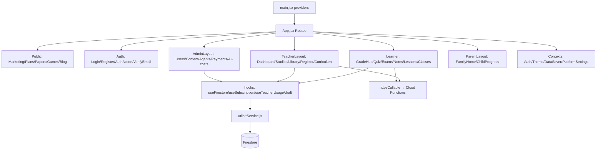

# 04 — Frontend Architecture

> Snapshot as of 2026-07-17 — verify before acting. Audited commit `0cd4c49`.

## Stack

React **19.2** SPA built with **Vite** (see [`02`](./02-repository-map.md) for the CLAUDE.md version discrepancy). Routing `react-router-dom` **v7** (fully lazy). Styling Tailwind. Rich text TipTap v3. State via React Context + hooks (no Redux). Firebase JS SDK v12. Analytics PostHog; error monitoring Sentry. i18n via i18next.

## Provider tree (`src/main.jsx`)

```
ErrorBoundary
  └ AuthProvider          (contexts/AuthContext — user, role, subscription snapshot)
     └ ThemeProvider       (contexts/ThemeContext — brand themes; public routes pinned to default)
        └ DataSaverProvider (contexts/DataSaverContext)
           └ PlatformSettingsProvider (contexts/PlatformSettingsContext — maintenance/announcements/flags)
              └ App          (src/App.jsx — BrowserRouter + Routes)
```

`main.jsx` skips `registerSW()` on native (Capacitor). App-level chrome mounted once above `<Routes>`: banners (maintenance/announcement/android-update/subscription), offline indicators, PWA `UpdatePrompt`, `ZedChatLauncher`, `CookieConsentBanner`, `ThemeApplicator`, `ActiveAssignmentSync` (headless teacher-assignment sync), `ScrollToTop`, `VisitorTracker`, and the paywall/popup hosts (`PaywallHost`, `PostUpgradeContinuation`, `LockedFeatureModal`, `QuizLimitPopup`, `SubscriptionReminderPopup`).

## Routing & layouts

Single `<Routes>` block in `App.jsx` (see [`03`](./03-route-register.md)). Nearly every page is `React.lazy()` in one `<Suspense fallback={<PageLoader/>}>`. Layout wrappers: `AdminLayout`, `TeacherLayout`, `ParentLayout`, global `Navbar` (learner/shared). Guards `ProtectedRoute`/`LearnerOnlyRoute`/`AdminRoute`/`TeacherRoute`/`ParentRoute` are UX gates; real enforcement is Firestore rules + CF guards ([`10`](./10-authentication-and-roles.md)).

## Directory conventions

- `src/components/<domain>/` — the bulk of the UI (admin, teacher, quiz, exams, dashboard, papers, parent, subscription, …).
- `src/features/<feature>/` — newer self-contained modules (`pages/`, `components/`, `services/`, `lib/`): notes, lessons, visualStudio, drafts, teacherSettings, learnerSettings, flashcards.
- `src/hooks/` — data + behaviour hooks (`useFirestore`, `useSubscription`, `useTeacherUsage`, `useQuizPersistence`, `draft/*`, `useActiveAssignmentSync`).
- `src/utils/` — **~210 modules** — the catch-all: Firestore services, AI clients, exporters, payments, permissions, paywall, analytics, navigation, curriculum resolvers.
- `src/editor/` — shared TipTap editor.
- `src/schemas/` — Zod schemas (quiz/attempt/result).
- `src/config/` — `curriculum.js`, `teacherTaxonomy.js`, `agents.js`.
- `src/offline/` — offline-first library + sync engine.

## Data access pattern

Client reads/writes go through `src/hooks/useFirestore.js` and the `src/utils/*Service.js` layer (rules-governed). AI/payments/privileged writes go through `httpsCallable` to Cloud Functions (see [`13`](./13-cloud-functions-register.md)). SSE endpoints (Zed chat, lesson-plan/worksheet streams) hit same-origin `/api/*` (hosting rewrites) to avoid CORS.

## Build & bundling (`vite.config.js`)

- **VitePWA** `generateSW` + `autoUpdate` (the config comment forbids `prompt`); `manifest:false` (ships `public/manifest.webmanifest`); workbox globIgnores heavy chunks (pdfjs/docx/pdf/notes/studio vendors), 4 MB cache cap; navigateFallback `/index.html` with a denylist (googleapis/firebaseio/identitytoolkit/`/timetables/`/`/__/`); `clientsClaim`+`skipWaiting`; `importScripts:['/sw-reload-clients.js']`.
- **`firebaseMessagingSwConfig`** plugin substitutes `__FIREBASE_*__` tokens in `dist/firebase-messaging-sw.js` (SW can't read `import.meta.env`).
- **Sentry** plugin (gated on `SENTRY_AUTH_TOKEN`+ORG+PROJECT) uploads+strips hidden source maps; `pruneSourceMaps` backstop.
- Extensive `manualChunks` (react/router/firestore/firebase/posthog/sentry/i18n/markdown/heroicons/docx/pdf/pdfjs/capacitor/sanitize/fflate vendors; tiptap/katex auto-split). `chunkSizeBudgets` 900 kB default, pdfjs 1.8 MB.

## Service worker & offline

VitePWA `generateSW` (`registerType:'autoUpdate'`). The rendered page crosses to the new SW at two safe moments: activation (`public/sw-reload-clients.js` → `usePwaUpdate` toast) and the next in-app navigation (`src/hooks/pwaAutoReload.js`). On Capacitor the SW is not registered. Firestore uses `enableMultiTabIndexedDbPersistence` (offline + cross-tab); writes queue offline and replay on reconnect (`firebase/config.js`).

## Frontend component architecture



See [`05-component-dependencies.md`](./05-component-dependencies.md) for per-feature dependency maps and shared-component usage.
