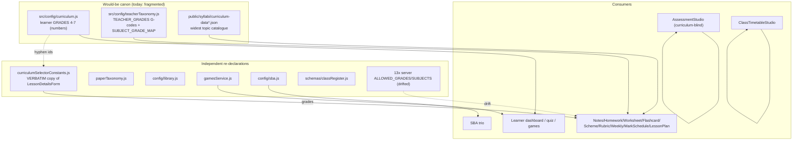

# 06 — Curriculum Architecture

> Snapshot as of 2026-07-17 — verify before acting. Audited commit `0cd4c49`.
> **This is the single most fragmented area of the codebase.** Treat every curriculum change as high-risk until the canonical source below is adopted.

## Bottom line

There is **no single canonical curriculum source of truth.** Grade lists, subject lists, subject→grade maps and topic catalogues are re-declared independently across **~30 modules** in `src/config`, `src/utils`, `src/schemas`, `src/components`, and `functions/teacherTools`, in **four incompatible ID vocabularies** stitched together by ~18 translator functions. The most-canonical single file is `src/config/curriculum.js`, but it only governs the learner side (Grades 4–7) and is bypassed by most teacher/admin surfaces.

## The four (really five) vocabularies — the root cause

The same concept has a different shape per layer, so every boundary needs a translator (each a place a wrong-curriculum bug hides).

| Concept | Learner | Teacher/KB | Studio picker | Past-paper | Class register |
|---|---|---|---|---|---|
| Grade 4 | `4` (number) | `'G4'` | `'Grade 4'` | `'4'` (string) | `'4'` |
| Nursery | — | `'ECE_N'` | `'Nursery'` | `'ECE_N'` | `reception`/`baby`/`middle` |
| Form 1 | — | `'G8'` | `'Form 1'` | `'G8'`/`'Form 1'` | `form-1` |
| Integrated Sci | `'science'` | `'integrated_science'` | varies | `'integrated_science'` | — |
| Social Studies | `'social-studies'` | `'social_studies'` | — | `'social_studies'` | — |
| CBC framework | — | `'2023'` | `'cbc'` | `'2023'` | — |
| OBC framework | — | `'2013'` | `'previous'` | `'2013'` | — |

Timetable config (`curriculumFramework.js`) adds a **fifth** subject-id set (`'english-language'`, `'mathematics-and-science'`) and 4-value curriculum ids (`'cbc-2023'`/`'obc-2013'`); games (`gamesService.js`) adds short slugs (`'science'`, `'social'`).

**~18 translator functions** bridge these: `normalizeSubject` (curriculum.js:290), `normalizeGrade`/`normalizeSubject` (cbcKnowledge.js:576/601), `gradeCodeToNumber` + `TEACHER_SUBJECT_TO_CURRICULUM` (curriculum.js:751/734), `toKbSubjectKey`/`studioGradeToKbGrade`/`normalizePaperGrade`/`SUBJECT_FIXES` (paperTaxonomy.js), the `curriculumSelectorConstants.js` family (`studioLabelToKbGrade`/`kbGradeToStudioLabel`/`foldFormCodeToGrade`/`normalizeSelectorSeed`/…), `normalizeCurriculum` (teacherTaxonomy.js:404), `normalizeFramework` (syllabiCurriculumData.js:39), `sheetNameToGrade`.

## A. Duplicate GRADE lists (23+ declarations)

Highlights (full list verified in findings): `curriculum.js` alone holds three (`GRADES` [4,5,6,7] L49, `GRADE_BANDS.primary` L840, `ALL_GRADES` L845). `teacherTaxonomy.js` has `TEACHER_GRADES` (L19) + `CURRICULUM_GRADE_STRUCTURES` (L57). `curriculumSelectorConstants.js:31` `CBC_GRADES` is an **explicit "VERBATIM copy" of `LessonDetailsForm`** (header comment). Then hard-coded `['4','5','6','7']` / `['1'..'12']` literals appear in: `EditQuizV2`, `QuizList`, `CreateQuizV2`, `AdminResults`, `AdminLearners`, `AdminCsvImport`, `settingsRegistry`, `TeacherClassEditor`, `schemas/quiz.js`, `questionBankImportCore.js`, `learnerPrefs.js`, `gamesService.js`, `schemas/classRegister.js` (**different vocab** entirely), `config/sba.js`, `dailyExamPicker.js` (server), `pastPapers.js`. **Server generators re-declare `ALLOWED_GRADES` in 13 files** — and they are **not identical** (§D).

## B. Duplicate SUBJECT lists

`curriculum.js:59 SUBJECTS` (hyphen ids) vs `teacherTaxonomy.js:191 TEACHER_SUBJECTS` (underscore ids) vs `paperTaxonomy.js` `SUBJECT_LABELS`/`FALLBACK_SUBJECT_KEYS`/`SUBJECT_FIXES` vs `config/library.js:263+` display-label vocab (has both `'Science'` AND `'Integrated Science'` — likely aliasing bug) vs `gamesService.js:47` short slugs vs `curriculumFramework.js` timetable subjects (with `canonicalName`+`aliases`) vs `assessmentStudioMeta.js:32 STUDIO_SUBJECTS`. Plus dropdown copies in `EditQuizV2`, `QuizList`, `CreateQuizV2`, `AdminResults`, `AdminCsvImport`, `ManageContent` (despite importing `CURRICULUM_SUBJECTS`), `MyResults`, `MarkScheduleStudio`. `teacherTaxonomy.js:287 SUBJECT_GRADE_MAP` is the only real subject×grade authority.

## C. ID collisions (same concept, different IDs)

- **Integrated Science:** `science` (learner) / `integrated_science` (teacher/KB) / `science` slug (games) / `Science` canonicalName (timetable, deliberately renamed). Bridged 3 ways.
- **Social Studies:** `social-studies` / `social_studies` / `social`.
- **Expressive Art(s):** learner singular `Expressive Art` → `SUBJECT_FIXES.expressive_art`; slugs `expressive-arts`/`expressive_arts`.
- **Cinyanja vs Zambian Language**, **Numeracy / "Mathematics and Science"** (4 spellings), **CTS** (`creative-technology-studies` / `creative_and_technology_studies` / `creative-and-technology-studies`). Reference pages even share subject-object ids (`lit-lang-lp`, `cts-lp`) between `PrimaryCurriculum.jsx` and `Primary2013Curriculum.jsx` with different content.

## D. Server allowlist DRIFT (real bugs, not just duplication)

- `generateLessonPlan.js:109 ALLOWED_GRADES` has **no `F1`–`F4`**, but `assessmentAllowlists.js`, `generateNotes.js`, `generateFlashcards.js` **do** → a studio emitting `'F1'` passes assessment/notes but is rejected by lesson-plan.
- `assessmentAllowlists.js:14 ALLOWED_SUBJECTS` **omits** `fashion_fabrics`, `food_nutrition`, `hospitality_management`, `travel_tourism`, `literature_in_english` that `generateNotes.js`/`generateLessonPlan.js` include → "Please select a supported subject" errors that depend on which studio you're in.
- `generateLessonPlan.js:113` comment claims it "Mirrors the frontend TEACHER_SUBJECTS list" but has no shared import — hand-copied and drifted.

## E. Fallbacks that expose the WRONG curriculum

- **Shared KB seed across both frameworks** (cbcKnowledge.js:260-267): `cbcTopics.js` seed is merged into BOTH `'2023'` and `'2013'` lookups unchanged → a 2023 generation can ground on a 2013-era entry.
- `normalizeFramework` swallows unknowns → `'2023'` (a typo or `'cbc-2023'` silently becomes 2023).
- `normalizeCurriculum` blank → **union** of CBC+OBC subjects (cross-era / abolished-grade subjects surface).
- **Grade 7 means opposite things:** CBC (2023) abolished G7, yet the entire learner canon is `GRADES=[4,5,6,7]` with G7 as top grade — same token, opposite meaning.
- Band boundaries conflict between reference pages (Lower Primary G1–3 vs G1–4, etc.).

## F. Topics / subtopics / outcomes

- **Learner:** `curriculum.js` `TOPICS`/`SUBTOPICS`/`COMPETENCIES` (G4–G7).
- **Teacher/KB:** `functions/teacherTools/cbcTopics.js` (2108 lines, ECE–G9, richer shape) — **completely separate** from learner TOPICS; all entries `reviewStatus:"needs_check"`.
- **Syllabi Studio:** `public/syllabi/curriculum-data.json` (+ `-2013.json`), server-mirrored at `functions/data/*` — the widest catalogue and the merge base in `getAllTopics`.
- **2013 client mirror** `utils/syllabus2013Topics.js` ("Keep in sync with the server copy").
- Reference-page topics hard-coded inline (Strands lists + a second `GRADE_OVERVIEWS`).
- **Topics-treated-as-subtopics:** `normalizeSelectorSeed` exists specifically to repair a past bug where "topic + first sub-topic" was stored as the topic value; `lookupTopic` matches sub-topic strings against topic entries — the two levels aren't cleanly separated.

## G. Feature dependency inventory (imports shared config vs own list)

- **Sources shared config well (GOOD):** all `features/notes/*`, `features/lessons`, `features/visualStudio`, `features/teacherSettings/CurriculumPanel`; `components/lessons/*`, `components/exams/*`, quiz assignment, `CentralQuestionBank`, `RecordOfWorkStudio`, `ClassTimetableStudio`, `SbaTaskStudio`, `PictureBankAdmin`, `PastPaperStudio`.
- **Subjects shared but GRADES hard-coded (biggest systemic issue):** every `StudioCurriculumSelector`-based studio — **NotesStudio, HomeworkStudio, WorksheetGenerator, FlashcardGenerator, SchemeOfWorkGenerator, RubricGenerator, WeeklyForecastStudio, MarkScheduleStudio, LessonPlanStudio** — resolves subjects through the syllabi-backed service but draws **grades from the hard-coded `curriculumSelectorConstants.js` copy**.
- **Fully hard-coded (bypass shared config):** `AssessmentStudio`/`assessmentStudioMeta.js`, `AssessmentQuestionBlock.jsx`, `TeacherClassEditor`, `admin/CreateQuizV2`, `AdminResults`, `AdminLearners`, `AdminCsvImport`, `ManageContent`, `QuizList`, `EditQuizV2`, `documentQuizParserCore`, `MyResults`, `learnerPrefs`, `gamesService` (+ ~10 game components), `schemas/quiz`, `schemas/classRegister`, `questionBankImportCore`, the 10 curriculum reference pages.

## Curriculum dependency diagram

## Recommendation — one canonical source of truth

**Adopt `src/config/curriculum.js` + `src/config/teacherTaxonomy.js` as a single merged canonical module, with G-codes (`'G4'`, `'ECE_N'`, `'F1'`) as the one wire vocabulary and underscore subject slugs as canonical.**

Why: `teacherTaxonomy.js` is already the most complete authority (models subject×grade×curriculum, both frameworks, ECE, CBC-abolished-G7), it is pure/side-effect-free (node-testable), and **the server already speaks G-codes + underscore subjects** — canonicalizing on those removes translators at the server boundary rather than adding them. Keep the syllabi JSON as the canonical TOPIC source; demote `cbcTopics.js` to an explicit grounding overlay.

**Highest-leverage first moves (low risk):**
1. Delete the 20+ `['4','5','6','7']`/`STUDIO_GRADES`/`GRADE_NUMBERS` literals; import `getActiveGrades()`.
2. Collapse `curriculumSelectorConstants.js` + `LessonDetailsForm` grade lists into one derived from `CURRICULUM_GRADE_STRUCTURES` (fixes every studio grade dropdown at once).
3. Extract the 13 server `ALLOWED_*` into `assessmentAllowlists.js` and import everywhere — closes the §D drift bugs immediately.
4. Add a `test:curriculum-canon` guard asserting no module re-declares a grade/subject array outside the two config files (repo already uses this pattern, e.g. `test:play-catalog-mirror`).

**Worst offenders:** (1) the 13 drifted server generator allowlists (active bugs), (2) `curriculumSelectorConstants.js`/`LessonDetailsForm.jsx` verbatim-copied grade lists feeding every teacher studio, (3) the shared KB seed served to both frameworks, (4) `config/library.js` + `gamesService.js` + `classRegister.js` each inventing another subject/grade vocabulary.

See [`20-change-impact-register.md`](./20-change-impact-register.md) (Curriculum resolver row) and [`23-risk-register.md`](./23-risk-register.md) (curriculum divergence risks).
