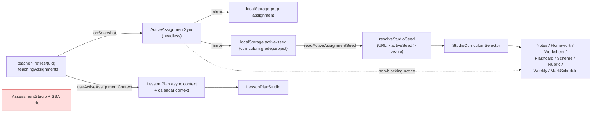

# 07 — Teaching Profile

> Snapshot as of 2026-07-17 — verify before acting. Audited commit `0cd4c49`.

The Teaching Profile is the teacher's persistent context (school, calendar, year) plus a set of **teaching assignments** (grade × subject × class × curriculum). One assignment is "active" at a time and seeds every studio's pickers.

## Data model

| Path | Purpose | File |
|---|---|---|
| `teacherProfiles/{uid}` | Profile doc (id == uid) | `src/utils/teachingProfileService.js`, `teachingProfileCore.js` |
| `teacherProfiles/{uid}/teachingAssignments/{id}` | One doc per assignment (deliberately **not** `assignments`, which is an unrelated top-level classes collection); carries denormalized `teacherId` for rules | same |

Profile shape (`normalizeTeachingProfile`, core:260–281): `schoolId`, `schoolLevel` (ece\|primary\|secondary), `calendarId`, `calendarSource` (national\|school\|teacher — only `national` resolves today), `academicYear`, `defaultAssignmentId`, `activeAssignmentId` (last cross-device selection, distinct from default), `profileStatus` (draft\|active), `onboardingCompleted`, `profileCompletion`. **Calendar stored by reference, never copied.** Term/week/holiday status is derived at read time via `resolveTeachingContext` (`src/utils/calendarResolver.js`).

Assignment shape (`normalizeAssignment` core:145–157): `grade`, `subject`, `className`, `curriculumType` (cbc\|previous), `periodsPerWeek` (0–60), `lessonDurationMinutes` (5–240), `isDefault`, `isActive`. Validation (`validateAssignment` core:206–226, against `src/config/teacherTaxonomy.js`): grade+subject required; grade-not-in-curriculum / subject-in-other-curriculum are **hard errors**; within-curriculum grade-range mismatch is a **soft warning** (static taxonomy is a floor, live syllabus leads). Dedup key = `grade::subject::className.toLowerCase()`.

## Active-assignment resolution

`resolveActiveAssignmentId` (core:408–435) priority (each must still point at an *active* assignment): (1) deviceId localStorage pick → (2) `profile.activeAssignmentId` → (3) effective default (stored default → first active) → (4) `''`. Returns `{id, source, storedInvalid}` so the dashboard can repair a dangling ref.

Service IO (`teachingProfileService.js`): `getTeachingProfile` (best-effort) vs `getTeachingProfileStrict` (rejects on read failure so edits can block). `setActiveAssignmentId` = single-field merge write (the cross-device signal). `setDefaultAssignment` = **atomic batch** flipping `isDefault` so exactly one is default.

## Cross-tab & cross-device sync

localStorage keys (per uid):
- `zedexams:prep-assignment:{uid}` — this device's selected assignment id.
- `zedexams:active-seed:{uid}` — JSON `{curriculum, grade, subject}` (`src/utils/activeAssignmentSeed.js`) so studios read the active assignment **synchronously at mount** (no Firestore round-trip).

**Listener** `src/hooks/useActiveAssignmentSync.js` — headless `<ActiveAssignmentSync/>` mounted once (`App.jsx:426`). `onSnapshot` on `teacherProfiles/{uid}`; on a remote `activeAssignmentId` change it fetches+validates the assignment (`planRemoteAdoption` in `activeAssignmentSyncCore.js`), mirrors into the two localStorage caches, and dispatches `REMOTE_ACTIVE_ASSIGNMENT_EVENT`. **Never writes Firestore, never mutates open form state** (studios get a non-blocking Switch/Keep notice via `useTeachingAssignmentChangeNotice`/`StudioAssignmentChangeNotice`), never clears a local pick.

**Writer** `src/components/teacher/TeacherDashboard.jsx` (295–430): resolves via `resolveActiveAssignmentId`, writes the prep key + `writeActiveAssignmentSeed`, persists `setActiveAssignmentId`, and repairs a `storedInvalid` id.

Read hook `src/features/teacherSettings/lib/useTeachingProfile.js`: single best-effort load (no live listener), derives `context` (memoised on `calendarId` — guards the documented "Maximum update depth exceeded" loop), `completion`, `yearMismatch`, `effectiveDefaultId`; `reload()` after mutations. `computeProfileCompletion` treats a Class Timetable as **recommended** (not required), so 100% is reachable without one.

Settings UI: `src/features/teacherSettings/TeacherSettings.jsx` → `panels/TeachingProfilePanel.jsx` (`/settings/teaching-profile`): migration inference from recent generations+assessments (suggest-only), assignment CRUD (`AssignmentFormModal`), setup wizard (`TeachingProfileWizard`), completion checklist, calendar card, weekly targets.

## How the active assignment reaches studios

Two paths: (1) **synchronous seed** (`readActiveAssignmentSeed` → `resolveStudioSeed`) feeds `StudioCurriculumSelector` in most studios; (2) **async context** (`useActiveAssignmentContext.js`) for Lesson Plan only, resolving against syllabi hooks + calendar, fail-closed to null.

## Studios that do NOT consume the Teaching Profile (the gap)

- **AssessmentStudio** (Test/Exam) uses a flat, **curriculum-blind** `STUDIO_GRADES` (`'1'..'12'`) + 8 hard-coded `STUDIO_SUBJECTS` (`assessmentStudioMeta.js`). **No `StudioCurriculumSelector`, no active-assignment seed** — the active assignment does not pre-fill the paper. Its client gate lives only in the AI slide-over (`CreatePaperModal.jsx`), not the manual builder.
- **SBA Task / Mark Tracker / Year Planner** use `SBA_GRADES`/`SBA_SUBJECTS` (`config/sba.js`), default grade `'G5'`, no selector, no active seed.
- **Record of Work** reads `readActiveAssignmentSeed` but renders its own flat `TEACHER_GRADES`/`TEACHER_SUBJECTS` `<select>` (not the syllabi cascade).
- **Class Timetable** legitimately uses its own curriculum model (needs official period allocations); grade seeded `'G5'`.

**Value-space mismatch:** selector/seed use server-ready `G5`/subject-slug/`cbc`; AssessmentStudio uses display `'5'`/`'Mathematics'`; SBA/Timetable use `G5`. The active assignment drops cleanly only into the 8 selector-based studios (+ Record of Work's seed read). See [`06-curriculum-architecture.md`](./06-curriculum-architecture.md) for the underlying vocabulary problem.
