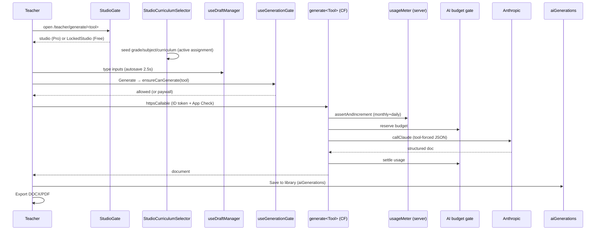

# 08 — Studio Generation Flows

> Snapshot as of 2026-07-17 — verify before acting. Audited commit `0cd4c49`.

Every teacher generator studio follows the same skeleton: **role gate → curriculum/assignment seed → input + draft → quota/entitlement pre-flight → Cloud Function (Anthropic) → reveal → save to library → export**. This doc gives the shared framework, then per-studio specifics and the files involved.

## Shared framework

| Concern | Component / hook | Notes |
|---|---|---|
| Route gate | `StudioGate` (`src/components/teacher/StudioGate.jsx`) | Free + `freeAllowanceFor(tool)===0` → `LockedStudio` (studio never mounts). Wraps every studio route in `App.jsx`. Lesson Plan is ungated. |
| Curriculum seed | `StudioCurriculumSelector` + `resolveStudioSeed` (URL > active-seed > profile) | See [`07`](./07-teaching-profile.md). Some studios bypass this (Assessment, SBA). |
| Input draft | `useStudioInputDraft` / `useDraftManager` | See [`15`](./15-drafts-and-autosave.md). |
| Quota pre-flight | `useGenerationGate.ensureCanGenerate(tool)` | Admins/unloaded meter fall through; top-up credit bypasses; else opens paywall and returns false. |
| Live usage | `useTeacherUsage` (`onSnapshot usageMeters/{uid}/periods/{yyyymm}`) | Caps resolved from the LIVE plan, not the stale meter snapshot. |
| Server enforcement | `functions/teacherTools/usageMeter.js assertAndIncrement` | Monthly per-tool + daily cap, transactional (backstops the client gate). |
| AI call | `functions/teacherTools/generate<Tool>.js` via `callClaude` (Sonnet 4.6) | Budget gate inside the client (see [`09`](./09-ai-architecture.md)). |
| Reveal | `LiveGenerationCanvas` (`src/components/ui/`) | Honest client-paced section-by-section reveal of the whole returned doc. |
| Save | `saveXGeneration` / `attachLibraryToGeneration` → `aiGenerations` | |
| Export | `src/utils/*To{Docx,Pdf,Xlsx}.js` | See [`16`](./16-document-generation.md). |

## Generic studio sequence

## Per-studio specifics

| Studio | Route | CF | Curriculum source | Draft | Notes |
|---|---|---|---|---|---|
| **Lesson Plan** | `/teacher/generate/lesson-plan` (ungated) | `studioGenerateLessonPlan` (+ SSE `apiGenerateLessonPlan`) | `useActiveAssignmentContext` (async) + Weekly-Forecast context | `useDraftManager` (input slices only; AI output not restored) | Bespoke `StudioCanvas`/`LiveLessonPlanPreview`, not LiveGenerationCanvas |
| **Worksheet** | `/teacher/generate/worksheet` | `generateWorksheet` (+ SSE) | `StudioCurriculumSelector` seed | `useStudioInputDraft` | **Withdrawn 2026-08** behind `featureFlags.worksheetStudioEnabled` (default off) — the module still builds; saved worksheets stay readable and exportable |
| **Notes** | `/teacher/generate/notes` | `generateNotes` | selector seed | input draft | |
| **Homework** | `/teacher/generate/homework` | `generateHomework` | selector seed | input draft | |
| **Flashcards** | `/teacher/generate/flashcards` | `generateFlashcards` | selector seed | input draft | |
| **Scheme of Work** | `/teacher/generate/scheme-of-work` | `generateSchemeOfWork` | selector seed | input draft | |
| ~~**Rubric**~~ | ~~`/teacher/generate/rubric`~~ | `generateRubric` (still deployed, unreachable) | — | — | **Retired 2026-08** — no route mounts the page; `RubricView` still renders saved rubrics in My Library |
| **Weekly Forecast** | `/teacher/generate/weekly-forecast` | (assembled) | selector seed | `useDraftManager` handBuilt | |
| **Mark Schedule** | `/teacher/generate/mark-schedule` | client-assembled | `DEFAULT_SUBJECTS` (hard-coded) | handBuilt | XLSX with live formulas |
| **Record of Work** | `/teacher/generate/record-of-work` | client-assembled | own `TEACHER_GRADES/SUBJECTS` (reads seed) | handBuilt | |
| **Class Timetable** | `/teacher/generate/class-timetable` | **none (no AI, no meter)** | own `curriculumFramework` model, grade seeded `'G5'` | handBuilt | uses assignments only for conflict siblings |
| **Test/Exam (Assessment)** | `/teacher/test-papers`, `/teacher/exam-papers` | `generateAssessment` (`mock_exam` for exam) | **curriculum-blind** `STUDIO_GRADES`/`STUDIO_SUBJECTS`; **ignores active assignment** | `useAssessmentDraft` (singleton) | Gate only in `CreatePaperModal` AI slide-over |
| **SBA Task/Tracker/Planner** | `/teacher/generate/sba*` | `generateSbaTask` (task) | `config/sba.js` lists, grade `'G5'`; **ignores active assignment** | handBuilt | |
| **Visual Studio** | `/teacher/visual-studio` | `generateDiagram` (gpt-image-1) | — | — | `visualSafety` opt-in |

## Key files per flow (representative)

- **Lesson Plan:** `src/features/lessonPlanStudio/pages/LessonPlanStudio.jsx`, `studio/StudioCanvas.jsx`, `studio/hooks/useActiveAssignmentContext.js`, `src/utils/teacherTools.js` (`studioGenerateLessonPlan`), `functions/teacherTools/studioLessonPlan.js`, `src/utils/restoreLessonPlan.js`, exporters `lessonPlanToDocx.js`/`lessonPlanToPdf.js`.
- **Assessment (Test/Exam):** `src/components/teacher/AssessmentStudio.jsx`, `assessmentStudioMeta.js`, `CreatePaperModal.jsx`, `AssessmentSlideOvers.jsx`, `functions/teacherTools/generateAssessment.js`, `src/utils/assessmentToDocx.js`/`assessmentToPdf.js`, draft `useAssessmentDraft.js`.
- **Shared:** `StudioGate.jsx`, `StudioCurriculumSelector`, `useTeacherUsage.js`, `useGenerationGate.js`, `LiveGenerationCanvas.jsx`, `liveGenerationSections.js`, `useLiveReveal.js`.

## Cross-cutting observations

- **Consistent gate + budget path** for the 8 selector-based studios; Assessment and SBA are the exceptions (gate only in a sub-modal, no active-assignment seed) — see [`07`](./07-teaching-profile.md).
- **Reveal is honest** — generators return the whole doc (or stream token counts); `LiveGenerationCanvas` paces the reveal client-side.
- `AiGenerationProgress` (the older tracker) remains only on the three generate-and-append flows without an output panel (Assessment AI slide-over, admin `CreateQuizV2`, `AdminVisualNotesGenerator`).
