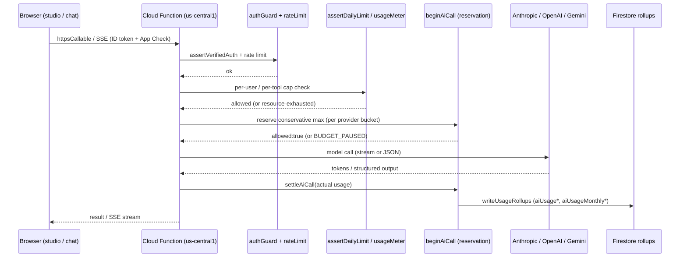

# 09 — AI Architecture

> Snapshot as of 2026-07-17 — verify before acting. Audited commit `0cd4c49`.

ZedExams runs AI on **three provider surfaces**, all server-side except one client-side Gemini path. Every server model client wraps calls in a **reserve → settle → release** budget gate; per-user caps are enforced separately per caller.

## Providers, models, env overrides

### Anthropic Claude — two client stacks

| Client | File | Default model | Env override | Used for |
|---|---|---|---|---|
| `callAnthropic` + chat builders | `functions/aiService.js:10` | `claude-sonnet-4-5` | `ANTHROPIC_MODEL` | explainAnswer, editQuizQuestion, generateQuiz, structureImportedQuiz, verifyQuiz, markAnswer, note insights/smart, studyPlan, Bonga + agent crons |
| `callClaude` (teacher ladder) | `functions/teacherTools/anthropicClient.js:29` | `claude-sonnet-4-6` | `ANTHROPIC_MODEL` (primary) + `ANTHROPIC_FALLBACK_MODEL` (default `claude-sonnet-4-5`) | all teacher `generate*` studios, scanned-quiz import, note OCR |

- **Vex** `verifyQuiz` = Haiku 4.5. `visualSafety` `SAFETY_MODEL` = `claude-haiku-4-5` (`visualSafetyCore.js:7`, env `VISUAL_SAFETY_MODEL`).
- **Divergence (config risk):** `aiService` defaults to `sonnet-4-5`, `teacherTools` to `sonnet-4-6`, both reading the same `ANTHROPIC_MODEL`. When unset, the two stacks run different models.
- System prompt sent as an ephemeral cache block (prompt caching). `callClaude` supports thinking/output_config + tool-forced JSON.

### OpenAI

| Client | File | Default | Env | Use |
|---|---|---|---|---|
| `callOpenAI`/`Stream` | `aiService.js:7` | `gpt-4o-mini` | `OPENAI_MODEL`; Zed also `ZED_CHAT_MODEL` (`index.js:1011`) | Zed chat, markAnswer |
| `callOpenAIImage` | `openaiClient.js:25` | `gpt-image-1` | `OPENAI_IMAGE_MODEL` | generateDiagram, generateNotePictures |
| `embedText` | `openaiEmbeddings.js:14` | `text-embedding-3-small` | `OPENAI_EMBED_MODEL` | Qix semantic dedup |

### Gemini

| Client | File | Default | Env | Use |
|---|---|---|---|---|
| `callGemini` (server text) | `geminiClient.js:25` | `gemini-2.5-flash` | `GEMINI_MODEL` | document/scanned import, vision |
| `callGeminiImage` (server) | `geminiImageClient.js:27` | `gemini-2.5-flash-image` | `GEMINI_IMAGE_MODEL` | generateNotePictures |
| **Firebase AI Logic (CLIENT)** | `src/firebase/ai.js:4` + `src/utils/aiLogic.js` | `gemini-2.5-flash` | `VITE_FIREBASE_AI_MODEL` | browser `generateText`/`streamText`/`generateJSON` |

## Selection, fallback, retry, streaming, limits

- Provider is **caller-hardcoded** per function — there is no runtime router.
- **Retry:** only Anthropic (`functions/anthropicFetch.js` — 429/529/5xx, retry-after, exp backoff 1.5–8s, 4 retries, 60s cap). OpenAI + Gemini are single-fetch, **no HTTP retry**.
- **Model fallback:** only `callClaude` (`buildModelLadder`/`attemptWithFallback`): primary → same-model re-roll → `ANTHROPIC_FALLBACK_MODEL`; never retries an already-streamed stream.
- **Streaming:** `callOpenAIStream` + `callClaudeStream` (text + tool `input_json_delta`); both capture usage for settlement.
- `maxTokens` defaults: callAnthropic 800, callOpenAI 500, callOpenAIStream 1000, callClaude 4000, callGemini clamp 200–8000. callAnthropic JSON output cap 60K chars.
- **Timeouts:** callOpenAIImage explicit 120s AbortController; others rely on function `timeoutSeconds`; client Gemini 15s.

## Budget / reservation / treasury / caps

Central: `functions/aiCostTracking.js`; engine: `functions/aiBudgetReservation.js`.

Every server model client runs: `beginAiCall`/`beginAiImageCall` (reserve a conservative max) → if `allowed:false` throw `resource-exhausted` `BUDGET_PAUSED_MESSAGE` → `settleAiCall` (reconcile to actual + write rollups) → `releaseAiCall` on failure.

- **Distributed lock:** 8 buckets (`AI_BUDGET_BUCKETS`, max 64); per-bucket cap = budget/N; caps sum to budget so total reserved cannot exceed budget under concurrency. Firestore `aiBudgetBuckets/{month}/buckets` + `/reservations/{generationId}`. Idempotent on `generationId`. TTL 2 min (`AI_RESERVATION_TTL_MS`), hourly reclaim cron (`functions/aiBudgetReclaim.js`).
- **Fails open everywhere:** disabled unless the ceiling is armed; any accounting error allows the call.
- **Enforced providers** (`aiBudgetEnforcement.js:37`): anthropic, openai, gemini, embeddings.
- **Revenue-linked treasury** (`functions/treasury.js`): `AI_BUDGET_MODE` = `static` (default `AI_MONTHLY_BUDGET_USD`) or `revenue_linked` (`monthRevenueUsd × AI_REVENUE_REINVEST_RATIO` default 0.30, floor `AI_BUDGET_FLOOR_USD`). Revenue = confirmed `payments` ZMW / FX (`settings/fxRate` via `dailyFxRefresh`, fallback `AI_TREASURY_ZMW_PER_USD` 26). All reads fail open; a derived $0 ceiling falls back to static.

### Per-user / per-agent caps (SEPARATE from the budget gate, applied per caller)

- `assertDailyLimit` (`aiService.js:114`): per-user/day counter → `aiDailyLimits/{uid}_{day}`. 150/day staff, 60/day learner.
- `assertAndIncrement` (`teacherTools/usageMeter.js`): per-tool monthly quota + plan daily cap → `usageMeters/{uid}/periods/{yyyymm}`; consumes `generationCredits`; `refundGeneration` on hard fail; Max-only tools gated.
- **Super-admin bypass:** usageMeter maps admin/superAdmin → max, skipping monthly+daily caps (usage caps **only** — never the budget gate, which has no role bypass).

Cost rollups (`writeUsageRollups`, sharded `FieldValue.increment`): `aiUsage/{date}/shards`, `/users/{uid}`, `/toolShards/{tool}__{shard}`, `aiUsageMonthly/{month}/shards` (ceiling reads this). Powers `/admin/ai-costs`.

## AI request flow (frontend → provider → back)

## Safety

- `aiPromptPolicy.resolveCustomSystemPrompt`: only teacher/admin may override the chat system prompt; learners are forced onto an education-guardrail + context wrapper (blocks free-LLM abuse + injection). Unit-tested, dependency-free.
- `educationSystemPrompt` guardrail + `cleanString`/`cleanContext` clamping/NUL-strip on all inputs.
- Quiz-gen post-validator (`validateQuizQuestion`): banned phrases, dup/topic-drift, structural filter independent of the model.
- Structured output: teacher tools tool-forced JSON (`callClaude` mode `tool`); Vex tool-forced; Gemini `responseMimeType json`; per-tool schemas in `teacherTools/<tool>Schema.js`.
- `visualSafety.js`/`visualSafetyCore.js`: staff-only, daily-limited `checkVisualSafety` (Haiku vision), fail-closed to flagged, SSRF host allow-list (firebasestorage only) + 5 MB cap.

## Per-function summary (verified)

| Function | Provider / model | Auth | Per-user cap | Budget gate | Track uid |
|---|---|---|---|---|---|
| `aiChat`/`apiAiChat` | OpenAI gpt-4o-mini | verified + ratelimit | assertDailyLimit | yes | uid+tool |
| `explainAnswer`/`editQuizQuestion`/`generateQuiz` | Anthropic sonnet-4-5 | verified | assertDailyLimit | yes | uid+tool |
| `verifyQuiz` (Vex) | Anthropic Haiku 4.5 | verified | assertDailyLimit | yes | — |
| `structureImportedQuiz` (smartImport) | Gemini→Anthropic | verified | assertDailyLimit | yes | Gemini call **no uid** (`index.js:1901`) |
| `structureScannedQuiz` | Gemini + callClaude | verified | assertDailyLimit | yes | **tool-only, no uid** |
| `ocrNotePages` (importNote) | Anthropic | verified | assertDailyLimit | yes | uid |
| `checkShortAnswer`/`markAnswer` | Anthropic | verified | assertDailyLimit | yes | uid+tool |
| teacher `generate*` studios | Anthropic callClaude | staff | assertAndIncrement | yes | uid+tool |
| `generateDiagram` | OpenAI gpt-image-1 | staff | assertAndIncrement | yes (image) | uid+tool |
| `generateNotePictures` | Gemini/OpenAI image | staff | assertAndIncrement | yes | uid+tool |
| `questionReviewOnWrite` (Qix) | OpenAI embed + Anthropic Haiku | Firestore trigger | none (by design) | yes | tool-only |
| Bonga WhatsApp | Anthropic Haiku | webhook (no auth) | none | yes | tool-only |

## Budget-enforcement gaps (findings)

| ID | Severity | Finding |
|---|---|---|
| AI-1 | **High** | **Client-side Gemini fully bypasses everything.** `src/utils/aiLogic.js` + `src/firebase/ai.js` call Gemini directly from the browser (Firebase AI Logic): no reservation/budget gate, no treasury cap, **not** in `aiUsage`/`aiUsageMonthly` rollups (`/admin/ai-costs` is blind), no daily/usage cap. Gated only by App Check + Firebase project quota. |
| AI-2 | Low (attribution) | Per-user attribution gaps: smartImport Gemini (`index.js:1901`), all scannedQuizImport calls, Qix, Bonga pass `track` with tool but **no uid** — spend counts to the ceiling but isn't attributed per user. |
| AI-3 | Medium (fragility) | Per-user caps live in each callable, not the model clients — no central chokepoint. A new function that forgets `assertDailyLimit`/`assertAndIncrement` bypasses per-user caps while still hitting the budget gate. No current function found missing them. |
| AI-4 | Low | OpenAI + Gemini have **no HTTP retry** (Anthropic-only). A 429 fails immediately. |
| AI-5 | Info | `visualSafety` is **opt-in** ("Check image"), NOT an automatic pre-Storage gate — contradicts CLAUDE.md's "outputs flow through visualSafety before landing in Storage." Only `sanitizePrompt` runs pre-gen. |
| AI-6 | Info | Default-model divergence sonnet-4-5 vs sonnet-4-6 across the two Anthropic clients when `ANTHROPIC_MODEL` is unset. |
