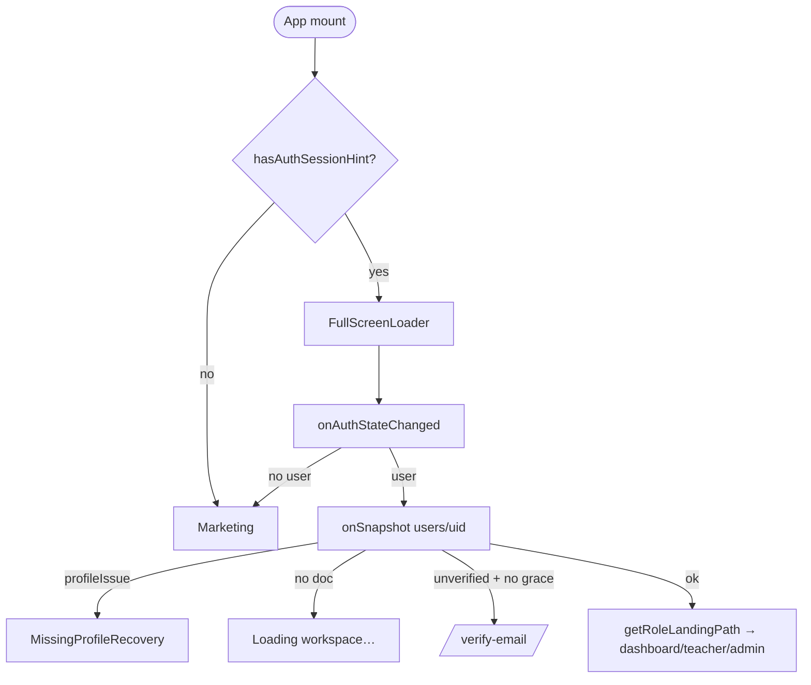

# 10 — Authentication & Roles

> Snapshot as of 2026-07-17 — verify before acting. Audited commit `0cd4c49`.

## Session & providers

One `getAuth(app)` (`src/firebase/config.js:58`). Persistence survives restarts: web `browserLocalPersistence`, native `indexedDBLocalPersistence` (`config.js:84–93`). One `onAuthStateChanged` (`AuthContext.jsx:637`) drives a `users/{uid}` `onSnapshot` (`AuthContext.jsx:530`) — the live source of role/status/subscription. `authDomain` is rewritten to the page origin on zedexams.com (`src/firebase/authDomain.js`).

- **Sign-up** `register()` (`AuthContext.jsx:229–282`): create user → `updateProfile` → referral mint → `setDoc(users/{uid}, defaultUserRecord)` → best-effort `sendEmailVerification`. Roles clamp to learner/teacher/parent.
- **Email/password sign-in** `login()`; retries only transient network errors.
- **Google sign-in:** web `signInWithPopup`; native `signInWithGoogleNative` resolves `Capacitor.Plugins.FirebaseAuthentication` at runtime (`skipNativeAuth:true`) then `signInWithCredential`. First-time doc via `ensureGoogleUserProfile`.
- **Email verification:** the token claim `email_verified` is the source of truth, never the Firestore mirror (`verification.js`, `authGuard.js:23–25`). `refreshEmailVerification` forces `getIdToken(true)`. Grace window `verificationGraceUntil` honoured client-side, in rules (`firestore.rules:26–28`), and backend fail-closed (`authGuard.js:27–39`); the client cannot write it.
- **Password reset:** client calls the callable `sendPasswordResetEmail` (not the client SDK) so it can be rate-limited — per-email 5/day, per-IP 15/day (`index.js:876–913`). `AuthAction.jsx` handles the oobCode modes.
- **Cold-start race:** `AUTH_HINT_KEY` localStorage hint lets the router distinguish "returning user restoring" from "signed out" synchronously; `RootRedirect` holds the loader when `loading && !currentUser && hasAuthSessionHint()` (`App.jsx:283`). Watchdog drops `loading` after 5s (no hint) / 30s (hinted).
- **Logout** `logout()`; the signed-out branch clears hint/Sentry/analytics/push.

## Role model

Roles: learner(=student), teacher, parent, admin, superAdmin. **admin ≡ superAdmin** (`permissions.js:15–18`; `AuthContext.jsx:459–463`); `isTeacher` includes super-admins.

Two role stores: (1) **authoritative Firestore `users.role`** — used by rules `callerRole()`/`isAdmin()` and backend `assertCallerIsAdmin` (`adminUsers.js:13–14`); (2) **custom claim `role`** set once at `onCreate` from `ADMIN_EMAILS`, and since #1993 **only for a verified address** (`security/adminBootstrapCore.js`). Consumed by `syllabusOverrides.js:33`, `buildBootstrappedUserProfile` — and by `requireAdminMfaCore.tokenIsAdmin`, which accepts `role === 'admin'` as administrator evidence, so the claim is an authorization signal in its own right and not merely a mirror.

## Route guards (client-side UX gates only)

`ProtectedRoute` (numeric `ROLE_LEVEL` learner=1/teacher=2/admin=3, unknown role `?? 1`), `LearnerOnlyRoute` (teachers hard-excluded), `AdminRoute`/`TeacherRoute` (`App.jsx:334–348`), `ParentRoute` (explicit `isParent||isAdmin`). The real boundary is Firestore rules + Cloud Function guards, per `ProtectedRoute.jsx:33–35`.

## Backend authorization

`assertVerifiedAuth` (`authGuard.js:52–61`) requires uid + email_verified/grace; skipped for bootstrap/delete/password-reset/webhooks. `assertCallerIsAdmin` does a server-side Firestore role get (`adminUsers.js:10–21`). Rules blocklist role/billing/status/grace/credits on both create and self-update (`firestore.rules:170–284`) — self-escalation is enforced-blocked.

## Flow diagrams

## Security findings

| ID | Severity | Finding | Evidence |
|---|---|---|---|
| AUTH-H1 | **High** — **Implemented ✔ · Tested ✔ · Merged ✔ (#1774) · Deployed ✔ (2026-07-17) · Reviewed ✔ (approved w/ follow-ups)** | **Suspension not enforced at the rules layer.** Fixed: canonical `users.status` now enforced by `notSuspended()` (folded into `firestore.rules` `isVerified()`), `callerActive()` (`storage.rules` `ownsPath()` + `papers/`), and `assertActiveAccount` (folded into `functions/authGuard.js` `assertVerifiedAuth`/`assertDecodedVerified`). Suspended users keep only their own-profile read + sign-out; admins managing others are unaffected. Tests: `functions/authGuard.test.js` (12/12), rules emulator (138/138). **Residual (Low, SEC-F1 / RISK-19):** the guard **fails open** on a transient status-read error, so payment initiation should be reviewed to fail *closed* separately (see [`18`](./18-security-review.md), [`23`](./23-risk-register.md)). See [`25`](./25-remediation-plan.md). | `authGuard.js`, `firestore.rules`, `storage.rules` |
| AUTH-M2 | Medium | **Parent-role create mismatch.** Frontend writes `role:'parent'` but the users create rule allows only `['learner','teacher']` (`firestore.rules:172`) → parent `setDoc` is permission-denied. Either parent signup is broken or another path is undocumented. | `AuthContext.jsx:232,304`, `Register.jsx:250–253` |
| AUTH-M3 | Medium | **App Check + reCAPTCHA fail-open / observe-only.** Server enforcement defaults to observe-only; providers fail open to placeholder tokens; `assessRecaptcha` fails open (block threshold 0.3). Anti-bot/anti-scraping on paid AI endpoints is currently advisory (documented staged rollout). | `appCheckEnforcement.js:40–51`, `recaptchaAssessmentCore.js:35,104–160` |
| AUTH-M4 | Medium | **Custom claim `role` never re-synced.** `adminSetUserRole` updates only the Firestore field; the claim is frozen at onCreate. `syllabusOverrides.js:33` (claim-based) denies a post-signup-promoted admin; `bootstrapUserProfile` re-mints from a stale token role. Divergence is toward *less* access, but is a latent inconsistency. | `adminUsers.js:114`, `syllabusOverrides.js:33`, `index.js:687–689` |
| AUTH-L5 | Low/Info | Route guards are client-only by design (data protected by rules — verified). | `ProtectedRoute.jsx:33–35` |
| AUTH-L6 | ~~Low~~ → **High** — **Fixed ✔ (#1993)** | **Fake-email admin bootstrap.** The previous entry claimed the risk was "contained (verification gate + create rule pins role)". **Both mitigations were inapplicable to the path that mattered:** `bootstrapUserProfile` is *explicitly exempt* from `assertVerifiedAuth` (`authGuard.js` — it repairs a profile before verification by design), and it writes with the **admin SDK**, which bypasses the `role in ['learner','teacher']` pin in `firestore.rules`. So an address listed in the committed `ADMIN_EMAILS` with **no existing Auth account** could be registered by anyone: `setUserRole` minted the `admin` claim from the email string at `onCreate`, and calling `bootstrapUserProfile` (while simply skipping the client's own `setDoc`) converted that claim into an authoritative `users.role = 'admin'` — with no email ever verified. Fixed by gating both halves on `emailVerified` (`security/adminBootstrapCore.js`, `test:admin-bootstrap`); federated sign-in arrives verified and is unaffected. Alert delivery moved to `OPS_ALERT_EMAILS` so a notification address is never an authorization grant. `ADMIN_EMAILS` ships unset; prefer `scripts/grant-superadmin.mjs`. | `index.js` `setUserRole`/`buildBootstrappedUserProfile`, `authGuard.js`, `firestore.rules:311` |
| AUTH-L7 | Info | No duplicate auth listeners — single `onAuthStateChanged`, snapshot torn down before re-subscribe. | `AuthContext.jsx:637` |
| AUTH-L8 | Low | 6-char password min, client-only. | `AuthAction.jsx:119` |

**Strengths:** self-escalation of role/billing/status/grace is blocked in both create and update rules; verification uses the token claim (not the mirror); grace is server-controlled fail-closed; no duplicate auth listeners.

See [`18-security-review.md`](./18-security-review.md) for the consolidated security posture and [`14-payment-and-subscriptions.md`](./14-payment-and-subscriptions.md) for the related learner-content-gating gap.
