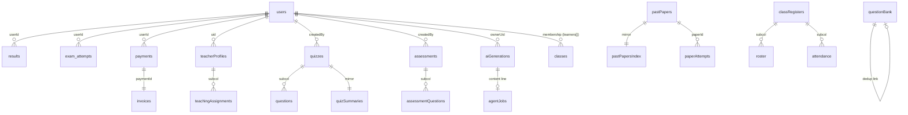

# 11 — Firestore Data Model

> Snapshot as of 2026-07-17 — verify before acting. Audited commit `0cd4c49`.
> Rules: [`firestore.rules`](../../firestore.rules) (~152 KB). Indexes: [`firestore.indexes.json`](../../firestore.indexes.json). Client SDK writes are rules-governed; Cloud Functions use the Admin SDK (bypasses rules).

~110 distinct collections/subcollections are referenced; ~85 live, ~15–20 legacy/orphaned. Client-facing reads/writes come from `src/hooks/useFirestore.js` and the `src/utils/*Service.js` layer; authoritative writes ($ / grading / AI / mirrors) are server-only.

## Core collections

| Collection | Doc ID | Owner | Key fields | Read (rules) | Writers | Indexes |
|---|---|---|---|---|---|---|
| `users` | `{uid}` | path | `role`, `plan/premium`, `subscription*`, `teacherPlan*`, `grade`, `status`, `emailVerified`, `verificationGraceUntil` | self or admin | client (limited fields); **server for all $ fields** (`subscriptionActivation`, `invoiceGenerator`, `googlePlayBilling`, `referralRedemption`, `adminPayments`) | role+status; premium+expiry |
| `quizzes` | auto | `createdBy` | `quizType`, `isPublished`, `publicAccess`, `isDailyExam`, `grade/subject/term`, `parts` | public if publicAccess&&isPublished; else published/daily/owner/admin | teacher draft-only, admin any; `dailyExamPicker` | 20+ composites |
| `quizzes/{id}/questions` | auto | parent | `type`,`marks`,`options`,`correctAnswer`,`passage` | daily-exam Q **server-only**; else parent rule | teacher owner/admin; grader reads | — |
| `quizSummaries` | `{quizId}` | mirror | lightweight quiz metadata | mirrors quizzes; client writes denied | `quizSummary/index.js` trigger | isPublished+quizType+grade |
| `results` | auto | `userId` | `quizId`,`score`,`percentage`,`grade`,`completedAt` | owner/admin/teacher-of-quiz | client create; admin update | userId+completedAt; quizId+completedAt |
| `exam_attempts` | auto | `userId` | `status`,`subject`,`percentage`,`timeTakenSeconds` | submitted(public)/owner/admin | client create `in_progress`; **grading server-only** | 6 leaderboard composites |
| `exam_attempts/{id}/private` | fixed | `userId` | answers/analytics | owner/admin | `write:false` (grader) | — |
| `daily_exam_locks` | auto | `userId` | `status`,`date`,`subject` | owner/admin | client create; flip server-only | userId+date |
| `assessments` (+ `/questions`) | auto | `createdBy` | teacher-private papers, `assessmentType`,`parts`,`library` | owner/admin | teacher owner | createdBy+createdAt |
| `lessons` | auto | `createdBy` | `noteFormat`,`content`,`blocks`,`isPublished`,`fileUrl` | published/owner/admin | teacher draft, admin any; server | ~30 composites |
| `aiGenerations` | auto | `ownerUid` | `tool`,`status`,`visibility`,`inputs`,`output`,cost | owner/admin | **mostly server** (all `teacherTools/generate*`, `pubo`); client only for 6 derivation tools | ownerUid(+tool)+createdAt; status; tool |
| `agentJobs` | auto | `createdBy` | `agentId`,`department`,`status`,`input`,`output` | owner/admin | teacher/admin create `queued`; dispatcher+crons | department/status/agentId/createdBy |
| `agentControl` | `{agentId}` | none | `paused`,`recentFailures`,`autoPublish` | **any verified** | admin + server (`circuitBreaker`,`questionReview`) | — |
| `questionBank` | auto | `ownerId` | `subject`,`grade`,`topic`,`reviewStatus`,`masterEligible`,embeddings | owner/masterEligible/admin | teacher pending only; admin any; Qix | subject+grade+topic |
| `pastPapers` | auto | `uploadedBy` | `status`,`grade`,`subject`,`year`,`assets[]` | published anon / admin | admin-only | status+grade(+subject)+year |
| `pastPapersIndex` | `published` | — | denormalized paper list | public; write:false | trigger+cron | — |
| `paperAttempts` | auto | `userId` | `paperId`,`elapsedSeconds`,`status` | owner/admin | owner | userId(+paperId)+submittedAt |
| `payments` | auto | `userId` | `status`,`amount`,`provider`,`confirmedAt` | owner/admin | **admin/server** (`subscriptionActivation`,`lencoWebhookProcessor`,`till`,`googlePlayBilling`) | userId+createdAt; status+confirmedAt |
| `invoices` | auto | `userId` | invoice data | owner/admin; writes denied | `invoiceGenerator` | userId+issuedAt |
| `aiUsage/{date}` (+`/shards`,`/toolShards`,`/users`) | `{date}`+shards | — | `totalCostUsd`,`callCount` | admin; write:false | `aiCostTracking`,`aiCostDailySummary` | — |
| `usageMeters/{uid}/periods` | `{periodId}` | path | daily gen caps | owner/admin; write:false | `teacherTools/usageMeter` | — |
| `classRegisters` (+`/roster`,`/attendance`,`/attendanceTerms`,`/attendanceAudit`) | mixed | `teacherUid` | roster rows, attendance marks+`version`+`termId`, term policy lifecycle, append-only audit | owner/admin | teacher version-guarded; admin reopen; audit update/delete:false | teacherUid+status+updatedAt |
| `classes` | auto | `teacherUid` | `learners[]`,`pendingLearners[]`,`active` | rules | server (`classManagement`) | teacherUid+active; array-contains learners |
| `assignments` | auto | `teacherUid` | `classId`,`active` | rules | server (`classManagement`,`classAnalytics`) | classId+active; teacherUid+active |
| `whatsappConversations` | `{phone}` | — | Bonga log | **no rules → server-only** | `index.js:3919` | — |
| `feedback` / `contactMessages` | auto | `uid` / anon | `role`,`type`,`message`,`status` / `name`,`email`,`message` | admin read; verified/anon create | client dialogs; Echo | — |

**Treasury/budget (all server-only, no client rules):** `aiUsageMonthly/{month}/shards`, `aiBudgetBuckets`+`buckets`+`reservations` (indexes provider+status, status+expiresAt), `aiUsageDaily`, `aiDailyLimits`/`rateLimits` (read/write:false).

**Secondary live:** CBC KB tree `cbcKnowledgeBase/{version}` + subcols; `approvedSyllabi`, `curriculum`, `rag_chunks`, `curriculumUploads`, `topics`; authoring (`noteSmart`, `noteInsights`, `noteProgress`, `flashcardProgress`, `lessonPlans`, `lessonProgress`, `lessonSeries/{uid}`, `lessonPlanTemplates`, `teacherLibraries/{uid}`, `drafts/{uid}/items`, `assessmentDrafts/{uid}`, `schoolProfiles/{uid}`, `teacherProfiles/{uid}`+`teachingAssignments`); images (`pictureBank`, `visualAssets`, `visualProjects`, `promptTemplates`, `downloadTickets`); gamification (`games`, `scores`, `badges`, `daily_challenges`, `dailyStreaks`, `learnerStats`, `learner_profiles/{uid}`); parent/family (`familyInviteCodes`, `parentLinks`, `progressShares`, `shares/{token}`); growth/ops (`referralCodes`, `referralRedemptions`, `newsletterSubscribers`, `subscriptionEvents`, `announcements`, `adminAuditLogs`, `notifications/{uid}/feed`, `dawnConfig`, `dawnRuns`, `publicStats`, `visitorStats`+shards, `visits`, `visitors`, `platformStats`+`active` markers, `settings`, `examTimetables`); server infra (`appCheckHealth`, `playBindingHealth`, `paymentLocks`, `storageOrphanReports`, `opsBackups`).

## ER overview

## Risk findings

| ID | Severity | Finding |
|---|---|---|
| FS-1 | Medium | **Multiple schemas per collection:** `aiGenerations` (3 write shapes; a new `tool` not in the rules allowlist = silent permission failure), `quizzes` (practice/daily-exam/public), `lessons` (5 `noteFormat` models), `questionBank` (private↔Master Bank). |
| FS-2 | Medium | **Weak/missing ownership:** `agentControl` is global and world-readable to verified users (exposes breaker state); `contactMessages` anonymous create (shape-only validation, relies on App Check); `whatsappConversations` uses PII phone as doc id; `classes` membership via denormalized array not per-doc ownership. |
| FS-3 | Medium | **Denormalization drift:** `quizSummaries`↔`quizzes` and `pastPapersIndex`↔`pastPapers` (trigger-maintained, stale on misfire); `users` subscription mirror vs `payments`/`invoices`; `users.emailVerified` deliberately display-only vs token claim; `teacherProfiles.default/activeAssignmentId` can dangle. |
| FS-4 | Medium | **Hotspots/unbounded:** `exam_attempts` (highest learner-write + public leaderboard); `aiUsage/{date}` & `visitorStats/{day}` sharded counters (good, but need summing); `agentControl.recentFailures` single shared doc contended by all runner failures; `classes.learners[]` whole-array rewrite per join (contention + 1 MiB cap); `notifications/{uid}/feed` and `scores` grow unbounded (only feed has TTL). |
| FS-5 | Low | **Orphaned/legacy** (in rules/indexes, only touched by `accountDeletion.js` or nowhere): old agent pipeline (`aiAgentTasks/Logs/aiTaskSteps/aiGeneratedContent/aiGeneratedContentVersions/aiSupervisorLogs/aiLiveAgentStates/aiAgentControls` + 8 indexes), `generatedContent`, `assessmentStandards`, `learnerWeaknessProfiles`, `curriculumUpdateReports`, `teacherApplications`, `schoolLicences`, `leaderboards`, `learnerProgress`; **stale `papers` collection** with 8 composite indexes (live code uses `pastPapers`). See [`22-dead-code-register.md`](./22-dead-code-register.md). |

**Good patterns:** server-authoritative writes across grading/payments/AI/mirrors; path-based ownership for per-user private data; an enforced rules-expression budget in `validQuestionFields()` (guards a real past outage).
