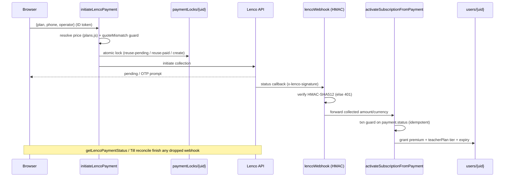

# 14 — Payments & Subscriptions

> Snapshot as of 2026-07-17 — verify before acting. Audited commit `0cd4c49`.

Two payment rails share **one idempotent activation chokepoint** (`subscriptionActivation.js activateSubscriptionFromPayment`): **Lenco** (web, ZMW mobile money) and **Google Play Billing** (Android in-app). Every premium/tier/credit field is backend-only — a tampered client cannot grant itself premium.

## Lenco (web — MTN/Airtel/Zamtel mobile money, ZMW; cards disabled)

- **Server-authoritative pricing:** `functions/plans.js` (`getPlan`); client mirror `src/utils/subscriptionConfig.js`. `initiateLencoPayment` (`index.js:3174`) resolves price server-side, never trusts a client amount. `quoteMismatch` (`paymentInitiationCore.js:105`) refuses to charge a price different from what the client displayed. Pro→Max prorated amount recomputed server-side (`quoteUpgradeForUser`).
- **Duplicate-payment protection (strong):** `decideLockedInitiation` + atomic `paymentLocks/{uid}` transaction (`index.js:3275–3315`). Concurrent double-taps/tabs/devices serialize on the lock; one creates, others `reuse-pending` (same reference) or `reuse-paid` (never re-charges). 3-min reuse window, clock-skew guarded. Payment doc id == Lenco reference.
- **Activation (single idempotent chokepoint):** `activateSubscriptionFromPayment` guarded by payment doc `status` in a transaction so webhook + poll + immediate-success races no-op. `checkCollectedAmount` blocks under-collection/currency-mismatch → parks as `amount_mismatch` (admin paged). Grants premium fields AND the separate `teacherPlan` tier the usage meter reads.
- **Webhook** `/api/payments/lenco/webhook` → `lencoWebhook` (`index.js:3691`): server-to-server, no CORS/App Check; security is `x-lenco-signature` **HMAC-SHA512** over the raw body. Bad signature → 401. `amount_mismatch` → ops alert + no grant; processing error → 500 → Lenco retries (idempotent-safe).
- **Fallbacks:** `submitLencoOtp`, `getLencoPaymentStatus`, `recoverMyPendingPayments` (user-scoped) — all route through the same idempotent functions.
- **Payment recovery (Till):** `functions/agents/runners/till.js reconcilePendingPayments` sweeps stale pending Lenco payments (5min–3day), re-queries, activates/fails idempotently; hourly cron `hourlyRevenueReconcile`.
- **FX/quote drift:** `fxRate.js` feeds only the treasury budget, **NOT charges**. Charges are integer ZMW from `plans.js` → no charge drift.

## Google Play Billing (Android in-app subscriptions)

- `functions/googlePlayBilling.js` + `googlePlayBillingCore.js` (pure); client `src/utils/playBilling.js` + `playBillingCatalog.js` (only importer of `@capgo/native-purchases`).
- `PLAY_PRODUCT_TO_PLAN` (core:19–26) is the exact inverse of `PLAY_SUBS` (catalog:20–27), guarded by `scripts/test-play-catalog-mirror.mjs`.
- `verifyGooglePlayPurchase` (`index.js:3600`): auth + App Check; `verifyAndApplyPurchase` verifies the token against the Play Developer API server-side, then funnels through the **same idempotent activation** via `payments/{gp_*}` (`provider:"google_play"`). `derivePaymentId` keyed on (token, expiry) so each renewal is a fresh doc; same-period re-verify no-ops.
- **Rails:** cross-account replay guard (`wrong_user`); account binding (observe-only unless `PLAY_ENFORCE_ACCOUNT_BINDING=1`); **never-downgrade** brain (`decideEntitlementUpdate`) keeps Lenco/admin subs untouchable from Android; server-side acknowledge (unacknowledged auto-refunds in 3 days). Referral bonus days skipped for Play.

## Plans, credits, quotas, lifecycle

- Top-up `topup_generation` (K25, `kind:"topup"`) grants `generationCredits` instead of flipping the plan.
- **Teacher quotas server-enforced** in `usageMeter.js assertAndIncrement`: monthly per-tool + daily cap, transactional; credit spent atomically only when blocked; `refundGeneration` rolls back on hard failure.
- Referral (`referralRedemption.js`): referee +30d idempotent via `referralCreditRedeemed`; self-referral/stale-code guarded.
- Cancellation (`subscriptionLifecycle.js` `cancelAtPeriodEnd`, Cloud Function only). No web auto-renew; access runs to `subscriptionExpiry`.
- **Expiry enforced at READ time only** — no cron flips `premium=false`. `hasPremiumAccess` + usageMeter re-check on read; a `subscriptionLifetime` guard prevents flag-without-expiry never-expiring accounts.

## Payment sequence (web Lenco)

## Findings

| ID | Severity | Finding | Evidence |
|---|---|---|---|
| PAY-1 | **High (content confidentiality)** — **Implemented ✔ · Tested ✔ · Merged ✔ · Deployed ✔ (2026-07-17) · Reviewed ✔** for quiz questions + past-paper PDFs | **Learner premium *content* gating was client-side only.** Fixed: quiz `questions` read now requires `isDemo(parent) \|\| hasValidEntitlement()`; Storage `papers/` read now requires entitlement (or teacher/admin/owner). `hasValidEntitlement()` mirrors `hasPremiumAccess()` (read-time expiry). **Lessons/notes were verified NOT premium-gated in the client (free content)** → out of scope. Not a billing bypass. **Residual (Low, SEC-F2 / RISK-20):** previously issued Firebase Storage download tokens for `papers/` may remain usable until rotated (unverified; not rotated). See [`18`](./18-security-review.md), [`23`](./23-risk-register.md), [`25`](./25-remediation-plan.md). | `firestore.rules`, `storage.rules` |
| PAY-2 | Info | Dead card-collection code (`initiateCardCollection` proxies raw PAN — PCI) but the card path is disabled at the callable. | `index.js:3187–3192` |
| PAY-3 | Low | Google Play revenue counted at **list price** in the treasury budget rollup (Google is authoritative on net) → Play revenue slightly over-counted for budgeting. | `aiCostTracking.getMonthToDateRevenueUsd` |
| PAY-4 | Low | Expiry enforced at read-time only — no cron demotes expired users. Mitigated by read-path re-checks. | `subscriptionLifecycle.js` |

**Strengths (write side):** all premium/teacherPlan/generationCredits fields are backend-only (`firestore.rules` users 243–275 blocks client self-mutation, create rule forces them false/absent); one idempotent activation path shared by webhook/poll/OTP/Till/Play; strong duplicate-payment protection; provider-agnostic never-downgrade logic. See [`18-security-review.md`](./18-security-review.md).
