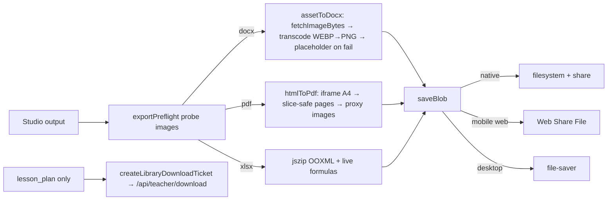

# 16 — Document Generation & Export

> Snapshot as of 2026-07-17 — verify before acting. Audited commit `0cd4c49`.

**Almost all export is client-side.** Exporters live in `src/utils/*To{Docx,Pdf,Xlsx}.js`, run in the browser, and lazy-load heavy libs so they never touch the main bundle. The one server render path is lesson-plan DOCX.

## Three export families

1. **`docx`** (`Document` + `Packer.toBlob`) for Word — most exporters.
2. **`html2canvas` + `jsPDF`** via the shared `src/utils/htmlToPdf.js` for PDF.
3. **Hand-built OOXML** zipped with lazy `jszip` (NOT the `xlsx` package) for spreadsheets — mark schedule, timetable, SBA tracker (with **live formulas**).

> `src/documentEngine/` and `functions/documentEngine/` are **NOT exporters** — they are the quiz-import StructuredDocument shape + validation engine.

## PDF pipeline — `src/utils/htmlToPdf.js`

`downloadHtmlAsPdf(html, filename, {onFallback, onImageFailures, orientation})` → `htmlToPdfBlob` → `saveBlob`. Renders HTML in an off-screen iframe at A4 CSS px (794 / landscape 1123); `jsPDF({unit:'pt', format:'a4', compress:true})`. Because html2canvas flattens the DOM, `collectBreakGeometry()` snapshots `break-inside:avoid` atomic blocks BEFORE rasterising, and `chooseSliceBottom()` (pure, tested) cuts pages in gaps so a question/table is never sliced. `waitForAssets()` awaits fonts+images (6s) and returns the failed-image count (→ `onImageFailures`). `rewriteImagesToProxy()` rewrites cross-origin Storage `` to `/api/image-proxy` before pixel reads. Any failure → `onFallback` (studio `window.print()`). Exists because the print-only path failed in the Android WebView.

## DOCX pipeline (canonical `src/utils/assessmentToDocx.js`, ~1471 lines)

`downloadAssessmentDocx` → `new Document` → `Packer.toBlob` → `saveBlob`, returns `{failedImages}`. Font Times New Roman 11pt. Walks the **same `buildPaperLayout()` blocks** as PDF/preview (lock-step). Banner → real Word first-page header; free-plan watermark composited into header. Images: `fetchImageBytes` → `loadImageRun` decodes + **transcodes WEBP→PNG** (docx can't embed WEBP); `detectImageType()` magic-byte sniff is required by docx v9 (undefined type = dropped media part — the old "missing pictures" bug); diagram labels composited into one PNG. **`imageFallbackBlock()`** = the dashed-red "⚠ Figure could not be embedded" placeholder; every failure pushes to `stats.failedImages` so loss is never silent.

## Export-type matrix

| Export | Library | Server/Client | Images | Notes |
|---|---|---|---|---|
| lessonPlanToDocx / lessonPlanToPdf | docx / htmlToPdf | client (also **server** DOCX path) | Yes (Storage diagram + red placeholder) | 3 schema versions |
| schemeOfWorkToDocx | docx (landscape) | client | — | CDC 9/7-col grid |
| worksheetToDocx / worksheetToPdf | docx / htmlToPdf | client | — | worksheet/answer-key modes |
| quizToDocx | docx | client | — | **no watermark** (inconsistency) |
| notesToDocx / homeworkToDocx | docx | client | — | |
| markScheduleToDocx / markScheduleToXlsx | docx (landscape) / **jszip OOXML** | client | — | XLSX has **live SUM/rank formulas**, frozen panes |
| rubricToDocx | docx (landscape) | client | — | criterion×level matrix |
| recordOfWorkToDocx | docx (landscape) | client | — | footer "Page X of Y" |
| sbaTaskToDocx | docx (async) | client | via shared block renderer | reuses assessment renderer |
| flashcardsToDocx / flashcardsToPdf | docx / htmlToPdf | client | — | cut-out grid, dashed borders |
| classTimetableToDocx / ToPdf / ToXlsx | docx / htmlToPdf / jszip | client | — | landscape, vertical-merge doubles |
| weeklyForecastToDocx | docx (landscape) | client | — | CBC/OBC columns |
| attendanceToDocx | docx | client | — | **no `sanitizeXmlText`, no watermark** (inconsistency) |
| reportCardsToDocx | docx | client | — | one card/pupil |
| sbaPlannerToDocx / sbaTrackerToDocx / ToXlsx | docx / jszip | client | — | tracker XLSX has live formulas |
| activityToDocx | docx | client | — | test-paper header |
| **assessmentToPdf** | **native print dialog only** (`window.open`+`print()`) | client | remote ``, **no proxy/CORS/placeholder** | **outlier — no real PDF file** |
| studioHtmlToDocx | docx via DOMParser | client | only pre-inlined `data:` URIs | "never throws"; caller saves |

## Server render path — `functions/libraryDownload.js`

Solves the WebView/DuckDuckGo dropped-filename problem via HTTP `Content-Disposition`. `createLibraryDownloadTicket` (callable, `assertVerifiedAuth`, checks `gen.ownerUid`) mints a 5-min ticket → client navigates `/api/teacher/download?ticket=…` → `apiLibraryDownload` re-validates + regenerates + streams with `contentDispositionFor()` (RFC 6266). **`SUPPORTED_TOOLS = {lesson_plan}` ONLY** — all other tools stay client-side. `reapDownloadTickets` cron every 6h.

## Image fetch & CORS reliance

`src/utils/fetchImageBytes.js`: three strategies, each abort-timeout-bounded (7s): normal cors → `cache:'reload'` → same-origin `/api/image-proxy`. Proxy response validated via `hasImageSignature()` — **fails closed** if the rewrite resolves to `index.html`. Exporters need image **bytes**, not just display; missing/misapplied bucket CORS (`.firebasestorage.app` vs `.appspot.com`) makes diagrams vanish from downloads. Mitigations: `npm run storage:cors` (pushes `cors.json`), the same-origin proxy (CORS-independent), visible placeholders, and `src/utils/exportPreflight.js` (`runExportPreflight` warns before export).

## Blob delivery & mobile — `saveBlob.js` + `nativeDownload.js`

Single choke point. **Native Capacitor** → `saveBlobNative` (filesystem write + share sheet); **mobile browser** → Web Share `File` first (only path preserving the human filename), then `stampedDownload`; **desktop** → `file-saver`. `downloadGuard.inspectFilename` reports junk/UUID names without blocking.

## Export flow

## Findings

| ID | Severity | Finding |
|---|---|---|
| DOC-1 | Medium | **`assessmentToPdf.js` is print-dialog-only** — no real PDF file, no image CORS handling, no placeholder. The reliable paths for assessments are the DOCX + `htmlToPdf` flows. |
| DOC-2 | Low | Inconsistent watermark/sanitize: `quizToDocx` and `attendanceToDocx` skip the free-plan watermark; `attendanceToDocx` also skips `sanitizeXmlText`. |
| DOC-3 | Low | Server render supports only `lesson_plan`; every other tool depends on client-side canvas/CORS, which degrades on old WebViews (mitigated by proxy + placeholders). |
| DOC-4 | Low | Native `data:` fallback in `saveBlobNative` can truncate very large files. |

**Consolidation:** ~27 `*ToDocx.js` + ~15 `*ToPdf.js` each re-build branded header/heading/page-setup boilerplate — candidate for a shared export engine (see [`21-duplication-register.md`](./21-duplication-register.md) D7 and [`24-recommended-target-architecture.md`](./24-recommended-target-architecture.md)).
