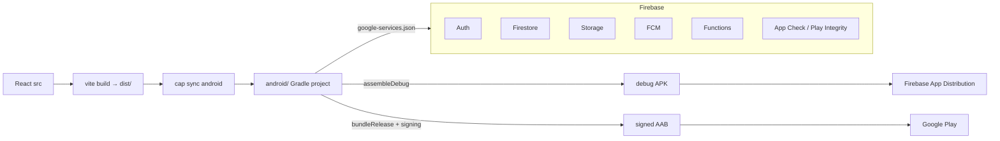

# 17 — Android & Capacitor

> Snapshot as of 2026-07-17 — verify before acting. Audited commit `0cd4c49`.

The Android app is the same React SPA running in a Capacitor WebView (appId `com.zedexams.android`). There is no separate native UI — native code is a thin shell (splash, safe-area, reCAPTCHA, back button).

## Configuration

`capacitor.config.json`: `webDir: dist`, `android.allowMixedContent: false`, `server.androidScheme: https` (WebView on an https origin, not `file://`). Plugins: `SafeArea {}`, `SystemBars {insetsHandling:"disable"}`, `FirebaseAuthentication {skipNativeAuth:true, providers:["google.com"]}`, `Keyboard {resize:"native"}`.

`android/app/build.gradle`: applicationId `com.zedexams.android`, compileSdk/targetSdk **36**, minSdk **24**. `versionCode` = `ZED_VERSION_CODE` env → `git rev-list --count HEAD` → `3`. `versionName` = `ZED_VERSION_NAME` env → `"1.2.8"`. Release signing from `ZED_RELEASE_*` env (unsigned+warn if incomplete). Release: `minifyEnabled true` + `shrinkResources true` (R8). `variables.gradle`: `rgcfaIncludeGoogle=true` (ships native Google-signin deps; required or R8 release fails), recaptcha 18.9.0.

`AndroidManifest.xml`: `allowBackup="false"` (deliberate — minors, no token/cache backup). MainActivity `launchMode="singleTask"`, `windowSoftInputMode="adjustResize"`. **Only intent-filter is MAIN/LAUNCHER — no App Links / custom-scheme deep-link intent-filter** (deep linking rides the https WebView + SPA router). Permissions: `INTERNET`, `POST_NOTIFICATIONS`, `com.android.vending.BILLING`.

Hand-written native classes (`android/app/src/main/java/com/zedexams/android/`): `MainActivity.java` (registers RecaptchaPlugin before `super.onCreate()`; AndroidX SplashScreen held until WebView `onPageLoaded` with a 5s backstop; `EdgeToEdge.enable()` + safe-area plugin bridges insets to CSS `env(safe-area-inset-*)`), `ZedExamsApplication.java`, `RecaptchaPlugin.java`.

## Capacitor plugins (package.json)

`@capacitor/core|android|app|keyboard|share|filesystem` ^8, `@capacitor-community/safe-area` ^8, `@capacitor-firebase/app-check|authentication|messaging` ^8.3, `@capgo/native-purchases` ^8.6 (Play Billing — used via JS import, not in the config plugin list). `@capacitor/status-bar` was removed 2026-08: its Android class carries the `Window` APIs Android 15 deprecated for edge-to-edge (Play Console flags their mere presence in the DEX); status-bar icon styling now goes through `@capacitor/core`'s built-in SystemBars plugin (`src/utils/statusBarManager.js`).

## Native flow wiring (src)

| Concern | Web | Android |
|---|---|---|
| Build → device | — | `npm run android:sync` = `vite build && cap sync android` |
| Google sign-in | `signInWithPopup`/redirect | `Capacitor.Plugins.FirebaseAuthentication.signInWithGoogle()` (`AuthContext.jsx` `signInWithGoogleNative`, skipNativeAuth) |
| Payments | Lenco | Play Billing quarantined in `src/utils/playBilling.js` (only importer of `@capgo/native-purchases`); catalog mirror-guarded; server `verifyGooglePlayPurchase` |
| Downloads | `file-saver`/Web Share | `src/utils/nativeDownload.js` (FileProvider + share) |
| Camera/gallery | file input | `CameraCaptureModal.jsx`, `PhotoUploadField.jsx` |
| Notifications | web-push VAPID | `@capacitor-firebase/messaging` native FCM |
| Status bar / splash | — | `src/utils/statusBarManager.js`; splash held natively |
| Back button | browser | `src/utils/nativeShell.js` `initNativeShell()` → `backButton` → `history.back()`/`exitApp()` |
| Offline / network | `src/offline/*` + Firestore multi-tab persistence | same |
| Service worker | VitePWA registered | **skipped** (`usePwaUpdate.js` early-returns on `isNativePlatform()`; `main.jsx` doesn't register) |
| App Check | reCAPTCHA Enterprise | Play Integrity via `@capacitor-firebase/app-check` (runtime lookup) |
| Versioning | — | CI uses commit-timestamp minutes (`git log -1 --format=%ct / 60`) for monotonic versionCode |

## Android build flow

## Release workflows

- `android-debug-apk.yml` — dispatch + push touching android/capacitor; no secrets; uploads `app-debug.apk`.
- `android-release.yml` — tag `v*.*.*` → signed APK → Firebase App Distribution testers.
- `android-play-release.yml` — tag `v*.*.*` → guards commit is on origin/main; decodes keystore from base64; **hard-fails** if `GOOGLE_SERVICES_JSON` missing/wrong package; `bundleRelease` → verify signature → publish AAB via `r0adkll/upload-google-play` (whatsnew from `distribution/whatsnew`).

## Findings

| ID | Severity | Finding |
|---|---|---|
| AND-1 | Low | **No native App-Links intent-filter** — deep links rely entirely on the https WebView + SPA router. Notification/share deep links into specific routes work only while the WebView is the handler. |
| AND-2 | Low | **No instrumented/Espresso tests** — only stock `Example*Test.java` stubs; native splash/back-button/reCAPTCHA/native-auth wiring is not exercised end-to-end (some JS-side specs exist — see [`19-testing-coverage.md`](./19-testing-coverage.md)). |
| AND-3 | Info | Native `data:` download fallback can truncate very large files (mirrors DOC-4). |
| AND-4 | Info | WebView caveats (from CLAUDE.md, verified in code): Google popups don't work in WebView (redirect/native path used); web reCAPTCHA App Check provider doesn't work in WebView (Play Integrity required); SW is dead weight on `capacitor://` so it's skipped. |
