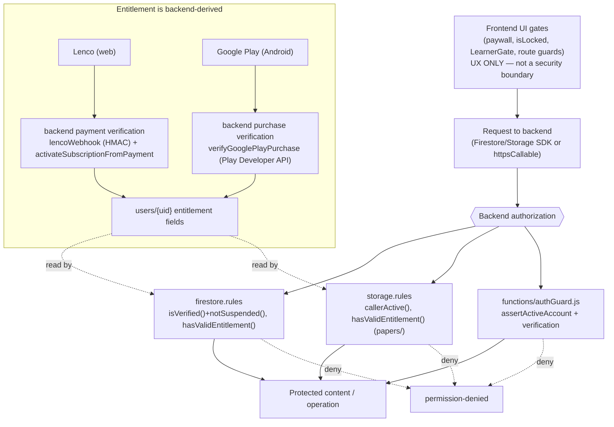

# 18 — Security Review

> Snapshot as of 2026-07-17 — verify before acting. Audited commit `0cd4c49`.
> No secret values appear in this document. Findings are classified Critical / High / Medium / Low / Informational.
>
> **P0 remediation — lifecycle status (2026-07-17):** **SEC-H1** (premium content) and **SEC-H2** (suspension) are enforced on the backend. Rather than a single "resolved" label, the stages are:
>
> | Stage | SEC-H1 (premium) | SEC-H2 (suspension) |
> |---|---|---|
> | Identified | ✔ | ✔ |
> | Implemented | ✔ | ✔ |
> | Behaviourally tested | ✔ (138/138 Firestore emulator; Storage in CI) | ✔ (138/138 rules emulator + 12/12 `authGuard.test.js`) |
> | Merged | ✔ PR #1774 (`7b0ad2f`) | ✔ |
> | Production deployment | ✔ Confirmed (Deploy Firebase run `29571690692`) | ✔ Confirmed |
> | Independent review | ✔ Approved with follow-ups | ✔ Approved with follow-ups |
> | Residual risk | **F2** — previously issued Storage download tokens | **F1** — payment-initiation fail-open |
>
> Enforcement points: `firestore.rules` `notSuspended()` (folded into `isVerified()`) + `hasValidEntitlement()` (quiz `questions` read); `storage.rules` `callerActive()` + `hasValidEntitlement()` (`papers/` read, `ownsPath()` uploads); `functions/authGuard.js` `assertActiveAccount` (folded into `assertVerifiedAuth`/`assertDecodedVerified`). Regression tests: `scripts/test-firestore-rules-emulator.mjs`, `scripts/test-storage-rules-emulator.mjs`, `functions/authGuard.test.js`. Residual items F1/F2 are documented as findings below and in [`23-risk-register.md`](./23-risk-register.md) / [`25-remediation-plan.md`](./25-remediation-plan.md). **Scope note:** lessons/notes are free content (not premium-gated), so they are not part of SEC-H1.

## Posture summary

The **write side is strong**: all money/role/entitlement fields are backend-only, self-escalation is blocked in Firestore rules (create + update), payments funnel through one idempotent activation path with HMAC-verified webhooks and strong duplicate protection, and grading/AI writes are server-authoritative. The main weaknesses are **read-side content confidentiality**, **suspension enforcement**, and **staged (not-yet-enforced) App Check**.

## Enforcement map (where security lives)

| Layer | Mechanism | Files |
|---|---|---|
| Firestore reads/writes | `firestore.rules` (~152 KB, hand-written); role via `users.role`, verification via token claim + grace | `firestore.rules` |
| Storage reads/writes | `storage.rules` (owner-keyed paths, size/content-type validators, deny-all fallthrough) | `storage.rules` |
| CF authorization | `assertVerifiedAuth`, `assertCallerIsAdmin`, `isStaffRole` | `functions/authGuard.js`, `adminUsers.js` |
| App Check | reCAPTCHA Enterprise (web) / Play Integrity (Android); **observe-only by default** | `appCheckEnforcement.js`, `recaptchaEnterprise.js` |
| Webhooks | HMAC (`x-lenco-signature` SHA512, `x-hub-signature-256`) | `lencoService.js`, `metaWhatsAppCore.js` |
| Rate limiting | `rateLimitCore.js`; per-email/IP on password reset; honeypot on newsletter | `functions/rateLimit*.js`, `index.js` |
| Input/output sanitization | `dompurify` (rich text), `sanitizeXmlText` (exports), `cleanString`/`cleanContext` (AI), `aiPromptPolicy` | `src/utils/*`, `functions/aiPromptPolicy.js` |
| Secrets | Firebase Functions `defineSecret` (never in `.env`); CSP restricts **browser-side** egress | `functions/index.js`, `firebase.json` |
| CSP / headers | `firebase.json` headers block (X-Frame-Options, nosniff, strict CSP, Permissions-Policy) — browser-side only | `firebase.json` |

## Enforcement boundary (the frontend gate is not the boundary)

A client purchase callback never grants access on its own — entitlement is written server-side (idempotent activation) and read by the rules. See [`14`](./14-payment-and-subscriptions.md).

## Findings

### High

**SEC-H1 — Learner premium *content* gating is client-side only.** (= PAY-1) — **Implemented · tested · merged · deployed (2026-07-17) · independently reviewed**, for quiz questions + past-paper PDFs. **Residual F2** (existing Storage download tokens) remains — see the lifecycle table at the top and the Residual findings below.
- **Risk:** A free/expired verified user could read any `isPublished==true` quiz's answer-bearing questions (and premium past-paper PDFs) directly from Firestore/Storage; the demo/paywall distinction lived only in React.
- **Evidence (before):** `firestore.rules` quiz `questions` read had no premium check; `storage.rules` `papers/` read was `isVerified()` only.
- **✅ Fix applied:** the quiz `questions` read rule now requires `parent.isDemo == true || hasValidEntitlement()` (owner/admin retained); `hasValidEntitlement()` mirrors `hasPremiumAccess()` (flags + read-time `subscriptionExpiry`/lifetime). Storage `papers/` read now requires `hasValidEntitlement() || isTeacherOrAdmin() || ownsPath()` + `callerActive()`. The quiz metadata doc stays public (locked-card preview → list-safe). Verified by `scripts/test-firestore-rules-emulator.mjs` (free/expired/suspended denied; entitled/lifetime/owner/admin allowed; demo + anonymous past-paper preview preserved) and the storage suite.
- **Scope note:** **lessons/notes were verified NOT premium-gated in the current client** (`LearnerGate` is auth-only; readers have no `PremiumGate`; `isDemo` is quiz-only) — they are free content, so they are *not* part of this leak. If the business decides to make them premium, that needs a body/metadata split (they share one doc) — tracked as a follow-up in [`25-remediation-plan.md`](./25-remediation-plan.md).
- **Not:** a billing bypass — cannot flip the premium flag or steal paid AI generations.

**SEC-H2 — Suspension not enforced at the rules layer.** (= AUTH-H1) — **Implemented · tested · merged · deployed (2026-07-17) · independently reviewed.** **Residual F1** (payment-initiation fail-open) remains — see the lifecycle table at the top and the Residual findings below.
- **Risk:** `adminSetUserStatus` set status + `revokeRefreshTokens`, but rules/functions never checked `status` and the current ID token stayed valid ~1h; client sign-out was cosmetic. A suspended user kept backend access up to an hour.
- **✅ Fix applied:** canonical `users.status` (absence == active). `firestore.rules` `notSuspended()` folded into `isVerified()` → every verified read/write is denied for `suspended`/`deleted`. `storage.rules` `callerActive()` folded into `ownsPath()` (blocks suspended uploads) + the `papers/` read. `functions/authGuard.js` `assertActiveAccount` folded into `assertVerifiedAuth`/`assertDecodedVerified` (fail-OPEN on transient read error so a Firestore blip can't lock out the platform) → blocks every sensitive callable/HTTP (AI, payments, publishing). Allowed minimum preserved: suspended users still read their own profile (users self-read uses bare `isAuthed()`) and can sign out; admins managing *other* accounts are unaffected. Verified by `functions/authGuard.test.js` (12 cases) and the rules emulator (suspended denied read/write/questions; can't clear own status; active/legacy not over-blocked).

**SEC-H3 — Client-side Gemini bypasses all AI guardrails.** (= AI-1)
- **Risk:** `src/utils/aiLogic.js` + `src/firebase/ai.js` call Gemini directly from the browser — no reservation/budget gate, no treasury cap, not in cost rollups, no per-user cap. Gated only by App Check + Firebase quota (and App Check is observe-only, SEC-M2). Potential uncapped spend / abuse vector.
- **Fix:** route client Gemini through a Cloud Function with the budget gate, or disable it until App Check is enforced; **regression test:** attribution/accounting test.

### Residual (post-P0-remediation follow-ups — Low)

These were surfaced by the independent review of the deployed P0 fix. They do **not** mean the P0 remediation failed — the primary boundaries are enforced and live. They are scoped, low-severity items awaiting a focused follow-up.

**SEC-F1 — Payment-initiation account-status check is fail-open on backend read errors.** (Low)
- **Affected path:** `functions/authGuard.js` `assertActiveAccount` (used by `assertVerifiedAuth`), reached by `initiateLencoPayment` and the other Lenco/Play callables.
- **Current behaviour:** if the `users/{uid}.status` read throws a transient error, the check **fails open** (allows the call) so a Firestore blip cannot lock the whole platform out. Document-not-found is treated as active by design (legacy-safe).
- **Why it matters:** during such a failure a suspended user could initiate a payment. The window is not attacker-inducible (server-side Admin-SDK read) and suspended users are still blocked at the rules layer for direct data access and have revoked refresh tokens, so impact is low.
- **Recommended action:** review payment initiation separately; decide which account-status errors may fail open; make sensitive **payment initiation fail closed** where appropriate; ensure **no Lenco request is created after an authorization failure**. Do not change payment code as part of documentation work.
- **Required tests:** suspended, deleted, missing-user, and Firestore-read-error cases for the payment-initiation guard path.

**SEC-F2 — Previously issued Firebase Storage download-token URLs may remain usable.** (Low)
- **Affected path:** `papers/` (past-paper PDFs + mark schemes) — the premium Storage content now gated by `storage.rules`.
- **Current behaviour:** the app resolves paper URLs on demand via `getDownloadURL()`, which **is** rules-gated (a free/suspended user is now denied), and does **not** persist token URLs in Firestore. **However**, a Firebase download token is stable per object, so any tokenised URL minted and shared **before** the rule change keeps working independently of Storage rules until the token is rotated/removed.
- **Status:** **unverified** whether any such tokens were previously distributed; tokens were **not** rotated as part of the P0 fix. Storage protection is therefore enforced for the SDK/`getDownloadURL()` path but not retroactively for already-minted tokens.
- **Recommended action (future):** (1) audit existing premium-file metadata tokens; (2) rotate/remove tokens for protected files; (3) stop persisting long-lived tokenised URLs; (4) use authenticated downloads or (5) short-lived signed URLs; (6) serve sensitive resources through a backend download endpoint. Do not rotate tokens as part of documentation work.

### Medium

**SEC-M1 — Parent-role signup mismatch.** (= AUTH-M2) Frontend writes `role:'parent'` but the create rule allows only learner/teacher → parent `setDoc` is permission-denied. Verify parent signup path.

**SEC-M2 — App Check + reCAPTCHA fail-open / observe-only.** (= AUTH-M3) Anti-bot/anti-scraping on paid AI + auth endpoints is advisory today (documented staged rollout). Enforce before relying on it.

**SEC-M3 — Custom claim `role` never re-synced.** (= AUTH-M4) `adminSetUserRole` updates only the Firestore field; the claim is frozen at onCreate → divergence (toward less access) for `syllabusOverrides.js` and `bootstrapUserProfile`.

**SEC-M4 — `agentControl` world-readable to verified users.** (= FS-2) Exposes circuit-breaker/pause state and `autoPublish` flag to any signed-in user. Low direct harm; tighten to admin read.

**SEC-M5 — `assessmentToPdf` and unmigrated drafts leak/lose work rather than a security hole**, but note `assessmentToPdf` renders remote `` with no CORS/proxy — see [`16`](./16-document-generation.md) DOC-1.

### Low / Informational

- **SEC-L1** — `contactMessages` anonymous create with shape-only validation (relies on App Check for spam) — FS-2.
- **SEC-L2** — `whatsappConversations` uses PII phone number as doc id — FS-2. (Server-only collection.)
- **SEC-L3** — `note-pictures/`, `slide-notes-images/` have no storage.rules match (served via token URLs) and no cleanup — STO-1; `picture-bank/staged/` readable by any verified user — STO-4.
- **SEC-L4** — Dead card-collection code proxies raw PAN (PCI) though the path is disabled — PAY-2.
- **SEC-L5** — 6-char password minimum, client-only — AUTH-L8.
- **SEC-L6** — OpenAI/Gemini calls have no HTTP retry (availability, not security) — AI-4.
- **SEC-Info** — `lesson-presentations` deliberately excludes SVG (XSS); exports funnel through `sanitizeXmlText`; rich text through `dompurify`; the CSP `connect-src` is a strict **browser-side** allowlist (it constrains the SPA, not server-side Cloud Function egress — see [`01`](./01-system-overview.md)); secrets are Functions-managed and never committed (guarded by `test:secret-hygiene`).

## XSS / injection / rendering

- Rich-text rendering sanitised with `dompurify`; the sanitiser is unit-tested (`test:sanitize`).
- AI prompt injection: `aiPromptPolicy` forces learners onto the education-guardrail system prompt (they cannot override it); inputs are NUL-stripped/clamped. Structured output is tool-forced JSON with per-tool schemas.
- Uploaded content: Storage validators pin content-types; SVG excluded from presentations.

## Prioritised remediation order

1. **SEC-H1** (learner content gating) and **SEC-H2** (suspension) — both are read/authorization boundaries with real exposure.
2. **SEC-H3** (client Gemini) + **SEC-M2** (enforce App Check) together.
3. **SEC-M1** (parent signup — may be a live bug), **SEC-M3** (claim re-sync), **SEC-M4** (agentControl read).
4. Storage cleanup gaps (STO-1/2) and Low items.

See [`23-risk-register.md`](./23-risk-register.md) for probability/impact scoring and [`10`](./10-authentication-and-roles.md)/[`14`](./14-payment-and-subscriptions.md) for the source detail.
