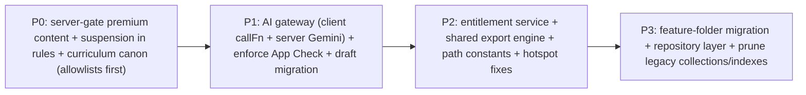

# 24 — Recommended Target Architecture

> Snapshot as of 2026-07-17 — verify before acting. Audited commit `0cd4c49`.
> **Not a rewrite.** ZedExams is a healthy, well-tested codebase with strong server-authoritative money/AI paths. The evidence points to *consolidation of shared systems*, not replacement. Every step below is incremental and keeps the live app running.

## Guiding principle

Most risk in this codebase comes from **the same concept being implemented several times** (curriculum vocabularies, drafts, subscription checks, AI wrappers, path strings) and from **a few authorization boundaries living only on the client** (premium content, suspension, client Gemini). The target architecture introduces **single sources of truth** for each shared concern and pulls the client-only boundaries server-side.

## Target building blocks

### 1. Canonical curriculum service *(highest priority — [`06`](./06-curriculum-architecture.md))*
- Merge `config/curriculum.js` + `config/teacherTaxonomy.js` into one canonical module; **G-codes** (`G4`, `ECE_N`, `F1`) as the single wire vocabulary, underscore subject slugs canonical.
- Keep `curriculum-data*.json` as the canonical **topic** source; demote `cbcTopics.js` to an explicit grounding overlay.
- Every grade/subject list imported from the canon; the 13 server `ALLOWED_*` unified in `assessmentAllowlists.js`.
- Guard: `test:curriculum-canon` forbids re-declaring grade/subject arrays elsewhere.

### 2. Canonical Teaching Profile context *([`07`](./07-teaching-profile.md))*
- One `resolveActiveAssignment` (collapse `teachingProfileCore` and `plannedTeachingMeta` copies, D12).
- Every studio (including AssessmentStudio + SBA) seeds from the active assignment via the shared selector — no per-studio grade/subject lists.

### 3. Shared studio framework *([`08`](./08-studio-flows.md))*
- A `useStudio({ tool })` composition bundling: curriculum seed → input draft → `ensureCanGenerate` → CF call → `LiveGenerationCanvas` reveal → save → export. New studios wire one hook instead of re-assembling the skeleton.

### 4. Shared picker system
- `StudioCurriculumSelector` as the *only* grade/subject/curriculum picker; retire `assessmentStudioMeta`/`sba.js` list ownership by feeding them the same selector output.

### 5. Shared draft manager *([`15`](./15-drafts-and-autosave.md))*
- Migrate `useAssessmentDraft` (singleton) and `useCreateQuizDraft` (localStorage-only) onto `draftCore`; give EditQuizV2 an autosave draft. Closes DRAFT-1/2/3.

### 6. Shared AI gateway *([`09`](./09-ai-architecture.md), [`21`](./21-duplication-register.md) D13)*
- **Client:** one `callFn(name, payload, opts)` (region, timeout, error envelope, SSE reader) replacing 48-file `getFunctions` + 11-file wrappers.
- **Server:** route the client Gemini path through a Cloud Function so it inherits the budget gate + cost rollups + per-user cap (closes AI-1). Consider a thin provider-router so per-function provider choice is declarative and retry/fallback is uniform.

### 7. Shared entitlement & credit service *([`14`](./14-payment-and-subscriptions.md))*
- Collapse the triplicated `toDateValue`/access-flag logic (D8) into one `entitlement.js`; `useSubscription` reads the `AuthContext`-computed access, doesn't re-derive it.
- **Move premium *content* gating server-side** (deliver premium quizzes/lessons via a Cloud Function like daily exams, or add a rules premium check) — closes the P0 content-leak.

### 8. Shared export engine *([`16`](./16-document-generation.md), D7)*
- A `documentEngine` that takes a normalized block model + branding and emits DOCX/PDF/XLSX, so the ~42 per-tool exporters become thin adapters. Migrate `assessmentToPdf` onto `htmlToPdf` (kills the print-only outlier).

### 9. Data-contract layer
- `config/collections.js` (collection-path constants) + storage-path helpers (D5/D6) — removes ~110 literal call sites.
- Keep Zod schemas (`src/schemas/`) as the validation contracts; add schemas for the currently-untyped collections that hold multiple shapes (`aiGenerations`, `lessons`).

### 10. Repository organization & feature boundaries
- Continue the `src/features/<feature>/` pattern (pages/components/services/lib) — migrate large `components/<domain>` surfaces (teacher studios, admin) into feature folders over time so each owns its services + schema.
- Keep `src/utils/` shrinking as helpers move into feature `lib/` or the shared services above.

### 11. Firestore repositories & CF service layers *([`11`](./11-firestore-data-model.md))*
- Introduce a thin repository layer (read/write helpers per collection) so ownership/pagination/index expectations live in one place; retire orphaned collections/indexes (R7).
- Address hotspots: `classes` membership subcollection instead of `learners[]`; TTLs on `scores`/notifications feed.

### 12. Testing & observability
- Add the guard/regression tests named in [`19`](./19-testing-coverage.md): curriculum-canon, learner-content-gating (rules), suspension (rules), client-AI attribution, unmigrated-draft recovery.
- Make "Build + mobile smoke" a required check.
- Observability: the AI cost dashboard is good; extend it to include the client Gemini path once gated; add drift-audit crons for the denormalized mirrors.

## Migration sequencing (incremental, live-safe)

Each phase ships behind its guard tests; none requires a big-bang cutover. The curriculum canon and the two server-side authorization moves (content, suspension) are the highest-leverage, do-them-first changes.

## What NOT to do

- Do **not** rewrite the payment/activation or AI-budget systems — they are server-authoritative, idempotent, and well-tested.
- Do **not** delete the legacy-render remnants (exam_paper/full_lesson views) — they serve back-compat library docs.
- Do **not** remove Recraft/Kie selector values — they are live wire values routing to gpt-image-1.
