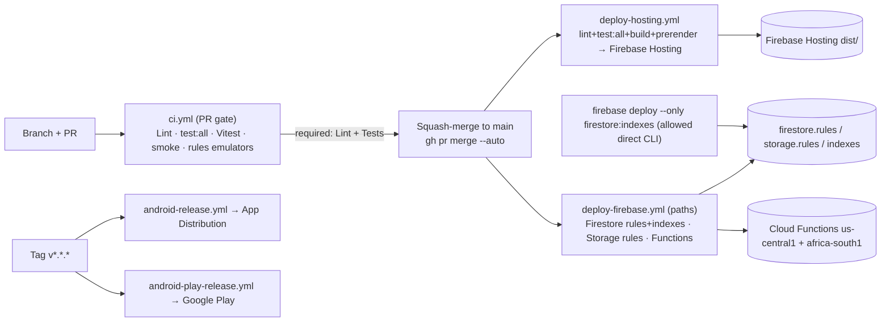

# Diagrams Index

> Snapshot as of 2026-07-17 — verify before acting. Audited commit `0cd4c49`.

All architecture diagrams are authored as **inline Mermaid** in the document that explains them, so they render on GitHub and stay editable next to their prose (rather than drifting in a separate binary/image folder). This index maps each required diagram to its home. To edit a diagram, open the linked document and edit its `mermaid` fenced code block; large diagrams were deliberately split into smaller readable ones.

| # | Diagram | Location |
|---|---|---|
| 1 | Full platform architecture | [`01-system-overview.md`](../01-system-overview.md#platform-architecture-diagram) |
| 2 | Frontend component architecture | [`04-frontend-architecture.md`](../04-frontend-architecture.md#frontend-component-architecture) |
| 3 | Backend architecture | [`13-cloud-functions-register.md`](../13-cloud-functions-register.md) (grouped register) + [`01`](../01-system-overview.md) |
| 4 | Firestore entity-relationship model | [`11-firestore-data-model.md`](../11-firestore-data-model.md#er-overview) |
| 5 | Firebase Storage model | [`12-storage-map.md`](../12-storage-map.md) (path register + cleanup) |
| 6 | Authentication flow | [`10-authentication-and-roles.md`](../10-authentication-and-roles.md#flow-diagrams) |
| 7 | Role & authorization flow | [`10-authentication-and-roles.md`](../10-authentication-and-roles.md) + [`18`](../18-security-review.md#enforcement-map-where-security-lives) |
| 8 | Teaching Profile flow | [`07-teaching-profile.md`](../07-teaching-profile.md#how-the-active-assignment-reaches-studios) |
| 9 | Curriculum resolution flow | [`06-curriculum-architecture.md`](../06-curriculum-architecture.md#curriculum-dependency-diagram) |
| 10 | Syllabus data flow | [`06-curriculum-architecture.md`](../06-curriculum-architecture.md#f-topics--subtopics--outcomes) + [`20`](../20-change-impact-register.md) (Syllabus parser row) |
| 11 | Lesson Plan Studio flow | [`08-studio-flows.md`](../08-studio-flows.md#generic-studio-sequence) (+ per-studio table) |
| 12 | Schemes of Work Studio flow | [`08-studio-flows.md`](../08-studio-flows.md#per-studio-specifics) |
| 13 | Weekly Focus (Forecast) Studio flow | [`08-studio-flows.md`](../08-studio-flows.md#per-studio-specifics) |
| 14 | Test Studio flow | [`08-studio-flows.md`](../08-studio-flows.md#per-studio-specifics) |
| 15 | Exam Studio flow | [`08-studio-flows.md`](../08-studio-flows.md#per-studio-specifics) |
| 16 | Quiz Studio flow | [`08-studio-flows.md`](../08-studio-flows.md#per-studio-specifics) + [`05`](../05-component-dependencies.md) |
| 17 | Timetable Studio flow | [`08-studio-flows.md`](../08-studio-flows.md#per-studio-specifics) |
| 18 | Payment flow | [`14-payment-and-subscriptions.md`](../14-payment-and-subscriptions.md#payment-sequence-web-lenco) |
| 19 | Subscription & entitlement flow | [`14-payment-and-subscriptions.md`](../14-payment-and-subscriptions.md) + [`18`](../18-security-review.md) |
| 20 | AI generation flow | [`09-ai-architecture.md`](../09-ai-architecture.md#ai-request-flow-frontend--provider--back) |
| 21 | Draft & autosave flow | [`15-drafts-and-autosave.md`](../15-drafts-and-autosave.md#draft-flow) |
| 22 | Document export flow | [`16-document-generation.md`](../16-document-generation.md#export-flow) |
| 23 | Android application flow | [`17-android-capacitor.md`](../17-android-capacitor.md#android-build-flow) |
| 24 | Notification flow | [`13-cloud-functions-register.md`](../13-cloud-functions-register.md#notifications--messaging) (crons + FCM/WhatsApp/triggers) |
| 25 | Change-impact dependency map | [`20-change-impact-register.md`](../20-change-impact-register.md) (register form) |
| 26 | Deployment architecture | [`24-recommended-target-architecture.md`](../24-recommended-target-architecture.md#migration-sequencing-incremental-live-safe) + this file (below) |

## Deployment architecture (diagram 26)

Deploy governance (from CLAUDE.md, verified against `.github/workflows/`): production hosting and functions ship **only via CI**; direct `firebase deploy --only hosting|functions` is denied in `.claude/settings.json`. `main` is branch-protected (`enforce_admins` on); required checks are `Lint` + `Tests (importer + sanitize + schema)`. The only allowed direct CLI deploys are `firestore:indexes` and the one-time `storage:cors`.
